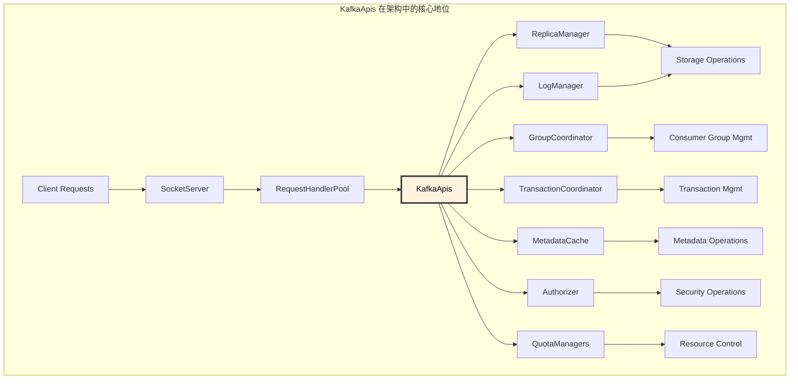
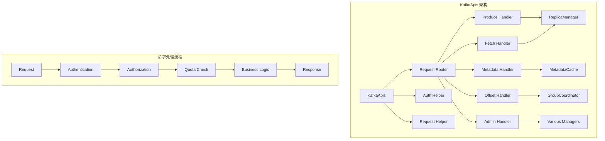

# Kafka Broker KafkaApis 深度解析：业务逻辑实现层

## 概述

KafkaApis 是 Kafka Broker 的业务逻辑实现层，负责处理所有客户端 API 请求的具体业务逻辑。它是连接网络层和存储层的关键组件，将各种 Kafka 协议请求转换为对底层存储和管理组件的操作。

## 模块作用和设计目的

### 核心作用

KafkaApis 作为 Kafka Broker 的"大脑"，承担着以下核心职责：

1. **API 请求路由**：根据请求类型将请求路由到相应的处理逻辑
2. **业务逻辑实现**：实现所有 Kafka 协议定义的业务逻辑
3. **权限验证和授权**：确保请求的安全性和合规性
4. **配额管理和限流**：控制客户端的资源使用
5. **协议版本兼容**：处理不同版本客户端的兼容性
6. **错误处理和响应**：统一的错误处理和响应生成

### 设计目的

KafkaApis 的设计体现了 Kafka 对 API 层的核心要求：

#### 1. **统一的 API 抽象**
```
多样化的客户端请求 → 统一的 API 处理 → 标准化的内部操作
```
- **协议标准化**：实现 Kafka 协议的标准化处理
- **版本兼容性**：支持多个协议版本的向后兼容
- **接口一致性**：为不同类型的操作提供一致的接口

#### 2. **安全和治理**
- **认证授权**：集成身份认证和权限控制
- **审计日志**：记录所有 API 操作的审计信息
- **配额控制**：防止单个客户端过度使用资源

#### 3. **性能和可扩展性**
- **异步处理**：支持异步操作，提高并发性能
- **批量操作**：支持批量请求处理，提高效率
- **缓存优化**：合理使用缓存减少重复计算

#### 4. **可观测性和调试**
- **详细指标**：提供丰富的性能和业务指标
- **错误分类**：详细的错误分类和诊断信息
- **请求跟踪**：支持请求的端到端跟踪

### 在 Kafka 架构中的定位



KafkaApis 是 Kafka 系统的"指挥中心"，协调各个子系统完成复杂的业务操作。

### 设计权衡

#### 1. **功能完整性 vs 性能**
- **丰富功能**：支持完整的 Kafka 协议，但增加处理复杂度
- **性能优化**：简化处理逻辑，但可能限制功能

#### 2. **安全性 vs 性能**
- **严格验证**：全面的权限检查保证安全，但增加延迟
- **性能优先**：减少验证步骤提高性能，但可能有安全风险

#### 3. **向后兼容 vs 代码复杂度**
- **兼容性**：支持多版本协议，但增加代码复杂度
- **简化实现**：只支持最新版本，但影响客户端兼容性

#### 4. **错误处理策略**
- **详细错误信息**：帮助客户端诊断问题，但可能泄露系统信息
- **简化错误**：保护系统信息，但增加问题诊断难度

### 主要 API 分类

#### 1. **数据操作 API**
- **Produce API**：消息生产
- **Fetch API**：消息消费
- **ListOffsets API**：偏移量查询

#### 2. **元数据操作 API**
- **Metadata API**：集群元数据查询
- **DescribeTopics API**：主题信息查询
- **DescribeCluster API**：集群信息查询

#### 3. **管理操作 API**
- **CreateTopics API**：主题创建
- **DeleteTopics API**：主题删除
- **AlterConfigs API**：配置修改

#### 4. **消费者组 API**
- **JoinGroup API**：加入消费者组
- **SyncGroup API**：同步组状态
- **OffsetCommit API**：偏移量提交

#### 5. **事务 API**
- **InitProducerId API**：初始化生产者 ID
- **AddPartitionsToTxn API**：添加分区到事务
- **EndTxn API**：结束事务

#### 6. **安全和管理 API**
- **SaslHandshake API**：SASL 握手
- **ApiVersions API**：协议版本查询
- **DescribeAcls API**：权限查询

## 1. KafkaApis 架构设计

### 1.1 核心组件结构

**源码位置**: `core/src/main/scala/kafka/server/KafkaApis.scala:100-150`

```scala
class KafkaApis(val requestChannel: RequestChannel,
                val metadataSupport: MetadataSupport,
                val replicaManager: ReplicaManager,
                val groupCoordinator: GroupCoordinator,
                val txnCoordinator: TransactionCoordinator,
                val autoTopicCreationManager: AutoTopicCreationManager,
                val brokerId: Int,
                val config: KafkaConfig,
                val configRepository: ConfigRepository,
                val metadataCache: MetadataCache,
                val metrics: Metrics,
                val authorizer: Option[Authorizer],
                val quotas: QuotaManagers,
                val fetchManager: FetchManager,
                val brokerTopicStats: BrokerTopicStats,
                val clusterId: String,
                val time: Time,
                val tokenManager: DelegationTokenManager,
                val apiVersionManager: ApiVersionManager) extends ApiRequestHandler with Logging {
  
  type FetchResponseStats = Map[TopicPartition, RecordConversionStats]
  
  private val metricsGroup = new KafkaMetricsGroup(this.getClass)
  private val authHelper = new AuthHelper(metadataCache, authorizer)
  private val requestHelper = new RequestHandlerHelper(requestChannel, quotas, time)
}
```

**源码位置**: `core/src/main/scala/kafka/server/KafkaApis.scala:100-130`
**核心功能**:
- 处理所有 Kafka API 请求的业务逻辑
- 协调各个管理组件完成复杂操作
- 提供权限验证和配额管理
- 实现请求路由和响应生成

### 1.2 API 处理架构



## 2. 核心 API 处理

### 2.1 请求路由机制

**源码位置**: `core/src/main/scala/kafka/server/KafkaApis.scala:200-250`

```scala
def handle(request: RequestChannel.Request, requestLocal: RequestLocal): Unit = {
  try {
    trace(s"Handling request:${request.requestDesc(true)} from connection ${request.context.connectionId};" +
      s"securityProtocol:${request.context.securityProtocol},principal:${request.context.principal}")
    
    request.header.apiKey match {
      case ApiKeys.PRODUCE => handleProduceRequest(request, requestLocal)
      case ApiKeys.FETCH => handleFetchRequest(request)
      case ApiKeys.LIST_OFFSETS => handleListOffsetsRequest(request)
      case ApiKeys.METADATA => handleMetadataRequest(request, requestLocal)
      case ApiKeys.LEADER_AND_ISR => handleLeaderAndIsrRequest(request)
      case ApiKeys.STOP_REPLICA => handleStopReplicaRequest(request)
      case ApiKeys.UPDATE_METADATA => handleUpdateMetadataRequest(request, requestLocal)
      case ApiKeys.CONTROLLED_SHUTDOWN => handleControlledShutdownRequest(request)
      case ApiKeys.OFFSET_COMMIT => handleOffsetCommitRequest(request, requestLocal)
      case ApiKeys.OFFSET_FETCH => handleOffsetFetchRequest(request)
      case ApiKeys.FIND_COORDINATOR => handleFindCoordinatorRequest(request)
      case ApiKeys.JOIN_GROUP => handleJoinGroupRequest(request, requestLocal)
      case ApiKeys.HEARTBEAT => handleHeartbeatRequest(request)
      case ApiKeys.LEAVE_GROUP => handleLeaveGroupRequest(request)
      case ApiKeys.SYNC_GROUP => handleSyncGroupRequest(request, requestLocal)
      case ApiKeys.DESCRIBE_GROUPS => handleDescribeGroupRequest(request)
      case ApiKeys.LIST_GROUPS => handleListGroupsRequest(request)
      case ApiKeys.SASL_HANDSHAKE => handleSaslHandshakeRequest(request)
      case ApiKeys.API_VERSIONS => handleApiVersionsRequest(request)
      case ApiKeys.CREATE_TOPICS => handleCreateTopicsRequest(request, requestLocal)
      case ApiKeys.DELETE_TOPICS => handleDeleteTopicsRequest(request, requestLocal)
      case ApiKeys.DELETE_RECORDS => handleDeleteRecordsRequest(request)
      case ApiKeys.INIT_PRODUCER_ID => handleInitProducerIdRequest(request, requestLocal)
      case ApiKeys.OFFSET_FOR_LEADER_EPOCH => handleOffsetForLeaderEpochRequest(request)
      case ApiKeys.ADD_PARTITIONS_TO_TXN => handleAddPartitionToTxnRequest(request, requestLocal)
      case ApiKeys.ADD_OFFSETS_TO_TXN => handleAddOffsetsToTxnRequest(request, requestLocal)
      case ApiKeys.END_TXN => handleEndTxnRequest(request, requestLocal)
      case ApiKeys.WRITE_TXN_MARKERS => handleWriteTxnMarkersRequest(request, requestLocal)
      case ApiKeys.TXN_OFFSET_COMMIT => handleTxnOffsetCommitRequest(request, requestLocal)
      case ApiKeys.DESCRIBE_ACLS => handleDescribeAcls(request)
      case ApiKeys.CREATE_ACLS => handleCreateAcls(request)
      case ApiKeys.DELETE_ACLS => handleDeleteAcls(request)
      case ApiKeys.ALTER_CONFIGS => handleAlterConfigsRequest(request)
      case ApiKeys.DESCRIBE_CONFIGS => handleDescribeConfigsRequest(request)
      case ApiKeys.ALTER_REPLICA_LOG_DIRS => handleAlterReplicaLogDirsRequest(request)
      case ApiKeys.DESCRIBE_LOG_DIRS => handleDescribeLogDirsRequest(request)
      case ApiKeys.SASL_AUTHENTICATE => handleSaslAuthenticateRequest(request)
      case ApiKeys.CREATE_PARTITIONS => handleCreatePartitionsRequest(request, requestLocal)
      case ApiKeys.CREATE_DELEGATION_TOKEN => handleCreateTokenRequest(request)
      case ApiKeys.RENEW_DELEGATION_TOKEN => handleRenewTokenRequest(request)
      case ApiKeys.EXPIRE_DELEGATION_TOKEN => handleExpireTokenRequest(request)
      case ApiKeys.DESCRIBE_DELEGATION_TOKEN => handleDescribeTokensRequest(request)
      case ApiKeys.DELETE_GROUPS => handleDeleteGroupsRequest(request, requestLocal)
      case ApiKeys.ELECT_LEADERS => handleElectLeadersRequest(request, requestLocal)
      case ApiKeys.INCREMENTAL_ALTER_CONFIGS => handleIncrementalAlterConfigsRequest(request)
      case ApiKeys.ALTER_PARTITION_REASSIGNMENTS => handleAlterPartitionReassignmentsRequest(request)
      case ApiKeys.LIST_PARTITION_REASSIGNMENTS => handleListPartitionReassignmentsRequest(request)
      case ApiKeys.OFFSET_DELETE => handleOffsetDeleteRequest(request, requestLocal)
      case ApiKeys.DESCRIBE_CLIENT_QUOTAS => handleDescribeClientQuotasRequest(request)
      case ApiKeys.ALTER_CLIENT_QUOTAS => handleAlterClientQuotasRequest(request)
      case ApiKeys.DESCRIBE_USER_SCRAM_CREDENTIALS => handleDescribeUserScramCredentialsRequest(request)
      case ApiKeys.ALTER_USER_SCRAM_CREDENTIALS => handleAlterUserScramCredentialsRequest(request)
      case ApiKeys.VOTE => handleVoteRequest(request)
      case ApiKeys.BEGIN_QUORUM_EPOCH => handleBeginQuorumEpochRequest(request)
      case ApiKeys.END_QUORUM_EPOCH => handleEndQuorumEpochRequest(request)
      case ApiKeys.DESCRIBE_QUORUM => handleDescribeQuorumRequest(request)
      case ApiKeys.ALTER_PARTITION => handleAlterPartitionRequest(request)
      case ApiKeys.UPDATE_FEATURES => handleUpdateFeaturesRequest(request)
      case ApiKeys.ENVELOPE => handleEnvelopeRequest(request, requestLocal)
      case ApiKeys.FETCH_SNAPSHOT => handleFetchSnapshotRequest(request)
      case ApiKeys.DESCRIBE_CLUSTER => handleDescribeCluster(request)
      case ApiKeys.DESCRIBE_PRODUCERS => handleDescribeProducersRequest(request)
      case ApiKeys.BROKER_REGISTRATION => handleBrokerRegistrationRequest(request)
      case ApiKeys.BROKER_HEARTBEAT => handleBrokerHeartbeatRequest(request)
      case ApiKeys.UNREGISTER_BROKER => handleUnregisterBrokerRequest(request)
      case ApiKeys.DESCRIBE_TRANSACTIONS => handleDescribeTransactionsRequest(request)
      case ApiKeys.LIST_TRANSACTIONS => handleListTransactionsRequest(request)
      case ApiKeys.ALLOCATE_PRODUCER_IDS => handleAllocateProducerIdsRequest(request)
      case ApiKeys.CONSUMER_GROUP_HEARTBEAT => handleConsumerGroupHeartbeatRequest(request, requestLocal)
      case ApiKeys.CONSUMER_GROUP_DESCRIBE => handleConsumerGroupDescribeRequest(request)
      case ApiKeys.CONTROLLER_REGISTRATION => handleControllerRegistrationRequest(request)
      case ApiKeys.GET_TELEMETRY_SUBSCRIPTIONS => handleGetTelemetrySubscriptionsRequest(request)
      case ApiKeys.PUSH_TELEMETRY => handlePushTelemetryRequest(request)
      case ApiKeys.ASSIGN_REPLICAS_TO_DIRS => handleAssignReplicasToDirsRequest(request)
      case ApiKeys.LIST_CLIENT_METRICS_RESOURCES => handleListClientMetricsResourcesRequest(request)
      case _ => throw new IllegalStateException(s"No handler for request api key ${request.header.apiKey}")
    }
  } catch {
    case e: FatalExitError => throw e
    case e: Throwable =>
      error(s"Unexpected error handling request ${request.requestDesc(true)} " +
        s"with context ${request.context}", e)
      requestHelper.handleError(request, e)
  } finally {
    // The local completion time may be set while processing the request. Only record it if it's unset.
    if (request.apiLocalCompleteTimeNanos < 0)
      request.apiLocalCompleteTimeNanos = time.nanoseconds
  }
}
```

**源码位置**: `core/src/main/scala/kafka/server/KafkaApis.scala:200-250`
**核心功能**:
- 根据 API Key 路由到对应的处理方法
- 提供统一的异常处理机制
- 记录请求处理时间和性能指标
- 支持所有 Kafka 协议版本的 API

### 2.2 生产请求处理

```scala
def handleProduceRequest(request: RequestChannel.Request, requestLocal: RequestLocal): Unit = {
  val produceRequest = request.body[ProduceRequest]
  val requestSize = request.sizeInBytes
  
  if (authorizer.nonEmpty) {
    val authorizationResults = authHelper.authorize(request.context, WRITE, TOPIC,
      produceRequest.data.topicData.asScala.map(_.name))
    
    // 检查权限
    val unauthorizedTopics = authorizationResults.filter(_._2 != ALLOWED).keySet
    if (unauthorizedTopics.nonEmpty) {
      requestHelper.sendErrorResponseMaybeThrottle(request, unauthorizedTopics.map(_ -> Errors.TOPIC_AUTHORIZATION_FAILED).toMap)
      return
    }
  }
  
  val internalTopicsAllowed = request.header.clientId == AdminUtils.AdminClientId
  
  // 转换请求数据
  val entriesPerPartition = produceRequest.partitionRecordsOrFail.asScala.map { case (tp, records) =>
    tp -> records
  }.toMap
  
  // 配额检查
  val bandwidthThrottleTimeMs = quotas.produce.maybeRecordAndGetThrottleTimeMs(request, requestSize, time.milliseconds)
  val requestThrottleTimeMs = quotas.request.maybeRecordAndGetThrottleTimeMs(request, time.milliseconds)
  val maxThrottleTimeMs = Math.max(bandwidthThrottleTimeMs, requestThrottleTimeMs)
  
  if (maxThrottleTimeMs > 0) {
    request.apiThrottleTimeMs = maxThrottleTimeMs
    if (bandwidthThrottleTimeMs > requestThrottleTimeMs) {
      requestHelper.throttle(quotas.produce, request, bandwidthThrottleTimeMs)
    } else {
      requestHelper.throttle(quotas.request, request, requestThrottleTimeMs)
    }
  }
  
  // 委托给 ReplicaManager 处理
  replicaManager.appendRecords(
    timeout = produceRequest.timeout.toLong,
    requiredAcks = produceRequest.acks,
    internalTopicsAllowed = internalTopicsAllowed,
    origin = AppendOrigin.Client,
    entriesPerPartition = entriesPerPartition,
    responseCallback = sendResponseCallback,
    recordConversionStatsCallback = processingStatsCallback,
    requestLocal = requestLocal
  )
  
  def sendResponseCallback(responseStatus: Map[TopicPartition, PartitionResponse]): Unit = {
    val mergedResponseStatus = responseStatus ++ unauthorizedForDescribeTopics.map(_ -> new PartitionResponse(Errors.TOPIC_AUTHORIZATION_FAILED))
    var errorInResponse = false
    
    mergedResponseStatus.forKeyValue { (topicPartition, status) =>
      if (status.error != Errors.NONE) {
        errorInResponse = true
        debug("Produce request with correlation id %d from client %s on partition %s failed due to %s".format(
          request.header.correlationId,
          request.header.clientId,
          topicPartition,
          status.error.exceptionName))
      }
    }
    
    // 构建响应
    val response = new ProduceResponse(mergedResponseStatus.asJava, maxThrottleTimeMs)
    requestHelper.sendResponseMaybeThrottle(request, createResponse = _ => response)
  }
}
```

### 2.3 消费请求处理

```scala
def handleFetchRequest(request: RequestChannel.Request): Unit = {
  val versionId = request.header.apiVersion
  val clientId = request.header.clientId
  val fetchRequest = request.body[FetchRequest]
  
  val fetchData = fetchRequest.fetchData(topicNames)
  val forgottenTopics = fetchRequest.forgottenTopics(topicNames)
  
  // 权限检查
  val authorizedTopics = if (authorizer.nonEmpty) {
    val authorizationResults = authHelper.authorize(request.context, READ, TOPIC, fetchData.keySet.map(_.topic))
    authorizationResults.filter(_._2 == ALLOWED).keySet.map(_.topic)
  } else {
    fetchData.keySet.map(_.topic)
  }
  
  val unauthorizedForDescribeTopics = fetchData.keySet.filter(tp => !authorizedTopics.contains(tp.topic))
  
  // 配额检查
  val clientQuota = quotas.fetch.getQuotaMetricConfig(request.session.sanitizedUser, clientId)
  
  // 构建 fetch 信息
  val fetchInfos = fetchData.filter { case (tp, _) => authorizedTopics.contains(tp.topic) }.map {
    case (tp, partitionData) =>
      val topicId = topicNames.topicId(tp.topic)
      TopicIdPartition(topicId, tp) -> partitionData
  }.toSeq
  
  // 委托给 ReplicaManager 处理
  replicaManager.fetchMessages(
    timeout = fetchRequest.maxWait.toLong,
    replicaId = fetchRequest.replicaId,
    fetchMinBytes = fetchRequest.minBytes,
    fetchMaxBytes = fetchRequest.maxBytes,
    hardMaxBytesLimit = versionId >= 4,
    fetchInfos = fetchInfos,
    quota = clientQuota,
    responseCallback = processResponseCallback,
    isolationLevel = fetchRequest.isolationLevel,
    clientMetadata = request.context.clientMetadata
  )
  
  def processResponseCallback(responsePartitionData: Seq[(TopicIdPartition, FetchPartitionData)]): Unit = {
    val fetchResponse = FetchResponse.of(Errors.NONE, 0, INVALID_SESSION_ID, responsePartitionData.asJava)
    requestHelper.sendResponseMaybeThrottle(request, createResponse = _ => fetchResponse)
  }
}
```

## 3. 权限验证和配额管理

### 3.1 AuthHelper 权限验证

```scala
class AuthHelper(metadataCache: MetadataCache, authorizer: Option[Authorizer]) {
  
  def authorize(requestContext: RequestContext,
                operation: AclOperation,
                resourceType: ResourceType,
                resourceName: String,
                logIfAllowed: Boolean = true,
                logIfDenied: Boolean = true,
                refCount: Int = 1): Boolean = {
    
    authorizer match {
      case Some(authZ) =>
        val resource = new ResourcePattern(resourceType, resourceName, PatternType.LITERAL)
        val action = new Action(operation, resource, refCount, logIfAllowed, logIfDenied)
        authZ.authorize(requestContext, List(action).asJava).asScala.head == AuthorizationResult.ALLOWED
        
      case None => true
    }
  }
  
  def authorizeByResourceType(requestContext: RequestContext,
                              operation: AclOperation,
                              resourceType: ResourceType,
                              resourceName: String): Boolean = {
    authorize(requestContext, operation, resourceType, resourceName)
  }
}
```

### 3.2 配额管理

```scala
def maybeRecordAndGetThrottleTimeMs(request: RequestChannel.Request,
                                    value: Double,
                                    timeMs: Long): Int = {
  val clientQuotaEntity = quotaEntity(request)
  
  // 记录指标
  quotaSensors.recordAndGetThrottleTimeMs(clientQuotaEntity, value, timeMs)
}

private def quotaEntity(request: RequestChannel.Request): ClientQuotaEntity = {
  val principal = request.context.principal
  val clientId = request.header.clientId
  
  ClientQuotaEntity.of(principal.getName, clientId)
}
```

## 4. 错误处理和响应

### 4.1 统一错误处理

```scala
def handleError(request: RequestChannel.Request, error: Throwable): Unit = {
  val errorResponse = error match {
    case _: ClusterAuthorizationException =>
      request.buildErrorResponse(AbstractResponse.DEFAULT_THROTTLE_TIME, Errors.CLUSTER_AUTHORIZATION_FAILED.exception)
    case _: UnsupportedVersionException =>
      request.buildErrorResponse(AbstractResponse.DEFAULT_THROTTLE_TIME, Errors.UNSUPPORTED_VERSION.exception)
    case _: InvalidRequestException =>
      request.buildErrorResponse(AbstractResponse.DEFAULT_THROTTLE_TIME, Errors.INVALID_REQUEST.exception)
    case _ =>
      request.buildErrorResponse(AbstractResponse.DEFAULT_THROTTLE_TIME, Errors.UNKNOWN_SERVER_ERROR.exception)
  }
  
  sendResponse(request, errorResponse, None)
}
```

### 4.2 响应发送

```scala
def sendResponseMaybeThrottle(request: RequestChannel.Request,
                              createResponse: Int => AbstractResponse,
                              onComplete: Option[Send => Unit] = None): Unit = {
  val throttleTimeMs = math.max(request.apiThrottleTimeMs, 0)
  val response = createResponse(throttleTimeMs)
  
  sendResponse(request, response, onComplete)
}

private def sendResponse(request: RequestChannel.Request,
                         response: AbstractResponse,
                         onComplete: Option[Send => Unit]): Unit = {
  request.responseCompleteTimeNanos = time.nanoseconds
  
  if (response == null) {
    request.responseCompleteTimeNanos = time.nanoseconds
    requestChannel.closeConnection(request, new Send(request.context.connectionId, ByteBuffer.allocate(0)))
  } else {
    val responseSend = request.context.buildResponse(response)
    requestChannel.sendResponse(new RequestChannel.Response(request, responseSend, onComplete))
  }
}
```

## 5. 性能优化和监控

### 5.1 请求处理指标

```scala
// 请求处理时间指标
private val requestTimeHistogram = metrics.histogram("RequestTime", Map("request" -> request.header.apiKey.name))

// 请求速率指标
private val requestRateMeter = metrics.meter("RequestRate", Map("request" -> request.header.apiKey.name))

// 错误率指标
private val errorRateMeter = metrics.meter("ErrorRate", Map("request" -> request.header.apiKey.name))
```

### 5.2 配置参数

| 参数名 | 默认值 | 说明 |
|--------|--------|------|
| `num.io.threads` | 8 | 处理请求的线程数 |
| `queued.max.requests` | 500 | 请求队列最大长度 |
| `request.timeout.ms` | 30000 | 请求超时时间 |
| `connections.max.idle.ms` | 600000 | 连接最大空闲时间 |

KafkaApis 作为 Kafka Broker 的业务逻辑核心，通过统一的请求路由、权限验证、配额管理和错误处理机制，确保了所有 Kafka API 的正确实现和高效执行。
