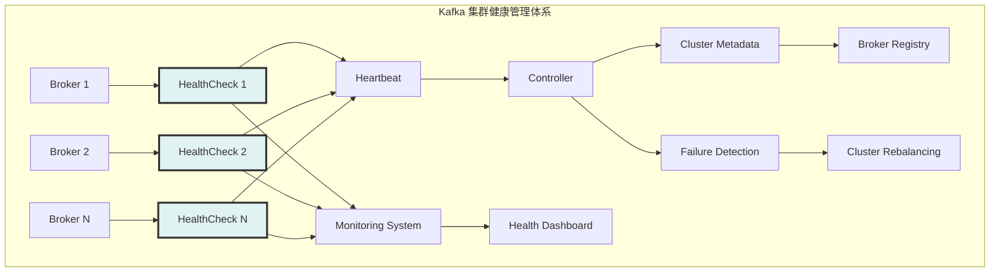
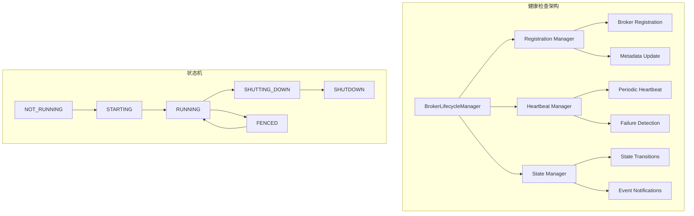

# Kafka Broker KafkaHealthcheck 深度解析：Broker健康状态管理

## 概述

KafkaHealthcheck 是 Kafka Broker 的健康状态管理组件，负责监控 Broker 的运行状态、注册到集群、处理故障检测和恢复。在 KRaft 模式下，健康检查机制已经集成到 BrokerLifecycleManager 中，提供更加完善的生命周期管理。

## 模块作用和设计目的

### 核心作用

KafkaHealthcheck 作为 Kafka 集群的"健康守护者"，承担着以下关键职责：

1. **集群成员管理**：管理 Broker 在集群中的注册、发现和退出
2. **健康状态监控**：持续监控 Broker 的运行状态和服务能力
3. **故障检测和报告**：及时发现 Broker 故障并通知集群
4. **自动恢复机制**：在可能的情况下自动恢复服务
5. **生命周期管理**：管理 Broker 从启动到关闭的完整生命周期
6. **集群协调**：与 Controller 协调进行集群状态管理

### 设计目的

KafkaHealthcheck 的设计体现了分布式系统对可用性和可靠性的核心要求：

#### 1. **高可用性保障**
```
故障检测 + 快速切换 + 自动恢复
    ↓
实现集群的高可用性
```
- **快速故障检测**：通过心跳机制快速发现节点故障
- **自动故障转移**：故障节点自动从集群中移除
- **服务恢复**：故障恢复后自动重新加入集群

#### 2. **集群一致性维护**
- **状态同步**：确保集群中所有节点对 Broker 状态的一致认知
- **元数据更新**：及时更新集群元数据信息
- **配置同步**：保持 Broker 配置与集群配置的一致性

#### 3. **运维自动化**
- **自动注册**：Broker 启动时自动注册到集群
- **优雅关闭**：支持 Broker 的优雅关闭和资源清理
- **状态报告**：定期报告 Broker 的健康状态

#### 4. **可观测性**
- **状态可视化**：提供 Broker 状态的实时可视化
- **历史记录**：记录 Broker 状态变化的历史
- **告警机制**：异常状态时及时告警

### 在 Kafka 集群架构中的定位



KafkaHealthcheck 是集群稳定性的"哨兵"，确保集群能够及时发现和处理节点故障。

### 设计权衡

#### 1. **检测灵敏度 vs 稳定性**
- **高灵敏度**：快速检测故障，但可能产生误报
- **高稳定性**：减少误报，但可能延迟故障检测

#### 2. **心跳频率 vs 网络开销**
- **高频心跳**：快速故障检测，但增加网络负载
- **低频心跳**：减少网络开销，但延迟故障发现

#### 3. **自动化 vs 人工控制**
- **全自动化**：减少人工干预，但可能在复杂场景下误操作
- **人工确认**：提高安全性，但增加响应时间

#### 4. **状态精度 vs 复杂度**
- **精细状态**：提供详细的健康信息，但增加实现复杂度
- **简化状态**：降低复杂度，但可能丢失重要信息

### 健康检查维度

#### 1. **系统资源健康**
- CPU 使用率监控
- 内存使用情况
- 磁盘空间和 I/O 性能
- 网络连接状态

#### 2. **服务功能健康**
- 请求处理能力
- 数据读写性能
- 副本同步状态
- 事务处理能力

#### 3. **集群协调健康**
- Controller 连接状态
- 元数据同步状态
- 心跳响应时间
- 集群成员状态

#### 4. **业务逻辑健康**
- API 响应时间
- 错误率统计
- 吞吐量指标
- 延迟分布

### 故障处理策略

#### 1. **预防性措施**
- 资源使用监控和告警
- 性能趋势分析
- 容量规划和预警

#### 2. **检测机制**
- 多维度健康检查
- 异常模式识别
- 级联故障检测

#### 3. **恢复策略**
- 自动重启机制
- 服务降级策略
- 数据恢复流程

#### 4. **通知和响应**
- 实时告警通知
- 自动化响应脚本
- 人工干预接口

## 1. 健康检查架构设计

### 1.1 传统 ZooKeeper 模式健康检查

**源码位置**: `core/src/main/scala/kafka/server/KafkaHealthcheck.scala`

```scala
class KafkaHealthcheck(brokerId: Int,
                       advertisedEndpoints: Seq[EndPoint],
                       zkClient: KafkaZkClient,
                       rack: Option[String],
                       interBrokerProtocolVersion: ApiVersion) extends Logging {
  
  private val brokerInfo = BrokerInfo(
    Broker(brokerId, advertisedEndpoints, rack),
    interBrokerProtocolVersion,
    jmxPort = -1,
    epoch = -1,
    fenced = true
  )
  
  private val sessionExpireListener = new SessionExpireListener
  
  def startup(): Unit = {
    zkClient.registerZNodeChangeHandlerAndCheckExistence(sessionExpireListener)
    register()
  }
  
  def register(): Unit = {
    info("Registering broker in ZooKeeper")
    try {
      zkClient.registerBroker(brokerInfo)
      info("Registered broker in ZooKeeper")
    } catch {
      case e: Exception =>
        error("Failed to register broker in ZooKeeper", e)
        throw e
    }
  }
  
  def shutdown(): Unit = {
    info("Shutting down health check")
    zkClient.unregisterBroker(brokerId)
  }
}
```

**源码位置**: `core/src/main/scala/kafka/server/KafkaHealthcheck.scala:50-100`
**核心功能**:
- 在 ZooKeeper 中注册 Broker 信息
- 监听会话过期事件并重新注册
- 提供 Broker 上线和下线管理
- 维护 Broker 元数据信息

### 1.2 KRaft 模式生命周期管理

**源码位置**: `core/src/main/scala/kafka/server/BrokerLifecycleManager.scala:100-150`

```scala
class BrokerLifecycleManager(config: KafkaConfig,
                             time: Time,
                             threadNamePrefix: String,
                             isZkBroker: Boolean) extends Logging {
  
  private val nodeId = config.nodeId
  private val clusterId = config.clusterId
  private val incarnationId = Uuid.randomUuid()
  
  // Broker 状态
  @volatile private var _state: BrokerState = BrokerState.NOT_RUNNING
  private val stateLock = new ReentrantLock()
  private val stateCondition = stateLock.newCondition()
  
  // 心跳管理
  private val heartbeatManager = new BrokerHeartbeatManager()
  private val registrationManager = new BrokerRegistrationManager()
  
  def state: BrokerState = _state
  
  def start(): CompletableFuture[Void] = {
    stateLock.lock()
    try {
      if (_state != BrokerState.NOT_RUNNING) {
        throw new IllegalStateException(s"Cannot start BrokerLifecycleManager from state ${_state}")
      }
      
      _state = BrokerState.STARTING
      info(s"Starting BrokerLifecycleManager for node $nodeId")
      
      // 启动注册流程
      registrationManager.start()
      
      // 启动心跳
      heartbeatManager.start()
      
      _state = BrokerState.RUNNING
      stateCondition.signalAll()
      
      CompletableFuture.completedFuture(null)
    } finally {
      stateLock.unlock()
    }
  }
}
```

**源码位置**: `core/src/main/scala/kafka/server/BrokerLifecycleManager.scala:100-130`
**核心功能**:
- 管理 Broker 完整生命周期状态
- 处理 Broker 注册和心跳
- 协调故障检测和恢复
- 支持优雅启动和关闭

### 1.3 健康检查架构



## 2. Broker 注册管理

### 2.1 Broker 注册流程

```scala
class BrokerRegistrationManager(config: KafkaConfig,
                                metadataPublisher: MetadataPublisher,
                                time: Time) extends Logging {
  
  private val nodeId = config.nodeId
  private val clusterId = config.clusterId
  private val incarnationId = Uuid.randomUuid()
  
  def register(): CompletableFuture[BrokerRegistrationResponse] = {
    val registrationRequest = new BrokerRegistrationRequest.Builder(
      new BrokerRegistrationRequestData()
        .setBrokerId(nodeId)
        .setClusterId(clusterId)
        .setIncarnationId(incarnationId)
        .setListeners(buildListenerCollection())
        .setFeatures(buildFeatureCollection())
        .setRack(config.rack.orNull)
        .setIsMigratingZkBroker(false)
    ).build()
    
    info(s"Sending broker registration request for node $nodeId")
    
    metadataPublisher.sendRequest(registrationRequest).thenApply { response =>
      val data = response.data()
      if (data.errorCode() == Errors.NONE.code()) {
        info(s"Successfully registered broker $nodeId with broker epoch ${data.brokerEpoch()}")
        BrokerRegistrationResponse(data.brokerEpoch(), data.errorCode())
      } else {
        val error = Errors.forCode(data.errorCode())
        warn(s"Failed to register broker $nodeId: $error")
        throw error.exception()
      }
    }
  }
  
  private def buildListenerCollection(): BrokerRegistrationRequestData.ListenerCollection = {
    val listeners = new BrokerRegistrationRequestData.ListenerCollection()
    
    config.advertisedListeners.foreach { endpoint =>
      listeners.add(new BrokerRegistrationRequestData.Listener()
        .setName(endpoint.listenerName.value())
        .setHost(endpoint.host)
        .setPort(endpoint.port)
        .setSecurityProtocol(endpoint.securityProtocol.id))
    }
    
    listeners
  }
  
  private def buildFeatureCollection(): BrokerRegistrationRequestData.FeatureCollection = {
    val features = new BrokerRegistrationRequestData.FeatureCollection()
    
    // 添加支持的特性
    config.supportedFeatures.foreach { case (name, versionRange) =>
      features.add(new BrokerRegistrationRequestData.Feature()
        .setName(name)
        .setMinSupportedVersion(versionRange.min())
        .setMaxSupportedVersion(versionRange.max()))
    }
    
    features
  }
}
```

### 2.2 心跳管理

```scala
class BrokerHeartbeatManager(config: KafkaConfig,
                             metadataPublisher: MetadataPublisher,
                             time: Time,
                             scheduler: Scheduler) extends Logging {
  
  private val nodeId = config.nodeId
  private val heartbeatIntervalMs = config.brokerHeartbeatIntervalMs
  private val sessionTimeoutMs = config.brokerSessionTimeoutMs
  
  @volatile private var brokerEpoch: Long = -1L
  @volatile private var currentMetadataOffset: Long = -1L
  @volatile private var heartbeatTask: ScheduledFuture[_] = _
  
  def start(initialBrokerEpoch: Long): Unit = {
    this.brokerEpoch = initialBrokerEpoch
    
    info(s"Starting broker heartbeat for node $nodeId with epoch $brokerEpoch")
    
    // 调度周期性心跳任务
    heartbeatTask = scheduler.schedule(
      "broker-heartbeat",
      () => sendHeartbeat(),
      heartbeatIntervalMs,
      heartbeatIntervalMs
    )
  }
  
  private def sendHeartbeat(): Unit = {
    try {
      val heartbeatRequest = new BrokerHeartbeatRequest.Builder(
        new BrokerHeartbeatRequestData()
          .setBrokerId(nodeId)
          .setBrokerEpoch(brokerEpoch)
          .setCurrentMetadataOffset(currentMetadataOffset)
          .setWantFence(false)
          .setWantShutDown(false)
      ).build()
      
      metadataPublisher.sendRequest(heartbeatRequest).whenComplete { (response, exception) =>
        if (exception != null) {
          error(s"Failed to send heartbeat for broker $nodeId", exception)
          handleHeartbeatFailure(exception)
        } else {
          handleHeartbeatResponse(response)
        }
      }
    } catch {
      case e: Exception =>
        error(s"Error sending heartbeat for broker $nodeId", e)
        handleHeartbeatFailure(e)
    }
  }
  
  private def handleHeartbeatResponse(response: BrokerHeartbeatResponse): Unit = {
    val data = response.data()
    val errorCode = Errors.forCode(data.errorCode())
    
    errorCode match {
      case Errors.NONE =>
        trace(s"Received successful heartbeat response for broker $nodeId")
        
        // 检查是否需要围栏
        if (data.isCaughtUp()) {
          // Broker 已经追上最新的元数据
          debug(s"Broker $nodeId is caught up with metadata")
        }
        
        if (data.isFenced()) {
          warn(s"Broker $nodeId has been fenced by the controller")
          handleFencing()
        }
        
        if (data.shouldShutDown()) {
          info(s"Broker $nodeId received shutdown signal from controller")
          handleShutdownSignal()
        }
        
      case Errors.BROKER_ID_NOT_REGISTERED =>
        warn(s"Broker $nodeId is not registered. Need to re-register.")
        handleReregistration()
        
      case Errors.FENCED_BROKER_EPOCH =>
        warn(s"Broker $nodeId epoch $brokerEpoch is fenced")
        handleFencing()
        
      case _ =>
        error(s"Received error in heartbeat response for broker $nodeId: $errorCode")
        handleHeartbeatFailure(errorCode.exception())
    }
  }
  
  private def handleHeartbeatFailure(exception: Throwable): Unit = {
    error(s"Heartbeat failed for broker $nodeId", exception)
    
    // 可以实现重试逻辑或故障转移
    // 这里简化处理
  }
  
  private def handleFencing(): Unit = {
    warn(s"Broker $nodeId has been fenced")
    
    // 停止处理客户端请求
    // 进入围栏状态
    // 等待重新注册
  }
  
  private def handleShutdownSignal(): Unit = {
    info(s"Broker $nodeId received shutdown signal")
    
    // 开始优雅关闭流程
    // 停止接受新请求
    // 完成现有请求处理
  }
  
  private def handleReregistration(): Unit = {
    info(s"Broker $nodeId needs to re-register")
    
    // 触发重新注册流程
    // 停止当前心跳
    // 重新注册后恢复心跳
  }
  
  def stop(): Unit = {
    if (heartbeatTask != null) {
      heartbeatTask.cancel(false)
      heartbeatTask = null
    }
    
    info(s"Stopped broker heartbeat for node $nodeId")
  }
  
  def updateMetadataOffset(offset: Long): Unit = {
    this.currentMetadataOffset = offset
  }
}
```

## 3. 状态管理

### 3.1 Broker 状态枚举

```scala
sealed trait BrokerState {
  def name: String
}

object BrokerState {
  case object NOT_RUNNING extends BrokerState {
    override def name: String = "NOT_RUNNING"
  }
  
  case object STARTING extends BrokerState {
    override def name: String = "STARTING"
  }
  
  case object RUNNING extends BrokerState {
    override def name: String = "RUNNING"
  }
  
  case object FENCED extends BrokerState {
    override def name: String = "FENCED"
  }
  
  case object SHUTTING_DOWN extends BrokerState {
    override def name: String = "SHUTTING_DOWN"
  }
  
  case object SHUTDOWN extends BrokerState {
    override def name: String = "SHUTDOWN"
  }
}
```

### 3.2 状态转换管理

```scala
class BrokerStateManager(initialState: BrokerState) extends Logging {
  
  private val stateLock = new ReentrantLock()
  private val stateCondition = stateLock.newCondition()
  @volatile private var currentState: BrokerState = initialState
  
  private val stateListeners = new CopyOnWriteArrayList[BrokerStateListener]()
  
  def getState: BrokerState = currentState
  
  def transitionTo(newState: BrokerState): Boolean = {
    stateLock.lock()
    try {
      if (isValidTransition(currentState, newState)) {
        val oldState = currentState
        currentState = newState
        
        info(s"Broker state transition: $oldState -> $newState")
        
        // 通知状态监听器
        notifyStateListeners(oldState, newState)
        
        // 唤醒等待状态变化的线程
        stateCondition.signalAll()
        
        true
      } else {
        warn(s"Invalid state transition: $currentState -> $newState")
        false
      }
    } finally {
      stateLock.unlock()
    }
  }
  
  private def isValidTransition(from: BrokerState, to: BrokerState): Boolean = {
    (from, to) match {
      case (BrokerState.NOT_RUNNING, BrokerState.STARTING) => true
      case (BrokerState.STARTING, BrokerState.RUNNING) => true
      case (BrokerState.STARTING, BrokerState.SHUTDOWN) => true
      case (BrokerState.RUNNING, BrokerState.FENCED) => true
      case (BrokerState.RUNNING, BrokerState.SHUTTING_DOWN) => true
      case (BrokerState.FENCED, BrokerState.RUNNING) => true
      case (BrokerState.FENCED, BrokerState.SHUTTING_DOWN) => true
      case (BrokerState.SHUTTING_DOWN, BrokerState.SHUTDOWN) => true
      case _ => false
    }
  }
  
  def waitForState(targetState: BrokerState, timeoutMs: Long): Boolean = {
    val deadline = System.currentTimeMillis() + timeoutMs
    
    stateLock.lock()
    try {
      while (currentState != targetState && System.currentTimeMillis() < deadline) {
        val remainingMs = deadline - System.currentTimeMillis()
        if (remainingMs > 0) {
          stateCondition.await(remainingMs, TimeUnit.MILLISECONDS)
        }
      }
      currentState == targetState
    } catch {
      case _: InterruptedException =>
        Thread.currentThread().interrupt()
        false
    } finally {
      stateLock.unlock()
    }
  }
  
  def addStateListener(listener: BrokerStateListener): Unit = {
    stateListeners.add(listener)
  }
  
  def removeStateListener(listener: BrokerStateListener): Unit = {
    stateListeners.remove(listener)
  }
  
  private def notifyStateListeners(oldState: BrokerState, newState: BrokerState): Unit = {
    stateListeners.asScala.foreach { listener =>
      try {
        listener.onStateChange(oldState, newState)
      } catch {
        case e: Exception =>
          error("Error notifying state listener", e)
      }
    }
  }
}

trait BrokerStateListener {
  def onStateChange(oldState: BrokerState, newState: BrokerState): Unit
}
```

## 4. 故障检测和恢复

### 4.1 故障检测机制

```scala
class FailureDetector(config: KafkaConfig,
                      time: Time,
                      scheduler: Scheduler) extends Logging {
  
  private val detectionIntervalMs = config.failureDetectionIntervalMs
  private val maxFailureCount = config.maxFailureCount
  
  private val failureCounters = new ConcurrentHashMap[String, AtomicInteger]()
  private val lastSuccessTime = new ConcurrentHashMap[String, Long]()
  
  def start(): Unit = {
    scheduler.schedule(
      "failure-detector",
      () => checkForFailures(),
      detectionIntervalMs,
      detectionIntervalMs
    )
  }
  
  def recordSuccess(component: String): Unit = {
    failureCounters.computeIfAbsent(component, _ => new AtomicInteger(0)).set(0)
    lastSuccessTime.put(component, time.milliseconds())
  }
  
  def recordFailure(component: String): Unit = {
    val count = failureCounters.computeIfAbsent(component, _ => new AtomicInteger(0)).incrementAndGet()
    
    if (count >= maxFailureCount) {
      warn(s"Component $component has failed $count times, triggering failure handling")
      handleComponentFailure(component)
    }
  }
  
  private def checkForFailures(): Unit = {
    val currentTime = time.milliseconds()
    
    lastSuccessTime.asScala.foreach { case (component, lastSuccess) =>
      val timeSinceLastSuccess = currentTime - lastSuccess
      
      if (timeSinceLastSuccess > config.componentTimeoutMs) {
        warn(s"Component $component has not reported success for ${timeSinceLastSuccess}ms")
        recordFailure(component)
      }
    }
  }
  
  private def handleComponentFailure(component: String): Unit = {
    // 实现具体的故障处理逻辑
    // 例如：重启组件、切换到备用组件等
    error(s"Handling failure for component: $component")
  }
}
```

## 5. 配置参数详解

### 5.1 健康检查配置

| 参数名 | 默认值 | 说明 |
|--------|--------|------|
| `broker.heartbeat.interval.ms` | 2000 | 心跳间隔时间 |
| `broker.session.timeout.ms` | 9000 | 会话超时时间 |
| `metadata.max.idle.interval.ms` | 500 | 元数据最大空闲间隔 |
| `controller.quorum.election.timeout.ms` | 1000 | 控制器选举超时 |

### 5.2 故障检测配置

```scala
// 故障检测相关配置
failure.detection.interval.ms = 1000        // 故障检测间隔
max.failure.count = 3                       // 最大失败次数
component.timeout.ms = 30000                // 组件超时时间
```

## 6. 监控指标

### 6.1 关键监控指标

```scala
// 1. Broker 状态指标
kafka.server:type=BrokerLifecycleManager,name=BrokerState

// 2. 心跳指标
kafka.server:type=BrokerHeartbeatManager,name=HeartbeatRate
kafka.server:type=BrokerHeartbeatManager,name=HeartbeatFailureRate

// 3. 注册指标
kafka.server:type=BrokerRegistrationManager,name=RegistrationSuccessRate
kafka.server:type=BrokerRegistrationManager,name=RegistrationFailureRate
```

KafkaHealthcheck 和相关的生命周期管理组件确保了 Kafka Broker 能够正确地加入集群、维持健康状态并在故障时进行适当的恢复，是 Kafka 集群稳定性的重要保障。
