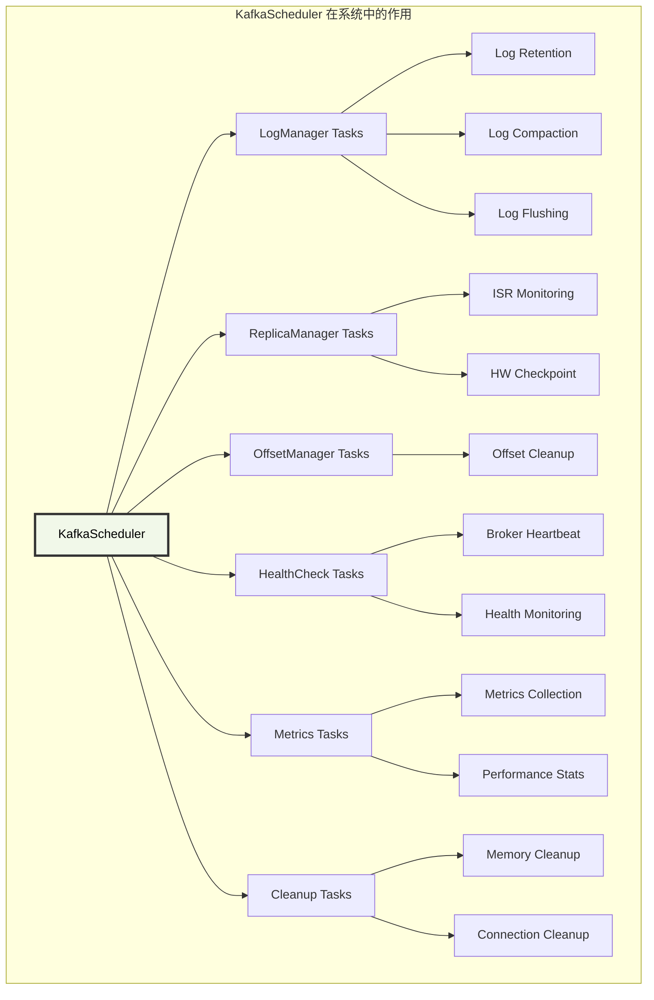
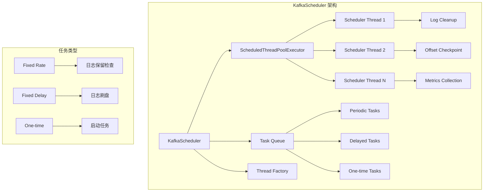

# Kafka Broker KafkaScheduler 深度解析：后台任务调度资源池

## 概述

KafkaScheduler 是 Kafka Broker 的后台任务调度资源池，负责管理和执行各种周期性和延迟任务，如日志清理、偏移量检查点、指标收集等。它基于 Java 的 ScheduledThreadPoolExecutor 实现，为 Kafka 提供了可靠的任务调度能力。

## 模块作用和设计目的

### 核心作用

KafkaScheduler 作为 Kafka 系统的"定时器"和"管家"，承担着以下重要职责：

1. **系统维护任务调度**：定期执行日志清理、压缩、刷盘等维护操作
2. **监控和检查点任务**：定期保存检查点、收集指标、健康检查
3. **资源管理任务**：内存清理、连接管理、配额重置等
4. **故障检测和恢复**：定期检测组件状态，触发故障恢复
5. **性能优化任务**：后台优化操作，如索引重建、数据重组
6. **集群协调任务**：心跳发送、状态同步、元数据更新

### 设计目的

KafkaScheduler 的设计体现了分布式系统对后台任务管理的核心需求：

#### 1. **系统自治和自愈能力**
```
定期维护 + 故障检测 + 自动恢复
    ↓
实现系统的自治运行
```
- **预防性维护**：通过定期清理和优化防止系统性能退化
- **主动监控**：持续监控系统状态，及早发现问题
- **自动恢复**：检测到异常时自动触发恢复机制

#### 2. **资源利用率优化**
- **后台执行**：在系统空闲时执行维护任务，不影响主要业务
- **负载均衡**：合理分配后台任务的执行时间
- **资源回收**：及时释放不再使用的资源

#### 3. **可靠性保障**
- **任务隔离**：单个任务失败不影响其他任务
- **异常处理**：完善的异常捕获和处理机制
- **重试机制**：支持任务失败后的重试

#### 4. **可观测性**
- **任务监控**：提供任务执行状态和性能指标
- **日志记录**：详细记录任务执行情况
- **调试支持**：支持任务执行的调试和诊断

### 在 Kafka 系统中的定位



KafkaScheduler 是 Kafka 系统的"后勤保障部门"，确保系统的持续稳定运行。

### 设计权衡

#### 1. **任务频率 vs 系统负载**
- **高频执行**：提高系统响应性，但增加 CPU 和 I/O 负载
- **低频执行**：减少系统负载，但可能延迟问题发现

#### 2. **线程数量 vs 资源消耗**
- **更多线程**：提高任务并发执行能力，但增加内存和调度开销
- **线程复用**：减少资源消耗，但可能导致任务排队

#### 3. **任务优先级 vs 公平性**
- **优先级调度**：重要任务优先执行，但可能导致低优先级任务饥饿
- **公平调度**：所有任务公平执行，但可能影响关键任务

#### 4. **故障处理策略**
- **快速失败**：任务失败立即停止，避免资源浪费
- **重试机制**：提高任务成功率，但可能延长执行时间

### 典型调度任务分类

#### 1. **数据管理任务**
- 日志段清理和压缩
- 索引文件维护
- 数据完整性检查

#### 2. **系统监控任务**
- 性能指标收集
- 健康状态检查
- 资源使用监控

#### 3. **集群协调任务**
- 心跳发送
- 元数据同步
- 状态报告

#### 4. **资源清理任务**
- 内存垃圾回收
- 连接池清理
- 临时文件清理

## 1. KafkaScheduler 架构设计

### 1.1 核心组件结构

**源码位置**: `server-common/src/main/java/org/apache/kafka/server/util/KafkaScheduler.java:110-125`

```java
public class KafkaScheduler implements Scheduler {
    private final AtomicInteger schedulerThreadId = new AtomicInteger(0);
    private final String threadNamePrefix;
    private final boolean daemon;
    private final int threads;
    private volatile ScheduledThreadPoolExecutor executor;
    private final Logger log = LoggerFactory.getLogger(KafkaScheduler.class);
    
    public KafkaScheduler(int threads) {
        this(threads, "kafka-scheduler-", true);
    }
    
    public KafkaScheduler(int threads, String threadNamePrefix, boolean daemon) {
        this.threads = threads;
        this.threadNamePrefix = threadNamePrefix;
        this.daemon = daemon;
    }
}
```

**源码位置**: `server-common/src/main/java/org/apache/kafka/server/util/KafkaScheduler.java:110-125`
**核心功能**:
- 管理固定大小的调度线程池
- 支持周期性和一次性任务调度
- 提供任务取消和线程池管理
- 支持优雅关闭和资源清理

### 1.2 调度器架构



## 2. 调度器启动和初始化

### 2.1 启动流程

**源码位置**: `server-common/src/main/java/org/apache/kafka/server/util/KafkaScheduler.java:112-125`

```java
@Override
public void startup() {
    log.debug("Initializing task scheduler.");
    synchronized (this) {
        if (isStarted())
            throw new IllegalStateException("This scheduler has already been started.");
            
        ScheduledThreadPoolExecutor executor = new ScheduledThreadPoolExecutor(threads);
        
        // 配置线程池行为
        executor.setContinueExistingPeriodicTasksAfterShutdownPolicy(false);
        executor.setExecuteExistingDelayedTasksAfterShutdownPolicy(false);
        executor.setRemoveOnCancelPolicy(true);
        
        // 设置自定义线程工厂
        executor.setThreadFactory(runnable ->
            new KafkaThread(threadNamePrefix + schedulerThreadId.getAndIncrement(), runnable, daemon));
            
        this.executor = executor;
    }
}
```

**源码位置**: `server-common/src/main/java/org/apache/kafka/server/util/KafkaScheduler.java:117-123`
**核心功能**:
- 创建指定大小的调度线程池
- 配置线程池关闭策略
- 设置自定义线程工厂创建守护线程
- 确保线程安全的启动过程

### 2.2 线程池配置

```java
// 线程池配置详解
private void configureExecutor(ScheduledThreadPoolExecutor executor) {
    // 1. 关闭后不继续执行周期性任务
    executor.setContinueExistingPeriodicTasksAfterShutdownPolicy(false);
    
    // 2. 关闭后不执行延迟任务
    executor.setExecuteExistingDelayedTasksAfterShutdownPolicy(false);
    
    // 3. 取消任务时立即从队列中移除
    executor.setRemoveOnCancelPolicy(true);
    
    // 4. 自定义线程工厂
    executor.setThreadFactory(runnable -> {
        KafkaThread thread = new KafkaThread(
            threadNamePrefix + schedulerThreadId.getAndIncrement(),
            runnable,
            daemon
        );
        thread.setUncaughtExceptionHandler((t, e) -> {
            log.error("Uncaught exception in scheduled task", e);
        });
        return thread;
    });
}
```

## 3. 任务调度机制

### 3.1 周期性任务调度

**源码位置**: `server-common/src/main/java/org/apache/kafka/server/util/KafkaScheduler.java:144-167`

```java
@Override
public ScheduledFuture<?> schedule(String name, Runnable task, long delayMs, long periodMs) {
    log.debug("Scheduling task {} with initial delay {} ms and period {} ms.", name, delayMs, periodMs);
    
    synchronized (this) {
        if (isStarted()) {
            Runnable runnable = () -> {
                try {
                    log.trace("Beginning execution of scheduled task '{}'.", name);
                    task.run();
                } catch (Throwable t) {
                    log.error("Uncaught exception in scheduled task '{}'", name, t);
                } finally {
                    log.trace("Completed execution of scheduled task '{}'.", name);
                }
            };
            
            if (periodMs > 0) {
                // 周期性任务：固定频率执行
                return executor.scheduleAtFixedRate(runnable, delayMs, periodMs, TimeUnit.MILLISECONDS);
            } else {
                // 一次性任务：延迟执行
                return executor.schedule(runnable, delayMs, TimeUnit.MILLISECONDS);
            }
        } else {
            log.info("Kafka scheduler is not running at the time task '{}' is scheduled. The task is ignored.", name);
            return new NoOpScheduledFutureTask();
        }
    }
}
```

**源码位置**: `server-common/src/main/java/org/apache/kafka/server/util/KafkaScheduler.java:144-167`
**核心功能**:
- 支持周期性和一次性任务调度
- 提供任务执行异常处理
- 记录任务执行日志和跟踪
- 返回可取消的 ScheduledFuture

### 3.2 任务包装和异常处理

```java
private Runnable wrapTask(String name, Runnable task) {
    return () -> {
        long startTime = System.currentTimeMillis();
        try {
            log.trace("Beginning execution of scheduled task '{}'.", name);
            
            // 设置线程名称以便调试
            Thread.currentThread().setName(threadNamePrefix + name);
            
            // 执行实际任务
            task.run();
            
        } catch (Throwable t) {
            // 记录异常但不中断调度器
            log.error("Uncaught exception in scheduled task '{}'", name, t);
            
            // 可选：发送告警或指标
            recordTaskFailure(name, t);
            
        } finally {
            long executionTime = System.currentTimeMillis() - startTime;
            log.trace("Completed execution of scheduled task '{}' in {} ms.", name, executionTime);
            
            // 记录任务执行时间指标
            recordTaskExecutionTime(name, executionTime);
        }
    };
}

private void recordTaskFailure(String taskName, Throwable error) {
    // 记录任务失败指标
    // 可以集成监控系统
}

private void recordTaskExecutionTime(String taskName, long executionTimeMs) {
    // 记录任务执行时间指标
    // 用于性能监控
}
```

## 4. 常见调度任务

### 4.1 日志管理任务

```java
// LogManager 中的调度任务示例
public void startupScheduledTasks() {
    // 1. 日志保留检查任务
    scheduler.schedule("kafka-log-retention",
                      () -> cleanupLogs(),
                      initialTaskDelayMs,
                      retentionCheckMs);
    
    // 2. 日志刷盘任务
    scheduler.schedule("kafka-log-flusher",
                      () -> flushDirtyLogs(),
                      initialTaskDelayMs,
                      flushCheckMs);
    
    // 3. 恢复点检查点任务
    scheduler.schedule("kafka-recovery-point-checkpoint",
                      () -> checkpointLogRecoveryOffsets(),
                      initialTaskDelayMs,
                      flushRecoveryOffsetCheckpointMs);
    
    // 4. 日志开始偏移量检查点任务
    scheduler.schedule("kafka-log-start-offset-checkpoint",
                      () -> checkpointLogStartOffsets(),
                      initialTaskDelayMs,
                      flushStartOffsetCheckpointMs);
}
```

### 4.2 副本管理任务

```java
// ReplicaManager 中的调度任务
public void startupReplicaTasks() {
    // 1. ISR 过期检查任务
    scheduler.schedule("isr-expiration",
                      () -> maybeShrinkIsr(),
                      0L,
                      config.replicaLagTimeMaxMs / 2);
    
    // 2. 高水位检查点任务
    scheduler.schedule("highwatermark-checkpoint",
                      () -> checkpointHighWatermarks(),
                      0L,
                      config.replicaHighWatermarkCheckpointIntervalMs);
    
    // 3. 延迟操作清理任务
    scheduler.schedule("delayed-operations-cleaner",
                      () -> {
                          delayedProducePurgatory.advanceClock(1000L);
                          delayedFetchPurgatory.advanceClock(1000L);
                      },
                      1000L,
                      1000L);
}
```

### 4.3 指标收集任务

```java
// 指标收集调度任务
public void startupMetricsTasks() {
    // 1. JVM 指标收集
    scheduler.schedule("jvm-metrics-collector",
                      () -> collectJvmMetrics(),
                      0L,
                      30000L); // 每30秒收集一次
    
    // 2. 磁盘使用率检查
    scheduler.schedule("disk-usage-checker",
                      () -> checkDiskUsage(),
                      0L,
                      60000L); // 每分钟检查一次
    
    // 3. 网络连接统计
    scheduler.schedule("network-stats-collector",
                      () -> collectNetworkStats(),
                      0L,
                      10000L); // 每10秒收集一次
}
```

## 5. 线程池管理

### 5.1 动态调整线程池大小

```java
public void resizeThreadPool(int newSize) {
    synchronized (this) {
        if (isStarted()) {
            log.info("Resizing scheduler thread pool from {} to {}", threads, newSize);
            executor.setCorePoolSize(newSize);
            
            // 更新内部状态
            // this.threads = newSize; // 注意：原始实现中threads是final的
        } else {
            log.warn("Cannot resize thread pool when scheduler is not started");
        }
    }
}

public String threadNamePrefix() {
    return threadNamePrefix;
}

public final boolean isStarted() {
    return executor != null;
}
```

### 5.2 任务监控和统计

```java
public SchedulerStats getStats() {
    if (!isStarted()) {
        return new SchedulerStats(0, 0, 0, 0);
    }
    
    return new SchedulerStats(
        executor.getActiveCount(),           // 活跃线程数
        executor.getTaskCount(),             // 总任务数
        executor.getCompletedTaskCount(),    // 已完成任务数
        executor.getQueue().size()           // 队列中等待的任务数
    );
}

public static class SchedulerStats {
    public final int activeThreads;
    public final long totalTasks;
    public final long completedTasks;
    public final int queuedTasks;
    
    public SchedulerStats(int activeThreads, long totalTasks, long completedTasks, int queuedTasks) {
        this.activeThreads = activeThreads;
        this.totalTasks = totalTasks;
        this.completedTasks = completedTasks;
        this.queuedTasks = queuedTasks;
    }
}
```

## 6. 优雅关闭机制

### 6.1 关闭流程

**源码位置**: `server-common/src/main/java/org/apache/kafka/server/util/KafkaScheduler.java:180-200`

```java
@Override
public void shutdown() throws InterruptedException {
    log.debug("Shutting down task scheduler.");
    
    synchronized (this) {
        if (executor != null) {
            // 1. 停止接受新任务
            executor.shutdown();
            
            try {
                // 2. 等待现有任务完成（最多等待30秒）
                if (!executor.awaitTermination(30, TimeUnit.SECONDS)) {
                    log.warn("Scheduler did not terminate gracefully within 30 seconds. Forcing shutdown.");
                    
                    // 3. 强制关闭
                    List<Runnable> pendingTasks = executor.shutdownNow();
                    log.info("Cancelled {} pending tasks during forced shutdown.", pendingTasks.size());
                    
                    // 4. 再次等待线程终止
                    if (!executor.awaitTermination(10, TimeUnit.SECONDS)) {
                        log.error("Scheduler threads did not terminate within 10 seconds after forced shutdown.");
                    }
                }
            } catch (InterruptedException e) {
                log.warn("Interrupted while waiting for scheduler shutdown.");
                executor.shutdownNow();
                Thread.currentThread().interrupt();
            } finally {
                executor = null;
            }
        }
    }
}
```

**源码位置**: `server-common/src/main/java/org/apache/kafka/server/util/KafkaScheduler.java:180-200`
**核心功能**:
- 停止接受新任务
- 等待现有任务完成
- 强制关闭未完成的任务
- 确保线程资源正确释放

## 7. 配置参数详解

### 7.1 调度器配置

| 参数名 | 默认值 | 说明 |
|--------|--------|------|
| `background.threads` | 10 | 后台线程数量 |
| `log.retention.check.interval.ms` | 300000 | 日志保留检查间隔 |
| `log.flush.interval.ms` | Long.MAX_VALUE | 日志刷盘间隔 |
| `replica.high.watermark.checkpoint.interval.ms` | 5000 | 高水位检查点间隔 |

### 7.2 性能调优

```java
// 根据系统负载调整线程数
int recommendedThreads = Math.max(2, Runtime.getRuntime().availableProcessors() / 2);

// 调度器配置示例
KafkaScheduler scheduler = new KafkaScheduler(
    recommendedThreads,
    "kafka-background-",
    true  // daemon threads
);
```

## 8. 监控指标

### 8.1 关键监控指标

```java
// 1. 线程池状态指标
kafka.server:type=KafkaScheduler,name=ActiveThreads
kafka.server:type=KafkaScheduler,name=TotalTasks
kafka.server:type=KafkaScheduler,name=CompletedTasks
kafka.server:type=KafkaScheduler,name=QueuedTasks

// 2. 任务执行指标
kafka.server:type=KafkaScheduler,name=TaskExecutionTime,task=*
kafka.server:type=KafkaScheduler,name=TaskFailureRate,task=*
```

### 8.2 健康检查

```java
public boolean isHealthy() {
    if (!isStarted()) {
        return false;
    }
    
    SchedulerStats stats = getStats();
    
    // 检查是否有线程卡死
    if (stats.activeThreads == threads && stats.queuedTasks > 100) {
        log.warn("Scheduler may be overloaded: {} active threads, {} queued tasks", 
                stats.activeThreads, stats.queuedTasks);
        return false;
    }
    
    return true;
}
```

KafkaScheduler 作为 Kafka Broker 的任务调度核心，通过可靠的线程池管理和任务调度机制，确保了各种后台维护任务的正常执行，是 Kafka 系统稳定运行的重要保障。
