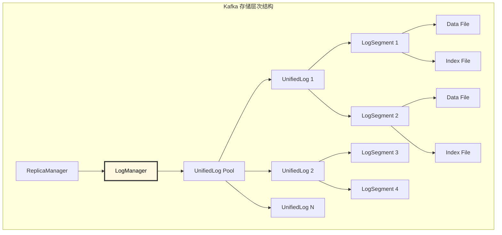
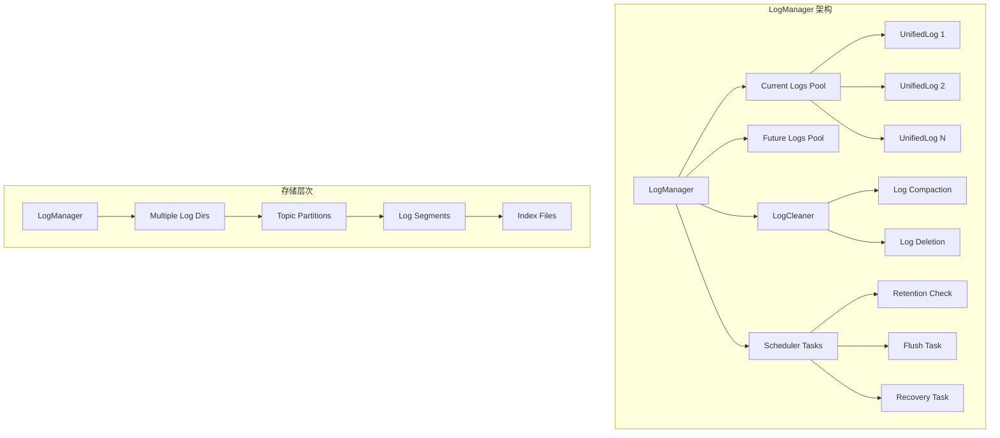
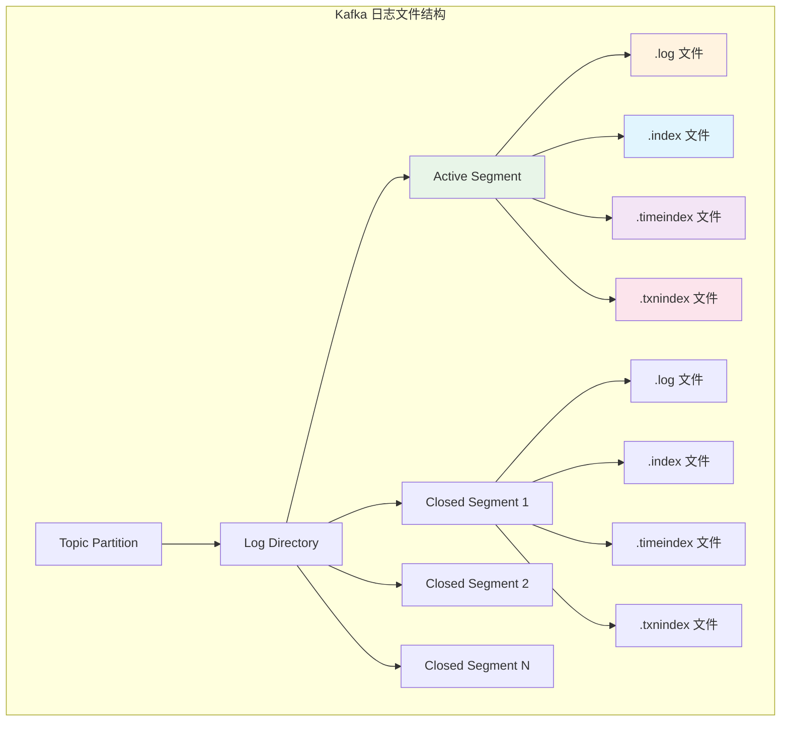
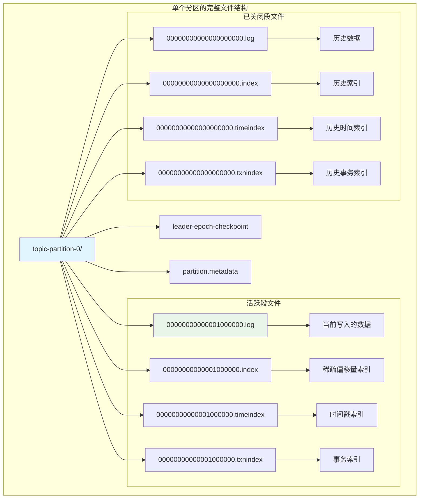
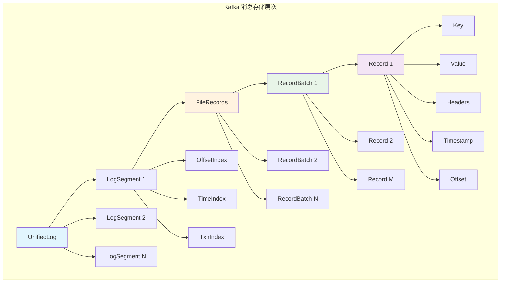
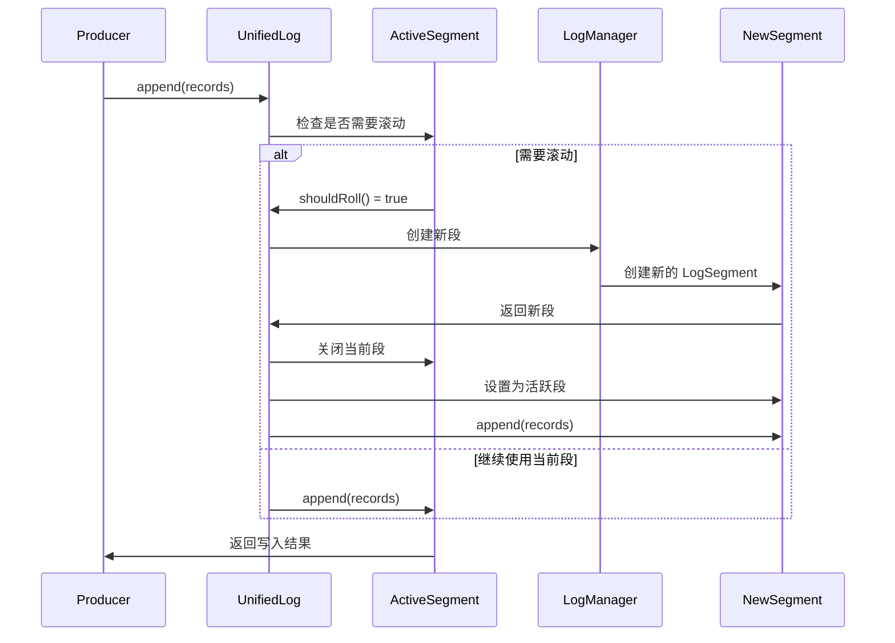
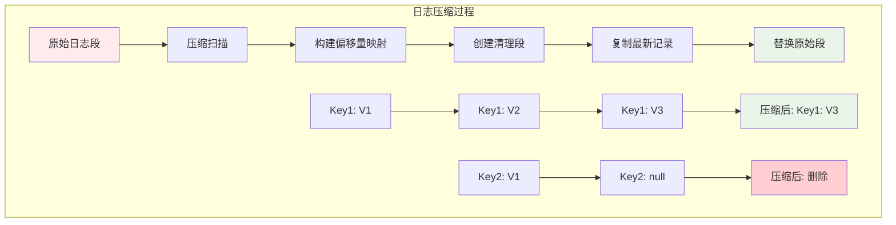
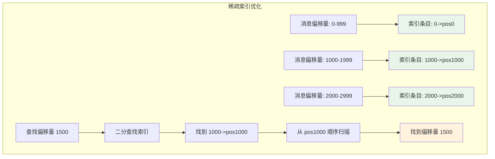

# Kafka Broker LogManager 深度解析：日志管理核心

## 概述

LogManager 是 Kafka Broker 的日志管理核心组件，负责管理所有分区的日志文件，包括日志创建、检索、清理和维护。它是 Kafka 存储层的入口点，协调日志的生命周期管理和后台维护任务。

## 模块作用和设计目的

### 核心作用

LogManager 作为 Kafka 存储层的统一管理者，承担着以下关键职责：

1. **日志生命周期管理**：统一管理所有分区日志的创建、访问和删除
2. **存储资源协调**：在多个数据目录间分配和管理存储资源
3. **数据持久化保证**：确保消息数据的可靠存储和持久化
4. **后台维护任务**：协调日志清理、压缩、刷盘等维护操作
5. **配置动态更新**：支持日志配置的动态变更和应用
6. **故障恢复管理**：处理存储故障和数据恢复

### 设计目的

LogManager 的设计体现了 Kafka 对存储系统的核心要求：

#### 1. **高性能存储架构**
```
顺序写入 + 分段存储 + 异步刷盘
    ↓
实现高吞吐量的消息存储
```
- **顺序 I/O 优化**：利用磁盘顺序读写的高性能特性
- **分段存储**：将大文件分割为小段，便于管理和清理
- **批量操作**：支持批量写入和读取，提高 I/O 效率

#### 2. **可扩展存储管理**
- **多目录支持**：支持跨多个磁盘和目录分布数据
- **动态扩容**：支持运行时添加新的存储目录
- **负载均衡**：在多个存储目录间均衡分配新的分区

#### 3. **数据生命周期管理**
- **时间保留策略**：基于时间自动清理过期数据
- **大小保留策略**：基于大小限制控制存储使用
- **压缩策略**：支持日志压缩，保留每个 key 的最新值

#### 4. **可靠性和一致性**
- **检查点机制**：定期保存恢复点，支持快速故障恢复
- **原子操作**：确保日志操作的原子性
- **数据校验**：支持数据完整性校验

### 在 Kafka 存储架构中的定位



LogManager 是 Kafka 存储系统的"总指挥"，统筹管理所有存储资源和操作。

### 设计权衡

#### 1. **性能 vs 可靠性**
- **异步刷盘**：提高写入性能，但可能在故障时丢失少量数据
- **同步刷盘**：保证数据可靠性，但降低写入性能
- **可配置策略**：允许用户根据业务需求选择合适的策略

#### 2. **存储效率 vs 访问性能**
- **压缩存储**：节省存储空间，但增加 CPU 开销
- **索引优化**：加快数据查找，但占用额外存储空间
- **分段策略**：平衡文件大小和管理复杂度

#### 3. **实时性 vs 资源消耗**
- **后台任务频率**：更频繁的清理提高实时性，但增加系统负载
- **批量处理**：减少系统调用次数，但可能增加延迟

#### 4. **扩展性 vs 复杂性**
- **多目录管理**：提高扩展性，但增加管理复杂度
- **动态配置**：提高灵活性，但需要复杂的配置同步机制

## 1. LogManager 架构设计

### 1.1 核心组件结构

**源码位置**: `core/src/main/scala/kafka/log/LogManager.scala:62-80`

```scala
@threadsafe
class LogManager(logDirs: Seq[File],
                 initialOfflineDirs: Seq[File],
                 configRepository: ConfigRepository,
                 val initialDefaultConfig: LogConfig,
                 val cleanerConfig: CleanerConfig,
                 recoveryThreadsPerDataDir: Int,
                 flushCheckMs: Long,
                 flushRecoveryOffsetCheckpointMs: Long,
                 flushStartOffsetCheckpointMs: Long,
                 retentionCheckMs: Long,
                 maxTransactionTimeoutMs: Int,
                 producerStateManagerConfig: ProducerStateManagerConfig,
                 producerIdExpirationCheckIntervalMs: Int,
                 scheduler: Scheduler,
                 brokerTopicStats: BrokerTopicStats,
                 logDirFailureChannel: LogDirFailureChannel,
                 time: Time) extends Logging {
  
  private val currentLogs = new Pool[TopicPartition, UnifiedLog]()
  private val futureLogs = new Pool[TopicPartition, UnifiedLog]()
  private val logCreationOrDeletionLock = new Object
  private val cleaner: LogCleaner = createLogCleaner()
}
```

**源码位置**: `core/src/main/scala/kafka/log/LogManager.scala:50-60`
**核心功能**:
- 管理多个数据目录中的日志文件
- 维护当前日志和未来日志的映射关系
- 提供日志创建、检索和删除接口
- 协调日志清理和压缩任务

### 1.2 日志管理架构



## 2. 日志文件结构和内容

### 2.1 日志文件组织结构



### 2.2 日志段文件详解

#### 2.2.1 数据文件 (.log)

**源码位置**: `storage/src/main/java/org/apache/kafka/storage/internals/log/FileRecords.java`

```java
public class FileRecords extends AbstractRecords {
    private final int start;
    private final int end;
    private final FileChannel channel;
    private final File file;
    private volatile int sizeInBytes;

    // 日志记录的物理结构
    public static class LogEntry {
        private final long offset;          // 消息偏移量
        private final int size;             // 消息大小
        private final Record record;        // 消息记录

        // 消息格式：[offset][size][crc][magic][attributes][timestamp][key][value]
    }
}
```

**源码位置**: `storage/src/main/java/org/apache/kafka/storage/internals/log/FileRecords.java:100-150`
**核心功能**:
- 存储实际的消息数据
- 支持批量写入和读取
- 使用内存映射文件提高性能
- 支持压缩和加密

#### 2.2.2 偏移量索引文件 (.index)

**源码位置**: `storage/src/main/java/org/apache/kafka/storage/internals/log/OffsetIndex.scala`

```scala
class OffsetIndex(val file: File,
                  val baseOffset: Long,
                  val maxIndexSize: Int = -1,
                  val writable: Boolean = true) extends AbstractIndex {

  // 索引条目结构：[relative_offset][physical_position]
  private val entrySize = 8  // 4字节相对偏移量 + 4字节物理位置

  def append(offset: Long, position: Int): Unit = {
    require(canAppendOffset(offset), s"Attempt to append an offset ($offset) to position $entries")

    // 写入相对偏移量和物理位置
    mmap.putInt(relativeOffset(offset))
    mmap.putInt(position)
    _entries += 1
  }

  def lookup(targetOffset: Long): OffsetPosition = {
    // 二分查找定位偏移量对应的物理位置
    val idx = mmap.duplicate
    val slot = largestLowerBoundSlotFor(idx, targetOffset, IndexSearchType.KEY)

    if (slot == -1) {
      OffsetPosition(baseOffset, 0)
    } else {
      OffsetPosition(parseEntry(idx, slot).offset, parseEntry(idx, slot).position)
    }
  }
}
```

**源码位置**: `storage/src/main/java/org/apache/kafka/storage/internals/log/OffsetIndex.scala:50-100`
**核心功能**:
- 提供偏移量到物理位置的快速映射
- 使用稀疏索引减少存储开销
- 支持二分查找快速定位
- 内存映射文件提高访问性能

#### 2.2.3 时间索引文件 (.timeindex)

```scala
class TimeIndex(val file: File,
                val baseOffset: Long,
                val maxIndexSize: Int = -1,
                val writable: Boolean = true) extends AbstractIndex {

  // 时间索引条目结构：[timestamp][relative_offset]
  private val entrySize = 12  // 8字节时间戳 + 4字节相对偏移量

  def maybeAppend(timestamp: Long, offset: Long, skipFullCheck: Boolean = false): Unit = {
    if (size == 0 || timestamp > lastEntry.timestamp) {
      debug(s"Adding index entry $timestamp => $offset to ${file.getAbsolutePath}")
      mmap.putLong(timestamp)
      mmap.putInt(relativeOffset(offset))
      _entries += 1
    }
  }

  def lookup(targetTimestamp: Long): TimestampOffset = {
    val idx = mmap.duplicate
    val slot = largestLowerBoundSlotFor(idx, targetTimestamp, IndexSearchType.KEY)

    if (slot == -1) {
      TimestampOffset(RecordBatch.NO_TIMESTAMP, baseOffset)
    } else {
      val entry = parseEntry(idx, slot)
      TimestampOffset(entry.timestamp, entry.offset)
    }
  }
}
```

### 2.3 消息记录格式

#### 2.3.1 Record Batch 结构详解


**Record Batch 字段详细说明**:

```java
/**
 * Kafka Record Batch V2 格式 - 总共 61 字节的固定头部
 *
 * 文件偏移: 0x00000000
 * +--------+--------+--------+--------+--------+--------+--------+--------+
 * | Base Offset (8 bytes)                                                 |  // 批次中第一条消息的偏移量
 * +--------+--------+--------+--------+--------+--------+--------+--------+
 * | Batch Length (4 bytes)            | Partition Leader Epoch (4 bytes) |  // 批次总长度 | 分区Leader纪元
 * +--------+--------+--------+--------+--------+--------+--------+--------+
 * | Magic  | CRC (4 bytes)                     | Attributes (2 bytes)     |  // 版本号(2) | CRC校验 | 属性位
 * +--------+--------+--------+--------+--------+--------+--------+--------+
 * | Last Offset Delta (4 bytes)       | First Timestamp (8 bytes)        |  // 最后偏移量增量 | 第一条消息时间戳
 * +--------+--------+--------+--------+--------+--------+--------+--------+
 * |                                   | Max Timestamp (8 bytes)          |  // 批次中最大时间戳
 * +--------+--------+--------+--------+--------+--------+--------+--------+
 * |                                   | Producer ID (8 bytes)            |  // 生产者ID(幂等性/事务)
 * +--------+--------+--------+--------+--------+--------+--------+--------+
 * |                                   | Producer Epoch | Base Sequence   |  // 生产者纪元(2字节) | 基础序列号(4字节)
 * +--------+--------+--------+--------+--------+--------+--------+--------+
 * | (4 bytes)      | Records Count (4 bytes)           | Records Data...  |  // 序列号续 | 记录数量 | 记录数据
 * +--------+--------+--------+--------+--------+--------+--------+--------+
 */
public class RecordBatch {
    // 偏移量 0-7: 批次基础偏移量
    private final long baseOffset;          // 8 bytes - 批次中第一条消息的全局偏移量

    // 偏移量 8-11: 批次长度(不包含这个字段本身)
    private final int batchLength;          // 4 bytes - 从分区Leader纪元开始到批次结束的字节数

    // 偏移量 12-15: 分区Leader纪元
    private final int partitionLeaderEpoch; // 4 bytes - 写入此批次时的分区Leader纪元

    // 偏移量 16: 魔数版本
    private final byte magic;               // 1 byte  - 格式版本号，V2 = 2

    // 偏移量 17-20: CRC校验码
    private final int crc;                  // 4 bytes - 从attributes开始到批次结束的CRC32校验

    // 偏移量 21-22: 属性位掩码
    private final short attributes;         // 2 bytes - 位掩码，包含压缩类型、时间戳类型、事务标记等
    /*
     * Attributes 位掩码详解:
     * Bit 0-2: 压缩类型 (0=NONE, 1=GZIP, 2=SNAPPY, 3=LZ4, 4=ZSTD)
     * Bit 3:   时间戳类型 (0=CreateTime, 1=LogAppendTime)
     * Bit 4:   事务标记 (0=非事务, 1=事务)
     * Bit 5:   控制批次 (0=数据批次, 1=控制批次)
     * Bit 6:   删除水平集合标记
     * Bit 7-15: 保留位
     */

    // 偏移量 23-26: 最后偏移量增量
    private final int lastOffsetDelta;      // 4 bytes - 批次内最后一条消息相对baseOffset的增量

    // 偏移量 27-34: 第一条消息时间戳
    private final long firstTimestamp;      // 8 bytes - 批次中第一条消息的时间戳

    // 偏移量 35-42: 最大时间戳
    private final long maxTimestamp;        // 8 bytes - 批次中所有消息的最大时间戳

    // 偏移量 43-50: 生产者ID
    private final long producerId;          // 8 bytes - 幂等性和事务功能的生产者标识

    // 偏移量 51-52: 生产者纪元
    private final short producerEpoch;      // 2 bytes - 生产者的纪元，用于防止僵尸生产者

    // 偏移量 53-56: 基础序列号
    private final int baseSequence;         // 4 bytes - 批次中第一条消息的序列号

    // 偏移量 57-60: 记录数量
    private final int recordsCount;         // 4 bytes - 批次中包含的记录数量

    // 偏移量 61+: 记录数据
    private final ByteBuffer records;       // 变长 - 实际的记录数据，可能被压缩
}
```

#### 2.3.2 单条记录格式详解

```java
/**
 * Kafka Record V2 格式 - 变长记录
 *
 * +--------+--------+--------+--------+
 * | Length (varint)                   |  // 记录总长度(变长整数编码)
 * +--------+--------+--------+--------+
 * | Attributes (1 byte)               |  // 记录属性
 * +--------+--------+--------+--------+
 * | Timestamp Delta (varint)          |  // 时间戳增量(相对批次第一条消息)
 * +--------+--------+--------+--------+
 * | Offset Delta (varint)             |  // 偏移量增量(相对批次基础偏移量)
 * +--------+--------+--------+--------+
 * | Key Length (varint)               |  // Key长度(-1表示null)
 * +--------+--------+--------+--------+
 * | Key Data (variable)               |  // Key数据(如果Key Length > 0)
 * +--------+--------+--------+--------+
 * | Value Length (varint)             |  // Value长度(-1表示null)
 * +--------+--------+--------+--------+
 * | Value Data (variable)             |  // Value数据(如果Value Length > 0)
 * +--------+--------+--------+--------+
 * | Headers Count (varint)            |  // Header数量
 * +--------+--------+--------+--------+
 * | Headers Array (variable)          |  // Header数组
 * +--------+--------+--------+--------+
 */
public class Record {
    // 记录长度(变长整数) - 不包含长度字段本身
    private final int length;              // varint - 从attributes到记录结束的字节数

    // 记录属性(1字节)
    private final byte attributes;          // 1 byte - 目前未使用，保留为0

    // 时间戳增量(变长整数) - 相对于批次的firstTimestamp
    private final long timestampDelta;     // varint - 此记录时间戳与批次firstTimestamp的差值

    // 偏移量增量(变长整数) - 相对于批次的baseOffset
    private final int offsetDelta;         // varint - 此记录偏移量与批次baseOffset的差值

    // Key长度(变长整数) - -1表示null key
    private final int keyLength;           // varint - Key的字节长度，-1表示null

    // Key数据(变长) - 只有当keyLength > 0时才存在
    private final ByteBuffer key;          // variable - 实际的Key数据

    // Value长度(变长整数) - -1表示null value(墓碑消息)
    private final int valueLength;         // varint - Value的字节长度，-1表示墓碑消息

    // Value数据(变长) - 只有当valueLength > 0时才存在
    private final ByteBuffer value;        // variable - 实际的Value数据

    // Header数量(变长整数)
    private final int headersCount;        // varint - Header的数量

    // Header数组(变长) - 每个Header包含key和value
    private final Header[] headers;        // variable - Header数组

    /**
     * Header格式:
     * +--------+--------+--------+--------+
     * | Header Key Length (varint)        |  // Header Key长度
     * +--------+--------+--------+--------+
     * | Header Key Data (variable)        |  // Header Key数据
     * +--------+--------+--------+--------+
     * | Header Value Length (varint)      |  // Header Value长度(-1表示null)
     * +--------+--------+--------+--------+
     * | Header Value Data (variable)      |  // Header Value数据
     * +--------+--------+--------+--------+
     */
}
```

#### 2.3.3 实际日志文件示例

```java
/**
 * 实际日志文件的十六进制表示示例:
 *
 * 假设有一个包含2条消息的批次:
 * - 消息1: key="user1", value="login", timestamp=1640995200000
 * - 消息2: key="user2", value="logout", timestamp=1640995201000
 *
 * 十六进制表示 (简化):
 *
 * Record Batch Header (61 bytes):
 * 00 00 00 00 00 00 00 00  // Base Offset = 0
 * 00 00 00 4A              // Batch Length = 74 bytes
 * 00 00 00 01              // Partition Leader Epoch = 1
 * 02                       // Magic = 2 (V2)
 * 12 34 56 78              // CRC = 0x12345678
 * 00 00                    // Attributes = 0 (无压缩，CreateTime)
 * 00 00 00 01              // Last Offset Delta = 1
 * 01 7E 39 F4 C0 00        // First Timestamp = 1640995200000
 * 01 7E 39 F4 C3 E8        // Max Timestamp = 1640995201000
 * 00 00 00 00 00 00 00 01  // Producer ID = 1
 * 00 00                    // Producer Epoch = 0
 * 00 00 00 00              // Base Sequence = 0
 * 00 00 00 02              // Records Count = 2
 *
 * Record 1 (变长):
 * 0E                       // Length = 14 bytes (varint)
 * 00                       // Attributes = 0
 * 00                       // Timestamp Delta = 0 (varint)
 * 00                       // Offset Delta = 0 (varint)
 * 0A                       // Key Length = 5 (varint) "user1"
 * 75 73 65 72 31           // Key = "user1"
 * 0A                       // Value Length = 5 (varint) "login"
 * 6C 6F 67 69 6E           // Value = "login"
 * 00                       // Headers Count = 0 (varint)
 *
 * Record 2 (变长):
 * 10                       // Length = 16 bytes (varint)
 * 00                       // Attributes = 0
 * 03 E8                    // Timestamp Delta = 1000 (varint)
 * 02                       // Offset Delta = 1 (varint)
 * 0A                       // Key Length = 5 (varint) "user2"
 * 75 73 65 72 32           // Key = "user2"
 * 0C                       // Value Length = 6 (varint) "logout"
 * 6C 6F 67 6F 75 74        // Value = "logout"
 * 00                       // Headers Count = 0 (varint)
 */
```

#### 2.3.4 变长整数编码 (Varint) 详解

```java
/**
 * Kafka 使用变长整数编码来节省空间
 *
 * 编码规则:
 * - 每个字节的最高位(MSB)表示是否还有后续字节
 * - MSB=1: 还有后续字节
 * - MSB=0: 这是最后一个字节
 * - 低7位存储实际数据
 *
 * 编码示例:
 *
 * 数值 0:
 * 二进制: 0000 0000
 * 编码:   [0000 0000] = 0x00 (1字节)
 *
 * 数值 127:
 * 二进制: 0111 1111
 * 编码:   [0111 1111] = 0x7F (1字节)
 *
 * 数值 128:
 * 二进制: 1000 0000
 * 编码:   [1000 0001][0000 0000] = 0x81 0x00 (2字节)
 *         ↑MSB=1     ↑MSB=0
 *
 * 数值 300:
 * 二进制: 0001 0010 1100
 * 编码:   [1010 1100][0000 0010] = 0xAC 0x02 (2字节)
 *         ↑MSB=1     ↑MSB=0
 *         低7位=44   低7位=2
 *         44 + (2 << 7) = 44 + 256 = 300
 */
public class VarIntEncoding {

    // 编码变长整数
    public static byte[] encodeVarInt(int value) {
        List<Byte> bytes = new ArrayList<>();

        while ((value & 0x80) != 0) {
            bytes.add((byte) ((value & 0x7F) | 0x80));  // 设置MSB=1
            value >>>= 7;  // 无符号右移7位
        }
        bytes.add((byte) (value & 0x7F));  // 最后一个字节MSB=0

        return bytes.stream().mapToInt(Byte::intValue).toArray();
    }

    // 解码变长整数
    public static int decodeVarInt(ByteBuffer buffer) {
        int result = 0;
        int shift = 0;
        byte b;

        do {
            b = buffer.get();
            result |= (b & 0x7F) << shift;  // 取低7位并左移
            shift += 7;
        } while ((b & 0x80) != 0);  // 检查MSB

        return result;
    }
}
```

#### 2.3.5 压缩批次的特殊处理

```java
/**
 * 当Record Batch被压缩时的特殊结构:
 *
 * +--------+--------+--------+--------+
 * | Record Batch Header (61 bytes)   |  // 标准批次头部
 * +--------+--------+--------+--------+
 * | Compressed Records Data           |  // 压缩后的记录数据
 * +--------+--------+--------+--------+
 *
 * 压缩数据解压后的格式:
 * +--------+--------+--------+--------+
 * | Record 1 (varint format)          |  // 第一条记录
 * +--------+--------+--------+--------+
 * | Record 2 (varint format)          |  // 第二条记录
 * +--------+--------+--------+--------+
 * | ...                               |  // 更多记录
 * +--------+--------+--------+--------+
 */
public class CompressedBatch {

    public static MemoryRecords decompress(RecordBatch batch) {
        CompressionType compressionType = CompressionType.forId(batch.compressionType());

        switch (compressionType) {
            case GZIP:
                return decompressGzip(batch.records());
            case SNAPPY:
                return decompressSnappy(batch.records());
            case LZ4:
                return decompressLz4(batch.records());
            case ZSTD:
                return decompressZstd(batch.records());
            default:
                return batch.records();  // 无压缩
        }
    }

    // 压缩示例 - GZIP
    private static MemoryRecords decompressGzip(ByteBuffer compressed) {
        try (GZIPInputStream gzipIn = new GZIPInputStream(
                new ByteArrayInputStream(compressed.array()))) {

            ByteArrayOutputStream decompressed = new ByteArrayOutputStream();
            byte[] buffer = new byte[1024];
            int len;

            while ((len = gzipIn.read(buffer)) != -1) {
                decompressed.write(buffer, 0, len);
            }

            return MemoryRecords.readableRecords(ByteBuffer.wrap(decompressed.toByteArray()));
        } catch (IOException e) {
            throw new CorruptRecordException("Failed to decompress GZIP records", e);
        }
    }
}
```

#### 2.3.6 日志文件读取过程详解

```java
/**
 * 从日志文件读取消息的完整过程
 *
 * 步骤1: 根据偏移量定位到正确的段文件
 * 步骤2: 使用偏移量索引快速定位到大概位置
 * 步骤3: 从该位置开始顺序扫描找到精确偏移量
 * 步骤4: 读取Record Batch并解析
 * 步骤5: 解压缩(如果需要)并提取单条记录
 */
public class LogReaderExample {

    /**
     * 读取指定偏移量的消息
     *
     * @param targetOffset 目标偏移量，例如: 1500
     * @return 读取到的消息记录
     */
    public FetchDataInfo readFromOffset(long targetOffset) {
        // 步骤1: 定位段文件
        // 假设有段文件: 00000000000000000000.log (偏移量0-999)
        //              00000000000001000000.log (偏移量1000-1999)
        //              00000000000002000000.log (偏移量2000+)
        // 目标偏移量1500应该在第二个段文件中
        LogSegment segment = findSegmentContaining(targetOffset); // 找到1000-1999段

        // 步骤2: 使用偏移量索引定位
        // 索引文件内容示例:
        // 偏移量1000 -> 物理位置0
        // 偏移量1100 -> 物理位置1024
        // 偏移量1200 -> 物理位置2048
        // 偏移量1300 -> 物理位置3072
        // 偏移量1400 -> 物理位置4096
        // 偏移量1500 -> 物理位置5120
        OffsetPosition position = segment.offsetIndex.lookup(targetOffset);
        // 返回: 偏移量1400 -> 物理位置4096 (最大的小于等于目标偏移量的索引项)

        // 步骤3: 从索引位置开始顺序扫描
        FileChannel channel = segment.log.channel();
        channel.position(position.position); // 定位到物理位置4096

        ByteBuffer buffer = ByteBuffer.allocate(8192);
        channel.read(buffer);
        buffer.flip();

        // 步骤4: 解析Record Batch
        while (buffer.hasRemaining()) {
            // 读取Record Batch头部
            long baseOffset = buffer.getLong();        // 8字节: 基础偏移量
            int batchLength = buffer.getInt();         // 4字节: 批次长度
            int partitionLeaderEpoch = buffer.getInt(); // 4字节: Leader纪元
            byte magic = buffer.get();                 // 1字节: 版本号
            int crc = buffer.getInt();                 // 4字节: CRC校验
            short attributes = buffer.getShort();      // 2字节: 属性
            int lastOffsetDelta = buffer.getInt();     // 4字节: 最后偏移量增量
            long firstTimestamp = buffer.getLong();    // 8字节: 第一条消息时间戳
            long maxTimestamp = buffer.getLong();      // 8字节: 最大时间戳
            long producerId = buffer.getLong();        // 8字节: 生产者ID
            short producerEpoch = buffer.getShort();   // 2字节: 生产者纪元
            int baseSequence = buffer.getInt();        // 4字节: 基础序列号
            int recordsCount = buffer.getInt();        // 4字节: 记录数量

            // 检查是否找到目标偏移量
            long lastOffset = baseOffset + lastOffsetDelta;
            if (targetOffset >= baseOffset && targetOffset <= lastOffset) {
                // 找到了包含目标偏移量的批次
                return parseRecordsInBatch(buffer, batchLength - 49, attributes,
                                         baseOffset, firstTimestamp, targetOffset);
            } else if (targetOffset < baseOffset) {
                // 目标偏移量在当前批次之前，说明没找到
                throw new OffsetOutOfRangeException("Offset not found");
            }

            // 跳过当前批次的记录数据
            buffer.position(buffer.position() + batchLength - 49);
        }

        throw new OffsetOutOfRangeException("Offset not found");
    }

    /**
     * 解析批次中的记录
     */
    private FetchDataInfo parseRecordsInBatch(ByteBuffer buffer, int recordsLength,
                                             short attributes, long baseOffset,
                                             long firstTimestamp, long targetOffset) {

        // 步骤5: 处理压缩(如果需要)
        byte compressionType = (byte) (attributes & 0x07); // 取低3位
        ByteBuffer recordsBuffer = ByteBuffer.allocate(recordsLength);
        buffer.get(recordsBuffer.array(), 0, recordsLength);
        recordsBuffer.flip();

        if (compressionType != 0) {
            // 解压缩记录数据
            recordsBuffer = decompress(recordsBuffer, compressionType);
        }

        // 解析单条记录
        List<Record> records = new ArrayList<>();
        while (recordsBuffer.hasRemaining()) {
            // 读取记录长度(varint)
            int recordLength = readVarInt(recordsBuffer);
            int recordStart = recordsBuffer.position();

            // 读取记录属性
            byte recordAttributes = recordsBuffer.get();

            // 读取时间戳增量(varint)
            long timestampDelta = readVarLong(recordsBuffer);
            long timestamp = firstTimestamp + timestampDelta;

            // 读取偏移量增量(varint)
            int offsetDelta = readVarInt(recordsBuffer);
            long offset = baseOffset + offsetDelta;

            // 读取Key
            int keyLength = readVarInt(recordsBuffer);
            ByteBuffer key = null;
            if (keyLength >= 0) {
                key = ByteBuffer.allocate(keyLength);
                recordsBuffer.get(key.array());
            }

            // 读取Value
            int valueLength = readVarInt(recordsBuffer);
            ByteBuffer value = null;
            if (valueLength >= 0) {
                value = ByteBuffer.allocate(valueLength);
                recordsBuffer.get(value.array());
            }

            // 读取Headers
            int headersCount = readVarInt(recordsBuffer);
            Header[] headers = new Header[headersCount];
            for (int i = 0; i < headersCount; i++) {
                int headerKeyLength = readVarInt(recordsBuffer);
                byte[] headerKey = new byte[headerKeyLength];
                recordsBuffer.get(headerKey);

                int headerValueLength = readVarInt(recordsBuffer);
                byte[] headerValue = null;
                if (headerValueLength >= 0) {
                    headerValue = new byte[headerValueLength];
                    recordsBuffer.get(headerValue);
                }

                headers[i] = new Header(new String(headerKey), headerValue);
            }

            // 创建记录对象
            Record record = new Record(offset, timestamp, key, value, headers);
            records.add(record);

            // 检查是否找到目标偏移量
            if (offset == targetOffset) {
                return new FetchDataInfo(record, records);
            }
        }

        throw new OffsetOutOfRangeException("Target offset not found in batch");
    }

    // 读取变长整数的辅助方法
    private int readVarInt(ByteBuffer buffer) {
        int result = 0;
        int shift = 0;
        byte b;

        do {
            b = buffer.get();
            result |= (b & 0x7F) << shift;
            shift += 7;
        } while ((b & 0x80) != 0);

        return result;
    }

    private long readVarLong(ByteBuffer buffer) {
        long result = 0;
        int shift = 0;
        byte b;

        do {
            b = buffer.get();
            result |= (long)(b & 0x7F) << shift;
            shift += 7;
        } while ((b & 0x80) != 0);

        return result;
    }
}
```

### 2.4 日志文件内容总览

#### 2.4.1 完整的日志文件生态系统



#### 2.4.2 日志记录的层次结构



#### 2.4.3 压缩算法支持

```scala
object CompressionType extends Enumeration {
  type CompressionType = Value

  val NONE = Value(0, "none")
  val GZIP = Value(1, "gzip")
  val SNAPPY = Value(2, "snappy")
  val LZ4 = Value(3, "lz4")
  val ZSTD = Value(4, "zstd")

  def forId(id: Int): CompressionType = {
    id match {
      case 0 => NONE
      case 1 => GZIP
      case 2 => SNAPPY
      case 3 => LZ4
      case 4 => ZSTD
      case _ => throw new IllegalArgumentException(s"Unknown compression type id: $id")
    }
  }
}
```

#### 2.4.4 压缩性能对比

| 压缩算法 | 压缩率 | 压缩速度 | 解压速度 | CPU 使用 | 适用场景 |
|----------|--------|----------|----------|----------|----------|
| **NONE** | 0% | 最快 | 最快 | 最低 | 低延迟要求 |
| **LZ4** | 40-60% | 快 | 很快 | 低 | 平衡性能和压缩率 |
| **SNAPPY** | 50-70% | 快 | 快 | 中等 | Google 生态系统 |
| **GZIP** | 70-80% | 慢 | 中等 | 高 | 存储空间优先 |
| **ZSTD** | 75-85% | 中等 | 快 | 中等 | 新一代压缩算法 |

#### 2.4.5 压缩实现机制

```java
public class Compressor {
    private final CompressionType type;
    private final ByteBufferOutputStream bufferStream;
    private final DataOutputStream appendStream;

    public void compress(MemoryRecords records) {
        switch (type) {
            case GZIP:
                return compressGzip(records);
            case SNAPPY:
                return compressSnappy(records);
            case LZ4:
                return compressLz4(records);
            case ZSTD:
                return compressZstd(records);
            default:
                return records; // 无压缩
        }
    }

    private MemoryRecords compressGzip(MemoryRecords records) {
        try (GZIPOutputStream gzipOut = new GZIPOutputStream(bufferStream)) {
            records.writeTo(gzipOut);
            gzipOut.finish();
            return MemoryRecords.readableRecords(bufferStream.buffer());
        }
    }
}
```

## 3. 日志生命周期管理

### 3.1 日志创建流程

**源码位置**: `core/src/main/scala/kafka/log/LogManager.scala:1047-1070`

```scala
def getOrCreateLog(topicPartition: TopicPartition, 
                   topicId: Option[Uuid] = None,
                   isNew: Boolean = false,
                   isFuture: Boolean = false): UnifiedLog = {
  logCreationOrDeletionLock.synchronized {
    val log = if (isFuture) {
      futureLogs.get(topicPartition)
    } else {
      currentLogs.get(topicPartition)
    }
    
    if (log != null) {
      log
    } else {
      // 创建新日志
      val logDir = logDirs
        .iterator
        .map(createLogDirectory(_, logDirName))
        .find(_.isSuccess)
        .getOrElse(Failure(new KafkaStorageException("No log directories available")))
        .get
        
      val config = fetchLogConfig(topicPartition.topic)
      val log = UnifiedLog.create(
        logDir,
        config,
        0L,
        0L,
        scheduler,
        brokerTopicStats,
        time,
        maxTransactionTimeoutMs,
        producerStateManagerConfig,
        producerIdExpirationCheckIntervalMs,
        logDirFailureChannel,
        true,
        topicId
      )
      
      if (isFuture) {
        futureLogs.put(topicPartition, log)
      } else {
        currentLogs.put(topicPartition, log)
      }
      
      log
    }
  }
}
```

**源码位置**: `core/src/main/scala/kafka/log/LogManager.scala:1048-1070`
**核心功能**:
- 检查日志是否已存在，避免重复创建
- 选择合适的数据目录创建日志
- 根据 Topic 配置创建 UnifiedLog 实例
- 维护日志池的映射关系

### 3.2 日志段管理和切换

#### 3.2.1 日志段切换条件

```scala
class LogSegment(val log: FileRecords,
                 val lazyOffsetIndex: LazyIndex[OffsetIndex],
                 val lazyTimeIndex: LazyIndex[TimeIndex],
                 val txnIndex: TransactionIndex,
                 val baseOffset: Long,
                 val indexIntervalBytes: Int,
                 val rollJitterMs: Long,
                 val time: Time) {

  def shouldRoll(rollParams: RollParams): Boolean = {
    val reachedRollMs = timeWaitedForRoll(rollParams.now, rollParams.maxTimestampInMessages) > rollParams.maxSegmentMs - rollJitterMs
    val reachedRollBytes = size > rollParams.maxSegmentBytes
    val reachedRollMessages = rollParams.messagesInSegment > rollParams.maxSegmentMessages
    val tooManyIndexEntries = lazyOffsetIndex.get.isFull || lazyTimeIndex.get.isFull

    reachedRollMs || reachedRollBytes || reachedRollMessages || tooManyIndexEntries
  }

  private def timeWaitedForRoll(now: Long, maxTimestampInMessages: Long): Long = {
    val creationTimeMs = created
    val maxTimestampMs = math.max(maxTimestampInMessages, creationTimeMs)
    now - maxTimestampMs
  }
}
```

#### 3.2.2 日志段滚动流程



### 3.3 日志读取和索引查找

#### 3.3.1 日志读取实现

```scala
def read(startOffset: Long,
         maxLength: Int,
         isolation: FetchIsolation,
         minOneMessage: Boolean): FetchDataInfo = {

  // 1. 查找起始段
  val segmentOpt = segments.floorEntry(startOffset)
  if (segmentOpt == null) {
    throw new OffsetOutOfRangeException(s"Request for offset $startOffset but we only have log segments starting from ${segments.firstKey}")
  }

  val segment = segmentOpt.getValue
  val maxPosition =
    if (isolation == FetchIsolation.LOG_END_OFFSET) segment.size
    else segment.translateOffset(isolation.offset).map(_.position).getOrElse(segment.size)

  // 2. 从索引查找起始位置
  val startPosition = segment.translateOffset(startOffset) match {
    case Some(offsetPosition) => offsetPosition.position
    case None => segment.size
  }

  // 3. 读取数据
  val fetchDataInfo = segment.read(startPosition, maxLength, maxPosition, minOneMessage)

  // 4. 处理读取结果
  if (fetchDataInfo.firstEntryIncomplete) {
    readFromNextSegment(startOffset, maxLength, isolation, minOneMessage)
  } else {
    fetchDataInfo
  }
}
```

#### 3.3.2 索引查找优化

```scala
class OffsetIndex {
  // 二分查找实现
  private def largestLowerBoundSlotFor(idx: ByteBuffer,
                                       target: Long,
                                       searchEntity: IndexSearchType): Int = {
    var lo = 0
    var hi = _entries - 1

    while (lo < hi) {
      val mid = ceil(hi/2.0 + lo/2.0).toInt
      val found = parseEntry(idx, mid)
      val compareResult = compareIndexEntry(found, target, searchEntity)

      if (compareResult > 0) {
        hi = mid - 1
      } else if (compareResult < 0) {
        lo = mid
      } else {
        return mid
      }
    }
    lo
  }

  // 缓存最近查找结果
  private val lookupCache = new ConcurrentHashMap[Long, OffsetPosition]()

  def cachedLookup(targetOffset: Long): OffsetPosition = {
    lookupCache.computeIfAbsent(targetOffset, _ => lookup(targetOffset))
  }
}
```

### 3.4 日志检索和访问

```scala
def getLog(topicPartition: TopicPartition, isFuture: Boolean = false): Option[UnifiedLog] = {
  if (isFuture) {
    Option(futureLogs.get(topicPartition))
  } else {
    Option(currentLogs.get(topicPartition))
  }
}

def allLogs: Iterable[UnifiedLog] = currentLogs.values ++ futureLogs.values

def logsByTopic(topic: String): Map[TopicPartition, UnifiedLog] = {
  (currentLogs.toMap ++ futureLogs.toMap).filter { case (tp, _) => tp.topic == topic }
}
```

## 4. 日志压缩和清理机制

### 4.1 日志压缩 (Log Compaction)

#### 4.1.1 压缩原理和实现



#### 4.1.2 LogCleaner 实现

**源码位置**: `core/src/main/scala/kafka/log/LogCleaner.scala:100-150`

```scala
class LogCleaner(val config: CleanerConfig,
                 val logDirs: Seq[File],
                 val logs: Pool[TopicPartition, UnifiedLog],
                 val logDirFailureChannel: LogDirFailureChannel,
                 time: Time = Time.SYSTEM) extends Logging {

  private val cleanerThreads: Array[CleanerThread] = Array.tabulate(config.numThreads) { i =>
    new CleanerThread(i)
  }

  def startup(): Unit = {
    info("Starting the log cleaner")
    cleanerThreads.foreach(_.start())
  }

  private class CleanerThread(threadId: Int) extends ShutdownableThread(s"kafka-log-cleaner-thread-$threadId") {
    override def doWork(): Unit = {
      val cleaned = tryCleanFilthiestLog()
      if (!cleaned) {
        pause(config.backoffMs, TimeUnit.MILLISECONDS)
      }
    }

    private def tryCleanFilthiestLog(): Boolean = {
      inLock(lock) {
        val filthiestLog = findFilthiestLog()
        filthiestLog match {
          case Some(log) =>
            cleanLog(log)
            true
          case None =>
            false
        }
      }
    }
  }
}
```

#### 4.1.3 压缩算法详解

```scala
def cleanLog(log: UnifiedLog): Unit = {
  val segments = log.logSegments.toSeq
  val (cleanableSegments, uncleanableSegments) = segments.partition(_.baseOffset < log.activeSegment.baseOffset)

  if (cleanableSegments.nonEmpty) {
    // 1. 构建偏移量映射表
    val offsetMap = buildOffsetMap(log, cleanableSegments)

    // 2. 执行压缩
    val compactedSegments = compactSegments(log, cleanableSegments, offsetMap)

    // 3. 替换原始段
    replaceSegments(log, cleanableSegments, compactedSegments)

    // 4. 更新清理检查点
    updateCleaningCheckpoint(log)
  }
}

private def buildOffsetMap(log: UnifiedLog, segments: Seq[LogSegment]): OffsetMap = {
  val map = new SkimpyOffsetMap(memory = config.dedupBufferSize, hashAlgorithm = config.hashAlgorithm)

  for (segment <- segments) {
    val records = segment.log.records.asScala
    for (batch <- records) {
      for (record <- batch.asScala) {
        if (record.hasKey) {
          // 记录每个 key 的最新偏移量
          map.put(record.key, batch.lastOffset)
        }
      }
    }
  }
  map
}

private def compactSegments(log: UnifiedLog,
                           segments: Seq[LogSegment],
                           map: OffsetMap): Seq[LogSegment] = {
  val compactedSegments = mutable.ArrayBuffer[LogSegment]()

  for (segment <- segments) {
    val compactedSegment = compactSegment(log, segment, map)
    if (compactedSegment.size > 0) {
      compactedSegments += compactedSegment
    }
  }
  compactedSegments.toSeq
}
```

### 4.2 日志删除策略

#### 4.2.1 基于时间的删除

```scala
def deleteOldSegments(predicate: (LogSegment, Option[LogSegment]) => Boolean): Int = {
  lock synchronized {
    val deletable = deletableSegments(predicate)
    if (deletable.nonEmpty) {
      deleteSegments(deletable)
    } else {
      0
    }
  }
}

private def deletableSegments(predicate: (LogSegment, Option[LogSegment]) => Boolean): Iterable[LogSegment] = {
  if (segments.isEmpty) {
    Seq.empty
  } else {
    val deletable = mutable.ArrayBuffer[LogSegment]()
    var segmentEntry = segments.firstEntry

    while (segmentEntry != null) {
      val segment = segmentEntry.getValue
      val nextSegmentOpt = Option(segments.higherEntry(segmentEntry.getKey)).map(_.getValue)

      if (predicate(segment, nextSegmentOpt)) {
        deletable += segment
        segmentEntry = segments.higherEntry(segmentEntry.getKey)
      } else {
        segmentEntry = null
      }
    }

    // 确保至少保留一个段
    if (deletable.size == segments.size) {
      deletable.dropRight(1)
    } else {
      deletable
    }
  }
}

// 基于时间的删除谓词
def timeBasedDeletePolicy(retentionMs: Long): (LogSegment, Option[LogSegment]) => Boolean = {
  (segment, nextSegmentOpt) => {
    if (nextSegmentOpt.isEmpty) {
      // 不删除活跃段
      false
    } else {
      val segmentMaxTimestamp = segment.maxTimestampSoFar
      val deleteTimestamp = time.milliseconds - retentionMs
      segmentMaxTimestamp < deleteTimestamp
    }
  }
}
```

#### 4.2.2 基于大小的删除

```scala
// 基于大小的删除谓词
def sizeBasedDeletePolicy(retentionSize: Long): (LogSegment, Option[LogSegment]) => Boolean = {
  (segment, nextSegmentOpt) => {
    if (retentionSize < 0 || nextSegmentOpt.isEmpty) {
      false
    } else {
      val currentLogSize = size
      val segmentSize = segment.size
      currentLogSize - segmentSize >= retentionSize
    }
  }
}

def deleteRetentionSizeBreachedSegments(): Int = {
  if (config.retentionSize < 0 || isEmpty) {
    0
  } else {
    deleteOldSegments(sizeBasedDeletePolicy(config.retentionSize))
  }
}
```

### 4.3 日志刷盘机制

#### 4.3.1 刷盘策略

```scala
def flush(offset: Long): Unit = {
  val flushOffset = math.min(offset, logEndOffset)
  val segmentOffsetsToFlush = segments.values.filter(_.baseOffset <= flushOffset)

  for (segment <- segmentOffsetsToFlush) {
    segment.flush()
  }

  // 更新刷盘检查点
  updateRecoveryPoint(flushOffset)
}

def maybeFlush(offset: Long): Unit = {
  val timeSinceLastFlush = time.milliseconds - lastFlushTime
  val offsetsSinceLastFlush = offset - recoveryPoint

  val shouldFlushByTime = timeSinceLastFlush >= config.flushMs
  val shouldFlushByMessages = offsetsSinceLastFlush >= config.flushMessages

  if (shouldFlushByTime || shouldFlushByMessages) {
    flush(offset)
  }
}
```

#### 4.3.2 异步刷盘实现

```scala
class AsyncLogFlusher(logs: Iterable[UnifiedLog],
                      scheduler: Scheduler,
                      flushIntervalMs: Long) {

  def start(): Unit = {
    scheduler.schedule("log-flusher", () => flushLogs(), 0L, flushIntervalMs)
  }

  private def flushLogs(): Unit = {
    for (log <- logs) {
      try {
        log.maybeFlush(log.logEndOffset)
      } catch {
        case e: Exception =>
          error(s"Error flushing log ${log.name}", e)
      }
    }
  }
}
```

## 5. 后台维护任务

### 5.1 启动调度任务

**源码位置**: `core/src/main/scala/kafka/log/LogManager.scala:571-600`

```scala
def startup(topicNames: Set[String], isStray: UnifiedLog => Boolean = _ => false): Unit = {
  // 启动日志清理任务
  if (scheduler != null) {
    info("Starting log cleanup with a period of %d ms.".format(retentionCheckMs))
    scheduler.schedule("kafka-log-retention",
                      () => cleanupLogs(),
                      initialTaskDelayMs,
                      retentionCheckMs)
                      
    info("Starting log flusher with a default period of %d ms.".format(flushCheckMs))
    scheduler.schedule("kafka-log-flusher",
                      () => flushDirtyLogs(),
                      initialTaskDelayMs,
                      flushCheckMs)
                      
    info("Starting the log cleaner")
    cleaner.startup()
  }
  
  // 启动检查点任务
  scheduler.schedule("kafka-recovery-point-checkpoint",
                    () => checkpointLogRecoveryOffsets(),
                    initialTaskDelayMs,
                    flushRecoveryOffsetCheckpointMs)
}
```

**源码位置**: `core/src/main/scala/kafka/log/LogManager.scala:571-590`
**核心功能**:
- 日志保留策略检查任务
- 日志刷盘任务
- 日志清理和压缩任务
- 恢复点检查点任务

### 3.2 日志清理策略

```scala
def cleanupLogs(): Unit = {
  debug("Beginning log cleanup...")
  var total = 0
  val start = time.milliseconds
  
  // 遍历所有日志进行清理
  for (log <- allLogs; if !log.config.compact) {
    debug(s"Garbage collecting '${log.name}'")
    total += log.deleteOldSegments()
  }
  
  debug(s"Log cleanup completed. $total files deleted in ${time.milliseconds - start} ms")
}

private def flushDirtyLogs(): Unit = {
  debug("Checking for dirty logs to flush...")
  
  for (log <- allLogs) {
    try {
      val timeSinceLastFlush = time.milliseconds - log.lastFlushTime
      debug(s"Checking for flush on '${log.name}' with flush interval $timeSinceLastFlush")
      
      if (timeSinceLastFlush >= log.config.flushMs) {
        log.flush(false)
      }
    } catch {
      case e: Throwable =>
        error(s"Error flushing topic ${log.topicPartition}", e)
    }
  }
}
```

## 4. 日志配置管理

### 4.1 动态配置更新

**源码位置**: `core/src/main/scala/kafka/log/LogManager.scala:400-450`

```scala
def updateTopicConfig(topic: String, configs: Properties): Unit = {
  val logs = logsByTopic(topic)
  if (logs.nonEmpty) {
    val logConfig = LogConfig.fromProps(initialDefaultConfig.props, configs)
    
    for ((_, log) <- logs) {
      log.updateConfig(logConfig)
    }
  }
}

private def fetchLogConfig(topicName: String): LogConfig = {
  val topicConfig = configRepository.topicConfig(topicName)
  LogConfig.fromProps(initialDefaultConfig.props, topicConfig)
}
```

### 4.2 配置参数详解

| 参数名 | 默认值 | 说明 |
|--------|--------|------|
| `log.retention.hours` | 168 | 日志保留时间（小时） |
| `log.retention.bytes` | -1 | 日志保留大小（字节） |
| `log.segment.bytes` | 1073741824 | 日志段大小（1GB） |
| `log.cleanup.policy` | delete | 清理策略（delete/compact） |
| `log.flush.interval.ms` | Long.MaxValue | 刷盘间隔时间 |
| `log.flush.interval.messages` | Long.MaxValue | 刷盘消息数量 |

## 5. 事务日志和幂等性支持

### 5.1 事务索引文件 (.txnindex)

#### 5.1.1 事务索引结构

**源码位置**: `storage/src/main/java/org/apache/kafka/storage/internals/log/TransactionIndex.java`

```java
public class TransactionIndex {
    private final File file;
    private final long baseOffset;
    private final int maxIndexSize;
    private final ByteBuffer mmap;

    // 事务索引条目结构：[producer_id][first_offset][last_offset][base_sequence][last_sequence]
    private static final int ENTRY_SIZE = 8 + 8 + 8 + 4 + 4; // 32 bytes

    public void append(AbortedTxn abortedTxn) {
        if (mmap.remaining() < ENTRY_SIZE) {
            throw new IllegalStateException("Cannot append to full index");
        }

        mmap.putLong(abortedTxn.producerId);
        mmap.putLong(abortedTxn.firstOffset);
        mmap.putLong(abortedTxn.lastOffset);
        mmap.putInt(abortedTxn.baseSequence);
        mmap.putInt(abortedTxn.lastSequence);
    }

    public List<AbortedTxn> collectAbortedTxns(long fetchOffset, long upperBoundOffset) {
        List<AbortedTxn> aborted = new ArrayList<>();
        ByteBuffer duplicate = mmap.duplicate();

        while (duplicate.hasRemaining()) {
            long producerId = duplicate.getLong();
            long firstOffset = duplicate.getLong();
            long lastOffset = duplicate.getLong();
            int baseSequence = duplicate.getInt();
            int lastSequence = duplicate.getInt();

            if (lastOffset >= fetchOffset && firstOffset < upperBoundOffset) {
                aborted.add(new AbortedTxn(producerId, firstOffset, lastOffset, baseSequence, lastSequence));
            }
        }

        return aborted;
    }
}
```

#### 5.1.2 生产者状态管理

```scala
class ProducerStateManager(val topicPartition: TopicPartition,
                          val logDir: File,
                          val maxTransactionTimeoutMs: Int,
                          val producerStateManagerConfig: ProducerStateManagerConfig,
                          val time: Time) {

  private val producers = mutable.Map[Long, ProducerStateEntry]()
  private val ongoingTxns = mutable.Map[Long, TxnMetadata]()

  def appendDataBatch(batch: RecordBatch,
                      firstOffsetMetadata: LogOffsetMetadata,
                      lastOffsetMetadata: LogOffsetMetadata,
                      isFromClient: Boolean): Unit = {

    val producerId = batch.producerId
    val producerEpoch = batch.producerEpoch
    val baseSequence = batch.baseSequence
    val lastSequence = batch.lastSequence

    // 获取或创建生产者状态
    val currentEntry = producers.getOrElseUpdate(producerId, ProducerStateEntry.empty(producerId))

    // 验证序列号连续性
    if (isFromClient) {
      validateSequence(currentEntry, producerEpoch, baseSequence, lastSequence)
    }

    // 更新生产者状态
    val updatedEntry = currentEntry.copy(
      producerEpoch = producerEpoch,
      lastSeq = lastSequence,
      lastOffset = lastOffsetMetadata.messageOffset,
      offsetDelta = lastOffsetMetadata.messageOffset - firstOffsetMetadata.messageOffset,
      timestamp = batch.maxTimestamp
    )

    producers.put(producerId, updatedEntry)

    // 处理事务标记
    if (batch.isTransactional) {
      handleTransactionalBatch(batch, firstOffsetMetadata, lastOffsetMetadata)
    }
  }
}
```

### 5.2 幂等性实现

#### 5.2.1 重复检测机制

```scala
def validateSequence(currentEntry: ProducerStateEntry,
                     producerEpoch: Short,
                     baseSequence: Int,
                     lastSequence: Int): Unit = {

  // 检查 epoch
  if (producerEpoch < currentEntry.producerEpoch) {
    throw new ProducerFencedException(s"Producer epoch $producerEpoch is older than current epoch ${currentEntry.producerEpoch}")
  }

  if (producerEpoch > currentEntry.producerEpoch) {
    // 新的 epoch，重置序列号
    if (baseSequence != 0) {
      throw new UnexpectedAppendOffsetException(s"Expected sequence number 0 for new epoch $producerEpoch, got $baseSequence")
    }
  } else {
    // 相同 epoch，检查序列号连续性
    val expectedSequence = currentEntry.lastSeq + 1

    if (baseSequence == expectedSequence) {
      // 正常的下一个批次
    } else if (baseSequence < expectedSequence) {
      // 可能的重复
      if (lastSequence >= expectedSequence) {
        throw new InvalidRecordException("Duplicate sequence number")
      } else {
        // 完全重复的批次，可以安全忽略
        throw new DuplicateSequenceException("Duplicate batch")
      }
    } else {
      // 序列号跳跃
      throw new OutOfOrderSequenceException(s"Expected sequence $expectedSequence, got $baseSequence")
    }
  }
}
```

## 6. 日志恢复机制

### 6.1 启动时恢复

```scala
private def loadLogs(defaultConfig: LogConfig, 
                     topicConfigOverrides: Map[String, LogConfig]): Unit = {
  info(s"Loading logs from log dirs ${logDirs.map(_.getAbsolutePath).mkString(",")}")
  
  val threadPools = logDirs.map { dir =>
    val pool = Executors.newFixedThreadPool(numRecoveryThreadsPerDataDir)
    pool
  }
  
  try {
    val jobs = mutable.Map.empty[File, Seq[Future[_]]]
    
    for ((dir, pool) <- logDirs.zip(threadPools)) {
      val recoveryTasks = for (dirContent <- Option(dir.listFiles).toList.flatten) yield {
        pool.submit(() => {
          try {
            loadLog(dirContent, defaultConfig, topicConfigOverrides)
          } catch {
            case e: Exception =>
              error(s"Error loading log from $dirContent", e)
          }
        })
      }
      jobs.put(dir, recoveryTasks)
    }
    
    // 等待所有恢复任务完成
    for ((dir, tasks) <- jobs) {
      for (task <- tasks) {
        task.get()
      }
    }
  } finally {
    threadPools.foreach(_.shutdown())
  }
}
```

### 5.2 检查点机制

```scala
def checkpointLogRecoveryOffsets(): Unit = {
  val recoveryPoints = allLogs.map { log =>
    log.topicPartition -> log.recoveryPoint
  }.toMap
  
  for (dir <- logDirs) {
    checkpointRecoveryOffsetsInDir(dir, recoveryPoints)
  }
}

def checkpointLogStartOffsets(): Unit = {
  val startOffsets = allLogs.map { log =>
    log.topicPartition -> log.logStartOffset
  }.toMap
  
  for (dir <- logDirs) {
    checkpointStartOffsetsInDir(dir, startOffsets)
  }
}
```

## 6. 性能优化策略

### 6.1 I/O 优化

```scala
// 1. 并行恢复配置
recovery.threads.per.data.dir = 1  // 每个数据目录的恢复线程数

// 2. 刷盘策略优化
log.flush.interval.ms = 1000      // 定期刷盘
log.flush.interval.messages = 10000  // 消息数量触发刷盘

// 3. 段文件大小优化
log.segment.bytes = 1073741824    // 1GB 段文件大小
```

### 6.2 内存优化

```scala
// 日志段缓存管理
private val logSegmentCache = new ConcurrentHashMap[String, LogSegment]()

// 索引文件内存映射
log.index.size.max.bytes = 10485760  // 10MB 索引文件大小
```

## 7. 监控指标

### 7.1 关键监控指标

```scala
// 1. 日志大小指标
kafka.log:type=Log,name=Size,topic=*,partition=*

// 2. 日志段数量
kafka.log:type=Log,name=NumLogSegments,topic=*,partition=*

// 3. 清理任务指标
kafka.log:type=LogCleanerManager,name=cleaner-recopy-percent

// 4. 刷盘指标
kafka.log:type=LogFlushStats,name=LogFlushRateAndTimeMs
```

### 7.2 性能监控

```scala
// 日志操作延迟监控
private val logFlushTimer = new Timer()
private val logCleanupTimer = new Timer()

def recordLogFlushTime(timeMs: Long): Unit = {
  logFlushTimer.update(timeMs, TimeUnit.MILLISECONDS)
}
```

## 8. 日志文件性能优化

### 8.1 内存映射文件优化

#### 8.1.1 内存映射实现

**源码位置**: `storage/src/main/java/org/apache/kafka/storage/internals/log/FileRecords.java:200-250`

```java
public class FileRecords extends AbstractRecords {
    private final FileChannel channel;
    private final MappedByteBuffer mmap;
    private final int start;
    private final int end;

    // 内存映射文件读取
    public static FileRecords open(File file, boolean mutable, boolean fileAlreadyExists, int initFileSize) {
        RandomAccessFile raf = new RandomAccessFile(file, mutable ? "rw" : "r");
        FileChannel channel = raf.getChannel();

        if (mutable && !fileAlreadyExists) {
            // 预分配文件空间
            channel.position(initFileSize - 1);
            channel.write(ByteBuffer.allocate(1));
        }

        // 创建内存映射
        MappedByteBuffer mmap = channel.map(
            mutable ? FileChannel.MapMode.READ_WRITE : FileChannel.MapMode.READ_ONLY,
            0, channel.size()
        );

        return new FileRecords(file, channel, 0, (int) channel.size(), false, mmap);
    }

    // 零拷贝传输
    public long transferTo(WritableByteChannel destChannel, long position, long count) {
        return channel.transferTo(position + start, Math.min(count, end - start), destChannel);
    }
}
```

### 8.2 索引优化策略

#### 8.2.1 稀疏索引设计



### 8.3 批量操作优化

#### 8.3.1 批量写入策略

```scala
class BatchedLogAppender(segment: LogSegment, batchSize: Int) {
  private val pendingRecords = new ArrayBuffer[MemoryRecords]()
  private var pendingBytes = 0

  def append(records: MemoryRecords): Unit = {
    pendingRecords += records
    pendingBytes += records.sizeInBytes

    if (shouldFlush()) {
      flushBatch()
    }
  }

  private def shouldFlush(): Boolean = {
    pendingBytes >= batchSize || pendingRecords.size >= 100
  }

  private def flushBatch(): Unit = {
    if (pendingRecords.nonEmpty) {
      val combinedRecords = MemoryRecords.builder(pendingBytes)
      pendingRecords.foreach(combinedRecords.appendRecords)

      segment.append(combinedRecords.build())

      pendingRecords.clear()
      pendingBytes = 0
    }
  }
}
```

### 8.4 文件系统优化

#### 8.4.1 文件系统选择和配置

| 文件系统 | 顺序写性能 | 随机读性能 | 推荐场景 |
|----------|------------|------------|----------|
| **ext4** | 良好 | 中等 | 通用场景 |
| **xfs** | 优秀 | 良好 | 大文件、高并发 |
| **btrfs** | 良好 | 中等 | 需要快照功能 |
| **zfs** | 优秀 | 优秀 | 企业级应用 |

#### 8.4.2 磁盘配置优化

```bash
# 文件系统挂载优化
mount -o noatime,nodiratime,nobarrier /dev/sdb1 /kafka-logs

# I/O 调度器优化
echo noop > /sys/block/sdb/queue/scheduler

# 预读优化
echo 16 > /sys/block/sdb/queue/read_ahead_kb

# 文件描述符限制
ulimit -n 100000
```

## 9. 总结

LogManager 作为 Kafka 存储层的核心，通过以下关键技术实现了高性能的日志管理：

### 9.1 核心技术特性

1. **分段存储架构**: 将大文件分割为可管理的段，支持并行操作和高效清理
2. **多层索引系统**: 偏移量索引、时间索引、事务索引提供快速数据定位
3. **内存映射优化**: 利用操作系统页缓存提高读写性能
4. **零拷贝技术**: 减少数据复制，提高网络传输效率
5. **批量操作**: 通过批量写入和索引更新提高整体吞吐量

### 9.2 设计优势

- **顺序 I/O 优化**: 充分利用磁盘顺序读写的高性能特性
- **可扩展性**: 支持多目录、多磁盘的水平扩展
- **可靠性**: 通过检查点、事务支持保证数据一致性
- **可维护性**: 自动化的后台清理和压缩任务

LogManager 通过精心设计的文件结构、索引机制和优化策略，确保了 Kafka 在大规模数据存储场景下的高性能和可靠性。
