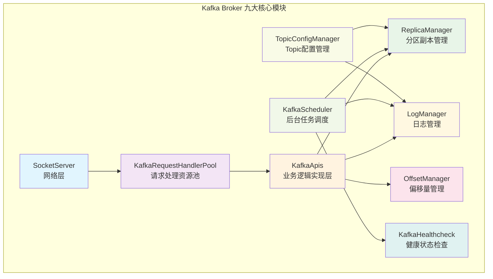
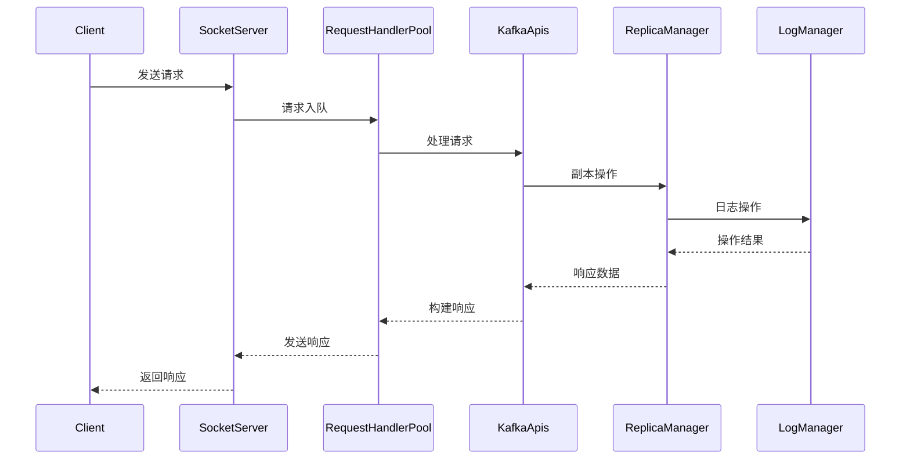
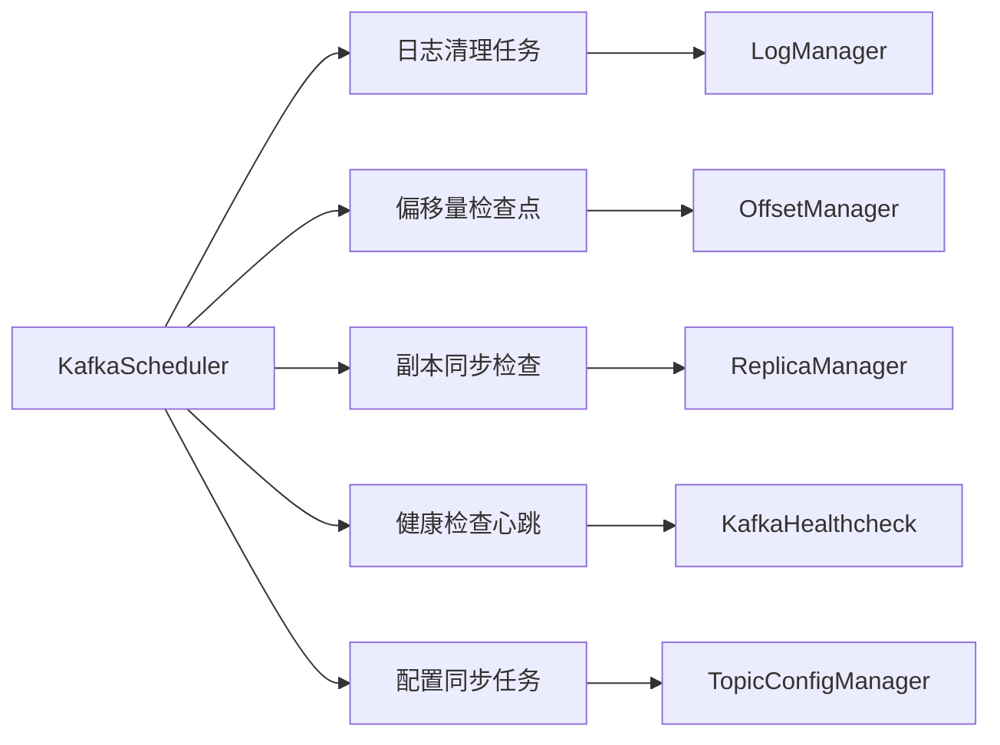
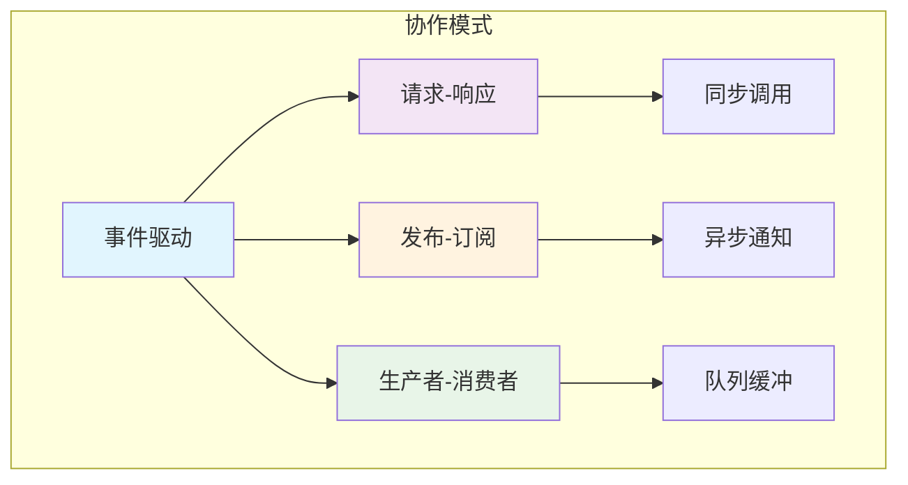

# Kafka Broker 九大核心模块深度解析总览

## 概述

Kafka Broker 由九个基本模块组成，每个模块负责特定的功能领域，共同构成了一个高性能、高可用的分布式消息系统。本文档提供了所有模块的总览和相互关系分析。

## 1. 九大核心模块架构



## 2. 模块功能概览和设计目的

### 2.1 网络和请求处理层

| 模块 | 设计目的 | 核心作用 | 关键特性 | 文档链接 |
|------|----------|----------|----------|----------|
| **SocketServer** | 高并发网络I/O处理，实现C10K级别连接支持 | 网络连接管理、I/O多路复用、请求路由 | Reactor模式、非阻塞I/O、连接配额 | [详细文档](broker-socketserver-deep-dive.md) |
| **KafkaRequestHandlerPool** | 解耦网络I/O和业务处理，实现高并发请求处理 | 请求并发处理、负载均衡、资源管理 | 线程池模式、异步处理、背压控制 | [详细文档](broker-request-handler-pool-deep-dive.md) |
| **KafkaApis** | 统一API抽象，提供安全可靠的业务逻辑实现 | API请求路由、业务逻辑实现、权限验证 | 协议兼容、安全治理、可观测性 | [详细文档](broker-kafkaapis-deep-dive.md) |

**层次设计理念**：网络层采用分层解耦设计，从底层的网络I/O到上层的业务逻辑，每层专注特定职责，实现高性能和高可维护性。

### 2.2 存储和副本管理层

| 模块 | 设计目的 | 核心作用 | 关键特性 | 文档链接 |
|------|----------|----------|----------|----------|
| **LogManager** | 高性能存储管理，实现数据的可靠持久化 | 日志生命周期管理、存储资源协调、数据持久化 | 顺序I/O、分段存储、后台维护 | [详细文档](broker-logmanager-deep-dive.md) |
| **ReplicaManager** | CAP定理平衡，实现高可用性和数据一致性 | 副本状态管理、Leader选举、数据同步 | ISR机制、延迟操作、故障容错 | [详细文档](broker-replicamanager-deep-dive.md) |
| **OffsetManager** | 消费语义保证，支持精确一次消费 | 消费进度跟踪、故障恢复、事务支持 | 偏移量持久化、事务性提交、多版本控制 | [详细文档](broker-offsetmanager-deep-dive.md) |

**层次设计理念**：存储层围绕数据可靠性和高可用性设计，通过副本机制、事务支持和精确的状态管理，确保数据的一致性和系统的可靠性。

### 2.3 系统管理和配置层

| 模块 | 设计目的 | 核心作用 | 关键特性 | 文档链接 |
|------|----------|----------|----------|----------|
| **KafkaScheduler** | 系统自治和自愈，实现后台任务的可靠调度 | 系统维护调度、监控检查、资源管理 | 任务隔离、异常处理、可观测性 | [详细文档](broker-kafkascheduler-deep-dive.md) |
| **KafkaHealthcheck** | 集群高可用性，实现故障检测和自动恢复 | 集群成员管理、健康监控、故障检测 | 快速故障检测、自动恢复、生命周期管理 | [详细文档](broker-kafkahealthcheck-deep-dive.md) |
| **TopicConfigManager** | 运维灵活性，实现零停机配置管理 | 配置生命周期管理、动态更新、配置验证 | 热更新、配置一致性、变更审计 | [详细文档](broker-topicconfigmanager-deep-dive.md) |

**层次设计理念**：管理层专注于系统的运维自动化和配置管理，通过智能调度、健康监控和动态配置，实现系统的自治运行和运维便利性。

## 3. 模块间交互关系

### 3.1 请求处理流程



### 3.2 后台任务协调



## 4. 关键性能指标

### 4.1 网络层指标

```scala
// SocketServer 指标
kafka.network:type=SocketServer,name=NetworkProcessorAvgIdlePercent
kafka.network:type=RequestChannel,name=RequestQueueSize

// RequestHandler 指标
kafka.server:type=KafkaRequestHandlerPool,name=RequestHandlerAvgIdlePercent
```

### 4.2 存储层指标

```scala
// LogManager 指标
kafka.log:type=LogManager,name=OfflineLogDirectoryCount
kafka.log:type=LogCleanerManager,name=cleaner-recopy-percent

// ReplicaManager 指标
kafka.server:type=ReplicaManager,name=LeaderCount
kafka.server:type=ReplicaManager,name=IsrShrinksPerSec
```

### 4.3 系统层指标

```scala
// Scheduler 指标
kafka.server:type=KafkaScheduler,name=ActiveThreads

// Healthcheck 指标
kafka.server:type=BrokerLifecycleManager,name=BrokerState
```

## 5. 配置参数汇总

### 5.1 网络配置

| 参数 | 默认值 | 影响模块 | 说明 |
|------|--------|----------|------|
| `num.network.threads` | 3 | SocketServer | 网络处理线程数 |
| `num.io.threads` | 8 | RequestHandlerPool | 请求处理线程数 |
| `queued.max.requests` | 500 | RequestChannel | 请求队列最大长度 |
| `socket.send.buffer.bytes` | 102400 | SocketServer | Socket发送缓冲区 |

### 5.2 存储配置

| 参数 | 默认值 | 影响模块 | 说明 |
|------|--------|----------|------|
| `log.retention.hours` | 168 | LogManager | 日志保留时间 |
| `log.segment.bytes` | 1073741824 | LogManager | 日志段大小 |
| `replica.lag.time.max.ms` | 30000 | ReplicaManager | 副本最大滞后时间 |
| `offsets.retention.minutes` | 10080 | OffsetManager | 偏移量保留时间 |

### 5.3 系统配置

| 参数 | 默认值 | 影响模块 | 说明 |
|------|--------|----------|------|
| `background.threads` | 10 | KafkaScheduler | 后台线程数 |
| `broker.heartbeat.interval.ms` | 2000 | KafkaHealthcheck | 心跳间隔 |

## 6. 故障排查指南

### 6.1 网络层问题

**症状**: 请求超时、连接失败
**排查步骤**:
1. 检查 SocketServer 网络线程使用率
2. 查看 RequestChannel 队列积压情况
3. 监控 RequestHandler 线程池状态

### 6.2 存储层问题

**症状**: 写入延迟高、副本同步滞后
**排查步骤**:
1. 检查 LogManager 磁盘I/O指标
2. 查看 ReplicaManager ISR变化情况
3. 监控日志清理任务执行状态

### 6.3 系统层问题

**症状**: 后台任务执行异常、配置更新失败
**排查步骤**:
1. 检查 KafkaScheduler 线程池状态
2. 查看健康检查心跳状态
3. 验证配置管理器错误日志

## 7. 性能优化建议

### 7.1 网络层优化

```scala
// 高并发场景优化
num.network.threads = 8              // 增加网络线程
num.io.threads = 16                  // 增加处理线程
queued.max.requests = 1000           // 增加队列容量
socket.send.buffer.bytes = 1048576   // 增大发送缓冲区
```

### 7.2 存储层优化

```scala
// 高吞吐量优化
log.segment.bytes = 1073741824       // 1GB段大小
log.flush.interval.ms = 10000        // 定期刷盘
replica.fetch.max.bytes = 1048576    // 增大拉取大小
```

### 7.3 系统层优化

```scala
// 后台任务优化
background.threads = 20              // 增加后台线程
log.retention.check.interval.ms = 300000  // 调整检查间隔
```

## 8. 设计哲学和架构原则

### 8.1 核心设计哲学

Kafka Broker 的九大模块体现了以下设计哲学：

#### 1. **分层解耦 (Layered Decoupling)**
```
网络层 → 处理层 → 业务层 → 存储层 → 管理层
```
- 每层专注特定职责，降低复杂度
- 层间通过标准接口交互，提高可维护性
- 支持独立优化和扩展

#### 2. **异步优先 (Async-First)**
- 网络I/O与业务处理异步解耦
- 副本同步采用异步拉取模式
- 后台任务异步执行，不阻塞主流程

#### 3. **故障容错 (Fault Tolerance)**
- 每个模块都有完善的异常处理机制
- 支持优雅降级和快速恢复
- 通过副本和检查点机制保证数据可靠性

#### 4. **可观测性 (Observability)**
- 丰富的监控指标和日志
- 支持请求链路跟踪
- 提供详细的性能和健康状态信息

### 8.2 架构权衡决策

| 权衡维度 | 选择 | 原因 | 影响 |
|----------|------|------|------|
| **一致性 vs 性能** | 可调一致性 | 支持不同业务场景 | 通过acks参数控制 |
| **同步 vs 异步** | 异步优先 | 提高系统吞吐量 | 增加编程复杂度 |
| **内存 vs 磁盘** | 磁盘优先 | 支持大数据量存储 | 通过缓存优化性能 |
| **复杂性 vs 功能** | 功能完整性 | 满足企业级需求 | 通过模块化管理复杂性 |

### 8.3 模块协作模式



## 9. 总结

Kafka Broker 的九大核心模块通过精心设计的架构和清晰的职责分工，实现了：

### 9.1 系统特性

1. **高性能**:
   - 通过 Reactor 模式和异步 I/O 实现高并发
   - 顺序写入和零拷贝技术优化存储性能
   - 批量处理和流水线优化提高吞吐量

2. **高可用**:
   - 通过 ISR 机制和副本同步保证数据可用性
   - 故障检测和自动恢复确保服务连续性
   - 优雅关闭和快速启动支持运维操作

3. **可扩展**:
   - 模块化设计支持独立扩展和优化
   - 分区机制支持水平扩展
   - 插件化架构支持功能扩展

4. **可维护**:
   - 清晰的模块边界和职责分工
   - 丰富的监控指标和诊断工具
   - 动态配置和热更新能力

### 9.2 学习价值

每个模块都体现了分布式系统设计的最佳实践：

- **SocketServer**: 高并发网络编程模式
- **RequestHandlerPool**: 线程池和资源管理
- **KafkaApis**: API 设计和协议兼容性
- **LogManager**: 存储系统设计和数据管理
- **ReplicaManager**: 分布式一致性和副本管理
- **OffsetManager**: 状态管理和事务处理
- **KafkaScheduler**: 任务调度和系统维护
- **KafkaHealthcheck**: 故障检测和集群管理
- **TopicConfigManager**: 配置管理和动态更新

### 9.3 实践指导

通过深入理解这些模块的设计原理和实现机制，可以：

1. **优化部署配置**: 根据业务特点调整各模块参数
2. **提升运维效率**: 利用监控指标进行性能调优
3. **快速故障排查**: 基于模块职责定位问题根因
4. **架构设计参考**: 借鉴设计模式和架构思想

通过本系列文档的深入学习，可以全面掌握 Kafka Broker 的内部实现机制，为实际生产环境中的 Kafka 集群管理提供坚实的理论基础和实践指导。
