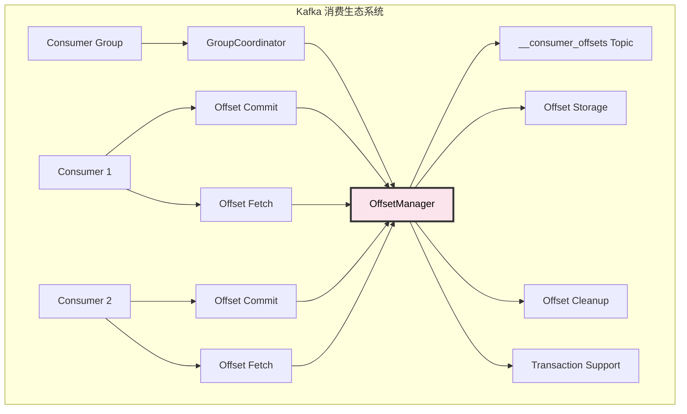
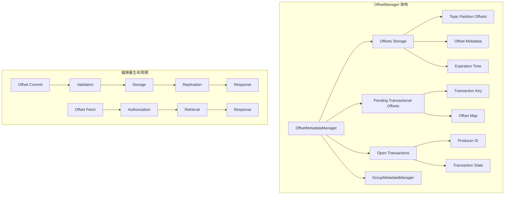

# Kafka Broker OffsetManager 深度解析：偏移量管理核心

## 概述

OffsetManager（现在主要通过 OffsetMetadataManager 实现）是 Kafka Broker 的偏移量管理核心组件，负责管理消费者组的偏移量提交、存储、检索和清理。它确保消费者能够准确跟踪消费进度，并在重启后从正确位置继续消费。

## 模块作用和设计目的

### 核心作用

OffsetManager 在 Kafka 消费语义保证中发挥着基础性作用：

1. **消费进度跟踪**：精确记录每个消费者组在各分区的消费位置
2. **故障恢复支持**：消费者重启后能从上次提交的位置继续消费
3. **事务性偏移量管理**：支持事务性消费，确保偏移量提交的原子性
4. **多版本并发控制**：支持多个消费者并发访问偏移量信息
5. **数据一致性保证**：确保偏移量数据在集群中的一致性
6. **过期数据清理**：自动清理过期的偏移量数据

### 设计目的

OffsetManager 的设计围绕 Kafka 消费语义的核心需求：

#### 1. **消费语义保证**
```
At-Most-Once ←→ At-Least-Once ←→ Exactly-Once
                    ↓
            偏移量管理是关键基础
```
- **At-Least-Once**：先处理消息，后提交偏移量
- **At-Most-Once**：先提交偏移量，后处理消息
- **Exactly-Once**：通过事务性偏移量提交实现

#### 2. **高可用性设计**
- **分布式存储**：偏移量存储在 Kafka 内部主题中，享受副本保护
- **故障转移**：Coordinator 故障时能够快速切换
- **数据恢复**：支持从日志重放恢复偏移量状态

#### 3. **性能优化**
- **批量操作**：支持批量提交和获取偏移量
- **内存缓存**：在内存中缓存活跃的偏移量数据
- **异步处理**：偏移量提交不阻塞消息处理

#### 4. **事务支持**
- **两阶段提交**：支持事务性偏移量提交
- **隔离级别**：支持不同的事务隔离级别
- **回滚机制**：事务失败时能够回滚偏移量变更

### 在 Kafka 消费架构中的定位



OffsetManager 是消费者生态系统的"记忆中枢"，确保消费进度的准确记录和可靠恢复。

### 设计权衡

#### 1. **一致性 vs 性能**
- **强一致性**：确保偏移量的准确性，但可能影响提交性能
- **最终一致性**：提高性能，但需要处理短暂的不一致

#### 2. **存储开销 vs 功能丰富性**
- **元数据存储**：存储更多元数据提供丰富功能，但增加存储开销
- **压缩策略**：通过日志压缩减少存储使用

#### 3. **实时性 vs 资源消耗**
- **实时清理**：及时清理过期数据，但增加系统负载
- **批量清理**：减少系统负载，但可能延迟资源释放

#### 4. **事务支持 vs 复杂性**
- **事务性偏移量**：提供强一致性保证，但增加实现复杂度
- **简单模式**：降低复杂度，但功能受限

## 1. OffsetManager 架构设计

### 1.1 核心组件结构

**源码位置**: `group-coordinator/src/main/java/org/apache/kafka/coordinator/group/OffsetMetadataManager.java:426-444`

```java
public class OffsetMetadataManager {
    private final SnapshotRegistry snapshotRegistry;
    private final Logger log;
    private final Time time;
    private final GroupMetadataManager groupMetadataManager;
    private final GroupCoordinatorConfig config;
    private final GroupCoordinatorMetricsShard metrics;
    
    // 偏移量存储
    private final Offsets offsets;
    
    // 待处理的事务性偏移量
    private final TimelineHashMap<TransactionKey, Map<TopicPartition, OffsetAndMetadata>> pendingTransactionalOffsets;
    
    // 打开的事务
    private final OpenTransactions openTransactions;
    
    OffsetMetadataManager(
        SnapshotRegistry snapshotRegistry,
        LogContext logContext,
        Time time,
        MetadataImage metadataImage,
        GroupMetadataManager groupMetadataManager,
        GroupCoordinatorConfig config,
        GroupCoordinatorMetricsShard metrics
    ) {
        this.snapshotRegistry = snapshotRegistry;
        this.log = logContext.logger(OffsetMetadataManager.class);
        this.time = time;
        this.groupMetadataManager = groupMetadataManager;
        this.config = config;
        this.metrics = metrics;
        this.offsets = new Offsets();
        this.pendingTransactionalOffsets = new TimelineHashMap<>(snapshotRegistry, 0);
        this.openTransactions = new OpenTransactions();
    }
}
```

**源码位置**: `group-coordinator/src/main/java/org/apache/kafka/coordinator/group/OffsetMetadataManager.java:426-444`
**核心功能**:
- 管理消费者组偏移量的存储和检索
- 处理事务性偏移量提交
- 维护偏移量的时间线快照
- 提供偏移量过期和清理机制

### 1.2 偏移量管理架构



## 2. 偏移量提交处理

### 2.1 偏移量提交流程

**源码位置**: `group-coordinator/src/main/java/org/apache/kafka/coordinator/group/OffsetMetadataManager.java:600-650`

```java
public CoordinatorResult<OffsetCommitResponseData, CoordinatorRecord> commitOffset(
    AuthorizableRequestContext context,
    OffsetCommitRequestData request
) throws ApiException {
    // 1. 验证偏移量提交请求
    Group group = validateOffsetCommit(context, request);
    
    final long currentTimeMs = time.milliseconds();
    final List<CoordinatorRecord> records = new ArrayList<>();
    final Map<String, OffsetCommitResponseData.OffsetCommitResponseTopic> responseTopics = new HashMap<>();
    
    // 2. 处理每个主题的偏移量提交
    request.topics().forEach(topic -> {
        final OffsetCommitResponseData.OffsetCommitResponseTopic responseTopic =
            new OffsetCommitResponseData.OffsetCommitResponseTopic().setName(topic.name());
        responseTopics.put(topic.name(), responseTopic);
        
        topic.partitions().forEach(partition -> {
            try {
                // 验证分区权限
                validateOffsetCommitPartition(context, topic.name(), partition.partitionIndex());
                
                // 计算偏移量过期时间
                final OptionalLong expireTimestampMs = offsetCommitExpirationTime(
                    request.retentionTimeMs(), currentTimeMs);
                
                // 创建偏移量记录
                final OffsetAndMetadata offsetAndMetadata = new OffsetAndMetadata(
                    partition.committedOffset(),
                    partition.committedLeaderEpoch(),
                    partition.committedMetadata(),
                    currentTimeMs,
                    expireTimestampMs
                );
                
                // 生成偏移量提交记录
                records.add(CoordinatorRecordHelpers.newOffsetCommitRecord(
                    request.groupId(),
                    topic.name(),
                    partition.partitionIndex(),
                    offsetAndMetadata,
                    request.memberId()
                ));
                
                responseTopic.partitions().add(new OffsetCommitResponseData.OffsetCommitResponsePartition()
                    .setPartitionIndex(partition.partitionIndex())
                    .setErrorCode(Errors.NONE.code()));
                    
            } catch (ApiException ex) {
                responseTopic.partitions().add(new OffsetCommitResponseData.OffsetCommitResponsePartition()
                    .setPartitionIndex(partition.partitionIndex())
                    .setErrorCode(ex.error().code()));
            }
        });
    });
    
    return new CoordinatorResult<>(
        new OffsetCommitResponseData()
            .setTopics(new ArrayList<>(responseTopics.values())),
        records
    );
}
```

**源码位置**: `group-coordinator/src/main/java/org/apache/kafka/coordinator/group/OffsetMetadataManager.java:600-630`
**核心功能**:
- 验证偏移量提交请求的合法性
- 计算偏移量过期时间
- 生成偏移量提交的协调器记录
- 处理权限验证和错误响应

### 2.2 偏移量验证机制

```java
private Group validateOffsetCommit(
    AuthorizableRequestContext context,
    OffsetCommitRequestData request
) throws ApiException {
    // 1. 验证组 ID
    if (request.groupId().isEmpty()) {
        throw new InvalidGroupIdException("Group id cannot be empty");
    }
    
    // 2. 获取或创建消费者组
    Group group;
    try {
        group = groupMetadataManager.group(request.groupId());
        if (group == null) {
            if (request.generationIdOrMemberEpoch() == UNKNOWN_GENERATION_ID) {
                // 简单消费者，创建空组
                group = groupMetadataManager.getOrMaybeCreatePersistedConsumerGroup(request.groupId(), false);
            } else {
                throw new UnknownMemberIdException("Group not found");
            }
        }
    } catch (GroupIdNotFoundException ex) {
        throw new UnknownMemberIdException("Group not found");
    }
    
    // 3. 验证成员身份（对于消费者组）
    if (group.type() == Group.GroupType.CONSUMER) {
        ConsumerGroup consumerGroup = (ConsumerGroup) group;
        if (!request.memberId().isEmpty()) {
            ConsumerGroupMember member = consumerGroup.getOrMaybeCreateMember(request.memberId(), false);
            if (member == null) {
                throw new UnknownMemberIdException("Member not found");
            }
            
            // 验证成员 epoch
            if (request.generationIdOrMemberEpoch() != member.memberEpoch()) {
                throw new FencedInstanceIdException("Member epoch mismatch");
            }
        }
    }
    
    return group;
}
```

## 3. 偏移量检索处理

### 3.1 偏移量获取流程

**源码位置**: `group-coordinator/src/main/java/org/apache/kafka/coordinator/group/OffsetMetadataManager.java:862-900`

```java
public OffsetFetchResponseData.OffsetFetchResponseGroup fetchOffsets(
    OffsetFetchRequestData.OffsetFetchRequestGroup request,
    long lastCommittedOffset
) throws ApiException {
    final boolean requireStable = lastCommittedOffset == Long.MAX_VALUE;
    
    boolean failAllPartitions = false;
    try {
        validateOffsetFetch(request, lastCommittedOffset);
    } catch (GroupIdNotFoundException ex) {
        failAllPartitions = true;
    }
    
    final Map<String, OffsetFetchResponseData.OffsetFetchResponseTopics> responseTopics = new HashMap<>();
    
    if (failAllPartitions) {
        // 组不存在，返回默认偏移量
        request.topics().forEach(topic -> {
            final OffsetFetchResponseData.OffsetFetchResponseTopics responseTopic =
                new OffsetFetchResponseData.OffsetFetchResponseTopics().setName(topic.name());
            responseTopics.put(topic.name(), responseTopic);
            
            topic.partitionIndexes().forEach(partitionIndex -> {
                responseTopic.partitions().add(new OffsetFetchResponseData.OffsetFetchResponsePartitions()
                    .setPartitionIndex(partitionIndex)
                    .setCommittedOffset(INVALID_OFFSET)
                    .setCommittedLeaderEpoch(INVALID_LEADER_EPOCH)
                    .setMetadata("")
                    .setErrorCode(Errors.NONE.code()));
            });
        });
    } else {
        // 获取存储的偏移量
        request.topics().forEach(topic -> {
            final OffsetFetchResponseData.OffsetFetchResponseTopics responseTopic =
                new OffsetFetchResponseData.OffsetFetchResponseTopics().setName(topic.name());
            responseTopics.put(topic.name(), responseTopic);
            
            topic.partitionIndexes().forEach(partitionIndex -> {
                final TopicPartition topicPartition = new TopicPartition(topic.name(), partitionIndex);
                final OffsetAndMetadata offsetAndMetadata = offsets.get(
                    request.groupId(), 
                    topicPartition, 
                    lastCommittedOffset
                );
                
                if (offsetAndMetadata != null) {
                    responseTopic.partitions().add(new OffsetFetchResponseData.OffsetFetchResponsePartitions()
                        .setPartitionIndex(partitionIndex)
                        .setCommittedOffset(offsetAndMetadata.offset())
                        .setCommittedLeaderEpoch(offsetAndMetadata.leaderEpoch().orElse(INVALID_LEADER_EPOCH))
                        .setMetadata(offsetAndMetadata.metadata())
                        .setErrorCode(Errors.NONE.code()));
                } else {
                    responseTopic.partitions().add(new OffsetFetchResponseData.OffsetFetchResponsePartitions()
                        .setPartitionIndex(partitionIndex)
                        .setCommittedOffset(INVALID_OFFSET)
                        .setCommittedLeaderEpoch(INVALID_LEADER_EPOCH)
                        .setMetadata("")
                        .setErrorCode(Errors.NONE.code()));
                }
            });
        });
    }
    
    return new OffsetFetchResponseData.OffsetFetchResponseGroup()
        .setGroupId(request.groupId())
        .setTopics(new ArrayList<>(responseTopics.values()))
        .setErrorCode(Errors.NONE.code());
}
```

**源码位置**: `group-coordinator/src/main/java/org/apache/kafka/coordinator/group/OffsetMetadataManager.java:862-890`
**核心功能**:
- 验证偏移量获取请求
- 从存储中检索偏移量数据
- 处理组不存在的情况
- 构建响应数据结构

## 4. 事务性偏移量管理

### 4.1 事务性偏移量提交

```java
public void addPendingTransactionalOffsets(
    long producerId,
    short producerEpoch,
    String groupId,
    Map<TopicPartition, OffsetAndMetadata> offsets
) {
    final TransactionKey transactionKey = new TransactionKey(producerId, producerEpoch);
    
    // 将偏移量添加到待处理事务映射中
    Map<TopicPartition, OffsetAndMetadata> existingOffsets = 
        pendingTransactionalOffsets.get(transactionKey);
    
    if (existingOffsets == null) {
        existingOffsets = new HashMap<>();
        pendingTransactionalOffsets.put(transactionKey, existingOffsets);
    }
    
    existingOffsets.putAll(offsets);
    
    // 记录打开的事务
    openTransactions.addTransaction(producerId, producerEpoch, groupId);
}

public void commitPendingTransactionalOffsets(long producerId, short producerEpoch) {
    final TransactionKey transactionKey = new TransactionKey(producerId, producerEpoch);
    
    // 获取待处理的偏移量
    Map<TopicPartition, OffsetAndMetadata> pendingOffsets = 
        pendingTransactionalOffsets.remove(transactionKey);
    
    if (pendingOffsets != null) {
        // 将待处理偏移量提交到主存储
        String groupId = openTransactions.getGroupId(producerId, producerEpoch);
        if (groupId != null) {
            for (Map.Entry<TopicPartition, OffsetAndMetadata> entry : pendingOffsets.entrySet()) {
                offsets.put(groupId, entry.getKey(), entry.getValue());
            }
        }
    }
    
    // 清理事务状态
    openTransactions.removeTransaction(producerId, producerEpoch);
}

public void abortPendingTransactionalOffsets(long producerId, short producerEpoch) {
    final TransactionKey transactionKey = new TransactionKey(producerId, producerEpoch);
    
    // 直接丢弃待处理的偏移量
    pendingTransactionalOffsets.remove(transactionKey);
    
    // 清理事务状态
    openTransactions.removeTransaction(producerId, producerEpoch);
}
```

## 5. 偏移量过期和清理

### 5.1 过期时间计算

```java
private OptionalLong offsetCommitExpirationTime(long retentionTimeMs, long currentTimeMs) {
    if (retentionTimeMs == OffsetCommitRequest.DEFAULT_RETENTION_TIME) {
        // 使用默认保留时间
        return OptionalLong.empty();
    } else {
        // 使用指定的保留时间
        return OptionalLong.of(currentTimeMs + retentionTimeMs);
    }
}

public void cleanupExpiredOffsets(long currentTimeMs) {
    final List<String> expiredGroups = new ArrayList<>();
    
    // 遍历所有组的偏移量
    offsets.forEach((groupId, topicPartitionOffsets) -> {
        boolean hasExpiredOffsets = false;
        
        for (Map.Entry<TopicPartition, OffsetAndMetadata> entry : topicPartitionOffsets.entrySet()) {
            OffsetAndMetadata offsetAndMetadata = entry.getValue();
            
            if (offsetAndMetadata.expireTimestamp().isPresent() &&
                offsetAndMetadata.expireTimestamp().getAsLong() < currentTimeMs) {
                // 偏移量已过期
                hasExpiredOffsets = true;
                break;
            }
        }
        
        if (hasExpiredOffsets) {
            expiredGroups.add(groupId);
        }
    });
    
    // 清理过期的偏移量
    for (String groupId : expiredGroups) {
        cleanupGroupOffsets(groupId, currentTimeMs);
    }
}
```

## 6. 配置参数详解

### 6.1 偏移量管理配置

| 参数名 | 默认值 | 说明 |
|--------|--------|------|
| `offsets.retention.minutes` | 10080 | 偏移量保留时间（分钟） |
| `offsets.retention.check.interval.ms` | 600000 | 偏移量清理检查间隔 |
| `offsets.topic.num.partitions` | 50 | 偏移量主题分区数 |
| `offsets.topic.replication.factor` | 3 | 偏移量主题副本因子 |
| `offsets.topic.segment.bytes` | 104857600 | 偏移量主题段大小 |

### 6.2 事务配置

```java
// 事务性偏移量配置
transaction.state.log.replication.factor = 3      // 事务状态日志副本因子
transaction.state.log.num.partitions = 50         // 事务状态日志分区数
transaction.state.log.min.isr = 2                 // 事务状态日志最小 ISR
```

## 7. 监控指标

### 7.1 关键监控指标

```java
// 1. 偏移量提交指标
kafka.coordinator.group:type=GroupMetadataManager,name=OffsetCommitsPerSec

// 2. 偏移量获取指标  
kafka.coordinator.group:type=GroupMetadataManager,name=OffsetFetchesPerSec

// 3. 过期偏移量清理指标
kafka.coordinator.group:type=GroupMetadataManager,name=OffsetExpiredCount

// 4. 事务性偏移量指标
kafka.coordinator.group:type=GroupMetadataManager,name=TransactionalOffsetCommitsPerSec
```

### 7.2 性能监控

```java
// 偏移量存储大小监控
public long getTotalOffsetCount() {
    return offsets.size();
}

// 待处理事务数量监控
public int getPendingTransactionCount() {
    return pendingTransactionalOffsets.size();
}
```

## 8. 故障恢复机制

### 8.1 偏移量重放

```java
public void replay(CoordinatorRecord record) {
    switch (record.type()) {
        case OFFSET_COMMIT:
            OffsetCommitRecord offsetCommitRecord = (OffsetCommitRecord) record;
            OffsetAndMetadata offsetAndMetadata = new OffsetAndMetadata(
                offsetCommitRecord.offset(),
                offsetCommitRecord.leaderEpoch(),
                offsetCommitRecord.metadata(),
                offsetCommitRecord.commitTimestamp(),
                offsetCommitRecord.expireTimestamp()
            );
            
            offsets.put(
                offsetCommitRecord.groupId(),
                new TopicPartition(offsetCommitRecord.topic(), offsetCommitRecord.partition()),
                offsetAndMetadata
            );
            break;
            
        case TRANSACTION_START:
            // 处理事务开始记录
            break;
            
        case TRANSACTION_COMMIT:
            // 处理事务提交记录
            break;
            
        case TRANSACTION_ABORT:
            // 处理事务中止记录
            break;
    }
}
```

OffsetManager 通过精确的偏移量管理和事务支持，确保了消费者能够可靠地跟踪消费进度，是 Kafka 消费语义保证的重要基础。
