# Kafka Broker ReplicaManager 深度解析：分区副本管理核心

## 概述

ReplicaManager 是 Kafka Broker 的分区副本管理核心组件，负责管理本地分区副本的读写操作、副本同步、Leader 选举和故障恢复。它是实现 Kafka 高可用性和数据一致性的关键组件。

## 模块作用和设计目的

### 核心作用

ReplicaManager 在 Kafka 架构中承担着至关重要的角色，其主要作用包括：

1. **数据一致性保证**：通过 ISR（In-Sync Replicas）机制确保数据在多个副本间的一致性
2. **高可用性实现**：当 Leader 副本故障时，能够快速从 Follower 中选举新的 Leader
3. **读写操作协调**：统一处理客户端的读写请求，确保数据的正确性和完整性
4. **副本同步管理**：协调 Follower 副本与 Leader 副本之间的数据同步
5. **故障检测和恢复**：监控副本健康状态，处理副本故障和恢复

### 设计目的

ReplicaManager 的设计遵循以下核心目的：

#### 1. **CAP 定理的平衡**
```
一致性 (Consistency) ←→ 可用性 (Availability)
                ↓
        分区容错性 (Partition Tolerance)
```
- **强一致性**：通过 ISR 机制保证写入的数据在所有同步副本中一致
- **高可用性**：即使部分副本故障，系统仍能继续提供服务
- **分区容错**：网络分区时，系统能够继续运行并保持数据完整性

#### 2. **性能与可靠性的权衡**
- **延迟操作机制**：通过 DelayedProduce 和 DelayedFetch 平衡响应延迟和数据一致性
- **异步副本同步**：Follower 异步拉取数据，避免阻塞 Leader 的写入操作
- **批量操作优化**：支持批量读写操作，提高整体吞吐量

#### 3. **故障容错设计**
- **自动故障检测**：实时监控副本滞后情况，自动调整 ISR
- **优雅降级**：当副本数量不足时，仍能提供基本服务
- **快速恢复**：故障副本恢复后能够快速重新加入 ISR

#### 4. **扩展性考虑**
- **分区级别管理**：每个分区独立管理，支持水平扩展
- **负载均衡**：支持 Leader 分区在不同 Broker 间的均衡分布
- **动态配置**：支持运行时调整副本配置和行为参数

### 在 Kafka 生态中的定位

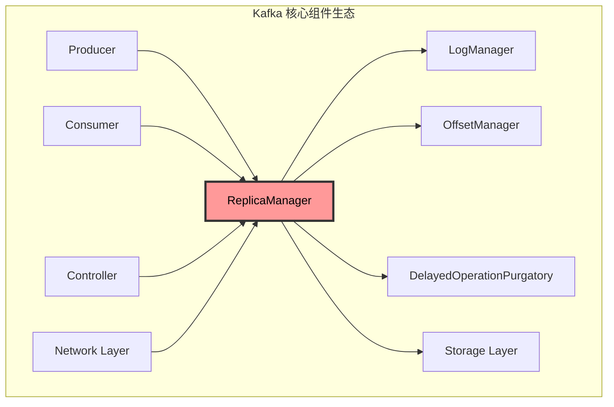

ReplicaManager 处于 Kafka 架构的核心位置，是连接上层业务逻辑和底层存储的关键桥梁，确保了整个系统的数据可靠性和服务可用性。

## 1. ReplicaManager 架构设计

### 1.1 核心组件结构

**源码位置**: `core/src/main/scala/kafka/server/ReplicaManager.scala:100-150`

```scala
class ReplicaManager(val config: KafkaConfig,
                     metrics: Metrics,
                     time: Time,
                     scheduler: Scheduler,
                     val logManager: LogManager,
                     val remoteLogManager: Option[RemoteLogManager],
                     quotaManagers: QuotaManagers,
                     val metadataCache: MetadataCache,
                     logDirFailureChannel: LogDirFailureChannel,
                     val alterPartitionManager: AlterPartitionManager,
                     brokerTopicStats: BrokerTopicStats,
                     val isShuttingDown: AtomicBoolean,
                     zkVersion: Option[Int],
                     threadNamePrefix: Option[String],
                     brokerEpoch: Long,
                     addPartitionsToTxnManager: Option[AddPartitionsToTxnManager]) extends Logging {
  
  // 分区映射表
  private val allPartitions = new Pool[TopicPartition, HostedPartition]()
  
  // 延迟操作管理
  private val delayedProducePurgatory = DelayedOperationPurgatory[DelayedProduce](
    purgatoryName = "Produce", brokerId = config.brokerId)
  private val delayedFetchPurgatory = DelayedOperationPurgatory[DelayedFetch](
    purgatoryName = "Fetch", brokerId = config.brokerId)
  private val delayedDeleteRecordsPurgatory = DelayedOperationPurgatory[DelayedDeleteRecords](
    purgatoryName = "DeleteRecords", brokerId = config.brokerId)
  private val delayedElectLeaderPurgatory = DelayedOperationPurgatory[DelayedElectLeader](
    purgatoryName = "ElectLeader", brokerId = config.brokerId)
}
```

**源码位置**: `core/src/main/scala/kafka/server/ReplicaManager.scala:100-130`
**核心功能**:
- 管理本地所有分区副本
- 处理生产者和消费者请求
- 协调副本同步和 Leader 选举
- 管理延迟操作和配额控制

### 1.2 副本管理架构

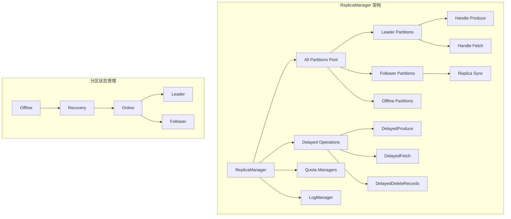

### 1.3 副本同步数据流

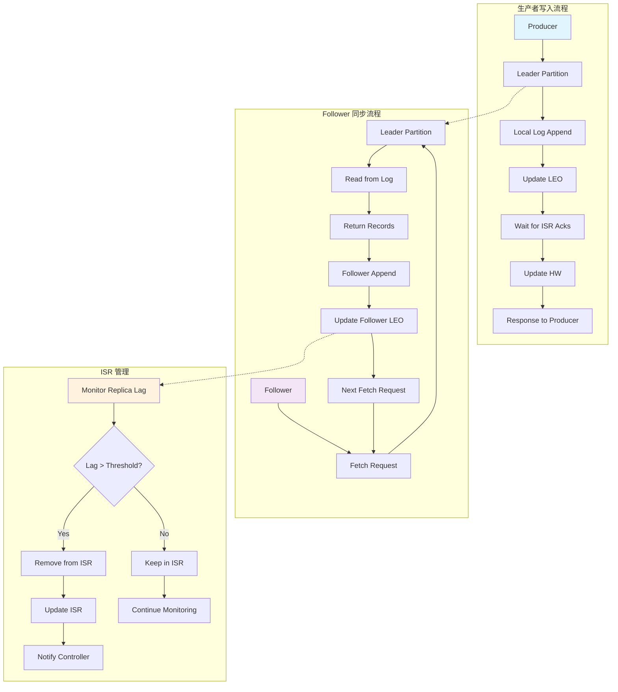

### 1.4 运行时状态机

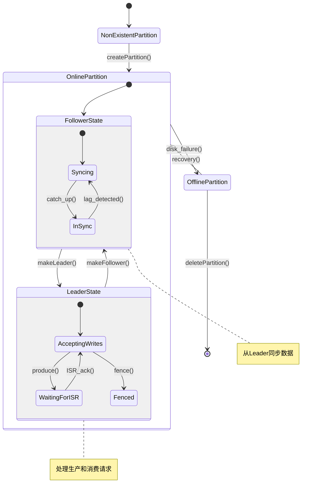

## 2. 分区副本管理

### 2.1 Leader 选举和状态转换流程

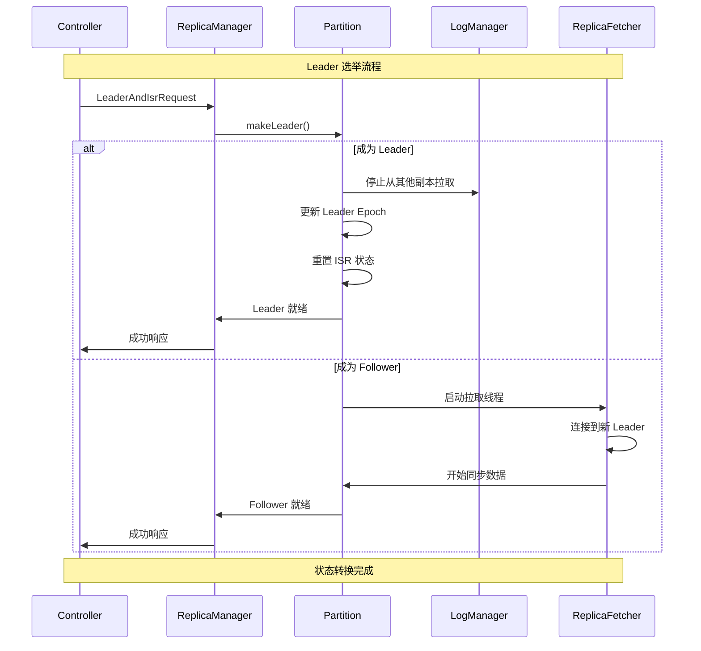

### 2.2 分区创建和管理

**源码位置**: `core/src/main/scala/kafka/server/ReplicaManager.scala:800-850`

```scala
def makeLeaders(controllerId: Int,
                controllerEpoch: Int,
                partitionStates: Map[TopicPartition, LeaderAndIsrPartitionState],
                correlationId: Int,
                responseMap: mutable.Map[TopicPartition, Errors],
                highWatermarkCheckpoints: OffsetCheckpoints,
                topicIds: Map[String, Uuid]): Set[Partition] = {
  
  val partitionsToMakeLeaders = mutable.Set[Partition]()
  
  try {
    // 验证控制器 epoch
    if (controllerEpoch > metadataCache.metadataVersion.controllerEpoch) {
      val partitionsToAdd = partitionStates.keySet -- allPartitions.keySet
      
      for ((topicPartition, partitionState) <- partitionStates) {
        try {
          val partition = getOrCreatePartition(topicPartition, delta = None, topicIds.get(topicPartition.topic))
          
          if (partition.makeLeader(partitionState, highWatermarkCheckpoints, topicIds.get(topicPartition.topic))) {
            partitionsToMakeLeaders += partition
            responseMap.put(topicPartition, Errors.NONE)
          } else {
            responseMap.put(topicPartition, Errors.STALE_CONTROLLER_EPOCH)
          }
        } catch {
          case e: KafkaStorageException =>
            error(s"Skipping makeLeader for partition $topicPartition due to disk error", e)
            responseMap.put(topicPartition, Errors.KAFKA_STORAGE_ERROR)
        }
      }
    }
  } catch {
    case e: Throwable =>
      error("Error while processing LeaderAndIsr request", e)
  }
  
  partitionsToMakeLeaders
}
```

**源码位置**: `core/src/main/scala/kafka/server/ReplicaManager.scala:800-830`
**核心功能**:
- 处理控制器发送的 LeaderAndIsr 请求
- 创建或更新分区副本状态
- 执行 Leader 选举和状态转换
- 维护高水位检查点

### 2.2 副本同步机制

```scala
def makeFollowers(controllerId: Int,
                  controllerEpoch: Int,
                  partitionStates: Map[TopicPartition, LeaderAndIsrPartitionState],
                  correlationId: Int,
                  responseMap: mutable.Map[TopicPartition, Errors],
                  highWatermarkCheckpoints: OffsetCheckpoints,
                  topicIds: Map[String, Uuid]): Set[Partition] = {
  
  val partitionsToMakeFollower = mutable.Set[Partition]()
  
  try {
    for ((topicPartition, partitionState) <- partitionStates) {
      val partition = getOrCreatePartition(topicPartition, delta = None, topicIds.get(topicPartition.topic))
      
      if (partition.makeFollower(partitionState, highWatermarkCheckpoints, topicIds.get(topicPartition.topic))) {
        partitionsToMakeFollower += partition
        responseMap.put(topicPartition, Errors.NONE)
      } else {
        responseMap.put(topicPartition, Errors.STALE_CONTROLLER_EPOCH)
      }
    }
    
    // 停止对这些分区的 fetch 请求
    replicaFetcherManager.removeFetcherForPartitions(partitionsToMakeFollower.map(_.topicPartition))
    
    // 启动新的 fetcher 线程
    if (partitionsToMakeFollower.nonEmpty) {
      replicaFetcherManager.addFetcherForPartitions(partitionsToMakeFollower.map { partition =>
        partition.topicPartition -> InitialFetchState(
          topicId = partition.topicId,
          leader = metadataCache.getPartitionLeaderEndpoint(partition.topicPartition.topic, 
                                                           partition.topicPartition.partition, 
                                                           listenerName),
          currentLeaderEpoch = partition.getLeaderEpoch,
          initOffset = partition.localLogOrException.highWatermark
        )
      }.toMap)
    }
  } catch {
    case e: Throwable =>
      error("Error while processing LeaderAndIsr request", e)
  }
  
  partitionsToMakeFollower
}
```

## 3. 读写操作处理

### 3.1 生产请求数据流

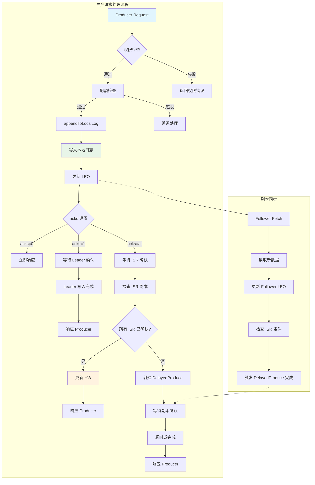

### 3.2 生产请求处理

**源码位置**: `core/src/main/scala/kafka/server/ReplicaManager.scala:500-600`

```scala
def appendRecords(timeout: Long,
                  requiredAcks: Short,
                  internalTopicsAllowed: Boolean,
                  origin: AppendOrigin,
                  entriesPerPartition: Map[TopicPartition, MemoryRecords],
                  responseCallback: Map[TopicPartition, PartitionResponse] => Unit,
                  delayedProduceRequestCreationCallback: Long => DelayedProduce = requestLocal => new DelayedProduce(requestLocal, this, responseCallback),
                  recordConversionStatsCallback: Map[TopicPartition, RecordConversionStats] => Unit = _ => (),
                  requestLocal: RequestLocal = RequestLocal.NoCaching,
                  transactionalId: String = null,
                  verificationGuard: Object = ReplicaManager.ProduceRequestVerificationGuard): Unit = {
  
  if (isValidRequiredAcks(requiredAcks)) {
    val sTime = time.milliseconds
    val localProduceResults = appendToLocalLog(internalTopicsAllowed = internalTopicsAllowed,
                                              origin, entriesPerPartition, requiredAcks == 0, requestLocal)
    debug("Produce to local log in %d ms".format(time.milliseconds - sTime))
    
    val produceStatus = localProduceResults.map { case (topicPartition, result) =>
      topicPartition -> ProducePartitionStatus(
        result.info.lastOffset + 1, // required offset
        new PartitionResponse(result.error, result.info.firstOffset.getOrElse(-1), result.info.logAppendTime,
                             result.info.logStartOffset, result.info.recordErrors.asJava, result.info.errorMessage)
      )
    }
    
    actionQueue.add {
      () =>
        localProduceResults.foreach {
          case (topicPartition, result) =>
            val requestKey = TopicPartitionOperationKey(topicPartition)
            result.info.leaderHwChange match {
              case LeaderHwChange.Increased =>
                // 尝试完成延迟的 fetch 操作
                tryCompleteDelayedFetch(requestKey)
              case LeaderHwChange.Same =>
                // 可能需要完成延迟的 produce 操作
                tryCompleteDelayedProduce(requestKey)
              case LeaderHwChange.None =>
                // 无需额外操作
            }
        }
    }
    
    if (delayedProduceRequestRequired(requiredAcks, entriesPerPartition, localProduceResults)) {
      // 创建延迟 produce 操作
      val delayedProduce = delayedProduceRequestCreationCallback(timeout)
      delayedProducePurgatory.tryCompleteElseWatch(delayedProduce, produceStatus.keys.map(TopicPartitionOperationKey).toSeq)
    } else {
      // 立即响应
      val produceResponseStatus = produceStatus.map { case (k, status) => k -> status.responseStatus }
      responseCallback(produceResponseStatus)
    }
  } else {
    // 无效的 acks 参数
    val responseStatus = entriesPerPartition.map { case (topicPartition, _) =>
      topicPartition -> new PartitionResponse(Errors.INVALID_REQUIRED_ACKS,
                                             LogAppendInfo.UnknownLogAppendInfo.firstOffset.getOrElse(-1),
                                             RecordBatch.NO_TIMESTAMP, LogAppendInfo.UnknownLogAppendInfo.logStartOffset)
    }
    responseCallback(responseStatus)
  }
}
```

**源码位置**: `core/src/main/scala/kafka/server/ReplicaManager.scala:500-550`
**核心功能**:
- 验证生产请求参数
- 将消息追加到本地日志
- 根据 acks 参数决定响应策略
- 管理延迟生产操作

### 3.2 消费请求数据流

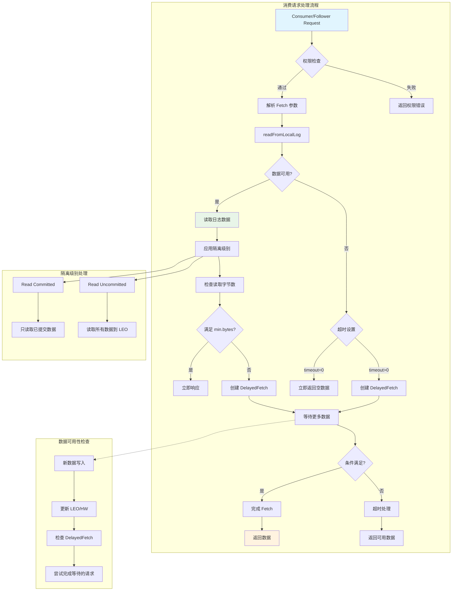

### 3.3 消费请求处理

```scala
def fetchMessages(timeout: Long,
                  replicaId: Int,
                  fetchMinBytes: Int,
                  fetchMaxBytes: Int,
                  hardMaxBytesLimit: Boolean,
                  fetchInfos: Seq[(TopicIdPartition, PartitionData)],
                  quota: ReplicaQuota,
                  responseCallback: Seq[(TopicIdPartition, FetchPartitionData)] => Unit,
                  isolationLevel: IsolationLevel,
                  clientMetadata: Option[ClientMetadata]): Unit = {
  
  val isFromFollower = Request.isValidBrokerId(replicaId)
  val isFromConsumer = !(isFromFollower || replicaId == Request.FutureLocalReplicaId)
  val fetchOnlyFromLeader = replicaId != Request.AllowedOnFollowerReplicaId
  
  def readFromLog(): Seq[(TopicIdPartition, LogReadResult)] = {
    val result = readFromLocalLog(
      replicaId = replicaId,
      fetchOnlyFromLeader = fetchOnlyFromLeader,
      fetchOnlyCommitted = isFromConsumer,
      fetchMaxBytes = fetchMaxBytes,
      hardMaxBytesLimit = hardMaxBytesLimit,
      readPartitionInfo = fetchInfos,
      quota = quota,
      isolationLevel = isolationLevel,
      clientMetadata = clientMetadata
    )
    
    if (isFromFollower) updateFollowerFetchState(replicaId, result)
    result
  }
  
  val logReadResults = readFromLog()
  val fetchPartitionData = logReadResults.map { case (tp, result) =>
    val isReassignmentFetch = isFromFollower && isAddingReplica(tp.topicPartition, replicaId)
    tp -> result.toFetchPartitionData(isReassignmentFetch)
  }
  
  var bytesReadable: Long = 0
  var errorReadingData = false
  val logReadResultMap = new mutable.HashMap[TopicIdPartition, LogReadResult]
  
  fetchPartitionData.foreach { case (topicIdPartition, partitionData) =>
    brokerTopicStats.topicStats(topicIdPartition.topic).totalFetchRequestRate.mark()
    brokerTopicStats.allTopicsStats.totalFetchRequestRate.mark()
    
    if (partitionData.errorCode != Errors.NONE.code) {
      errorReadingData = true
    } else {
      bytesReadable = bytesReadable + partitionData.records.sizeInBytes
    }
  }
  
  // 检查是否需要延迟响应
  if (!errorReadingData && bytesReadable < fetchMinBytes && timeout > 0) {
    // 创建延迟 fetch 操作
    val delayedFetch = new DelayedFetch(
      timeout = timeout,
      fetchMetadata = FetchMetadata(fetchMinBytes, fetchMaxBytes, hardMaxBytesLimit, 
                                   isFromFollower, replicaId, fetchInfos),
      replicaManager = this,
      quota = quota,
      isolationLevel = isolationLevel,
      responseCallback = responseCallback
    )
    
    val delayedFetchKeys = fetchInfos.map { case (tp, _) => TopicPartitionOperationKey(tp.topicPartition) }
    delayedFetchPurgatory.tryCompleteElseWatch(delayedFetch, delayedFetchKeys)
  } else {
    // 立即响应
    responseCallback(fetchPartitionData)
  }
}
```

## 4. 延迟操作管理

### 4.1 延迟操作生命周期

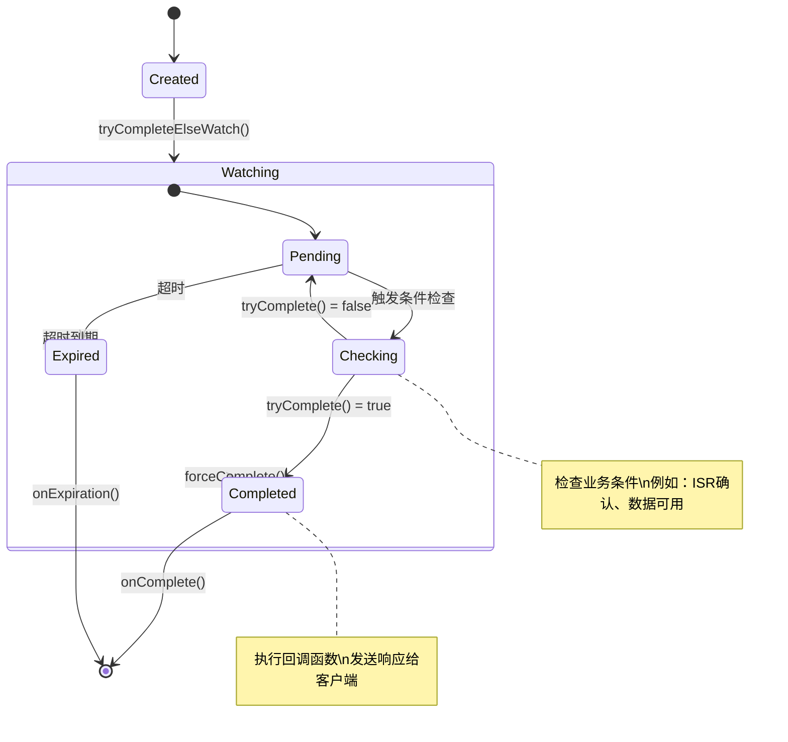

### 4.2 DelayedProduce 工作流程

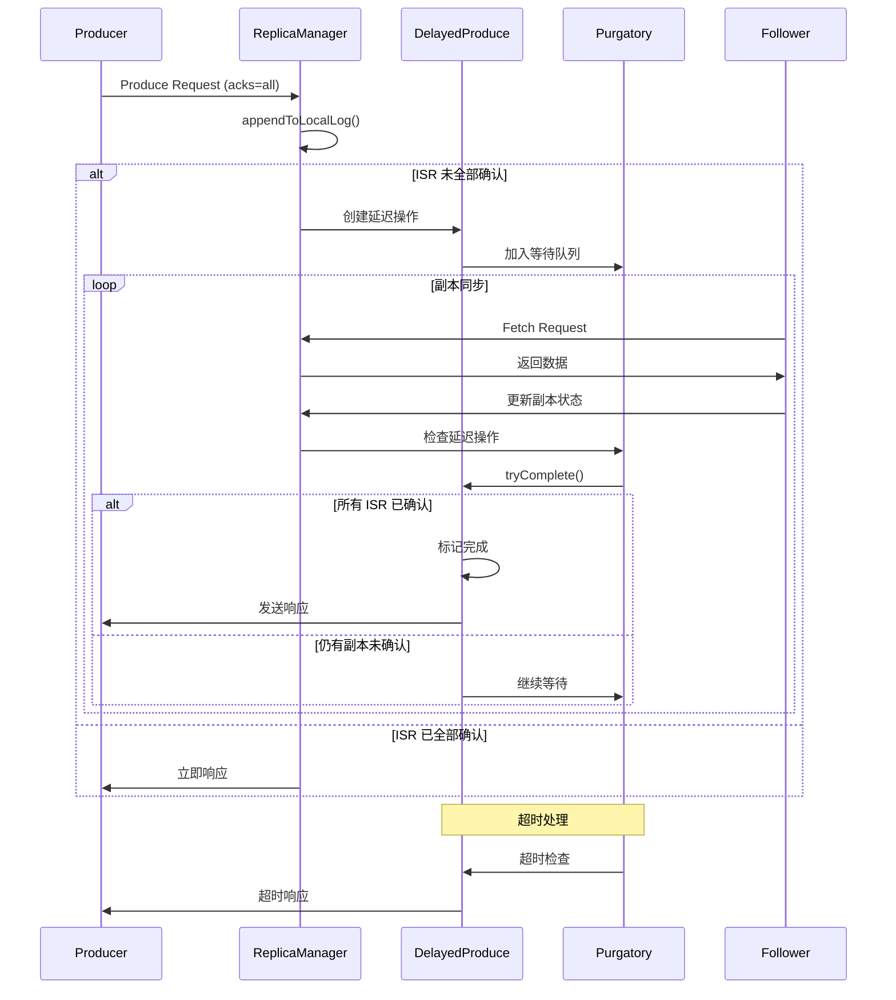

### 4.3 DelayedProduce 操作

```scala
class DelayedProduce(delayMs: Long,
                     produceMetadata: ProduceMetadata,
                     replicaManager: ReplicaManager,
                     responseCallback: Map[TopicPartition, PartitionResponse] => Unit,
                     lockOpt: Option[Lock] = None)
  extends DelayedOperation(delayMs, lockOpt) {
  
  override def tryComplete(): Boolean = {
    // 检查所有分区是否满足完成条件
    val hasEnoughReplicas = produceMetadata.produceStatus.forall { case (topicPartition, status) =>
      val partition = replicaManager.getPartitionOrException(topicPartition)
      partition.checkEnoughReplicasReachOffset(status.requiredOffset)
    }
    
    if (hasEnoughReplicas) {
      forceComplete()
    } else {
      false
    }
  }
  
  override def onComplete(): Unit = {
    val responseStatus = produceMetadata.produceStatus.map { case (k, status) => k -> status.responseStatus }
    responseCallback(responseStatus)
  }
}
```

### 4.4 DelayedFetch 工作流程

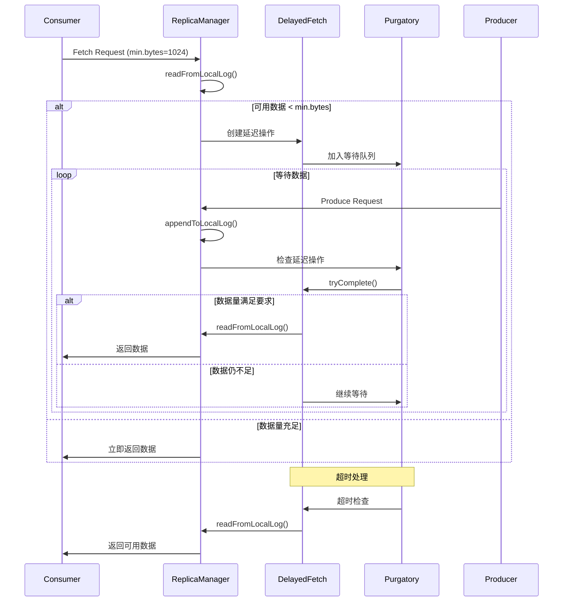

### 4.5 DelayedFetch 操作

```scala
class DelayedFetch(delayMs: Long,
                   fetchMetadata: FetchMetadata,
                   replicaManager: ReplicaManager,
                   quota: ReplicaQuota,
                   isolationLevel: IsolationLevel,
                   responseCallback: Seq[(TopicIdPartition, FetchPartitionData)] => Unit)
  extends DelayedOperation(delayMs) {
  
  override def tryComplete(): Boolean = {
    var accumulatedSize = 0
    fetchMetadata.fetchPartitionStatus.foreach { case (topicIdPartition, fetchStatus) =>
      val fetchInfo = fetchStatus.fetchInfo
      val partition = replicaManager.getPartition(topicIdPartition.topicPartition)
      
      partition match {
        case HostedPartition.Online(p) =>
          val fetchableBytes = p.fetchableBytes(fetchInfo.fetchOffset, isolationLevel)
          accumulatedSize += fetchableBytes
          
        case HostedPartition.Offline =>
          return forceComplete()
          
        case HostedPartition.None =>
          return forceComplete()
      }
    }
    
    if (accumulatedSize >= fetchMetadata.fetchMinBytes) {
      forceComplete()
    } else {
      false
    }
  }
  
  override def onComplete(): Unit = {
    replicaManager.fetchMessages(
      timeout = 0L,
      replicaId = fetchMetadata.replicaId,
      fetchMinBytes = fetchMetadata.fetchMinBytes,
      fetchMaxBytes = fetchMetadata.fetchMaxBytes,
      hardMaxBytesLimit = fetchMetadata.hardMaxBytesLimit,
      fetchInfos = fetchMetadata.fetchPartitionStatus.map { case (tp, status) => tp -> status.fetchInfo }.toSeq,
      quota = quota,
      responseCallback = responseCallback,
      isolationLevel = isolationLevel,
      clientMetadata = None
    )
  }
}
```

## 5. ISR 管理和高水位更新

### 5.1 ISR 管理流程

```mermaid
flowchart TD
    subgraph "ISR 监控和管理"
        A[定期检查副本状态] --> B{副本滞后检查}
        B -->|滞后 > threshold| C[从 ISR 移除]
        B -->|滞后 <= threshold| D[保持在 ISR]

        C --> E[更新 ISR 列表]
        E --> F[通知 Controller]
        F --> G[更新元数据]

        D --> H[继续监控]
        H --> I[副本追赶检查]
        I --> J{副本已追上?}
        J -->|是| K[加入 ISR]
        J -->|否| L[继续等待]

        K --> M[更新 ISR 列表]
        M --> N[通知 Controller]
        L --> H
    end

    subgraph "高水位更新"
        O[收到副本确认] --> P[计算新的 HW]
        P --> Q[HW = min(ISR LEOs)]
        Q --> R[更新分区 HW]
        R --> S[触发 DelayedProduce 检查]
        S --> T[触发 DelayedFetch 检查]
    end

    subgraph "故障恢复"
        U[副本故障] --> V[从 ISR 移除]
        V --> W[继续服务]
        W --> X[副本恢复]
        X --> Y[重新同步]
        Y --> Z[重新加入 ISR]
    end

    E -.-> O
    M -.-> O

    style A fill:#e1f5fe
    style P fill:#e8f5e8
    style U fill:#ffebee
```

### 5.2 副本同步状态转换

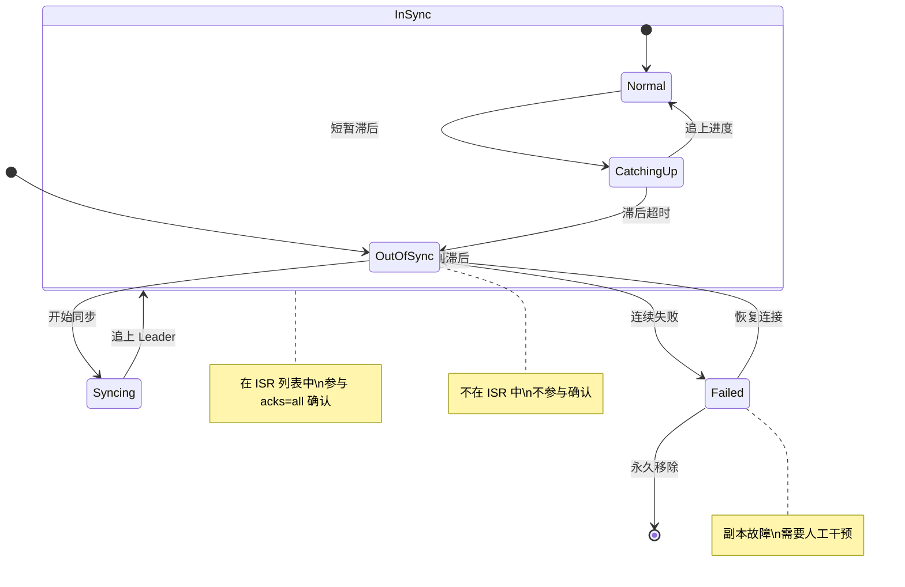

## 6. 配置参数详解

### 6.1 副本管理配置

| 参数名 | 默认值 | 说明 |
|--------|--------|------|
| `replica.lag.time.max.ms` | 30000 | 副本最大滞后时间 |
| `replica.fetch.max.bytes` | 1048576 | 副本拉取最大字节数 |
| `replica.fetch.min.bytes` | 1 | 副本拉取最小字节数 |
| `replica.fetch.wait.max.ms` | 500 | 副本拉取最大等待时间 |
| `num.replica.fetchers` | 1 | 副本拉取线程数 |

### 5.2 延迟操作配置

```scala
// 延迟操作超时配置
request.timeout.ms = 30000           // 请求超时时间
replica.fetch.wait.max.ms = 500      // Fetch 等待时间
producer.purgatory.purge.interval.requests = 1000  // 清理间隔
```

## 7. 性能监控和故障诊断

### 7.1 实时监控仪表板

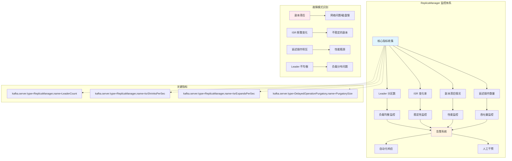

### 7.2 故障诊断流程

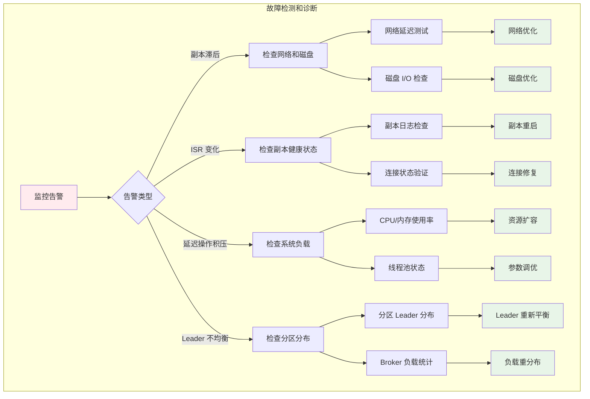

## 8. 监控指标

### 8.1 关键监控指标

```scala
// 1. 副本滞后指标
kafka.server:type=ReplicaManager,name=LeaderCount
kafka.server:type=ReplicaManager,name=PartitionCount
kafka.server:type=ReplicaManager,name=OfflineReplicaCount

// 2. 延迟操作指标
kafka.server:type=DelayedOperationPurgatory,name=PurgatorySize,delayedOperation=Produce
kafka.server:type=DelayedOperationPurgatory,name=PurgatorySize,delayedOperation=Fetch

// 3. ISR 变化指标
kafka.server:type=ReplicaManager,name=IsrExpandsPerSec
kafka.server:type=ReplicaManager,name=IsrShrinksPerSec
```

ReplicaManager 通过精细的副本状态管理和高效的延迟操作机制，确保了 Kafka 集群的高可用性和数据一致性，是 Kafka 可靠性保证的核心组件。
