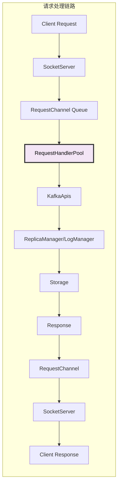
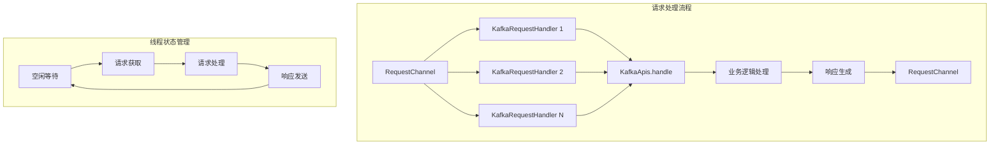

# Kafka Broker RequestHandler Pool 深度解析：请求处理资源池

## 概述

KafkaRequestHandlerPool 是 Kafka Broker 的请求处理资源池，负责管理多个 KafkaRequestHandler 线程来并发处理来自客户端的请求。它是连接网络层（SocketServer）和业务逻辑层（KafkaApis）的关键组件，通过线程池模式实现高并发请求处理。

## 模块作用和设计目的

### 核心作用

KafkaRequestHandlerPool 在 Kafka 请求处理链路中发挥着承上启下的关键作用：

1. **请求并发处理**：通过多线程并行处理来自网络层的请求
2. **负载均衡**：将请求均匀分配给可用的处理线程
3. **资源管理**：管理线程池的生命周期和资源分配
4. **背压控制**：通过线程池状态控制请求处理速度
5. **异常隔离**：单个请求的异常不影响其他请求的处理
6. **性能监控**：提供线程池运行状态和性能指标

### 设计目的

RequestHandlerPool 的设计体现了以下核心理念：

#### 1. **解耦网络 I/O 和业务处理**
```
Network I/O (SocketServer) → RequestChannel → RequestHandlerPool → Business Logic (KafkaApis)
```
- **职责分离**：网络线程专注 I/O，业务线程专注逻辑处理
- **异步处理**：避免业务逻辑阻塞网络 I/O 操作
- **独立扩展**：网络线程和业务线程可以独立调优

#### 2. **高并发处理架构**
- **线程池模式**：预创建固定数量的工作线程，避免频繁创建销毁
- **队列缓冲**：通过 RequestChannel 队列缓冲突发请求
- **无锁设计**：最小化线程间竞争，提高并发性能

#### 3. **可观测性和可控性**
- **实时监控**：提供线程池状态、队列长度、处理时间等指标
- **动态调整**：支持运行时调整线程池大小
- **故障诊断**：详细的异常处理和日志记录

#### 4. **资源优化**
- **内存管理**：合理管理请求缓冲区，避免内存泄漏
- **CPU 利用率**：通过线程数量调优平衡 CPU 使用和上下文切换
- **优雅关闭**：支持优雅停止，确保正在处理的请求完成

### 在 Kafka 处理链路中的定位



RequestHandlerPool 是请求处理的"中央调度器"，确保系统能够高效、稳定地处理大量并发请求。

### 设计权衡

#### 1. **线程数量 vs 资源消耗**
- **更多线程**：提高并发处理能力，但增加内存和上下文切换开销
- **线程复用**：减少创建销毁开销，但需要管理线程状态

#### 2. **队列长度 vs 内存使用**
- **大队列**：能够缓冲更多突发请求，但占用更多内存
- **背压机制**：队列满时的处理策略影响系统稳定性

#### 3. **同步 vs 异步处理**
- **同步模式**：简化编程模型，但可能阻塞网络线程
- **异步模式**：提高并发性，但增加编程复杂度

#### 4. **故障处理策略**
- **快速失败**：立即返回错误，保护系统稳定性
- **重试机制**：提高成功率，但可能加重系统负担

## 1. RequestHandler Pool 架构设计

### 1.1 核心组件结构

**源码位置**: `core/src/main/scala/kafka/server/KafkaRequestHandler.scala:195-230`

```scala
class KafkaRequestHandlerPool(
  val brokerId: Int,
  val requestChannel: RequestChannel,
  val apis: ApiRequestHandler,
  time: Time,
  numThreads: Int,
  requestHandlerAvgIdleMetricName: String,
  nodeName: String = "broker"
) extends Logging {
  
  val threadPoolSize: AtomicInteger = new AtomicInteger(numThreads)
  private val aggregateIdleMeter = metricsGroup.newMeter(requestHandlerAvgIdleMetricName, "percent", TimeUnit.NANOSECONDS)
  
  val runnables = new mutable.ArrayBuffer[KafkaRequestHandler](numThreads)
  for (i <- 0 until numThreads) {
    createHandler(i)
  }
}
```

**源码位置**: `core/src/main/scala/kafka/server/KafkaRequestHandler.scala:216-219`
**核心功能**:
- 管理固定数量的 KafkaRequestHandler 线程
- 提供线程池大小动态调整能力
- 统计线程池整体空闲率指标
- 支持优雅启动和关闭

### 1.2 请求处理流程



## 2. KafkaRequestHandler：单个请求处理器

### 2.1 RequestHandler 核心实现

**源码位置**: `core/src/main/scala/kafka/server/KafkaRequestHandler.scala:103-177`

```scala
class KafkaRequestHandler(
  id: Int,
  brokerId: Int,
  aggregateIdleMeter: Meter,
  totalHandlerThreads: AtomicInteger,
  requestChannel: RequestChannel,
  apis: ApiRequestHandler,
  time: Time,
  nodeName: String
) extends Runnable with Logging {
  
  def run(): Unit = {
    threadRequestChannel.set(requestChannel)
    while (!stopped) {
      val startSelectTime = time.nanoseconds
      
      // 从请求通道获取请求（超时300ms）
      val req = requestChannel.receiveRequest(300)
      val endTime = time.nanoseconds
      val idleTime = endTime - startSelectTime
      aggregateIdleMeter.mark(idleTime / totalHandlerThreads.get)
      
      req match {
        case RequestChannel.ShutdownRequest =>
          debug(s"Kafka request handler $id received shut down command")
          completeShutdown()
          return
          
        case request: RequestChannel.Request =>
          try {
            request.requestDequeueTimeNanos = endTime
            threadCurrentRequest.set(request)
            apis.handle(request, requestLocal)  // 委托给 KafkaApis 处理
          } catch {
            case e: FatalExitError =>
              completeShutdown()
              Exit.exit(e.statusCode)
            case e: Throwable => error("Exception when handling request", e)
          } finally {
            threadCurrentRequest.remove()
            request.releaseBuffer()
          }
          
        case null => // 超时，继续循环
      }
    }
    completeShutdown()
  }
}
```

**源码位置**: `core/src/main/scala/kafka/server/KafkaRequestHandler.scala:153-167`
**核心功能**:
- 从 RequestChannel 阻塞获取请求
- 委托 KafkaApis 进行具体业务处理
- 统计线程空闲时间和处理时间
- 处理异常情况和优雅关闭

### 2.2 请求处理生命周期

```scala
// 请求处理的完整生命周期
private def processRequest(request: RequestChannel.Request): Unit = {
  try {
    // 1. 设置请求出队时间
    request.requestDequeueTimeNanos = time.nanoseconds
    
    // 2. 设置当前处理的请求（用于监控）
    threadCurrentRequest.set(request)
    
    // 3. 委托给 KafkaApis 处理具体业务逻辑
    apis.handle(request, requestLocal)
    
  } catch {
    case e: FatalExitError =>
      // 致命错误，需要退出进程
      completeShutdown()
      Exit.exit(e.statusCode)
      
    case e: Throwable =>
      // 一般异常，记录日志但继续处理其他请求
      error("Exception when handling request", e)
      
  } finally {
    // 4. 清理线程本地状态
    threadCurrentRequest.remove()
    
    // 5. 释放请求缓冲区
    request.releaseBuffer()
  }
}
```

## 3. 线程池管理机制

### 3.1 动态线程池调整

**源码位置**: `core/src/main/scala/kafka/server/KafkaRequestHandler.scala:232-250`

```scala
def createHandler(id: Int): Unit = synchronized {
  runnables += new KafkaRequestHandler(id, brokerId, aggregateIdleMeter, 
                                      threadPoolSize, requestChannel, apis, time, nodeName)
  KafkaThread.daemon("data-plane-kafka-request-handler-" + id, runnables(id)).start()
}

def resizeThreadPool(newSize: Int): Unit = synchronized {
  val currentSize = threadPoolSize.get
  info(s"Resizing request handler thread pool size from $currentSize to $newSize")
  threadPoolSize.set(newSize)
  
  if (newSize > currentSize) {
    // 增加线程
    for (i <- currentSize until newSize) {
      createHandler(i)
    }
  } else if (newSize < currentSize) {
    // 减少线程（通过发送关闭请求）
    for (i <- newSize until currentSize) {
      runnables(i).initiateShutdown()
    }
  }
}
```

### 3.2 线程池监控指标

```scala
// 空闲率计算
private val aggregateIdleMeter = metricsGroup.newMeter(
  requestHandlerAvgIdleMetricName, 
  "percent", 
  TimeUnit.NANOSECONDS
)

// 每个线程的空闲时间贡献
val idleTime = endTime - startSelectTime
aggregateIdleMeter.mark(idleTime / totalHandlerThreads.get)
```

## 4. 配置参数详解

### 4.1 核心配置参数

| 参数名 | 默认值 | 说明 |
|--------|--------|------|
| `num.io.threads` | 8 | RequestHandler 线程数量 |
| `queued.max.requests` | 500 | 请求队列最大长度 |
| `request.timeout.ms` | 30000 | 请求处理超时时间 |

### 4.2 线程池大小计算

```scala
// 推荐的线程池大小计算公式
val cpuCores = Runtime.getRuntime.availableProcessors
val recommendedThreads = Math.max(8, cpuCores * 2)

// 根据业务特点调整
// CPU 密集型：cpuCores + 1
// I/O 密集型：cpuCores * 2
// 混合型：cpuCores * 1.5
```

## 5. 性能优化策略

### 5.1 线程池调优

```scala
// 1. 根据请求类型调整线程数
// 生产环境推荐配置
num.io.threads = 16  // 对于高并发场景

// 2. 监控队列长度，避免积压
queued.max.requests = 1000  // 增加队列容量

// 3. 设置合理的超时时间
request.timeout.ms = 30000  // 30秒超时
```

### 5.2 内存优化

```scala
// 请求缓冲区管理
class RequestChannel {
  private val memoryPool = new SimpleMemoryPool(
    sizeBytes = config.queuedMaxBytes,
    strict = false,
    oomPeriodMs = 1000
  )
  
  // 及时释放请求缓冲区
  def releaseBuffer(): Unit = {
    if (buffer != null) {
      memoryPool.release(buffer)
      buffer = null
    }
  }
}
```

## 6. 监控和诊断

### 6.1 关键监控指标

```scala
// 1. 线程池空闲率
kafka.server:type=KafkaRequestHandlerPool,name=RequestHandlerAvgIdlePercent

// 2. 请求队列大小
kafka.network:type=RequestChannel,name=RequestQueueSize

// 3. 请求处理时间
kafka.network:type=RequestMetrics,name=RequestsPerSec,request=*

// 4. 线程池大小
kafka.server:type=KafkaRequestHandlerPool,name=ThreadPoolSize
```

### 6.2 性能诊断

```scala
// 线程状态检查
def getCurrentRequestInfo(): Map[Int, String] = {
  runnables.zipWithIndex.map { case (handler, index) =>
    val currentRequest = handler.threadCurrentRequest.get()
    val requestInfo = if (currentRequest != null) {
      s"${currentRequest.header.apiKey}-${currentRequest.header.apiVersion}"
    } else {
      "IDLE"
    }
    index -> requestInfo
  }.toMap
}
```

## 7. 故障处理和恢复

### 7.1 异常处理策略

```scala
// 1. 致命错误处理
case e: FatalExitError =>
  completeShutdown()
  Exit.exit(e.statusCode)

// 2. 一般异常处理  
case e: Throwable =>
  error("Exception when handling request", e)
  // 继续处理其他请求，不影响整体服务

// 3. 资源清理
finally {
  threadCurrentRequest.remove()
  request.releaseBuffer()
}
```

### 7.2 优雅关闭机制

```scala
def shutdown(): Unit = synchronized {
  info("Shutting down request handler pool")
  
  // 1. 发送关闭信号给所有线程
  for (handler <- runnables) {
    requestChannel.sendRequest(RequestChannel.ShutdownRequest)
  }
  
  // 2. 等待所有线程完成
  for (handler <- runnables) {
    handler.awaitShutdown()
  }
  
  info("Request handler pool shutdown complete")
}
```

KafkaRequestHandlerPool 通过多线程并发处理模式，为 Kafka Broker 提供了高效的请求处理能力。合理的线程池配置和监控是确保系统性能的关键因素。
