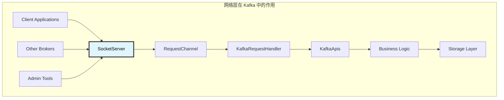
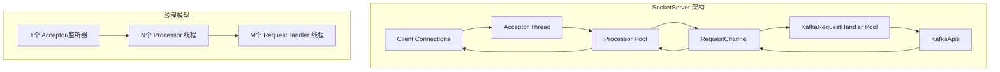

# Kafka Broker SocketServer 深度解析：网络层核心实现

## 概述

SocketServer 是 Kafka Broker 的网络层核心组件，负责监听客户端连接、处理网络 I/O 操作和管理请求-响应通道。它采用基于 NIO 的 Reactor 模式，通过多线程架构实现高并发网络处理能力。

## 模块作用和设计目的

### 核心作用

SocketServer 作为 Kafka Broker 的网络入口，承担着以下关键职责：

1. **网络连接管理**：监听指定端口，接受客户端连接请求
2. **I/O 多路复用**：使用 NIO Selector 实现高效的非阻塞 I/O 操作
3. **请求解析和路由**：解析网络数据包，将请求路由到相应的处理器
4. **响应发送**：将处理结果封装并发送回客户端
5. **连接生命周期管理**：管理连接的建立、维护和关闭
6. **流量控制**：实现连接配额和限流机制

### 设计目的

SocketServer 的设计遵循以下核心原则：

#### 1. **高并发处理能力**
```
单线程 Acceptor + 多线程 Processor 模式
    ↓
避免 C10K 问题，支持万级并发连接
```
- **Reactor 模式**：采用事件驱动的异步 I/O 模型
- **线程池分离**：Acceptor 专注连接接受，Processor 专注 I/O 处理
- **非阻塞 I/O**：避免线程阻塞，提高资源利用率

#### 2. **可扩展性设计**
- **多监听器支持**：支持不同安全协议和端口的多个监听器
- **动态线程调整**：支持运行时调整 Processor 线程数量
- **模块化架构**：网络层与业务逻辑完全分离

#### 3. **可靠性保障**
- **连接配额管理**：防止连接数过多导致系统资源耗尽
- **优雅关闭**：支持连接和服务的优雅关闭
- **异常隔离**：单个连接异常不影响其他连接

#### 4. **性能优化**
- **零拷贝技术**：在可能的情况下使用零拷贝减少数据复制
- **缓冲区管理**：合理配置发送和接收缓冲区大小
- **批量处理**：支持请求和响应的批量处理

### 在 Kafka 架构中的定位



SocketServer 是 Kafka 系统的"神经系统"，负责所有外部通信，其性能直接决定了整个 Kafka 集群的吞吐量和响应延迟。

### 设计权衡

#### 1. **内存 vs 延迟**
- 使用内存缓冲区提高性能，但需要控制内存使用量
- 通过配置缓冲区大小平衡内存占用和网络性能

#### 2. **线程数 vs 资源消耗**
- 更多的 Processor 线程提高并发能力，但增加上下文切换开销
- 需要根据硬件配置和负载特征调整线程数量

#### 3. **连接复用 vs 隔离性**
- 支持连接复用提高效率，但需要确保请求间的隔离性
- 通过请求 ID 和会话管理实现连接复用的安全性

## 1. SocketServer 架构设计

### 1.1 核心组件结构

**源码位置**: `core/src/main/scala/kafka/network/SocketServer.scala`

```scala
class SocketServer(val config: KafkaConfig,
                   val metrics: Metrics,
                   val time: Time,
                   val credentialProvider: CredentialProvider,
                   val apiVersionManager: ApiVersionManager) extends Logging {
  
  private val dataPlaneAcceptors = new mutable.HashMap[EndPoint, Acceptor]()
  private val dataPlaneProcessors = new mutable.HashMap[Int, Processor]()
  private val controlPlaneAcceptorOpt: Option[Acceptor] = None
  private val controlPlaneProcessorOpt: Option[Processor] = None
  
  val dataPlaneRequestChannel = new RequestChannel(
    queueSize = config.queuedMaxRequests,
    metricNamePrefix = DataPlaneMetricPrefix,
    time = time,
    apiVersionManager = apiVersionManager
  )
}
```

**源码位置**: `core/src/main/scala/kafka/network/SocketServer.scala:542-623`
**核心功能**:
- 管理数据平面和控制平面的网络连接
- 创建和管理 Acceptor 和 Processor 线程
- 提供请求通道用于与上层业务逻辑交互
- 支持多监听器配置和安全协议

### 1.2 Reactor 模式实现



## 2. Acceptor 组件：连接接受器

### 2.1 Acceptor 实现

**源码位置**: `core/src/main/scala/kafka/network/SocketServer.scala:536-623`

```scala
private[kafka] class Acceptor(val endPoint: EndPoint,
                              val sendBufferSize: Int,
                              val recvBufferSize: Int,
                              val nodeId: Int,
                              connectionQuotas: ConnectionQuotas,
                              metricPrefix: String,
                              time: Time,
                              nioSelector: Selector) extends Runnable {
  
  override def run(): Unit = {
    serverChannel.register(nioSelector, SelectionKey.OP_ACCEPT)
    try {
      while (shouldRun.get()) {
        try {
          acceptNewConnections()      // 接受新连接
          closeThrottledConnections() // 关闭限流连接
        } catch {
          case e: Throwable => error("Error occurred", e)
        }
      }
    } finally {
      closeAll()
    }
  }
}
```

**源码位置**: `core/src/main/scala/kafka/network/SocketServer.scala:604-623`
**核心功能**:
- 监听指定端口的新连接请求
- 将新连接分配给 Processor 线程处理
- 实现连接配额管理和限流控制
- 支持优雅关闭和资源清理

### 2.2 连接分配策略

```scala
private def acceptNewConnections(): Unit = {
  val ready = nioSelector.select(500)
  if (ready > 0) {
    val keys = nioSelector.selectedKeys()
    val iter = keys.iterator()
    while (iter.hasNext && shouldRun.get()) {
      try {
        val key = iter.next
        iter.remove()
        
        if (key.isAcceptable) {
          accept(key).foreach { socketChannel =>
            // 轮询分配给 Processor
            val processor = synchronized {
              currentProcessorIndex = (currentProcessorIndex + 1) % processors.length
              processors(currentProcessorIndex)
            }
            processor.accept(socketChannel)
          }
        }
      } catch {
        case e: Throwable => error("Error while accepting connection", e)
      }
    }
  }
}
```

## 3. Processor 组件：I/O 处理器

### 3.1 Processor 核心实现

**源码位置**: `core/src/main/scala/kafka/network/SocketServer.scala:833-1000`

```scala
private[kafka] class Processor(val id: Int,
                               time: Time,
                               maxRequestSize: Int,
                               requestChannel: RequestChannel,
                               connectionQuotas: ConnectionQuotas,
                               connectionsMaxIdleMs: Long) extends Runnable {
  
  override def run(): Unit = {
    try {
      while (shouldRun.get()) {
        try {
          configureNewConnections()    // 配置新连接
          processNewResponses()        // 处理新响应
          poll()                       // NIO 轮询
          processCompletedReceives()   // 处理完成的接收
          processCompletedSends()      // 处理完成的发送
          processDisconnected()        // 处理断开连接
          closeExcessConnections()     // 关闭多余连接
        } catch {
          case e: Throwable => error("Processor error", e)
        }
      }
    } finally {
      closeAll()
    }
  }
}
```

**源码位置**: `core/src/main/scala/kafka/network/SocketServer.scala:919-940`
**核心功能**:
- 管理多个客户端连接的 I/O 操作
- 实现非阻塞网络读写
- 处理请求解析和响应发送
- 维护连接状态和生命周期

### 3.2 请求处理流程

```scala
private def processCompletedReceives(): Unit = {
  selector.completedReceives.asScala.foreach { receive =>
    try {
      openOrClosingChannel(receive.source) match {
        case Some(channel) =>
          val header = RequestHeader.parse(receive.payload)
          val context = new RequestContext(header, receive.source, 
                                         channel.socketAddress, channel.principal, 
                                         listenerName, securityProtocol, 
                                         channel.channelMetadataRegistry.clientInformation)
          val req = new RequestChannel.Request(processor = id, context = context, 
                                             startTimeNanos = time.nanoseconds, 
                                             memoryPool, receive.payload, requestChannel.metrics)
          
          // 将请求放入请求队列
          requestChannel.sendRequest(req)
        case None =>
          throw new IllegalStateException(s"Channel ${receive.source} removed from selector")
      }
    } catch {
      case e: Throwable => error("Error processing request", e)
    }
  }
}
```

## 4. RequestChannel：请求通道

### 4.1 RequestChannel 设计

**源码位置**: `core/src/main/scala/kafka/network/RequestChannel.scala`

```scala
class RequestChannel(val queueSize: Int,
                     val metricNamePrefix: String,
                     time: Time,
                     val apiVersionManager: ApiVersionManager) extends KafkaMetricsGroup {
  
  private val requestQueue = new ArrayBlockingQueue[BaseRequest](queueSize)
  private val processors = new ConcurrentHashMap[Int, Processor]()
  
  def sendRequest(request: RequestChannel.Request): Unit = {
    requestQueue.put(request)
  }
  
  def receiveRequest(timeout: Long): BaseRequest = {
    requestQueue.poll(timeout, TimeUnit.MILLISECONDS)
  }
}
```

**源码位置**: `core/src/main/scala/kafka/network/RequestChannel.scala:50-100`
**核心功能**:
- 提供请求队列缓冲机制
- 支持超时等待和非阻塞操作
- 实现请求和响应的生命周期管理
- 提供监控指标和性能统计

## 5. 配置参数详解

### 5.1 网络配置参数

| 参数名 | 默认值 | 说明 |
|--------|--------|------|
| `num.network.threads` | 3 | Processor 线程数量 |
| `num.io.threads` | 8 | RequestHandler 线程数量 |
| `socket.send.buffer.bytes` | 102400 | Socket 发送缓冲区大小 |
| `socket.receive.buffer.bytes` | 102400 | Socket 接收缓冲区大小 |
| `socket.request.max.bytes` | 104857600 | 单个请求最大字节数 |
| `queued.max.requests` | 500 | 请求队列最大长度 |

### 5.2 连接管理配置

```scala
// 连接配额管理
val connectionQuotas = new ConnectionQuotas(config, time, metrics)

// 最大连接数限制
max.connections = config.maxConnections
max.connections.per.ip = config.maxConnectionsPerIp

// 连接空闲超时
connections.max.idle.ms = config.connectionsMaxIdleMs
```

## 6. 性能优化策略

### 6.1 线程池调优

```scala
// 根据 CPU 核心数调整 Processor 线程数
num.network.threads = Math.max(2, Math.min(8, Runtime.getRuntime.availableProcessors))

// 根据并发请求量调整 RequestHandler 线程数  
num.io.threads = Math.max(8, Runtime.getRuntime.availableProcessors * 2)
```

### 6.2 缓冲区优化

```scala
// 根据网络带宽调整缓冲区大小
socket.send.buffer.bytes = 1024 * 1024    // 1MB for high throughput
socket.receive.buffer.bytes = 1024 * 1024 // 1MB for high throughput

// 根据消息大小调整最大请求大小
socket.request.max.bytes = 100 * 1024 * 1024 // 100MB for large messages
```

## 7. 监控指标

### 7.1 网络层指标

- `kafka.network:type=SocketServer,name=NetworkProcessorAvgIdlePercent`: Processor 平均空闲率
- `kafka.network:type=RequestChannel,name=RequestQueueSize`: 请求队列大小
- `kafka.network:type=Processor,name=IdlePercent`: 单个 Processor 空闲率

### 7.2 连接指标

- `kafka.server:type=socket-server-metrics,listener=*,networkProcessor=*`: 连接数统计
- `kafka.network:type=Acceptor,name=AcceptorBlockedPercent`: Acceptor 阻塞率

SocketServer 作为 Kafka Broker 的网络入口，其性能直接影响整个集群的吞吐量和延迟。通过合理的线程配置、缓冲区调优和监控指标观察，可以确保网络层的高效运行。
