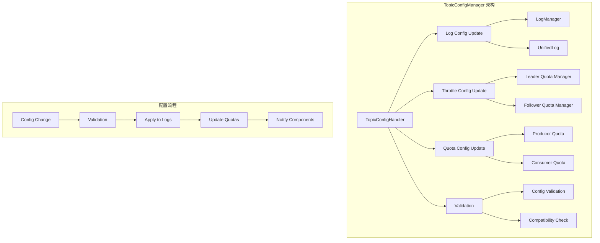

# Kafka Broker TopicConfigManager 深度解析：Topic配置信息管理

## 概述

TopicConfigManager 是 Kafka Broker 的 Topic 配置信息管理组件，负责处理 Topic 级别的配置变更、验证配置参数、应用配置更新并通知相关组件。它确保 Topic 配置的一致性和实时性，支持动态配置更新而无需重启 Broker。

## 模块作用和设计目的

### 核心作用

TopicConfigManager 作为 Kafka 配置管理的"控制中心"，承担着以下关键职责：

1. **配置生命周期管理**：管理 Topic 配置从创建到删除的完整生命周期
2. **动态配置更新**：支持运行时修改 Topic 配置而无需重启服务
3. **配置验证和约束**：确保配置参数的合法性和一致性
4. **配置同步和分发**：在集群中同步配置变更
5. **配置版本管理**：跟踪配置变更历史和版本
6. **配置影响分析**：分析配置变更对系统的影响

### 设计目的

TopicConfigManager 的设计体现了现代分布式系统对配置管理的核心需求：

#### 1. **运维灵活性**
```
静态配置 → 动态配置 → 智能配置
    ↓
实现零停机配置管理
```
- **热更新能力**：支持运行时配置变更，避免服务中断
- **配置隔离**：Topic 级别的配置不影响其他 Topic
- **渐进式更新**：支持配置的渐进式部署和回滚

#### 2. **配置一致性保障**
- **强一致性**：确保集群中所有节点的配置一致
- **事务性更新**：配置变更的原子性保证
- **冲突检测**：检测和解决配置冲突

#### 3. **系统可靠性**
- **配置验证**：防止错误配置导致系统故障
- **影响评估**：评估配置变更的潜在影响
- **安全回滚**：支持配置的安全回滚机制

#### 4. **可观测性和治理**
- **变更审计**：记录所有配置变更的审计日志
- **配置监控**：监控配置的使用情况和效果
- **合规检查**：确保配置符合企业治理要求

### 在 Kafka 配置体系中的定位

```mermaid
graph TB
    subgraph "Kafka 配置管理体系"
        A[Admin Client] --> B[Controller]
        B --> C[Config Change Events]
        C --> D[TopicConfigManager]

        D --> E[Config Validation]
        D --> F[Config Application]
        D --> G[Config Synchronization]

        E --> H[LogManager]
        F --> H
        F --> I[ReplicaManager]
        F --> J[QuotaManagers]

        G --> K[Other Brokers]

        L[Monitoring] --> M[Config Metrics]
        D --> L

        N[Audit System] --> O[Change History]
        D --> N

        style D fill:#f9fbe7,stroke:#333,stroke-width:3px
        style D color:#000
    end
```



TopicConfigManager 是 Kafka 配置管理的"神经中枢"，确保配置变更的安全、一致和高效。

### 设计权衡

#### 1. **实时性 vs 一致性**
- **强一致性**：确保所有节点配置一致，但可能增加延迟
- **最终一致性**：提高性能，但需要处理短暂的不一致

#### 2. **验证严格性 vs 灵活性**
- **严格验证**：防止错误配置，但可能限制高级用法
- **灵活配置**：支持更多场景，但增加出错风险

#### 3. **配置粒度 vs 管理复杂度**
- **细粒度配置**：提供更精确的控制，但增加管理复杂度
- **粗粒度配置**：简化管理，但可能不够灵活

#### 4. **性能 vs 功能**
- **丰富功能**：提供完整的配置管理能力，但可能影响性能
- **性能优先**：简化功能以提高性能

### 配置管理维度

#### 1. **存储配置**
- 日志保留策略（时间、大小）
- 压缩策略和参数
- 段文件大小和滚动策略
- 索引配置

#### 2. **性能配置**
- 批量大小和延迟设置
- 压缩算法选择
- 刷盘策略
- 预分配设置

#### 3. **可靠性配置**
- 副本数量和 ISR 要求
- 不干净选举设置
- 事务配置
- 幂等性设置

#### 4. **安全配置**
- 访问控制列表
- 加密设置
- 认证配置
- 审计设置

### 配置变更流程

#### 1. **变更请求**
- 配置变更请求接收
- 权限验证
- 参数预验证

#### 2. **影响分析**
- 配置兼容性检查
- 性能影响评估
- 依赖关系分析

#### 3. **变更执行**
- 配置更新
- 组件通知
- 状态同步

#### 4. **变更确认**
- 变更结果验证
- 回滚准备
- 审计记录

## 1. TopicConfigManager 架构设计

### 1.1 核心组件结构

**源码位置**: `core/src/main/scala/kafka/server/ConfigHandler.scala:45-80`

```scala
class TopicConfigHandler(private val replicaManager: ReplicaManager,
                         kafkaConfig: KafkaConfig,
                         val quotas: QuotaManagers) extends ConfigHandler with Logging {
  
  private val logManager = replicaManager.logManager
  
  def processConfigChanges(topic: String, topicConfig: Properties): Unit = {
    // 1. 更新日志配置
    updateLogConfig(topic, topicConfig)
    
    // 2. 更新限流配置
    updateThrottledList(LogConfig.LeaderReplicationThrottledReplicasProp, quotas.leader)
    updateThrottledList(LogConfig.FollowerReplicationThrottledReplicasProp, quotas.follower)
    
    // 3. 更新其他相关配置
    updateQuotaConfigs(topic, topicConfig)
  }
  
  private def updateLogConfig(topic: String, topicConfig: Properties): Unit = {
    // 获取该 Topic 的所有日志
    val logs = logManager.logsByTopic(topic)
    
    if (logs.nonEmpty) {
      // 创建新的日志配置
      val newLogConfig = LogConfig.fromProps(logManager.currentDefaultConfig.props, topicConfig)
      
      // 应用到所有相关日志
      logs.values.foreach { log =>
        log.updateConfig(newLogConfig)
      }
      
      info(s"Updated log config for topic $topic: ${topicConfig.asScala}")
    }
  }
}
```

**源码位置**: `core/src/main/scala/kafka/server/ConfigHandler.scala:45-70`
**核心功能**:
- 处理 Topic 配置变更通知
- 更新日志管理器的配置
- 管理复制限流配置
- 协调配额管理器配置更新

### 1.2 配置管理架构



## 2. 配置变更处理

### 2.1 配置更新流程

```scala
def processConfigChanges(topic: String, topicConfig: Properties): Unit = {
  try {
    info(s"Processing config changes for topic $topic")
    
    // 1. 验证配置参数
    validateTopicConfig(topic, topicConfig)
    
    // 2. 更新日志配置
    updateLogConfig(topic, topicConfig)
    
    // 3. 更新限流配置
    updateThrottledReplicasList(topic, topicConfig)
    
    // 4. 更新配额配置
    updateQuotaConfigs(topic, topicConfig)
    
    // 5. 通知其他组件
    notifyConfigChange(topic, topicConfig)
    
    info(s"Successfully processed config changes for topic $topic")
    
  } catch {
    case e: Exception =>
      error(s"Failed to process config changes for topic $topic", e)
      throw e
  }
}

private def validateTopicConfig(topic: String, config: Properties): Unit = {
  // 验证配置键值对
  config.asScala.foreach { case (key, value) =>
    if (!LogConfig.configNames.contains(key)) {
      throw new InvalidConfigurationException(s"Unknown configuration '$key' for topic $topic")
    }
    
    // 验证具体配置值
    validateConfigValue(key, value)
  }
}

private def validateConfigValue(key: String, value: String): Unit = {
  key match {
    case LogConfig.SegmentBytesProp =>
      val segmentSize = value.toLong
      if (segmentSize < 1024) {
        throw new InvalidConfigurationException(s"Invalid segment size: $segmentSize. Must be at least 1024 bytes")
      }
      
    case LogConfig.RetentionMsProp =>
      val retentionMs = value.toLong
      if (retentionMs < -1) {
        throw new InvalidConfigurationException(s"Invalid retention time: $retentionMs. Must be -1 or positive")
      }
      
    case LogConfig.CleanupPolicyProp =>
      val policies = value.split(",").map(_.trim)
      val validPolicies = Set("delete", "compact")
      policies.foreach { policy =>
        if (!validPolicies.contains(policy)) {
          throw new InvalidConfigurationException(s"Invalid cleanup policy: $policy. Valid values are: ${validPolicies.mkString(", ")}")
        }
      }
      
    case LogConfig.CompressionTypeProp =>
      val validTypes = Set("uncompressed", "snappy", "lz4", "gzip", "producer")
      if (!validTypes.contains(value)) {
        throw new InvalidConfigurationException(s"Invalid compression type: $value. Valid values are: ${validTypes.mkString(", ")}")
      }
      
    case _ =>
      // 其他配置的验证逻辑
  }
}
```

### 2.2 日志配置更新

```scala
private def updateLogConfig(topic: String, topicConfig: Properties): Unit = {
  val logs = logManager.logsByTopic(topic)
  
  if (logs.nonEmpty) {
    // 合并默认配置和 Topic 特定配置
    val mergedProps = new Properties()
    mergedProps.putAll(logManager.currentDefaultConfig.props)
    mergedProps.putAll(topicConfig)
    
    // 创建新的日志配置
    val newLogConfig = LogConfig.fromProps(mergedProps)
    
    // 验证配置兼容性
    validateConfigCompatibility(logs.head._2.config, newLogConfig)
    
    // 应用配置到所有分区日志
    logs.foreach { case (topicPartition, log) =>
      try {
        log.updateConfig(newLogConfig)
        info(s"Updated config for partition $topicPartition")
      } catch {
        case e: Exception =>
          error(s"Failed to update config for partition $topicPartition", e)
          throw e
      }
    }
    
    // 记录配置变更
    recordConfigChange(topic, topicConfig)
  } else {
    debug(s"No logs found for topic $topic, config will be applied when logs are created")
  }
}

private def validateConfigCompatibility(oldConfig: LogConfig, newConfig: LogConfig): Unit = {
  // 检查不兼容的配置变更
  if (oldConfig.segmentBytes != newConfig.segmentBytes) {
    info(s"Segment size changed from ${oldConfig.segmentBytes} to ${newConfig.segmentBytes}")
  }
  
  if (oldConfig.indexIntervalBytes != newConfig.indexIntervalBytes) {
    info(s"Index interval changed from ${oldConfig.indexIntervalBytes} to ${newConfig.indexIntervalBytes}")
  }
  
  // 某些配置变更可能需要特殊处理
  if (oldConfig.cleanupPolicy != newConfig.cleanupPolicy) {
    warn(s"Cleanup policy changed from ${oldConfig.cleanupPolicy} to ${newConfig.cleanupPolicy}. " +
         "This may require log compaction state changes.")
  }
}
```

## 3. 限流配置管理

### 3.1 复制限流配置

```scala
private def updateThrottledReplicasList(topic: String, topicConfig: Properties): Unit = {
  // 更新 Leader 复制限流
  updateThrottledList(LogConfig.LeaderReplicationThrottledReplicasProp, quotas.leader, topic, topicConfig)
  
  // 更新 Follower 复制限流
  updateThrottledList(LogConfig.FollowerReplicationThrottledReplicasProp, quotas.follower, topic, topicConfig)
}

private def updateThrottledList(prop: String, 
                                quotaManager: ReplicationQuotaManager,
                                topic: String,
                                topicConfig: Properties): Unit = {
  if (topicConfig.containsKey(prop) && topicConfig.getProperty(prop).nonEmpty) {
    // 解析限流分区列表
    val partitions = parseThrottledPartitions(topicConfig, kafkaConfig.brokerId, prop)
    
    // 应用限流配置
    quotaManager.markThrottled(topic, partitions.map(Integer.valueOf).asJava)
    
    debug(s"Setting $prop on broker ${kafkaConfig.brokerId} for topic: $topic and partitions $partitions")
  } else {
    // 移除限流配置
    quotaManager.removeThrottle(topic)
    debug(s"Removing $prop from broker ${kafkaConfig.brokerId} for topic $topic")
  }
}

private def parseThrottledPartitions(topicConfig: Properties, 
                                     brokerId: Int, 
                                     prop: String): Seq[Int] = {
  val throttledReplicas = topicConfig.getProperty(prop)
  
  if (throttledReplicas != null && throttledReplicas.nonEmpty) {
    throttledReplicas.split(",").flatMap { replicaEntry =>
      val parts = replicaEntry.split(":")
      if (parts.length == 2) {
        val partition = parts(0).toInt
        val replica = parts(1).toInt
        
        // 只处理当前 Broker 的副本
        if (replica == brokerId) {
          Some(partition)
        } else {
          None
        }
      } else {
        warn(s"Invalid throttled replica format: $replicaEntry")
        None
      }
    }.toSeq
  } else {
    Seq.empty
  }
}
```

### 3.2 配额配置更新

```scala
private def updateQuotaConfigs(topic: String, topicConfig: Properties): Unit = {
  // 更新生产者配额
  updateProducerQuotas(topic, topicConfig)
  
  // 更新消费者配额
  updateConsumerQuotas(topic, topicConfig)
}

private def updateProducerQuotas(topic: String, topicConfig: Properties): Unit = {
  val producerQuotaProp = "producer.byte.rate"
  
  if (topicConfig.containsKey(producerQuotaProp)) {
    val quotaValue = topicConfig.getProperty(producerQuotaProp).toLong
    
    // 应用到生产者配额管理器
    quotas.produce.updateQuota(topic, quotaValue)
    
    info(s"Updated producer quota for topic $topic to $quotaValue bytes/sec")
  }
}

private def updateConsumerQuotas(topic: String, topicConfig: Properties): Unit = {
  val consumerQuotaProp = "consumer.byte.rate"
  
  if (topicConfig.containsKey(consumerQuotaProp)) {
    val quotaValue = topicConfig.getProperty(consumerQuotaProp).toLong
    
    // 应用到消费者配额管理器
    quotas.fetch.updateQuota(topic, quotaValue)
    
    info(s"Updated consumer quota for topic $topic to $quotaValue bytes/sec")
  }
}
```

## 4. 配置持久化和同步

### 4.1 配置变更记录

```scala
private def recordConfigChange(topic: String, config: Properties): Unit = {
  val configChangeRecord = new ConfigChangeRecord(
    timestamp = System.currentTimeMillis(),
    topic = topic,
    configs = config.asScala.toMap,
    brokerId = kafkaConfig.brokerId
  )
  
  // 记录到审计日志
  auditLogger.info(s"Topic config changed: $configChangeRecord")
  
  // 更新指标
  configChangeMetrics.mark()
}

case class ConfigChangeRecord(timestamp: Long,
                              topic: String,
                              configs: Map[String, String],
                              brokerId: Int) {
  override def toString: String = {
    s"ConfigChangeRecord(timestamp=$timestamp, topic=$topic, configs=$configs, brokerId=$brokerId)"
  }
}
```

### 4.2 配置同步机制

```scala
class ConfigSynchronizer(configHandler: TopicConfigHandler,
                         metadataCache: MetadataCache) extends Logging {
  
  def syncTopicConfigs(): Unit = {
    val allTopics = metadataCache.getAllTopics()
    
    allTopics.foreach { topic =>
      try {
        val topicConfig = getTopicConfigFromMetadata(topic)
        configHandler.processConfigChanges(topic, topicConfig)
      } catch {
        case e: Exception =>
          error(s"Failed to sync config for topic $topic", e)
      }
    }
  }
  
  private def getTopicConfigFromMetadata(topic: String): Properties = {
    val topicMetadata = metadataCache.getTopicMetadata(topic)
    val config = new Properties()
    
    topicMetadata.foreach { metadata =>
      metadata.configs.asScala.foreach { case (key, value) =>
        config.setProperty(key, value)
      }
    }
    
    config
  }
}
```

## 5. 动态配置支持

### 5.1 运行时配置更新

```scala
class DynamicTopicConfigManager(configHandler: TopicConfigHandler,
                                scheduler: Scheduler) extends Logging {
  
  private val configUpdateQueue = new LinkedBlockingQueue[ConfigUpdateRequest]()
  private val configUpdateThread = new Thread(new ConfigUpdateProcessor(), "config-update-processor")
  
  def start(): Unit = {
    configUpdateThread.start()
    
    // 定期检查配置更新
    scheduler.schedule("config-sync", () => syncConfigs(), 0L, 30000L)
  }
  
  def updateTopicConfig(topic: String, configs: Map[String, String]): Unit = {
    val props = new Properties()
    configs.foreach { case (key, value) => props.setProperty(key, value) }
    
    val request = ConfigUpdateRequest(topic, props, System.currentTimeMillis())
    configUpdateQueue.offer(request)
  }
  
  private class ConfigUpdateProcessor extends Runnable {
    override def run(): Unit = {
      while (!Thread.currentThread().isInterrupted) {
        try {
          val request = configUpdateQueue.take()
          processConfigUpdate(request)
        } catch {
          case _: InterruptedException =>
            Thread.currentThread().interrupt()
            return
          case e: Exception =>
            error("Error processing config update", e)
        }
      }
    }
    
    private def processConfigUpdate(request: ConfigUpdateRequest): Unit = {
      try {
        configHandler.processConfigChanges(request.topic, request.config)
        info(s"Successfully applied config update for topic ${request.topic}")
      } catch {
        case e: Exception =>
          error(s"Failed to apply config update for topic ${request.topic}", e)
      }
    }
  }
  
  case class ConfigUpdateRequest(topic: String, config: Properties, timestamp: Long)
}
```

## 6. 配置验证和约束

### 6.1 配置约束检查

```scala
object TopicConfigConstraints {
  
  def validateSegmentSize(segmentBytes: Long): Unit = {
    if (segmentBytes < 1024) {
      throw new InvalidConfigurationException("Segment size must be at least 1024 bytes")
    }
    if (segmentBytes > Int.MaxValue) {
      throw new InvalidConfigurationException("Segment size cannot exceed 2GB")
    }
  }
  
  def validateRetentionTime(retentionMs: Long): Unit = {
    if (retentionMs < -1) {
      throw new InvalidConfigurationException("Retention time must be -1 (unlimited) or positive")
    }
  }
  
  def validateCompressionType(compressionType: String): Unit = {
    val validTypes = Set("uncompressed", "snappy", "lz4", "gzip", "producer")
    if (!validTypes.contains(compressionType)) {
      throw new InvalidConfigurationException(s"Invalid compression type: $compressionType")
    }
  }
  
  def validateCleanupPolicy(cleanupPolicy: String): Unit = {
    val policies = cleanupPolicy.split(",").map(_.trim)
    val validPolicies = Set("delete", "compact")
    
    policies.foreach { policy =>
      if (!validPolicies.contains(policy)) {
        throw new InvalidConfigurationException(s"Invalid cleanup policy: $policy")
      }
    }
    
    // 检查策略组合的有效性
    if (policies.contains("compact") && policies.contains("delete")) {
      // compact + delete 是有效的组合
    }
  }
}
```

## 7. 监控指标

### 7.1 配置管理指标

```scala
class TopicConfigMetrics(metrics: Metrics) {
  
  private val metricsGroup = new KafkaMetricsGroup(this.getClass)
  
  // 配置变更指标
  val configChangesRate = metricsGroup.newMeter("ConfigChangesPerSec", "changes")
  val configChangeErrors = metricsGroup.newMeter("ConfigChangeErrorsPerSec", "errors")
  
  // 配置验证指标
  val configValidationTime = metricsGroup.newTimer("ConfigValidationTime")
  val configValidationErrors = metricsGroup.newMeter("ConfigValidationErrorsPerSec", "errors")
  
  // 配置应用指标
  val configApplicationTime = metricsGroup.newTimer("ConfigApplicationTime")
  val configApplicationErrors = metricsGroup.newMeter("ConfigApplicationErrorsPerSec", "errors")
  
  def recordConfigChange(): Unit = {
    configChangesRate.mark()
  }
  
  def recordConfigChangeError(): Unit = {
    configChangeErrors.mark()
  }
  
  def recordValidationTime(timeMs: Long): Unit = {
    configValidationTime.update(timeMs, TimeUnit.MILLISECONDS)
  }
}
```

## 8. 配置参数详解

### 8.1 Topic 级别配置

| 参数名 | 默认值 | 说明 |
|--------|--------|------|
| `segment.bytes` | 1073741824 | 日志段大小（1GB） |
| `retention.ms` | 604800000 | 消息保留时间（7天） |
| `retention.bytes` | -1 | 消息保留大小（无限制） |
| `cleanup.policy` | delete | 清理策略（delete/compact） |
| `compression.type` | producer | 压缩类型 |
| `min.insync.replicas` | 1 | 最小同步副本数 |
| `unclean.leader.election.enable` | false | 是否允许不干净的 Leader 选举 |

### 8.2 性能相关配置

```scala
// 高吞吐量配置
segment.bytes = 1073741824              // 1GB 段大小
segment.ms = 604800000                  // 7天段时间
index.interval.bytes = 4096             // 4KB 索引间隔

// 低延迟配置  
segment.bytes = 104857600               // 100MB 段大小
segment.ms = 86400000                   // 1天段时间
flush.messages = 1                      // 立即刷盘
```

TopicConfigManager 通过完善的配置管理机制，确保了 Topic 级别配置的正确性、一致性和实时性，为 Kafka 集群提供了灵活的配置管理能力。
