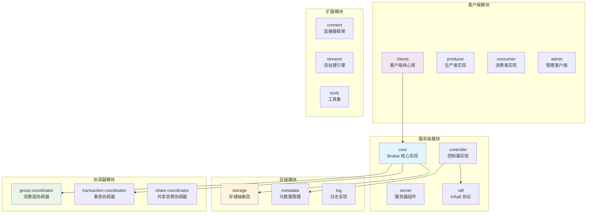
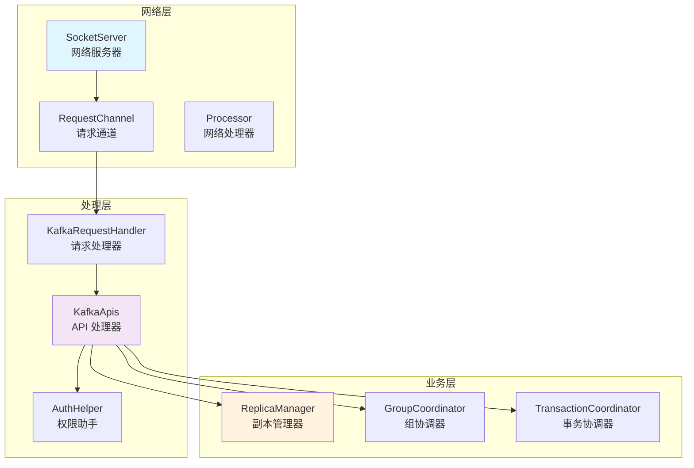
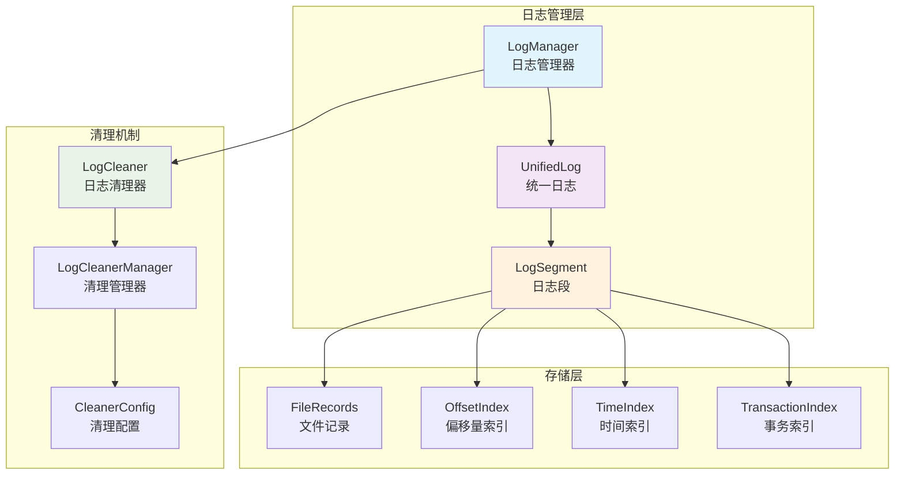
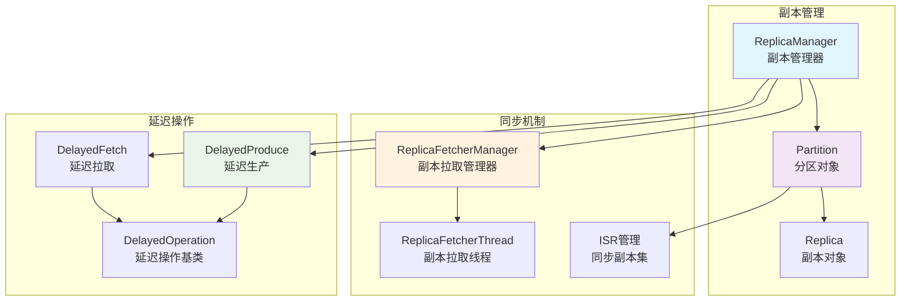
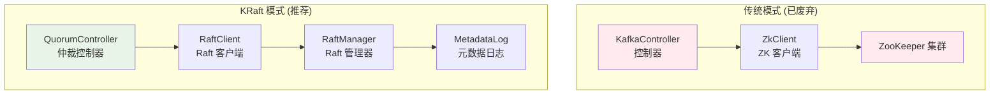
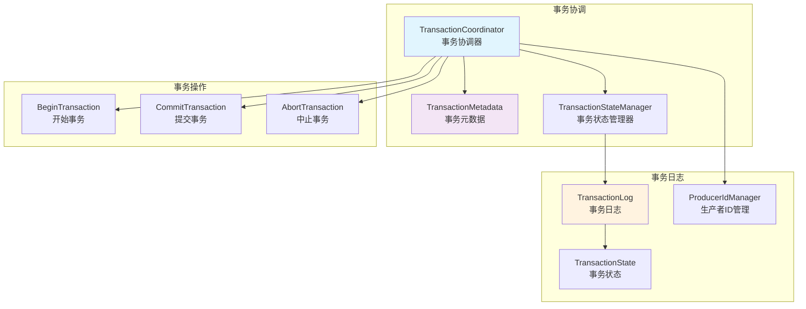
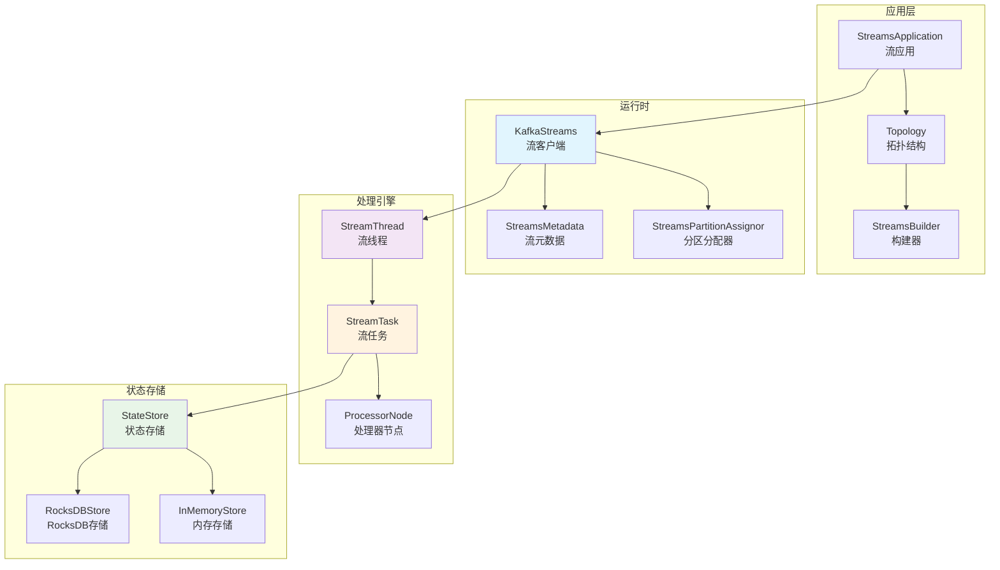
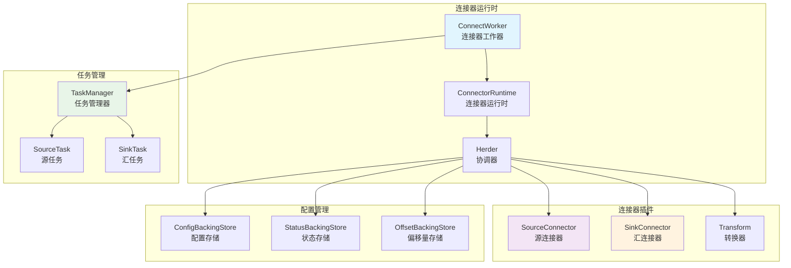

# Apache Kafka 源码深度阅读指南

## 概述

本指南将为您提供系统性的 Apache Kafka 源码阅读路径，从架构师角度深入理解 Kafka 的设计理念、核心实现和最佳实践。我们将按照从基础到高级、从核心到扩展的顺序进行学习。

## 目录

### 第一阶段：基础架构理解
1. [项目结构概览](#项目结构概览) - 理解模块划分和依赖关系
2. [核心概念实现](#核心概念实现) - 掌握基础数据结构和接口
3. [网络通信层](#网络通信层) - 理解 NIO 网络模型

### 第二阶段：核心机制深入
4. [请求处理流程](#请求处理流程) - 掌握请求生命周期
5. [日志存储系统](#日志存储系统) - 理解持久化机制
6. [副本管理机制](#副本管理机制) - 掌握一致性保证

### 第三阶段：分布式协调
7. [控制器实现](#控制器实现) - 理解集群管理
8. [KRaft 协议](#kraft-协议) - 掌握新一代共识机制
9. [元数据管理](#元数据管理) - 理解集群状态管理

### 第四阶段：高级特性
10. [事务机制](#事务机制) - 理解 ACID 保证
11. [流处理引擎](#流处理引擎) - 掌握 Kafka Streams
12. [连接器框架](#连接器框架) - 理解 Kafka Connect

---

## 第一阶段：基础架构理解

### 项目结构概览

#### 核心模块划分



#### 阅读顺序建议

**第一步：理解项目结构**
```bash
# 1. 查看根目录结构
ls -la

# 2. 理解模块依赖关系
cat settings.gradle
cat build.gradle

# 3. 查看核心模块
ls -la core/src/main/scala/kafka/
ls -la clients/src/main/java/org/apache/kafka/
```

**第二步：核心接口和数据结构**

重点文件阅读顺序：

1. **基础数据结构** (`clients/src/main/java/org/apache/kafka/common/`)
   - `TopicPartition.java` - 主题分区抽象
   - `Node.java` - 节点抽象
   - `Cluster.java` - 集群元数据
   - `record/` - 消息记录格式

2. **网络协议** (`clients/src/main/java/org/apache/kafka/common/`)
   - `protocol/ApiKeys.java` - API 类型定义
   - `requests/` - 请求响应协议
   - `network/` - 网络通信抽象

3. **配置管理** (`clients/src/main/java/org/apache/kafka/common/config/`)
   - `ConfigDef.java` - 配置定义框架
   - `AbstractConfig.java` - 配置基类

### 核心概念实现

#### 消息记录格式

**关键文件**：`clients/src/main/java/org/apache/kafka/common/record/`

```java
// 消息记录的核心抽象
public interface Record {
    long offset();           // 消息偏移量
    long timestamp();        // 时间戳
    int serializedKeySize(); // 键序列化大小
    int serializedValueSize(); // 值序列化大小
    Headers headers();       // 消息头
    ByteBuffer key();        // 消息键
    ByteBuffer value();      // 消息值
}
```

**源码位置**: `clients/src/main/java/org/apache/kafka/common/record/Record.java`

**阅读重点**:
- `MemoryRecords.java` - 内存中的消息批次
- `FileRecords.java` - 文件中的消息批次
- `RecordBatch.java` - 消息批次抽象
- `DefaultRecord.java` - 默认消息实现

#### 主题分区模型

**关键文件**：`clients/src/main/java/org/apache/kafka/common/TopicPartition.java`

```java
public final class TopicPartition implements Serializable {
    private final int hash;
    private final String topic;    // 主题名称
    private final int partition;   // 分区编号
    
    // 核心方法
    public String topic() { return topic; }
    public int partition() { return partition; }
}
```

**扩展阅读**:
- `TopicIdPartition.java` - 带主题 ID 的分区
- `TopicPartitionInfo.java` - 分区元数据信息
- `PartitionInfo.java` - 分区详细信息

### 网络通信层

#### NIO 网络模型

**核心实现**：`clients/src/main/java/org/apache/kafka/common/network/`

**关键组件**：

1. **Selector** - NIO 选择器封装
```java
public class Selector implements Selectable {
    private final java.nio.channels.Selector nioSelector;
    private final Map<String, KafkaChannel> channels;
    private final Set<SelectionKey> immediatelyConnectedKeys;
    
    // 核心方法
    public void poll(long timeout) throws IOException;
    public void send(NetworkSend send);
    public List<NetworkReceive> completedReceives();
}
```

**源码位置**: `clients/src/main/java/org/apache/kafka/common/network/Selector.java`

2. **KafkaChannel** - Kafka 通道抽象
```java
public class KafkaChannel implements AutoCloseable {
    private final String id;
    private final TransportLayer transportLayer;
    private final Authenticator authenticator;
    private final int maxReceiveSize;
    
    // 核心方法
    public NetworkReceive read() throws IOException;
    public Send write() throws IOException;
}
```

**源码位置**: `clients/src/main/java/org/apache/kafka/common/network/KafkaChannel.java`

#### 网络客户端实现

**核心文件**：`clients/src/main/java/org/apache/kafka/clients/NetworkClient.java`

```java
public class NetworkClient implements KafkaClient {
    private final Selectable selector;
    private final MetadataUpdater metadataUpdater;
    private final InFlightRequests inFlightRequests;
    private final ClusterConnectionStates connectionStates;
    
    // 核心方法
    public List<ClientResponse> poll(long timeout, long now);
    public void send(ClientRequest request, long now);
    public boolean ready(Node node, long now);
}
```

**阅读重点**:
- 理解异步网络 I/O 模型
- 掌握连接状态管理
- 学习请求响应匹配机制
- 理解元数据更新流程

---

## 学习建议

### 阅读方法

1. **自顶向下**：先理解整体架构，再深入具体实现
2. **关注接口**：重点理解核心接口的设计理念
3. **追踪数据流**：跟踪数据在系统中的流转路径
4. **结合文档**：配合官方文档理解设计决策

### 调试技巧

1. **单元测试**：通过测试用例理解组件行为
2. **日志分析**：开启详细日志观察运行时行为
3. **断点调试**：在关键路径设置断点跟踪执行流程
4. **性能分析**：使用 JProfiler 等工具分析性能瓶颈

### 实践建议

1. **搭建环境**：本地搭建 Kafka 集群进行实验
2. **修改代码**：尝试小的功能修改验证理解
3. **编写测试**：为理解的组件编写测试用例
4. **文档记录**：记录学习过程中的关键发现

---

## 第二阶段：核心机制深入

### 请求处理流程

#### 服务端请求处理架构

**核心组件关系图**：



#### 关键文件阅读顺序

**1. 网络服务器** (`core/src/main/scala/kafka/network/`)
- `SocketServer.scala` - 主网络服务器
- `RequestChannel.scala` - 请求响应通道
- `Processor.scala` - 网络处理器

**2. 请求处理器** (`core/src/main/scala/kafka/server/`)
- `KafkaRequestHandler.scala` - 请求处理主循环
- `KafkaApis.scala` - API 路由和处理
- `RequestHandlerHelper.scala` - 请求处理助手

**3. 权限控制** (`core/src/main/scala/kafka/server/`)
- `AuthHelper.scala` - 权限验证助手
- `Authorizer.scala` - 权限验证器接口

#### SocketServer 深度分析

**核心实现**：`core/src/main/scala/kafka/network/SocketServer.scala`

```scala
class SocketServer(val config: KafkaConfig,
                   val metrics: Metrics,
                   val time: Time,
                   val credentialProvider: CredentialProvider,
                   val apiVersionManager: ApiVersionManager) extends Logging {

  // 核心组件
  private val processors = new Array[Processor](config.numNetworkThreads)
  private val acceptors = new mutable.Map[EndPoint, Acceptor]
  private val requestChannel = new RequestChannel(maxQueuedRequests, metricNamePrefix, time)

  // 启动流程
  def startup(startProcessingRequests: Boolean = true,
              controlPlaneListener: Option[EndPoint] = None,
              config: KafkaConfig = config): Unit = {
    createDataPlaneAcceptorsAndProcessors(config.dataPlaneListeners)
    if (startProcessingRequests) {
      this.startProcessingRequests()
    }
  }
}
```

**源码位置**: `core/src/main/scala/kafka/network/SocketServer.scala:89-156`

**核心功能**:
- **多线程网络模型**: Acceptor + Processor 线程池
- **请求队列管理**: 通过 RequestChannel 解耦网络和处理
- **连接管理**: 管理客户端连接生命周期
- **流量控制**: 支持连接数和请求队列限制

#### KafkaApis 请求路由

**核心实现**：`core/src/main/scala/kafka/server/KafkaApis.scala`

```scala
class KafkaApis(val requestChannel: RequestChannel,
                val metadataSupport: MetadataSupport,
                val replicaManager: ReplicaManager,
                val groupCoordinator: GroupCoordinator,
                val txnCoordinator: TransactionCoordinator,
                // ... 其他依赖
               ) extends ApiRequestHandler with Logging {

  // 请求处理入口
  def handle(request: RequestChannel.Request, requestLocal: RequestLocal): Unit = {
    try {
      request.header.apiKey match {
        case ApiKeys.PRODUCE => handleProduceRequest(request, requestLocal)
        case ApiKeys.FETCH => handleFetchRequest(request)
        case ApiKeys.LIST_OFFSETS => handleListOffsetRequest(request)
        case ApiKeys.METADATA => handleTopicMetadataRequest(request)
        case ApiKeys.OFFSET_COMMIT => handleOffsetCommitRequest(request, requestLocal)
        case ApiKeys.OFFSET_FETCH => handleOffsetFetchRequest(request)
        case ApiKeys.FIND_COORDINATOR => handleFindCoordinatorRequest(request)
        case ApiKeys.JOIN_GROUP => handleJoinGroupRequest(request, requestLocal)
        case ApiKeys.HEARTBEAT => handleHeartbeatRequest(request)
        case ApiKeys.LEAVE_GROUP => handleLeaveGroupRequest(request)
        case ApiKeys.SYNC_GROUP => handleSyncGroupRequest(request, requestLocal)
        case ApiKeys.DESCRIBE_GROUPS => handleDescribeGroupRequest(request)
        case ApiKeys.LIST_GROUPS => handleListGroupsRequest(request)
        // ... 更多 API 处理
      }
    } catch {
      case e: FatalExitError => throw e
      case e: Throwable =>
        error(s"Unexpected error handling request ${request.header} with context ${request.context}", e)
        requestHelper.handleError(request, e)
    }
  }
}
```

**源码位置**: `core/src/main/scala/kafka/server/KafkaApis.scala:150-262`

**阅读重点**:
- **请求路由机制**: 基于 ApiKey 的路由分发
- **错误处理策略**: 统一的异常处理和错误响应
- **权限检查流程**: 与 AuthHelper 的集成
- **异步处理模式**: 回调机制的使用

### 日志存储系统

#### 日志管理架构

**核心组件**：



#### 关键文件阅读顺序

**1. 日志管理器** (`core/src/main/scala/kafka/log/`)
- `LogManager.scala` - 日志生命周期管理
- `UnifiedLog.scala` - 统一日志实现
- `LogSegment.scala` - 日志段实现

**2. 存储实现** (`clients/src/main/java/org/apache/kafka/common/record/`)
- `FileRecords.java` - 文件存储实现
- `MemoryRecords.java` - 内存存储实现
- `RecordBatch.java` - 记录批次

**3. 索引机制** (`core/src/main/scala/kafka/log/`)
- `OffsetIndex.scala` - 偏移量索引
- `TimeIndex.scala` - 时间戳索引
- `TransactionIndex.scala` - 事务索引

#### UnifiedLog 核心实现

**关键代码**：`core/src/main/scala/kafka/log/UnifiedLog.scala`

```scala
class UnifiedLog(@volatile var logStartOffset: Long,
                 private val localLog: LocalLog,
                 private val brokerTopicStats: BrokerTopicStats,
                 val producerIdExpirationCheckIntervalMs: Int,
                 @volatile var leaderEpochCache: Option[LeaderEpochFileCache],
                 val producerStateManager: ProducerStateManager,
                 @volatile private var _topicId: Option[Uuid],
                 val keepPartitionMetadataFile: Boolean) extends Logging {

  // 日志追加
  def appendAsLeader(records: MemoryRecords,
                     leaderEpoch: Int,
                     origin: AppendOrigin = AppendOrigin.CLIENT,
                     interBrokerProtocolVersion: MetadataVersion = MetadataVersion.latest,
                     requestLocal: RequestLocal = RequestLocal.NoCaching): LogAppendInfo = {
    val validateAndAssignOffsets = origin != AppendOrigin.RAFT_LEADER
    append(records, origin, interBrokerProtocolVersion, validateAndAssignOffsets, leaderEpoch, Some(requestLocal), ignoreRecordSize = false)
  }

  // 日志读取
  def read(startOffset: Long,
           maxLength: Int,
           isolation: FetchIsolation,
           minOneMessage: Boolean): FetchDataInfo = {
    maybeHandleIOException(s"Exception while reading from $topicPartition in dir ${localLog.dir.getParent}") {
      val endOffsetMetadata = localLog.logEndOffsetMetadata
      val endOffset = endOffsetMetadata.messageOffset

      if (startOffset == endOffset)
        return emptyFetchDataInfo(endOffsetMetadata, isolation)

      var segmentOpt = localLog.segments.floorEntry(startOffset)

      // 从合适的段开始读取
      val fetchDataInfo = segmentOpt.getValue.read(startOffset, maxLength, endOffset, minOneMessage)

      if (isolation == FetchIsolation.TXN_COMMITTED)
        addAbortedTransactions(startOffset, segmentOpt.getValue, fetchDataInfo)
      else
        fetchDataInfo
    }
  }
}
```

**源码位置**: `core/src/main/scala/kafka/log/UnifiedLog.scala:1089-1156`

**核心功能**:
- **分段存储**: 将日志分割为多个段文件
- **索引加速**: 通过偏移量和时间索引快速定位
- **事务支持**: 支持事务消息的读写
- **压缩清理**: 支持日志压缩和删除策略

### 副本管理机制

#### 副本同步架构

**核心组件**：



#### ReplicaManager 核心实现

**关键代码**：`core/src/main/scala/kafka/server/ReplicaManager.scala`

```scala
class ReplicaManager(val config: KafkaConfig,
                     metrics: Metrics,
                     time: Time,
                     scheduler: Scheduler,
                     val logManager: LogManager,
                     val isShuttingDown: AtomicBoolean,
                     quotaManagers: QuotaManagers,
                     val brokerTopicStats: BrokerTopicStats,
                     val metadataCache: MetadataCache,
                     logDirFailureChannel: LogDirFailureChannel,
                     val delayedProducePurgatory: DelayedOperationPurgatory[DelayedProduce],
                     val delayedFetchPurgatory: DelayedOperationPurgatory[DelayedFetch],
                     val delayedDeleteRecordsPurgatory: DelayedOperationPurgatory[DelayedDeleteRecords],
                     val delayedElectLeaderPurgatory: DelayedOperationPurgatory[DelayedElectLeader],
                     threadNamePrefix: Option[String],
                     val alterPartitionManager: AlterPartitionManager,
                     brokerEpochSupplier: () => Long) extends Logging with KafkaMetricsGroup {

  // 处理生产请求
  def appendRecords(timeout: Long,
                    requiredAcks: Short,
                    internalTopicsAllowed: Boolean,
                    origin: AppendOrigin,
                    entriesPerPartition: Map[TopicPartition, MemoryRecords],
                    responseCallback: Map[TopicPartition, PartitionResponse] => Unit,
                    delayedProduceRequestRequired: Boolean = true,
                    recordConversionStatsCallback: Map[TopicPartition, RecordConversionStats] => Unit = _ => (),
                    requestLocal: RequestLocal = RequestLocal.NoCaching): Unit = {

    if (isValidRequiredAcks(requiredAcks)) {
      val sTime = time.milliseconds
      val localProduceResults = appendToLocalLog(internalTopicsAllowed = internalTopicsAllowed,
        origin, entriesPerPartition, requiredAcks, requestLocal)
      debug("Produce to local log in %d ms".format(time.milliseconds - sTime))

      val produceStatus = localProduceResults.map { case (topicPartition, result) =>
        topicPartition -> ProducePartitionStatus(
          result.info.lastOffset + 1, // required offset
          new PartitionResponse(result.error, result.info.firstOffset.getOrElse(-1), result.info.logAppendTime,
            result.info.logStartOffset, result.info.recordErrors.asJava, result.info.errorMessage))
      }

      actionQueue.add {
        () =>
          localProduceResults.foreach {
            case (topicPartition, result) =>
              val requestKey = TopicPartitionOperationKey(topicPartition)
              result.info.leaderHwChange match {
                case LeaderHwChange.INCREASED =>
                  // some delayed operations may be unblocked after HW changed
                  delayedProducePurgatory.checkAndComplete(requestKey)
                  delayedFetchPurgatory.checkAndComplete(requestKey)
                  delayedDeleteRecordsPurgatory.checkAndComplete(requestKey)
                case LeaderHwChange.SAME =>
                  // probably unblock some follower fetch requests since log end offset has been updated
                  delayedFetchPurgatory.checkAndComplete(requestKey)
                case LeaderHwChange.NONE =>
                  // nothing
              }
          }
      }

      recordConversionStatsCallback(localProduceResults.map { case (k, v) => k -> v.info.recordConversionStats })

      if (delayedProduceRequestRequired && produceStatus.nonEmpty) {
        // create delayed produce operation
        val produceMetadata = ProduceMetadata(requiredAcks, produceStatus)
        val delayedProduce = new DelayedProduce(timeout, produceMetadata, this, responseCallback, delayedProduceRequestRequired)

        // create a list of (topic, partition) pairs to use as keys for this delayed produce operation
        val producerRequestKeys = entriesPerPartition.keys.map(TopicPartitionOperationKey(_)).toSeq

        // try to complete the request immediately, otherwise put it into the purgatory
        // this is because while the delayed produce operation is being created, new requests
        // may arrive and hence make this operation completable.
        delayedProducePurgatory.tryCompleteElseWatch(delayedProduce, producerRequestKeys)

      } else {
        // we can respond immediately
        val produceResponseStatus = produceStatus.map { case (k, status) => k -> status.responseStatus }
        responseCallback(produceResponseStatus)
      }
    } else {
      // If required.acks is outside accepted range, something is wrong with the client
      // Just return an error and don't worry about trying to return all errors for each partition
      val responseStatus = entriesPerPartition.map { case (topicPartition, _) =>
        topicPartition -> new PartitionResponse(Errors.INVALID_REQUIRED_ACKS,
          UnifiedLog.UnknownOffset, RecordBatch.NO_TIMESTAMP, UnifiedLog.UnknownOffset)
      }
      responseCallback(responseStatus)
    }
  }
}
```

**源码位置**: `core/src/main/scala/kafka/server/ReplicaManager.scala:387-550`

**核心功能**:
- **副本同步**: 管理 Leader 和 Follower 副本的同步
- **ISR 管理**: 维护同步副本集合
- **延迟操作**: 处理需要等待的生产和消费请求
- **高水位管理**: 维护已提交消息的高水位标记

---

## 第三阶段：分布式协调

### 控制器实现

#### 控制器架构演进

**传统 ZooKeeper 模式 vs KRaft 模式**：



#### KRaft 控制器核心实现

**关键文件**：`metadata/src/main/java/org/apache/kafka/controller/QuorumController.java`

```java
public class QuorumController implements Controller {
    private final int nodeId;
    private final String clusterId;
    private final KafkaEventQueue queue;
    private final RaftClient<ApiMessageAndVersion> raftClient;

    // 各种控制管理器
    private final ClusterControlManager clusterControl;
    private final ConfigurationControlManager configurationControl;
    private final ReplicationControlManager replicationControl;
    private final FeatureControlManager featureControl;

    // 处理客户端请求
    @Override
    public CompletableFuture<CreateTopicsResponseData> createTopics(
            ControllerRequestContext context,
            CreateTopicsRequestData request,
            Set<String> describable) {

        return appendControlEvent("createTopics", context.deadlineNs(), () -> {
            CreateTopicsResponseData response = new CreateTopicsResponseData();

            for (CreatableTopic topic : request.topics()) {
                ApiError error = ApiError.NONE;
                try {
                    // 验证主题名称
                    if (!Topic.isValid(topic.name())) {
                        error = new ApiError(Errors.INVALID_TOPIC_EXCEPTION,
                            "Topic name is invalid");
                    } else {
                        // 创建主题
                        replicationControl.createTopic(
                            topic.name(),
                            topic.numPartitions(),
                            topic.replicationFactor(),
                            topic.assignments(),
                            topic.configs(),
                            context.principal(),
                            describable.contains(topic.name())
                        );
                    }
                } catch (Exception e) {
                    error = ApiError.fromThrowable(e);
                }

                response.topics().add(new CreatableTopicResult()
                    .setName(topic.name())
                    .setErrorCode(error.error().code())
                    .setErrorMessage(error.message()));
            }

            return response;
        });
    }
}
```

**源码位置**: `metadata/src/main/java/org/apache/kafka/controller/QuorumController.java:1460-1482`

**核心功能**:
- **事件驱动**: 通过事件队列处理所有控制操作
- **状态管理**: 维护集群的完整元数据状态
- **一致性保证**: 通过 Raft 协议确保元数据一致性
- **模块化设计**: 将不同功能分离到专门的控制管理器

#### 元数据管理器

**关键文件**：`metadata/src/main/java/org/apache/kafka/controller/ReplicationControlManager.java`

```java
public class ReplicationControlManager {
    private final SnapshotRegistry snapshotRegistry;
    private final LogContext logContext;
    private final short defaultReplicationFactor;
    private final int defaultNumPartitions;
    private final ConfigurationControlManager configurationControl;
    private final ClusterControlManager clusterControl;

    // 主题状态管理
    private final TimelineHashMap<String, Uuid> topicsByName;
    private final TimelineHashMap<Uuid, TopicControlInfo> topics;
    private final TimelineHashMap<TopicIdPartition, PartitionControlInfo> partitions;

    // 创建主题
    ControllerResult<CreateTopicsResponseData> createTopics(
            ControllerRequestContext context,
            CreateTopicsRequestData request,
            Set<String> describable) {

        Map<String, ApiError> topicErrors = new HashMap<>();
        List<ApiMessageAndVersion> records = new ArrayList<>();

        for (CreatableTopic topic : request.topics()) {
            try {
                // 验证主题配置
                validateCreateTopic(topic);

                // 分配副本
                List<List<Integer>> partitionAssignments =
                    assignReplicas(topic.numPartitions(), topic.replicationFactor());

                // 生成主题记录
                Uuid topicId = Uuid.randomUuid();
                records.add(new ApiMessageAndVersion(new TopicRecord()
                    .setName(topic.name())
                    .setTopicId(topicId), (short) 0));

                // 生成分区记录
                for (int partitionId = 0; partitionId < partitionAssignments.size(); partitionId++) {
                    List<Integer> replicas = partitionAssignments.get(partitionId);
                    records.add(new ApiMessageAndVersion(new PartitionRecord()
                        .setPartitionId(partitionId)
                        .setTopicId(topicId)
                        .setReplicas(replicas)
                        .setIsr(replicas)
                        .setLeader(replicas.get(0))
                        .setLeaderEpoch(0)
                        .setPartitionEpoch(0), (short) 0));
                }

            } catch (Exception e) {
                topicErrors.put(topic.name(), ApiError.fromThrowable(e));
            }
        }

        return ControllerResult.of(records, new CreateTopicsResponseData()
            .setTopics(buildCreateTopicsResponse(topicErrors, describable)));
    }
}
```

**源码位置**: `metadata/src/main/java/org/apache/kafka/controller/ReplicationControlManager.java:892-1156`

### KRaft 协议

#### Raft 客户端实现

**核心文件**：`raft/src/main/java/org/apache/kafka/raft/KafkaRaftClient.java`

```java
public class KafkaRaftClient<T> implements RaftClient<T> {
    private final QuorumState quorum;
    private final ReplicatedLog log;
    private final MemoryPool memoryPool;
    private final NetworkChannel channel;
    private final RaftMessageQueue messageQueue;

    // 处理投票请求
    private CompletableFuture<VoteResponseData> handleVoteRequest(
            RaftRequest.Inbound request,
            long currentTimeMs) {

        VoteRequestData voteRequest = (VoteRequestData) request.data();

        // 验证集群 ID
        if (!clusterId.equals(voteRequest.clusterId())) {
            return completedFuture(new VoteResponseData()
                .setErrorCode(Errors.INCONSISTENT_CLUSTER_ID.code()));
        }

        // 处理投票逻辑
        boolean voteGranted = quorum.canGrantVote(
            voteRequest.candidateId(),
            voteRequest.candidateEpoch(),
            voteRequest.lastOffsetEpoch(),
            voteRequest.lastOffset(),
            voteRequest.isPreVote()
        );

        if (voteGranted && !voteRequest.isPreVote()) {
            quorum.transitionToVoted(voteRequest.candidateEpoch(), voteRequest.candidateId());
        }

        return completedFuture(VoteResponse.singletonResponse(
            Errors.NONE,
            topicPartition,
            voteGranted,
            Optional.of(quorum.leaderIdOrSentinel()),
            quorum.epoch()
        ));
    }

    // 处理日志追加
    public long scheduleAppend(int epoch, List<T> records) {
        return accumulator.append(epoch, records, false);
    }

    // 处理日志拉取
    private CompletableFuture<FetchResponseData> handleFetchRequest(
            RaftRequest.Inbound request,
            long currentTimeMs) {

        FetchRequestData fetchRequest = (FetchRequestData) request.data();

        // 验证请求
        if (fetchRequest.replicaId() < 0) {
            return completedFuture(buildFetchResponse(Errors.INVALID_REQUEST, Collections.emptyMap()));
        }

        // 读取日志
        LogFetchInfo fetchInfo = log.read(
            fetchRequest.fetchOffset(),
            fetchRequest.maxBytes(),
            FetchIsolation.HIGH_WATERMARK
        );

        return completedFuture(buildFetchResponse(Errors.NONE, fetchInfo));
    }
}
```

**源码位置**: `raft/src/main/java/org/apache/kafka/raft/KafkaRaftClient.java:2890-3156`

### 元数据管理

#### 元数据缓存

**核心文件**：`core/src/main/scala/kafka/server/metadata/KRaftMetadataCache.scala`

```scala
class KRaftMetadataCache(val brokerId: Int) extends MetadataCache with Logging {

  // 元数据状态
  @volatile private var _metadataSnapshot = MetadataSnapshot.EMPTY
  @volatile private var _state: MetadataImageAndOffset = MetadataImageAndOffset.EMPTY

  // 更新元数据
  def setImage(newImageAndOffset: MetadataImageAndOffset): Unit = {
    val newImage = newImageAndOffset.image
    val deltaName = if (_state == MetadataImageAndOffset.EMPTY) {
      "initial metadata"
    } else {
      s"metadata delta from offset ${_state.offset} to ${newImageAndOffset.offset}"
    }

    info(s"Setting $deltaName with ${newImage.features().metadataVersion()}")

    val oldImage = _state.image
    _state = newImageAndOffset
    _metadataSnapshot = newImage.toMetadataSnapshot()

    // 触发监听器
    maybeNotifyMetadataListeners(oldImage, newImage)
  }

  // 获取主题元数据
  override def getTopicMetadata(topics: Set[String],
                               listenerName: ListenerName,
                               errorUnavailableEndpoints: Boolean = false,
                               errorUnavailableListeners: Boolean = false): Seq[MetadataResponseTopic] = {

    val image = _state.image
    topics.toSeq.map { topicName =>
      image.topics().getTopic(topicName) match {
        case null =>
          MetadataResponseTopic()
            .setName(topicName)
            .setErrorCode(Errors.UNKNOWN_TOPIC_OR_PARTITION.code())

        case topic =>
          val partitions = (0 until topic.partitionCount()).map { partitionId =>
            val partition = image.partitions().get(new TopicIdPartition(topic.id(), partitionId))

            MetadataResponsePartition()
              .setPartitionIndex(partitionId)
              .setLeaderId(partition.leader)
              .setLeaderEpoch(partition.leaderEpoch)
              .setReplicaNodes(partition.replicas.toList.asJava)
              .setIsrNodes(partition.isr.toList.asJava)
              .setErrorCode(Errors.NONE.code())
          }

          MetadataResponseTopic()
            .setName(topicName)
            .setTopicId(topic.id())
            .setPartitions(partitions.asJava)
            .setErrorCode(Errors.NONE.code())
      }
    }
  }
}
```

**源码位置**: `core/src/main/scala/kafka/server/metadata/KRaftMetadataCache.scala:89-156`

---

## 第四阶段：高级特性

### 事务机制

#### 事务协调器架构



#### 事务协调器实现

**核心文件**：`transaction-coordinator/src/main/java/org/apache/kafka/coordinator/transaction/TransactionCoordinator.java`

```java
public class TransactionCoordinator implements Coordinator {
    private final TransactionStateManager transactionManager;
    private final ProducerIdManager producerIdManager;
    private final TransactionMarkerChannelManager transactionMarkerChannelManager;

    // 处理事务初始化
    public InitProducerIdResult handleInitProducerId(String transactionalId,
                                                    int transactionTimeoutMs,
                                                    Optional<ProducerIdAndEpoch> expectedProducerIdAndEpoch) {

        if (transactionalId == null || transactionalId.isEmpty()) {
            // 非事务生产者，直接分配 Producer ID
            ProducerIdAndEpoch producerIdAndEpoch = producerIdManager.generateProducerId();
            return new InitProducerIdResult(producerIdAndEpoch.producerId,
                                          producerIdAndEpoch.epoch,
                                          Errors.NONE);
        } else {
            // 事务生产者，需要管理事务状态
            return transactionManager.handleInitProducerId(
                transactionalId,
                transactionTimeoutMs,
                expectedProducerIdAndEpoch
            );
        }
    }

    // 处理事务提交
    public void handleEndTransaction(String transactionalId,
                                   long producerId,
                                   short producerEpoch,
                                   TransactionResult transactionResult,
                                   EndTransactionCallback callback) {

        transactionManager.getTransactionState(transactionalId).flatMap(
            transactionMetadata -> {
                // 验证生产者信息
                if (transactionMetadata.producerId != producerId) {
                    return CompletableFuture.completedFuture(
                        new EndTransactionResult(Errors.INVALID_PRODUCER_ID_MAPPING));
                }

                // 更新事务状态
                TransactionState newState = transactionResult == TransactionResult.COMMIT
                    ? TransactionState.PREPARE_COMMIT
                    : TransactionState.PREPARE_ABORT;

                return transactionManager.putTransactionStateIfExists(
                    transactionalId,
                    transactionMetadata.copy(state = newState)
                );
            }
        ).thenCompose(result -> {
            if (result.error == Errors.NONE) {
                // 发送事务标记
                return sendTransactionMarkers(transactionalId, transactionResult);
            } else {
                return CompletableFuture.completedFuture(result);
            }
        }).thenAccept(callback::complete);
    }
}
```

### 流处理引擎

#### Kafka Streams 架构



### 连接器框架

#### Kafka Connect 架构



---

## 总结和建议

### 学习路径总结

1. **第一阶段 (1-2周)**: 熟悉项目结构，理解基础概念和网络模型
2. **第二阶段 (2-3周)**: 深入核心机制，掌握请求处理、日志存储和副本管理
3. **第三阶段 (2-3周)**: 理解分布式协调，重点学习 KRaft 协议和元数据管理
4. **第四阶段 (1-2周)**: 探索高级特性，了解事务、流处理和连接器

### 实践建议

#### 环境搭建
```bash
# 1. 克隆代码
git clone https://github.com/apache/kafka.git
cd kafka

# 2. 构建项目
./gradlew build -x test

# 3. 启动本地集群
bin/kafka-server-start.sh config/kraft/server.properties
```

#### 调试技巧
1. **IDE 配置**: 使用 IntelliJ IDEA 导入 Gradle 项目
2. **日志配置**: 修改 `config/log4j2.yaml` 开启详细日志
3. **断点调试**: 在关键路径设置断点跟踪执行流程
4. **单元测试**: 运行相关测试用例理解组件行为

#### 深入学习
1. **源码注释**: 重点关注类和方法的 JavaDoc 注释
2. **设计文档**: 阅读 `docs/` 目录下的设计文档
3. **社区讨论**: 关注 Apache Kafka 邮件列表和 JIRA
4. **版本演进**: 对比不同版本的实现差异

通过系统性的学习和实践，您将能够深入理解 Kafka 的架构设计和实现细节，为后续的开发和优化工作打下坚实基础。

---

*本指南提供了完整的 Kafka 源码阅读路径，建议结合实际项目需求调整学习重点和深度。*
