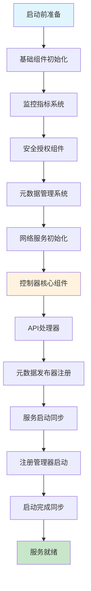

# Kafka控制器服务器启动流程详解

## 概述

本文档详细分析Kafka KRaft模式下控制器服务器（ControllerServer）的启动流程。控制器是Kafka集群的核心组件，负责管理集群元数据、分区领导者选举、配置管理等关键功能。

## 启动流程架构图



## 详细启动流程

### 1. 启动前准备阶段

#### 1.1 状态管理和超时控制

```scala
if (!maybeChangeStatus(SHUTDOWN, STARTING)) return
val startupDeadline = Deadline.fromDelay(time, config.serverMaxStartupTimeMs, TimeUnit.MILLISECONDS)
```

**关键功能：**
- **状态检查**：确保当前状态为`SHUTDOWN`，防止重复启动
- **状态切换**：将状态从`SHUTDOWN`切换到`STARTING`
- **超时保护**：设置启动超时时间，防止启动过程无限期阻塞
- **并发安全**：使用锁机制确保状态变更的线程安全

**设计意义：**
- 提供启动过程的可观测性
- 防止启动过程中的竞态条件
- 确保启动失败时能够及时响应

### 2. 基础组件初始化

#### 2.1 日志和配置系统

```scala
this.logIdent = logContext.logPrefix()
info("Starting controller")
config.dynamicConfig.initialize(clientMetricsReceiverPluginOpt = None)
maybeChangeStatus(STARTING, STARTED)
```

**组件功能：**
- **日志标识符**：设置唯一的日志前缀，便于日志追踪和问题定位
- **动态配置**：初始化支持运行时变更的配置系统
- **状态更新**：将状态从`STARTING`更新为`STARTED`

**技术细节：**
- 日志标识符包含控制器ID，便于多控制器环境下的日志区分
- 动态配置系统支持无需重启即可变更配置
- 状态变更会通知等待的线程

### 3. 监控指标系统初始化

#### 3.1 集群级指标

```scala
metricsGroup.newGauge("ClusterId", () => clusterId)
metricsGroup.newGauge("yammer-metrics-count", () => KafkaYammerMetrics.defaultRegistry.allMetrics.size)
```

#### 3.2 系统级指标

```scala
linuxIoMetricsCollector = new LinuxIoMetricsCollector("/proc", time)
if (linuxIoMetricsCollector.usable()) {
    metricsGroup.newGauge("linux-disk-read-bytes", () => linuxIoMetricsCollector.readBytes())
    metricsGroup.newGauge("linux-disk-write-bytes", () => linuxIoMetricsCollector.writeBytes())
}
```

**监控维度：**
- **集群标识**：监控集群ID，确保控制器属于正确的集群
- **指标数量**：监控注册的指标总数，用于性能分析
- **磁盘I/O**：在Linux系统上收集磁盘读写指标
- **系统兼容性**：自动检测系统能力，优雅降级

### 4. 安全和授权组件初始化

#### 4.1 授权插件

```scala
authorizerPlugin = config.createNewAuthorizer(metrics, ProcessRole.ControllerRole.toString)
```

#### 4.2 认证组件

```scala
tokenCache = new DelegationTokenCache(ScramMechanism.mechanismNames)
credentialProvider = new CredentialProvider(ScramMechanism.mechanismNames, tokenCache)
```

**安全机制：**
- **授权插件**：支持可插拔的授权机制（如StandardAuthorizer）
- **委托令牌**：支持委托令牌认证，提高安全性
- **SCRAM认证**：支持SCRAM-SHA-256/512认证机制
- **凭证管理**：统一管理各种认证凭证

**设计原则：**
- 安全优先：在网络服务启动前初始化安全组件
- 可扩展性：支持自定义授权和认证插件
- 性能考虑：使用缓存机制提高认证性能

### 5. 元数据管理系统初始化

#### 5.1 元数据缓存

```scala
metadataCache = new KRaftMetadataCache(config.nodeId, () => raftManager.client.kraftVersion())
```

#### 5.2 发布器组件

```scala
metadataCachePublisher = new KRaftMetadataCachePublisher(metadataCache)
featuresPublisher = new FeaturesPublisher(logContext)
registrationsPublisher = new ControllerRegistrationsPublisher()
incarnationId = Uuid.randomUuid()
```

**核心概念：**
- **KRaft元数据缓存**：存储集群状态信息，支持快速查询
- **发布器模式**：解耦元数据生产者和消费者
- **特性管理**：管理集群支持的特性版本
- **注册管理**：处理控制器和broker的注册信息
- **实例化ID**：唯一标识控制器实例，用于故障检测

### 6. 网络服务初始化

#### 6.1 API版本管理

```scala
val apiVersionManager = new SimpleApiVersionManager(
    ListenerType.CONTROLLER,
    config.unstableApiVersionsEnabled,
    () => featuresPublisher.features().setFinalizedLevel(
        KRaftVersion.FEATURE_NAME,
        raftManager.client.kraftVersion().featureLevel())
)
```

#### 6.2 Socket服务器

```scala
socketServer = new SocketServer(config,
    metrics,
    time,
    credentialProvider,
    apiVersionManager,
    sharedServer.socketFactory)
```

#### 6.3 监听器配置

```scala
val listenerInfo = ListenerInfo
    .create(config.effectiveAdvertisedControllerListeners.asJava)
    .withWildcardHostnamesResolved()
    .withEphemeralPortsCorrected(name => socketServer.boundPort(new ListenerName(name)))
```

**网络架构：**
- **API版本协商**：支持客户端和服务器之间的版本协商
- **多监听器**：支持多个网络接口和协议
- **动态端口**：支持临时端口分配和端口发现
- **主机名解析**：自动解析通配符主机名

### 7. 控制器核心组件构建

这是整个启动流程中最复杂和最关键的部分：

#### 7.1 仲裁特性配置

```scala
val voterConnections = FutureUtils.waitWithLogging(logger.underlying, logIdent,
    "controller quorum voters future",
    sharedServer.controllerQuorumVotersFuture,
    startupDeadline, time)
val controllerNodes = QuorumConfig.voterConnectionsToNodes(voterConnections)
val quorumFeatures = new QuorumFeatures(config.nodeId,
    QuorumFeatures.defaultSupportedFeatureMap(config.unstableFeatureVersionsEnabled),
    controllerNodes.asScala.map(node => Integer.valueOf(node.id())).asJava)
```

#### 7.2 委托令牌配置

```scala
val delegationTokenManagerConfigs = new DelegationTokenManagerConfigs(config)
val delegationTokenKeyString = {
    if (delegationTokenManagerConfigs.tokenAuthEnabled) {
        delegationTokenManagerConfigs.delegationTokenSecretKey.value
    } else {
        null
    }
}
```

#### 7.3 控制器构建器配置

```scala
val controllerBuilder = {
    val leaderImbalanceCheckIntervalNs = if (config.autoLeaderRebalanceEnable) {
        OptionalLong.of(TimeUnit.NANOSECONDS.convert(config.leaderImbalanceCheckIntervalSeconds, TimeUnit.SECONDS))
    } else {
        OptionalLong.empty()
    }
    
    val maxIdleIntervalNs = config.metadataMaxIdleIntervalNs.fold(OptionalLong.empty)(OptionalLong.of)
    
    // 创建仲裁控制器指标
    quorumControllerMetrics = new QuorumControllerMetrics(Optional.of(KafkaYammerMetrics.defaultRegistry), time, config.brokerSessionTimeoutMs)

    new QuorumController.Builder(config.nodeId, sharedServer.clusterId). // 创建仲裁控制器构建器
      setTime(time). // 设置时间
      setThreadNamePrefix(s"quorum-controller-${config.nodeId}-"). // 设置线程名前缀
      setConfigSchema(configSchema). // 设置配置模式
      setRaftClient(raftManager.client). // 设置Raft客户端
      setQuorumFeatures(quorumFeatures). // 设置仲裁特性
      setDefaultReplicationFactor(config.defaultReplicationFactor.toShort). // 设置默认复制因子
      setDefaultNumPartitions(config.numPartitions.intValue()). // 设置默认分区数
      setSessionTimeoutNs(TimeUnit.NANOSECONDS.convert(config.brokerSessionTimeoutMs.longValue(), // 设置会话超时时间
        TimeUnit.MILLISECONDS)).
      setLeaderImbalanceCheckIntervalNs(leaderImbalanceCheckIntervalNs). // 设置领导者不平衡检查间隔
      setMaxIdleIntervalNs(maxIdleIntervalNs). // 设置最大空闲间隔
      setMetrics(quorumControllerMetrics). // 设置指标
      setCreateTopicPolicy(createTopicPolicy.toJava). // 设置创建主题策略
      setAlterConfigPolicy(alterConfigPolicy.toJava). // 设置修改配置策略
      setConfigurationValidator(new ControllerConfigurationValidator(sharedServer.brokerConfig)). // 设置配置验证器
      setStaticConfig(config.originals). // 设置静态配置
      setBootstrapMetadata(bootstrapMetadata). // 设置引导元数据
      setFatalFaultHandler(sharedServer.fatalQuorumControllerFaultHandler). // 设置致命故障处理器
      setNonFatalFaultHandler(sharedServer.nonFatalQuorumControllerFaultHandler). // 设置非致命故障处理器
      setDelegationTokenCache(tokenCache). // 设置委托令牌缓存
      setDelegationTokenSecretKey(delegationTokenKeyString). // 设置委托令牌密钥
      setDelegationTokenMaxLifeMs(delegationTokenManagerConfigs.delegationTokenMaxLifeMs). // 设置委托令牌最大生命周期
      setDelegationTokenExpiryTimeMs(delegationTokenManagerConfigs.delegationTokenExpiryTimeMs). // 设置委托令牌过期时间
      setDelegationTokenExpiryCheckIntervalMs(delegationTokenManagerConfigs.delegationTokenExpiryCheckIntervalMs). // 设置委托令牌过期检查间隔
      setUncleanLeaderElectionCheckIntervalMs(config.uncleanLeaderElectionCheckIntervalMs). // 设置不洁领导者选举检查间隔
      setInterBrokerListenerName(config.interBrokerListenerName.value()). // 设置代理间监听器名称
      setControllerPerformanceSamplePeriodMs(config.controllerPerformanceSamplePeriodMs). // 设置控制器性能采样周期
      setControllerPerformanceAlwaysLogThresholdMs(config.controllerPerformanceAlwaysLogThresholdMs) // 设置控制器性能总是记录阈值
  }
controller = controllerBuilder.build()
```

**控制器职责：**
- **元数据管理**：管理主题、分区、副本等集群元数据
- **领导者选举**：处理分区领导者选举和故障转移
- **配置管理**：处理动态配置变更
- **权限控制**：集成ACL管理
- **性能监控**：收集和报告性能指标
- **故障处理**：处理各种故障场景

#### 7.4 授权器集成

```scala
authorizerPlugin.foreach { plugin =>
    plugin.get match {
        case a: ClusterMetadataAuthorizer => a.setAclMutator(controller)
        case _ =>
    }
}
```

**集成机制：**
- 如果使用ClusterMetadataAuthorizer，将控制器设置为ACL变更器
- 支持通过控制器进行ACL的添加和删除操作
- 确保ACL变更通过Raft日志进行复制

### 8. API处理器初始化

#### 8.1 配额管理器

```scala
quotaManagers = QuotaFactory.instantiate(config,
    metrics,
    time,
    s"controller-${config.nodeId}-", ProcessRole.ControllerRole.toString)
clientQuotaMetadataManager = new ClientQuotaMetadataManager(quotaManagers, socketServer.connectionQuotas)
```

#### 8.2 API处理器和线程池

```scala
controllerApis = new ControllerApis(socketServer.dataPlaneRequestChannel,
    authorizerPlugin,
    quotaManagers,
    time,
    controller,
    raftManager,
    config,
    clusterId,
    registrationsPublisher,
    apiVersionManager,
    metadataCache)
    
controllerApisHandlerPool = new KafkaRequestHandlerPool(config.nodeId,
    socketServer.dataPlaneRequestChannel,
    controllerApis,
    time,
    config.numIoThreads,
    "RequestHandlerAvgIdlePercent",
    "controller")
```

**处理架构：**
- **请求路由**：将不同类型的请求路由到相应的处理器
- **配额控制**：实施客户端请求配额限制
- **线程池管理**：使用多线程处理并发请求
- **性能监控**：监控请求处理性能和线程池状态

### 9. 元数据发布器注册

这个阶段注册了多个元数据发布器，每个都有特定的职责：

```scala
// 设置元数据缓存发布器
metadataPublishers.add(metadataCachePublisher)

// 设置元数据特性发布器
metadataPublishers.add(featuresPublisher)

// 设置控制器注册发布器
metadataPublishers.add(registrationsPublisher)

// 创建注册管理器，处理KIP-919控制器注册
registrationManager = new ControllerRegistrationManager(config.nodeId,
    clusterId,
    time,
    s"controller-${config.nodeId}-",
    QuorumFeatures.defaultSupportedFeatureMap(config.unstableFeatureVersionsEnabled),
    incarnationId,
    listenerInfo)

// 将注册管理器添加到元数据发布器列表
metadataPublishers.add(registrationManager)

// 设置动态配置发布器
metadataPublishers.add(new DynamicConfigPublisher(
    config,
    sharedServer.metadataPublishingFaultHandler,
    immutable.Map[ConfigType, ConfigHandler](
        ConfigType.BROKER -> new BrokerConfigHandler(config, quotaManagers)
    ),
    "controller"))
```

**发布器类型：**
- **元数据缓存发布器**：同步元数据到本地缓存
- **特性发布器**：管理集群特性版本信息
- **注册发布器**：处理控制器和broker注册
- **配置发布器**：处理动态配置变更
- **配额发布器**：管理客户端配额设置
- **SCRAM发布器**：管理SCRAM认证信息
- **委托令牌发布器**：管理委托令牌
- **ACL发布器**：管理访问控制列表

### 10. 服务启动和同步

#### 10.1 发布器安装

```scala
FutureUtils.waitWithLogging(logger.underlying, logIdent,
    "the controller metadata publishers to be installed",
    sharedServer.loader.installPublishers(metadataPublishers), startupDeadline, time)
```

#### 10.2 网络服务启动

```scala
val authorizerFutures: Map[Endpoint, CompletableFuture[Void]] = endpointReadyFutures.futures().asScala.toMap
val socketServerFuture = socketServer.enableRequestProcessing(authorizerFutures)
```

**同步机制：**
- **批量安装**：一次性安装所有元数据发布器
- **超时控制**：使用启动超时时间防止无限等待
- **授权就绪**：等待授权器在各个端点上就绪
- **请求处理**：启用网络请求处理

### 11. 注册管理器启动

#### 11.1 KIP-919控制器注册

```scala
val controllerNodeProvider = RaftControllerNodeProvider(raftManager, config)
registrationChannelManager = new NodeToControllerChannelManagerImpl(
    controllerNodeProvider,
    time,
    metrics,
    config,
    "registration",
    s"controller-${config.nodeId}-",
    5000)
registrationChannelManager.start()
registrationManager.start(registrationChannelManager)
```

**注册机制：**
- **节点发现**：通过Raft管理器发现其他控制器节点
- **通道管理**：管理与其他控制器的通信通道
- **注册协议**：实现KIP-919控制器注册协议
- **故障检测**：监控控制器节点的健康状态

### 12. 启动完成同步

#### 12.1 等待组件就绪

```scala
// 等待所有授权器Future完成
FutureUtils.waitWithLogging(logger.underlying, logIdent,
    "all of the authorizer futures to be completed",
    CompletableFuture.allOf(authorizerFutures.values.toSeq: _*), startupDeadline, time)

// 等待所有SocketServer端口打开和接受器启动
FutureUtils.waitWithLogging(logger.underlying, logIdent,
    "all of the SocketServer Acceptors to be started",
    socketServerFuture, startupDeadline, time)
```

**最终同步：**
- **授权器就绪**：确保所有端点的授权器都已就绪
- **网络就绪**：确保所有网络端口都已绑定并开始接受连接
- **超时保护**：使用统一的超时时间防止启动卡死
- **日志记录**：详细记录等待过程，便于问题诊断

### 13. 异常处理和资源清理

```scala
} catch {
    case e: Throwable =>
        maybeChangeStatus(STARTING, STARTED)
        sharedServer.controllerStartupFaultHandler.handleFault("caught exception", e)
        shutdown()
        throw e
}
```

**故障处理策略：**
- **状态恢复**：确保状态一致性
- **故障上报**：通过故障处理器记录和处理异常
- **资源清理**：调用shutdown方法清理已初始化的资源
- **异常传播**：重新抛出异常，让上层调用者知道启动失败

## 启动流程的关键特点

### 1. 有序初始化
- 严格按照依赖关系初始化组件
- 确保被依赖的组件先于依赖它的组件初始化
- 避免循环依赖和初始化死锁

### 2. 异步协调
- 使用Future机制协调异步操作
- 支持并发初始化不相关的组件
- 提供超时保护机制

### 3. 故障恢复
- 完善的异常处理和资源清理
- 启动失败时能够安全地清理已初始化的资源
- 提供详细的错误信息和日志

### 4. 监控集成
- 全面的指标收集和监控
- 从启动阶段就开始收集性能数据
- 支持运维监控和问题诊断

### 5. 安全优先
- 早期初始化安全组件
- 在网络服务启动前完成安全配置
- 支持多种认证和授权机制

### 6. 发布器模式
- 使用发布器模式解耦组件间通信
- 支持元数据变更的异步通知
- 便于扩展和维护

## 总结

Kafka控制器服务器的启动流程是一个复杂而精心设计的过程，它确保了：

1. **系统稳定性**：通过有序初始化和完善的错误处理确保系统稳定启动
2. **高可用性**：通过Raft协议和故障检测机制提供高可用性
3. **安全性**：通过多层安全机制保护集群安全
4. **可观测性**：通过全面的监控和日志提供良好的可观测性
5. **可扩展性**：通过插件机制和发布器模式提供良好的可扩展性

这个启动流程为Kafka集群提供了一个强大、可靠的控制平面，是整个Kafka生态系统的基石。
