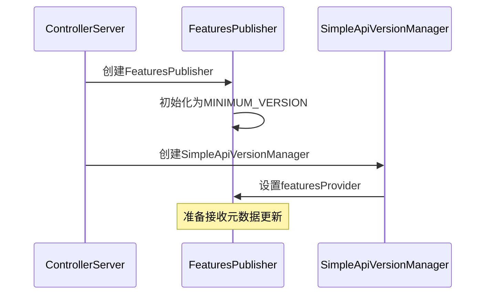
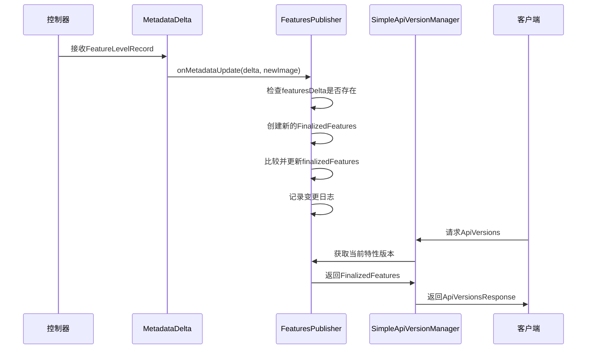

# Kafka FeaturesPublisher 深度解析

## 概述

FeaturesPublisher是Kafka KRaft架构中的一个关键组件，负责管理和发布集群的特性版本信息。它实现了MetadataPublisher接口，当集群的特性版本发生变化时，会及时更新并通知相关组件。

## 核心功能

### 1. 特性版本管理
FeaturesPublisher的主要职责是维护集群当前确定的特性版本（FinalizedFeatures），这些特性版本决定了集群支持哪些功能和协议版本。

### 2. 元数据同步
作为MetadataPublisher的实现，它会接收元数据变更通知，并在特性版本发生变化时更新本地状态。

## 类结构分析

<augment_code_snippet path="metadata/src/main/java/org/apache/kafka/metadata/publisher/FeaturesPublisher.java" mode="EXCERPT">
```java
public class FeaturesPublisher implements MetadataPublisher {
    private final Logger log;
    private volatile FinalizedFeatures finalizedFeatures = FinalizedFeatures.fromKRaftVersion(MINIMUM_VERSION);

    public FeaturesPublisher(LogContext logContext) {
        log = logContext.logger(FeaturesPublisher.class);
    }

    public FinalizedFeatures features() {
        return finalizedFeatures;
    }

    @Override
    public void onMetadataUpdate(MetadataDelta delta, MetadataImage newImage, LoaderManifest manifest) {
        if (delta.featuresDelta() != null) {
            FinalizedFeatures newFinalizedFeatures = new FinalizedFeatures(
                newImage.features().metadataVersionOrThrow(),
                newImage.features().finalizedVersions(),
                newImage.provenance().lastContainedOffset()
            );
            if (!newFinalizedFeatures.equals(finalizedFeatures)) {
                log.info("Loaded new metadata {}.", newFinalizedFeatures);
                finalizedFeatures = newFinalizedFeatures;
            }
        }
    }
}
```
</augment_code_snippet>

### 关键字段解析

#### 1. finalizedFeatures
- **类型**：`volatile FinalizedFeatures`
- **作用**：存储当前集群确定的特性版本
- **线程安全**：使用volatile确保多线程可见性
- **初始值**：从最小KRaft版本初始化

#### 2. log
- **类型**：`Logger`
- **作用**：记录特性版本变更日志
- **重要性**：便于运维人员跟踪特性版本的变化

## FinalizedFeatures 详解

<augment_code_snippet path="server-common/src/main/java/org/apache/kafka/server/common/FinalizedFeatures.java" mode="EXCERPT">
```java
public record FinalizedFeatures(
    MetadataVersion metadataVersion,
    Map<String, Short> finalizedFeatures,
    long finalizedFeaturesEpoch
) {
    public static FinalizedFeatures fromKRaftVersion(MetadataVersion version) {
        return new FinalizedFeatures(version, Map.of(), -1);
    }

    public FinalizedFeatures setFinalizedLevel(String key, short level) {
        if (level == (short) 0) {
            // 移除特性
            Map<String, Short> newFinalizedFeatures = new HashMap<>(finalizedFeatures);
            newFinalizedFeatures.remove(key);
            return new FinalizedFeatures(metadataVersion, newFinalizedFeatures, finalizedFeaturesEpoch);
        } else {
            // 设置特性版本
            Map<String, Short> newFinalizedFeatures = new HashMap<>(finalizedFeatures);
            newFinalizedFeatures.put(key, level);
            return new FinalizedFeatures(metadataVersion, newFinalizedFeatures, finalizedFeaturesEpoch);
        }
    }
}
```
</augment_code_snippet>

### FinalizedFeatures组成

1. **metadataVersion**：元数据格式版本
2. **finalizedFeatures**：各种特性的确定版本
3. **finalizedFeaturesEpoch**：特性版本的纪元，用于版本控制

### 支持的特性类型

| 特性名称 | 描述 | 版本范围 |
|----------|------|----------|
| metadata.version | 元数据格式版本 | 1-19+ |
| kraft.version | KRaft协议版本 | 0-1 |
| eligible.leader.replicas | ELR特性版本 | 0-1 |
| group.version | 消费者组协调器版本 | 0-1 |
| transaction.version | 事务协调器版本 | 0-2 |
| share.version | 共享消费特性版本 | 0-1 |

## 工作流程

### 1. 初始化流程



### 2. 特性版本更新流程



### 3. 与其他组件的交互

#### 与SimpleApiVersionManager的集成

<augment_code_snippet path="core/src/main/scala/kafka/server/ControllerServer.scala" mode="EXCERPT">
```scala
val apiVersionManager = new SimpleApiVersionManager(
  ListenerType.CONTROLLER,
  config.unstableApiVersionsEnabled,
  () => featuresPublisher.features().setFinalizedLevel(
    KRaftVersion.FEATURE_NAME,
    raftManager.client.kraftVersion().featureLevel())
)
```
</augment_code_snippet>

**关键点：**
- FeaturesPublisher作为特性提供者传递给SimpleApiVersionManager
- 动态设置KRaft版本特性级别
- 支持API版本协商

#### 与BrokerMetadataPublisher的协作

<augment_code_snippet path="core/src/main/scala/kafka/server/metadata/BrokerMetadataPublisher.scala" mode="EXCERPT">
```scala
if (delta.featuresDelta != null) {
  val newFinalizedFeatures = new FinalizedFeatures(
    newImage.features.metadataVersionOrThrow, 
    newImage.features.finalizedVersions, 
    newImage.provenance.lastContainedOffset)
  val newFinalizedShareVersion = newFinalizedFeatures.finalizedFeatures()
    .getOrDefault(ShareVersion.FEATURE_NAME, 0.toShort)
  
  if (newFinalizedShareVersion != finalizedShareVersion) {
    finalizedShareVersion = newFinalizedShareVersion
    val shareVersion: ShareVersion = ShareVersion.fromFeatureLevel(finalizedShareVersion)
    sharePartitionManager.onShareVersionToggle(shareVersion, config.shareGroupConfig.isShareGroupEnabled)
  }
}
```
</augment_code_snippet>

**协作机制：**
- 两个发布器都监听相同的特性变更
- 各自处理关心的特性版本
- 确保特性变更的一致性传播

## 实际应用场景

### 1. 集群升级场景

```java
// 场景：升级metadata.version从18到19
public void upgradeMetadataVersion() {
    // 1. 控制器接收升级请求
    FeatureLevelRecord record = new FeatureLevelRecord()
        .setName("metadata.version")
        .setFeatureLevel((short) 19);
    
    // 2. 记录被提交到Raft日志
    raftClient.scheduleAppend(record);
    
    // 3. FeaturesPublisher接收更新
    // onMetadataUpdate会被调用，更新finalizedFeatures
    
    // 4. 客户端获取新的特性版本
    ApiVersionsResponse response = apiVersionManager.apiVersionResponse(0, false);
    // response包含新的metadata.version=19
}
```

### 2. 特性兼容性检查

```java
// 检查是否支持ELR特性
public boolean isElrEnabled() {
    FinalizedFeatures features = featuresPublisher.features();
    Short elrVersion = features.finalizedFeatures().get("eligible.leader.replicas");
    return elrVersion != null && elrVersion > 0;
}

// 检查元数据版本兼容性
public boolean isMetadataVersionCompatible(MetadataVersion requiredVersion) {
    FinalizedFeatures features = featuresPublisher.features();
    return features.metadataVersion().isAtLeast(requiredVersion);
}
```

### 3. API版本协商

```java
// 客户端请求API版本信息
public ApiVersionsResponse handleApiVersionsRequest(ApiVersionsRequest request) {
    // SimpleApiVersionManager使用FeaturesPublisher提供的特性信息
    FinalizedFeatures currentFeatures = featuresPublisher.features();
    
    return new ApiVersionsResponse.Builder()
        .setApiVersions(supportedApiVersions)
        .setFinalizedFeatures(currentFeatures.finalizedFeatures())
        .setFinalizedFeaturesEpoch(currentFeatures.finalizedFeaturesEpoch())
        .build();
}
```

## 监控和调试

### 1. 关键日志

```java
// FeaturesPublisher的关键日志
log.info("Loaded new metadata {}.", newFinalizedFeatures);

// 典型日志输出
// [2024-01-15 10:30:45,123] INFO Loaded new metadata FinalizedFeatures{
//   metadataVersion=19, 
//   finalizedFeatures={metadata.version=19, kraft.version=1}, 
//   finalizedFeaturesEpoch=12345
// }
```

### 2. 监控指标

```java
// 监控特性版本变更
public class FeaturesMetrics {
    private final Metrics metrics;
    
    public void recordFeatureUpdate(String featureName, short oldVersion, short newVersion) {
        metrics.addMetric("feature.version.change", 
                         Map.of("feature", featureName, 
                               "old_version", oldVersion, 
                               "new_version", newVersion));
    }
    
    public void recordFeatureEpoch(long epoch) {
        metrics.addMetric("feature.epoch", epoch);
    }
}
```

### 3. 调试工具

```java
// 特性版本诊断工具
public class FeaturesDiagnostic {
    public static void dumpFeatures(FeaturesPublisher publisher) {
        FinalizedFeatures features = publisher.features();
        
        System.out.println("=== 当前特性版本 ===");
        System.out.println("元数据版本: " + features.metadataVersion());
        System.out.println("特性纪元: " + features.finalizedFeaturesEpoch());
        System.out.println("确定的特性:");
        
        features.finalizedFeatures().forEach((name, version) -> {
            System.out.println("  " + name + " = " + version);
        });
    }
    
    public static boolean validateFeatureCompatibility(
            FinalizedFeatures current, 
            FinalizedFeatures required) {
        // 检查特性兼容性
        for (Map.Entry<String, Short> entry : required.finalizedFeatures().entrySet()) {
            String featureName = entry.getKey();
            Short requiredVersion = entry.getValue();
            Short currentVersion = current.finalizedFeatures().get(featureName);
            
            if (currentVersion == null || currentVersion < requiredVersion) {
                System.err.println("特性不兼容: " + featureName + 
                                 " 需要版本 " + requiredVersion + 
                                 " 但当前版本是 " + currentVersion);
                return false;
            }
        }
        return true;
    }
}
```

## 最佳实践

### 1. 特性升级策略

- **渐进式升级**：逐步升级特性版本，避免一次性大幅升级
- **兼容性验证**：升级前验证所有节点的特性支持情况
- **回滚准备**：保留回滚到旧版本的能力

### 2. 监控要点

- **特性版本变更**：监控特性版本的变化
- **兼容性告警**：当检测到不兼容的特性版本时告警
- **升级进度**：跟踪集群升级的进度

### 3. 故障排查

- **版本不一致**：检查不同节点的特性版本是否一致
- **升级失败**：分析特性升级失败的原因
- **兼容性问题**：诊断客户端和服务器的特性兼容性

## 总结

FeaturesPublisher是Kafka KRaft架构中特性版本管理的核心组件，它：

1. **统一管理**：集中管理集群的特性版本信息
2. **实时更新**：及时响应特性版本的变更
3. **线程安全**：通过volatile确保多线程访问的安全性
4. **集成友好**：与API版本管理器等组件无缝集成
5. **可观测性**：提供详细的日志和监控支持

理解FeaturesPublisher的工作原理对于：
- **集群升级**：安全地进行特性版本升级
- **兼容性管理**：确保客户端和服务器的兼容性
- **故障排查**：快速定位特性相关的问题
- **系统监控**：监控集群的特性版本状态

具有重要意义。
