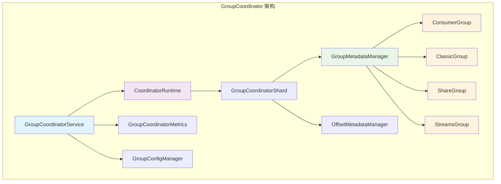
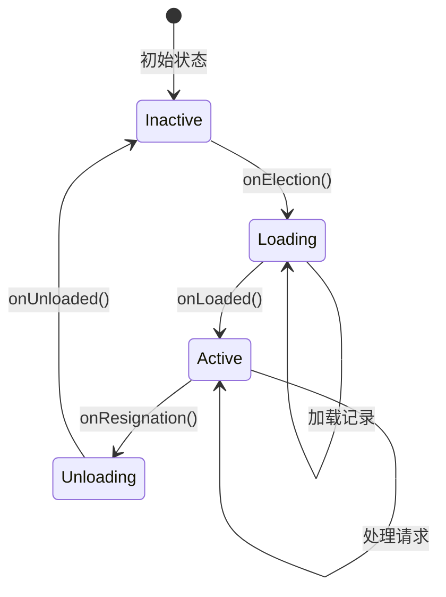
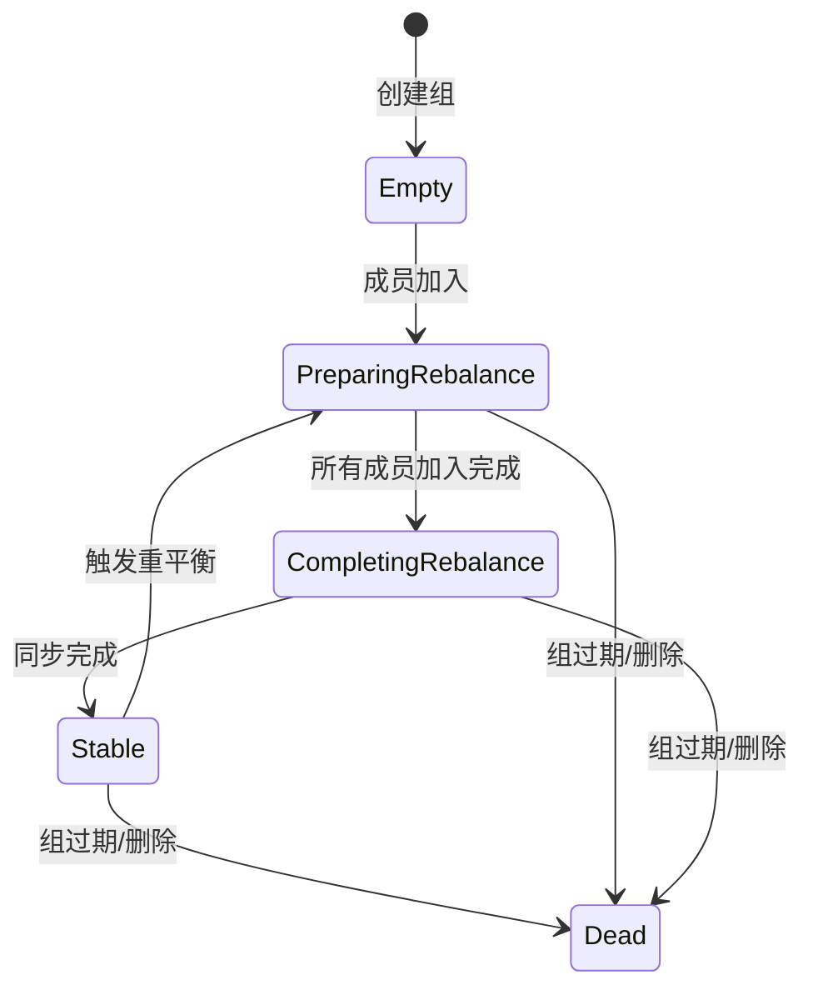
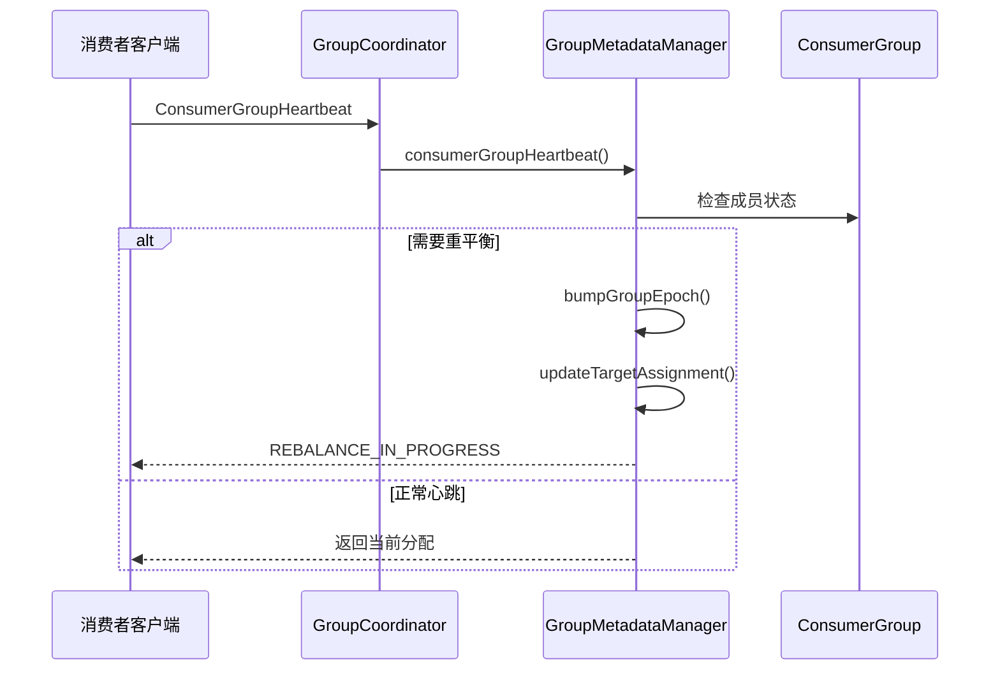
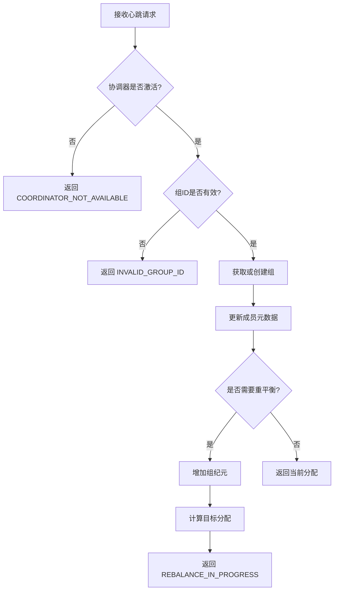
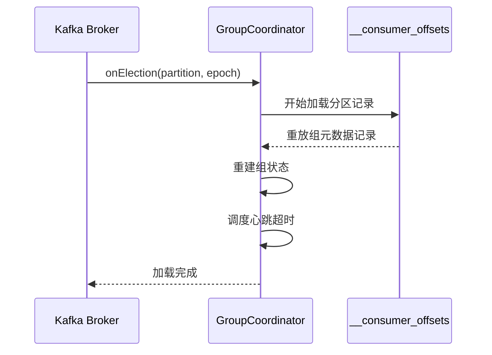

# Kafka GroupCoordinator 深度解析

## 概述

GroupCoordinator 是 Kafka 中负责管理消费者组和共享组的核心组件，它处理组成员的加入、离开、重平衡以及偏移量提交等关键操作。本文将深入分析 GroupCoordinator 的架构设计、运行时状态管理以及核心工作机制。

## 架构设计

### 核心组件层次结构



### 主要接口和实现

**源码位置：** `group-coordinator/src/main/java/org/apache/kafka/coordinator/group/GroupCoordinator.java:73-512`

````java
/**
 * Group Coordinator's internal API.
 */
public interface GroupCoordinator {

    /**
     * 消费者组心跳处理
     * @param context  请求上下文，包含认证和授权信息
     * @param request  心跳请求数据
     * @return 异步响应Future
     */
    CompletableFuture<ConsumerGroupHeartbeatResponseData> consumerGroupHeartbeat(
        AuthorizableRequestContext context,
        ConsumerGroupHeartbeatRequestData request
    );

    /**
     * 分区领导权选举回调
     * @param groupMetadataPartitionIndex      分区索引
     * @param groupMetadataPartitionLeaderEpoch 领导者纪元
     */
    void onElection(int groupMetadataPartitionIndex, int groupMetadataPartitionLeaderEpoch);

    /**
     * 分区领导权辞任回调
     */
    void onResignation(int groupMetadataPartitionIndex, OptionalInt groupMetadataPartitionLeaderEpoch);

    /**
     * 启动协调器服务
     */
    void startup(IntSupplier groupMetadataTopicPartitionCount);

    /**
     * 关闭协调器服务
     */
    void shutdown();
}
````

**接口设计特点：**
- **异步处理**：心跳等核心操作返回 `CompletableFuture`，支持非阻塞处理
- **生命周期管理**：提供完整的启动、选举、辞任、关闭生命周期回调
- **分区感知**：基于分区的领导权管理，支持分布式部署
- **上下文传递**：通过 `AuthorizableRequestContext` 传递请求上下文信息

## 运行时状态管理

### GroupCoordinatorService 状态管理

**源码位置：** `group-coordinator/src/main/java/org/apache/kafka/coordinator/group/GroupCoordinatorService.java:150-2232`

````java
public class GroupCoordinatorService implements GroupCoordinator {

    // 1. 核心状态字段
    private final AtomicBoolean isActive = new AtomicBoolean(false);  // 协调器激活状态
    private volatile int numPartitions = -1;                          // __consumer_offsets 分区数
    private MetadataImage metadataImage = null;                       // 元数据镜像
    private final Set<String> consumerGroupAssignors;                 // 支持的分配器集合

    // 2. 核心组件依赖
    private final CoordinatorRuntime<GroupCoordinatorShard, CoordinatorRecord> runtime;
    private final GroupCoordinatorMetrics groupCoordinatorMetrics;
    private final GroupConfigManager groupConfigManager;
    private final Timer timer;
````

**状态管理详解：**

**第一阶段：启动流程**
```java
public void startup(IntSupplier groupMetadataTopicPartitionCount) {
    // 原子性状态切换，确保只启动一次
    if (!isActive.compareAndSet(false, true)) {
        log.warn("Group coordinator is already running.");
        return;
    }

    log.info("Starting up.");
    numPartitions = groupMetadataTopicPartitionCount.getAsInt();  // 获取分区数
    isActive.set(true);                                           // 设置激活状态
    log.info("Startup complete.");
}
```

**第二阶段：关闭流程**
```java
public void shutdown() {
    // 原子性状态切换，确保只关闭一次
    if (!isActive.compareAndSet(true, false)) {
        log.warn("Group coordinator is already shutting down.");
        return;
    }

    log.info("Shutting down.");
    isActive.set(false);                                          // 设置非激活状态
    Utils.closeQuietly(runtime, "coordinator runtime");          // 关闭运行时
    Utils.closeQuietly(groupCoordinatorMetrics, "group coordinator metrics");
    Utils.closeQuietly(groupConfigManager, "group config manager");
    log.info("Shutdown complete.");
}
```

**状态管理特点：**
- **原子性操作**：使用 `AtomicBoolean.compareAndSet()` 确保状态切换的原子性
- **幂等性**：重复启动或关闭操作是安全的，不会产生副作用
- **资源管理**：关闭时按顺序清理所有相关资源
- **日志记录**：完整的生命周期日志，便于运维监控

### 分区状态管理

GroupCoordinator 通过分区领导权管理来处理不同的组：



### 组状态机

不同类型的组有各自的状态管理：

#### 消费者组状态机

**源码位置：** `group-coordinator/src/main/java/org/apache/kafka/coordinator/group/modern/consumer/ConsumerGroup.java:82-106`

````java
public enum ConsumerGroupState {
    EMPTY("Empty"),                    // 空组：没有活跃成员
    ASSIGNING("Assigning"),           // 分配中：正在计算分区分配
    RECONCILING("Reconciling"),       // 协调中：成员正在同步分配结果
    STABLE("Stable"),                 // 稳定状态：所有成员已同步完成
    DEAD("Dead");                     // 已死亡：组已被删除或过期

    private final String name;
    private final String lowerCaseName;

    ConsumerGroupState(String name) {
        this.name = name;
        this.lowerCaseName = name.toLowerCase(Locale.ROOT);
    }

    @Override
    public String toString() {
        return name;
    }

    public String toLowerCaseString() {
        return lowerCaseName;
    }
}
````

**状态转换逻辑：**
- **EMPTY → ASSIGNING**：第一个成员加入时触发
- **ASSIGNING → RECONCILING**：分区分配计算完成后
- **RECONCILING → STABLE**：所有成员完成分区同步后
- **STABLE → ASSIGNING**：成员变更或订阅变更触发重平衡
- **任意状态 → DEAD**：组过期或被显式删除

#### 经典组状态转换



## 核心工作机制

### 1. 心跳处理机制

**源码位置：** `group-coordinator/src/main/java/org/apache/kafka/coordinator/group/GroupCoordinatorShard.java:451-465`

````java
/**
 * 处理消费者组心跳请求
 * @param context 请求上下文，包含认证和授权信息
 * @param request 心跳请求数据
 * @return 包含响应数据和状态变更记录的结果
 */
public CoordinatorResult<ConsumerGroupHeartbeatResponseData, CoordinatorRecord> consumerGroupHeartbeat(
    AuthorizableRequestContext context,
    ConsumerGroupHeartbeatRequestData request
) {
    // 委托给组元数据管理器处理具体的心跳逻辑
    return groupMetadataManager.consumerGroupHeartbeat(context, request);
}
````

**心跳处理架构：**

**第一层：GroupCoordinatorService 请求验证**
```java
// 检查协调器是否激活
if (!isActive.get()) {
    return CompletableFuture.completedFuture(
        new ConsumerGroupHeartbeatResponseData()
            .setErrorCode(Errors.COORDINATOR_NOT_AVAILABLE.code())
    );
}

// 验证组ID有效性
if (!isGroupIdNotEmpty(request.groupId())) {
    return CompletableFuture.completedFuture(
        new ConsumerGroupHeartbeatResponseData()
            .setErrorCode(Errors.INVALID_GROUP_ID.code())
    );
}
```

**第二层：GroupCoordinatorShard 分片处理**
```java
// 路由到正确的分片进行处理
return runtime.scheduleWriteOperation(
    "consumer-group-heartbeat",
    topicPartitionFor(request.groupId()),           // 计算分区
    Duration.ofMillis(config.offsetCommitTimeoutMs()),
    coordinator -> coordinator.consumerGroupHeartbeat(context, request)
);
```

**第三层：GroupMetadataManager 业务逻辑**
```java
// 实际的心跳处理逻辑在 GroupMetadataManager 中实现
// 包括成员管理、重平衡触发、分区分配等核心逻辑
```

### 2. 组元数据管理架构

**源码位置：** `group-coordinator/src/main/java/org/apache/kafka/coordinator/group/GroupMetadataManager.java:269-278`

````java
/**
 * GroupMetadataManager 管理所有经典组和消费者组的元数据
 * 包含硬状态（持久化到日志）和软状态（内存中的运行时状态）
 *
 * 主要职责：
 * 1) 请求处理器：处理请求并生成响应和记录来修改硬状态
 * 2) 重放方法：将记录应用到硬状态，用于请求处理和初始加载
 */
public class GroupMetadataManager {

    // 核心数据结构
    private final TimelineHashMap<String, Group> groups;              // 组ID到组对象的映射
    private final OffsetMetadataManager offsetMetadataManager;        // 偏移量元数据管理器
    private final SnapshotRegistry snapshotRegistry;                  // 快照注册表，支持时间线查询
    private final Timer timer;                                        // 定时器，用于调度过期任务
    private final GroupCoordinatorMetricsShard metrics;               // 指标收集器

    // 元数据管理
    private volatile MetadataImage metadataImage;                     // 集群元数据镜像
    private volatile long lastMetadataImageWithNewTopics = -1L;       // 最后包含新主题的元数据镜像偏移量
}
````

**组管理核心方法：**

**第一阶段：组获取和创建**
```java
/**
 * 获取或创建消费者组
 */
private ConsumerGroup getOrMaybeCreateConsumerGroup(String groupId, boolean createIfNotExists) {
    Group group = groups.get(groupId);

    if (group == null) {
        if (createIfNotExists) {
            // 创建新的消费者组
            ConsumerGroup consumerGroup = new ConsumerGroup(snapshotRegistry, groupId, metrics);
            groups.put(groupId, consumerGroup);
            return consumerGroup;
        } else {
            throw new GroupIdNotFoundException(String.format("Group %s not found.", groupId));
        }
    } else if (group.type() == CONSUMER) {
        return (ConsumerGroup) group;
    } else if (group.type() == CLASSIC && ((ClassicGroup) group).isSimpleGroup()) {
        // 简单经典组可以安全替换为消费者组
        ConsumerGroup consumerGroup = new ConsumerGroup(snapshotRegistry, groupId, metrics);
        groups.put(groupId, consumerGroup);
        return consumerGroup;
    } else {
        throw new GroupIdNotFoundException(String.format("Group %s is not a consumer group.", groupId));
    }
}
```

**第二阶段：组类型管理**
```java
/**
 * 支持的组类型及其特点：
 * - CONSUMER: 现代消费者组，使用新的协议
 * - CLASSIC: 经典消费者组，向后兼容
 * - SHARE: 共享组，支持多消费者共享分区
 * - STREAMS: Kafka Streams 专用组
 */
public enum GroupType {
    CONSUMER("consumer"),
    CLASSIC("classic"),
    SHARE("share"),
    STREAMS("streams");
}
```

### 3. 重平衡处理流程



### 4. 重平衡和分区分配机制

**源码位置：** `group-coordinator/src/main/java/org/apache/kafka/coordinator/group/GroupMetadataManager.java:3321-3330`

````java
/**
 * 重平衡触发逻辑：当订阅元数据发生变化时触发重平衡
 */
if (bumpGroupEpoch) {
    int groupEpoch = group.groupEpoch() + 1;                          // 递增组纪元
    records.add(newConsumerGroupEpochRecord(groupId, groupEpoch, 0)); // 持久化新纪元
    log.info("[GroupId {}] Bumped group epoch to {}.", groupId, groupEpoch);
    metrics.record(CONSUMER_GROUP_REBALANCES_SENSOR_NAME);            // 记录重平衡指标

    // 设置元数据刷新截止时间
    group.setMetadataRefreshDeadline(
        time.milliseconds() + METADATA_REFRESH_INTERVAL_MS,
        groupEpoch
    );
}
````

**重平衡处理详解：**

**第一阶段：触发条件检查**
```java
/**
 * 重平衡触发条件：
 * 1. 成员加入或离开
 * 2. 成员订阅发生变化
 * 3. 分区数量变化
 * 4. 元数据刷新超时
 */
private boolean shouldTriggerRebalance(ConsumerGroup group, ConsumerGroupMember member,
                                     ConsumerGroupMember updatedMember) {
    // 检查成员订阅是否变化
    if (!Objects.equals(member.subscribedTopicNames(), updatedMember.subscribedTopicNames())) {
        return true;
    }

    // 检查成员配置是否变化
    if (!Objects.equals(member.rackId(), updatedMember.rackId())) {
        return true;
    }

    // 检查元数据是否过期
    if (group.hasMetadataExpired(time.milliseconds())) {
        return true;
    }

    return false;
}
```

**第二阶段：分区分配计算**
```java
/**
 * 计算目标分配：使用配置的分配策略计算每个成员的分区分配
 */
private Assignment computeTargetAssignment(ConsumerGroup group, String assignorName) {
    // 1. 收集所有成员的订阅信息
    Map<String, Subscription> memberSubscriptions = group.computeSubscriptionMetadata();

    // 2. 获取可用分区信息
    Map<String, Integer> topicPartitionCounts = metadataImage.topics().topicPartitionCounts();

    // 3. 调用分配器计算分配结果
    ConsumerGroupPartitionAssignor assignor = getAssignor(assignorName);
    GroupAssignment assignment = assignor.assign(
        new GroupSpec(memberSubscriptions, topicPartitionCounts)
    );

    return assignment;
}
```

**第三阶段：分配结果应用**
```java
/**
 * 应用分配结果：更新每个成员的目标分配
 */
private void applyTargetAssignment(ConsumerGroup group, Assignment assignment) {
    assignment.members().forEach((memberId, memberAssignment) -> {
        ConsumerGroupMember member = group.getOrMaybeCreateMember(memberId, false);

        // 更新成员的目标分配
        ConsumerGroupMember updatedMember = new ConsumerGroupMember.Builder(member)
            .setTargetAssignment(memberAssignment)
            .build();

        group.updateMember(updatedMember);
    });
}
```

## 请求处理流程

### 消费者组心跳处理



### 经典组加入处理

```java
// group-coordinator/src/main/java/org/apache/kafka/coordinator/group/GroupMetadataManager.java
public CoordinatorResult<Void, CoordinatorRecord> classicGroupJoin(
    AuthorizableRequestContext context,
    JoinGroupRequestData request,
    CompletableFuture<JoinGroupResponseData> responseFuture
) {
    Group group = groups.get(request.groupId(), Long.MAX_VALUE);
    if (group != null && group.type() == CONSUMER && !group.isEmpty()) {
        // 处理到非空消费者组的加入请求
        return classicGroupJoinToConsumerGroup(context, request, responseFuture);
    }
    // 处理经典组加入逻辑...
}
```

## 性能优化和监控

### 关键指标

GroupCoordinator 提供了丰富的监控指标：

- `consumer-group-rebalances`: 消费者组重平衡次数
- `group-size`: 组大小分布
- `offset-commit-rate`: 偏移量提交速率
- `heartbeat-rate`: 心跳频率

### 配置优化

关键配置参数：

```properties
# 组协调器配置
group.coordinator.rebalance.protocols=consumer,classic
offsets.topic.num.partitions=50
offsets.topic.replication.factor=3
group.initial.rebalance.delay.ms=3000
group.max.session.timeout.ms=1800000
```

## 故障处理和恢复

### 分区领导权转移

当 GroupCoordinator 失去分区领导权时：

```java
// group-coordinator/src/main/java/org/apache/kafka/coordinator/group/GroupCoordinatorShard.java
@Override
public void onUnloaded() {
    timer.cancel(GROUP_EXPIRATION_KEY); // 取消定时器
    coordinatorMetrics.deactivateMetricsShard(metricsShard); // 停用指标
    groupMetadataManager.onUnloaded(); // 清理状态
}
```

### 状态恢复机制



## 最佳实践

### 1. 组大小管理
- 控制消费者组大小，避免过大的组导致重平衡缓慢
- 合理设置 `group.max.session.timeout.ms`

### 2. 重平衡优化
- 使用静态成员身份减少不必要的重平衡
- 配置合适的 `group.initial.rebalance.delay.ms`

### 3. 监控和告警
- 监控重平衡频率和持续时间
- 关注组状态转换异常
- 监控偏移量提交延迟

## 总结

GroupCoordinator 作为 Kafka 的核心组件，通过精心设计的状态机和分层架构，有效管理着消费者组的生命周期。其现代化的设计支持多种组类型，提供了强大的容错能力和性能优化机制。理解其内部工作原理对于优化 Kafka 集群性能和排查相关问题具有重要意义。
