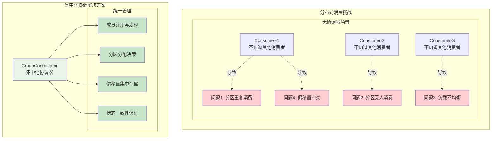
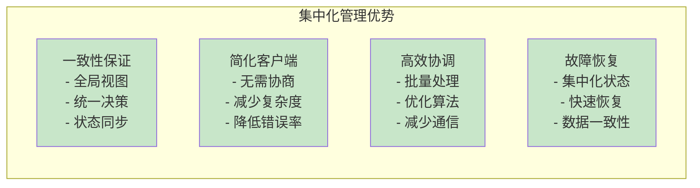

# Kafka GroupCoordinator：消费者组集中化管理的核心设计

## 概述

您的总结完全正确！GroupCoordinator 的设计目的确实是为了实现对消费者组的**集中化管理与协调**，解决分布式消费场景中的三大核心问题：**成员管理**、**分区分配**、**位移同步**。让我们深入源码来详细分析这个设计理念。

## 1. 集中化管理的设计理念

### 1.1 为什么需要集中化管理



### 1.2 集中化管理的核心接口

**源码位置：** `group-coordinator/src/main/java/org/apache/kafka/coordinator/group/GroupCoordinator.java:73-512`

````java
/**
 * GroupCoordinator 的核心接口：集中化管理消费者组
 */
public interface GroupCoordinator {
    
    /**
     * 消费者组心跳：成员管理的核心机制
     * 实现成员注册、状态同步、分配协调
     */
    CompletableFuture<ConsumerGroupHeartbeatResponseData> consumerGroupHeartbeat(
        AuthorizableRequestContext context,
        ConsumerGroupHeartbeatRequestData request
    );
    
    /**
     * 经典组加入：传统的成员管理方式
     * 支持向后兼容的集中化协调
     */
    CompletableFuture<JoinGroupResponseData> joinGroup(
        AuthorizableRequestContext context,
        JoinGroupRequestData request,
        BufferSupplier bufferSupplier
    );
    
    /**
     * 组同步：分区分配的集中化协调
     * 确保所有成员获得一致的分配结果
     */
    CompletableFuture<SyncGroupResponseData> syncGroup(
        AuthorizableRequestContext context,
        SyncGroupRequestData request,
        BufferSupplier bufferSupplier
    );
    
    /**
     * 偏移量提交：位移同步的集中化管理
     * 统一存储和管理所有成员的消费进度
     */
    CompletableFuture<OffsetCommitResponseData> commitOffset(
        AuthorizableRequestContext context,
        OffsetCommitRequestData request
    );
}
````

## 2. 成员管理：集中化的成员生命周期协调

### 2.1 成员注册与发现机制

**源码位置：** `group-coordinator/src/main/java/org/apache/kafka/coordinator/group/GroupMetadataManager.java:2160-2183`

````java
/**
 * 集中化成员管理：统一的成员注册和发现
 */
// 动态成员 ID 生成：确保全局唯一性
if (memberId.isEmpty()) memberId = Uuid.randomUuid().toString();

final ConsumerGroupMember member;
if (instanceId == null) {
    // 动态成员：每次重启生成新的成员ID
    member = getOrMaybeSubscribeDynamicConsumerGroupMember(
        group,
        memberId,
        memberEpoch,
        ownedTopicPartitions,
        createIfNotExists,
        false
    );
} else {
    // 静态成员：使用固定的实例ID，支持优雅重启
    member = getOrMaybeSubscribeStaticConsumerGroupMember(
        group,
        memberId,
        memberEpoch,
        instanceId,
        ownedTopicPartitions,
        createIfNotExists,
        false,
        records
    );
}
````

### 2.2 成员状态集中化管理

**源码位置：** `group-coordinator/src/main/java/org/apache/kafka/coordinator/group/modern/consumer/ConsumerGroup.java:312-327`

````java
/**
 * 成员更新的级联效应：集中化状态管理
 * 单个成员的变化会触发整个组的状态重新计算
 */
@Override
public void updateMember(ConsumerGroupMember newMember) {
    ConsumerGroupMember oldMember = members.put(newMember.memberId(), newMember);
    
    // 级联更新：体现集中化管理的协调性
    maybeUpdateSubscribedTopicNames(oldMember, newMember);           // 更新组订阅
    maybeUpdateServerAssignors(oldMember, newMember);               // 更新分配器选择
    maybeUpdatePartitionEpoch(oldMember, newMember);                // 更新分区纪元
    maybeUpdateSubscribedRegularExpression(oldMember, newMember);   // 更新正则订阅
    updateStaticMember(newMember);                                  // 更新静态成员映射
    maybeUpdateGroupState();                                        // 重新计算组状态
    maybeUpdateGroupSubscriptionType();                             // 更新订阅类型
    maybeUpdateNumClassicProtocolMembers(oldMember, newMember);     // 更新协议统计
}
````

### 2.3 成员心跳超时管理

**源码位置：** `group-coordinator/src/main/java/org/apache/kafka/coordinator/group/GroupMetadataManager.java:6270-6276`

````java
/**
 * 集中化的超时管理：协调器统一监控所有成员
 */
timer.schedule(
    classicGroupHeartbeatKey(group.groupId(), newMemberId),  // 唯一的心跳键
    request.sessionTimeoutMs(),                              // 会话超时时间
    TimeUnit.MILLISECONDS,
    false,
    () -> expireClassicGroupMemberHeartbeat(group.groupId(), newMemberId)  // 超时处理
);
````

## 3. 分区分配：集中化的分配决策与协调

### 3.1 分配决策的集中化

**源码位置：** `group-coordinator/src/main/java/org/apache/kafka/coordinator/group/modern/consumer/ConsumerGroup.java:598-609`

````java
/**
 * 集中化分配决策：协调器统一计算最优分配方案
 */
public Optional<String> computePreferredServerAssignor(
    ConsumerGroupMember oldMember,
    ConsumerGroupMember newMember
) {
    // 收集所有成员的分配器偏好
    Map<String, Integer> counts = new HashMap<>(this.serverAssignors);
    maybeUpdateServerAssignors(counts, oldMember, newMember);

    // 集中化决策：选择最受欢迎的分配器
    return counts.entrySet().stream()
        .max(Map.Entry.comparingByValue())
        .map(Map.Entry::getKey);
}
````

### 3.2 分区纪元管理

**源码位置：** `group-coordinator/src/main/java/org/apache/kafka/coordinator/group/modern/consumer/ConsumerGroup.java:1083-1091`

````java
/**
 * 集中化的分区纪元管理：确保分配的一致性和有序性
 */
void addPartitionEpochs(
    Map<Uuid, Set<Integer>> assignment,
    int epoch
) {
    assignment.forEach((topicId, assignedPartitions) -> {
        currentPartitionEpoch.compute(topicId, (__, partitionsOrNull) -> {
            if (partitionsOrNull == null) {
                partitionsOrNull = new TimelineHashMap<>(snapshotRegistry, assignedPartitions.size());
            }
            // 为每个分区分配统一的纪元，确保一致性
            assignedPartitions.forEach(partition -> 
                partitionsOrNull.put(partition, epoch)
            );
            return partitionsOrNull;
        });
    });
}
````

### 3.3 重平衡协调机制

**源码位置：** `group-coordinator/src/main/java/org/apache/kafka/coordinator/group/GroupMetadataManager.java:7646-7651`

````java
/**
 * 集中化重平衡协调：协调器统一判断和触发重平衡
 */
// 协调器集中判断成员是否需要重新加入
if (member.memberEpoch() < group.groupEpoch() ||                              // 纪元落后
    member.state() == MemberState.UNREVOKED_PARTITIONS ||                    // 需要撤销分区
    (member.state() == MemberState.UNRELEASED_PARTITIONS && 
     !group.waitingOnUnreleasedPartition(member))) {                         // 分区已释放
    
    error = Errors.REBALANCE_IN_PROGRESS;
    scheduleConsumerGroupJoinTimeoutIfAbsent(groupId, memberId, member.rebalanceTimeoutMs());
}
````

## 4. 位移同步：集中化的偏移量管理

### 4.1 偏移量提交的集中化处理

**源码位置：** `group-coordinator/src/main/java/org/apache/kafka/coordinator/group/OffsetMetadataManager.java:600-604`

````java
/**
 * 集中化偏移量管理：统一处理所有成员的偏移量提交
 */
public CoordinatorResult<OffsetCommitResponseData, CoordinatorRecord> commitOffset(
    AuthorizableRequestContext context,
    OffsetCommitRequestData request
) throws ApiException {
    Group group = validateOffsetCommit(context, request);  // 集中化验证
    
    // 协调器统一处理偏移量提交逻辑
    // 确保偏移量的一致性和持久化
}
````

### 4.2 偏移量重放和恢复

**源码位置：** `group-coordinator/src/main/java/org/apache/kafka/coordinator/group/OffsetMetadataManager.java:1129-1178`

````java
/**
 * 集中化偏移量重放：协调器统一管理偏移量的持久化和恢复
 */
public void replay(
    long recordOffset,
    long producerId,
    OffsetCommitKey key,
    OffsetCommitValue value
) {
    final String groupId = key.group();
    final String topic = key.topic();
    final int partition = key.partition();
    
    if (value != null) {
        if (producerId == RecordBatch.NO_PRODUCER_ID) {
            // 非事务偏移量：直接存储到主存储
            offsets.put(
                groupId,
                topic,
                partition,
                OffsetAndMetadata.fromRecord(recordOffset, value)
            );
        } else {
            // 事务偏移量：先存储到待处理存储，等待事务提交
            pendingTransactionalOffsets
                .computeIfAbsent(producerId, __ -> new Offsets())
                .put(groupId, topic, partition, OffsetAndMetadata.fromRecord(recordOffset, value));
        }
    } else {
        // 删除偏移量记录
        offsets.remove(groupId, topic, partition);
    }
}
````

## 5. 集中化管理的优势与挑战

### 5.1 设计优势



### 5.2 应对挑战的设计

**可扩展性挑战的解决：**
- **分片机制**：通过 `__consumer_offsets` 多分区实现水平扩展
- **异步处理**：使用 `CompletableFuture` 实现非阻塞操作
- **批量优化**：批量处理心跳和偏移量提交

**单点故障的缓解：**
- **副本机制**：`__consumer_offsets` 主题的多副本保证
- **故障转移**：分区领导权的自动转移
- **状态恢复**：基于日志的状态重建

## 总结

GroupCoordinator 的集中化管理设计体现了分布式系统中"**集中决策，分布执行**"的经典模式：

### 核心价值：
1. **统一协调**：解决分布式环境下的一致性问题
2. **简化复杂度**：将复杂的协调逻辑集中到服务端
3. **保证正确性**：通过集中化决策避免竞态条件
4. **提升效率**：优化的算法和批量处理提升性能

### 设计精髓：
- **成员管理**：集中化的注册、发现、状态管理
- **分区分配**：统一的分配决策和协调机制  
- **位移同步**：集中化的偏移量存储和管理
- **故障处理**：统一的超时管理和故障恢复

这种设计使得 Kafka 能够在保证数据一致性的同时，支持大规模的分布式消费场景，是现代分布式消息系统的重要架构模式。
