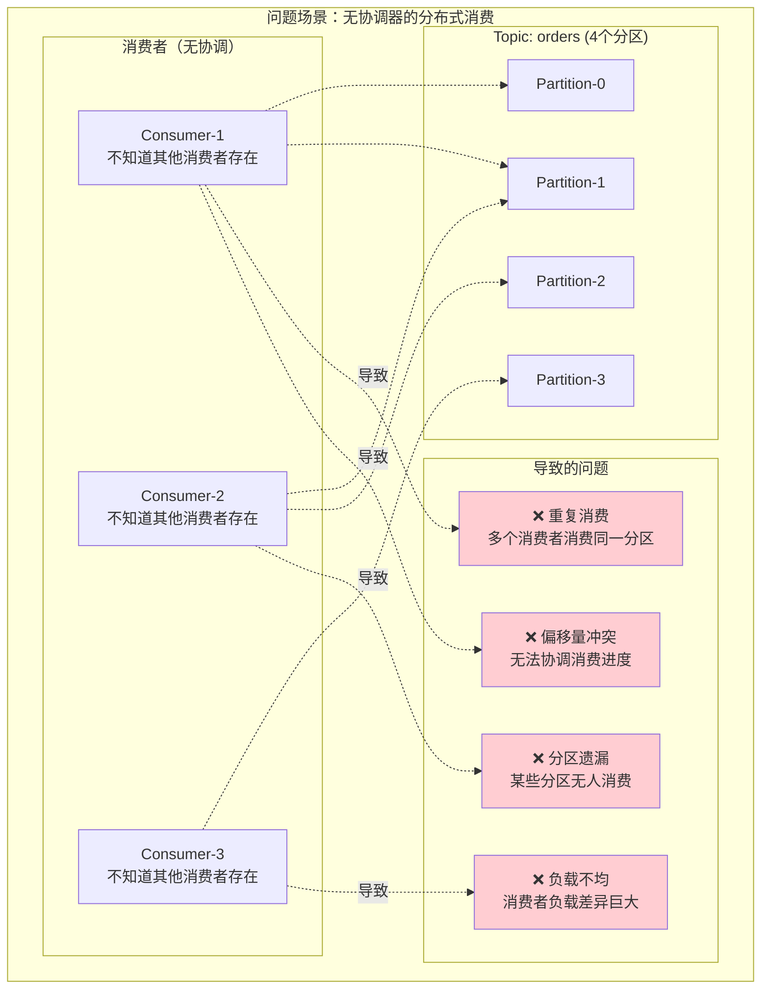
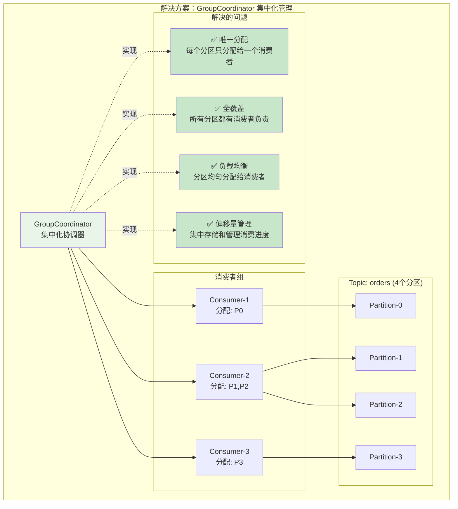
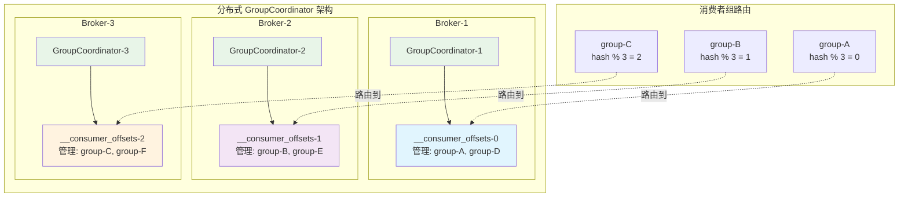
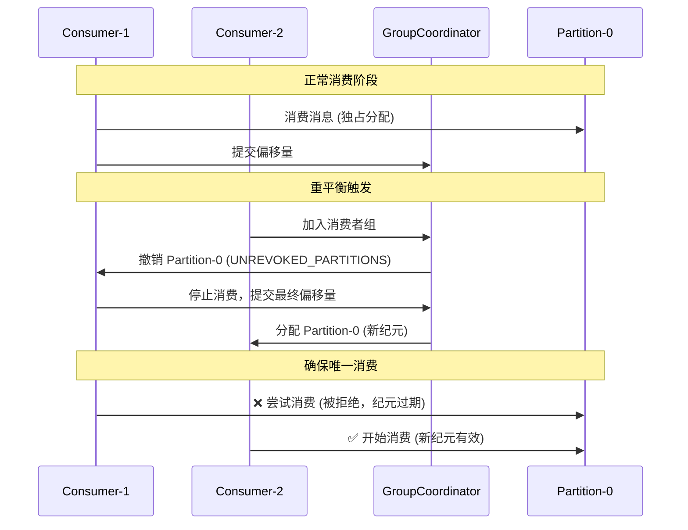
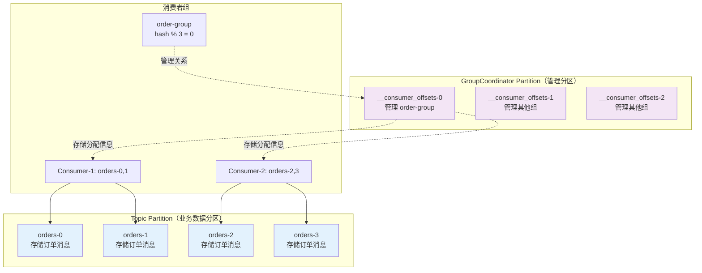
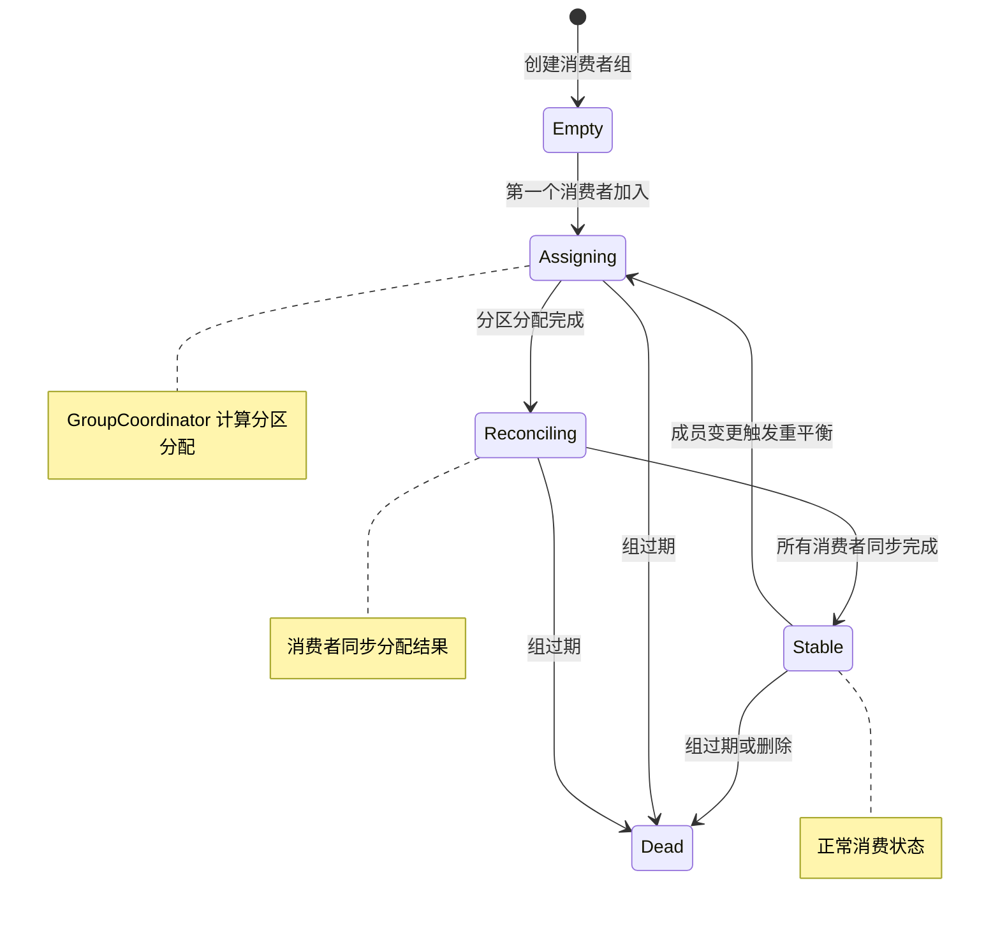
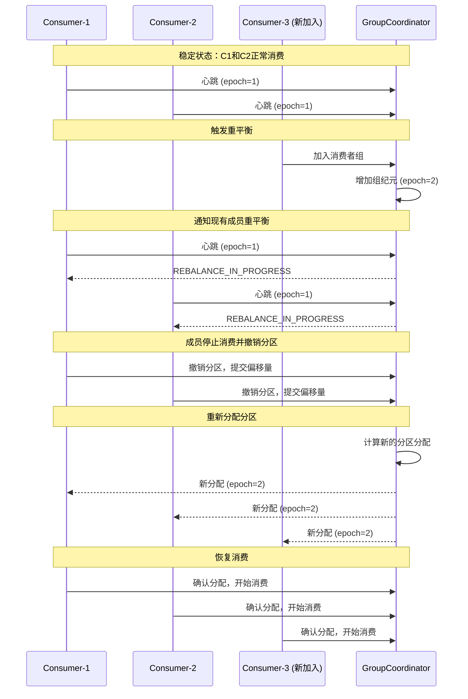
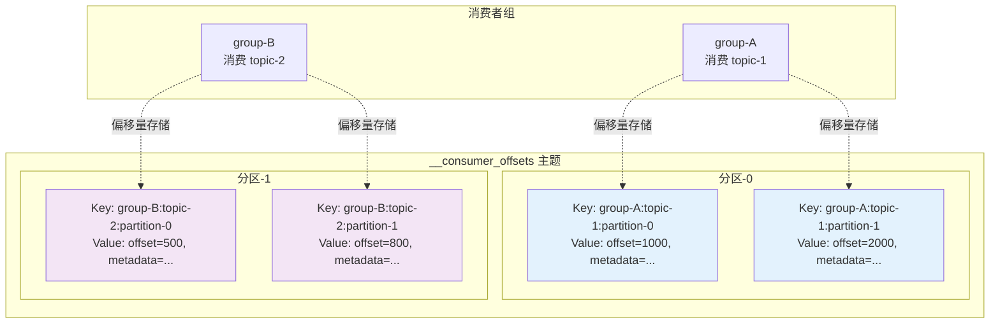
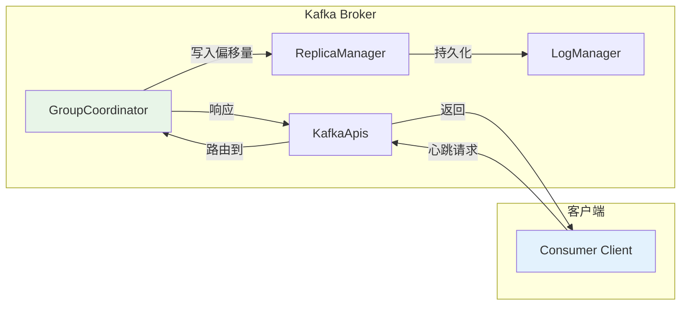

# Kafka GroupCoordinator 完全指南：设计原理、实现机制与实践应用

## 概述

GroupCoordinator 是 Kafka 中负责消费者组管理的核心组件，它解决了分布式消费场景中的关键问题：如何确保多个消费者协调工作，避免重复消费，实现负载均衡。本文将深入解析 GroupCoordinator 的设计原理、实现机制，并提供实际应用示例。

## 1. GroupCoordinator 解决的核心问题

### 1.1 分布式消费的挑战

在没有 GroupCoordinator 的分布式消费场景中，会面临以下问题：



### 1.2 GroupCoordinator 的解决方案

GroupCoordinator 通过**集中化管理**解决这些问题：



## 2. GroupCoordinator 的核心设计原理

### 2.1 集中化管理架构

GroupCoordinator 采用"**集中决策，分布执行**"的架构模式：

```java
// 核心接口：集中化的消费者组管理
public interface GroupCoordinator {
    // 成员管理：统一的成员注册和心跳处理
    CompletableFuture<ConsumerGroupHeartbeatResponseData> consumerGroupHeartbeat(
        AuthorizableRequestContext context,
        ConsumerGroupHeartbeatRequestData request
    );
    
    // 分区分配：集中化的分配决策
    CompletableFuture<JoinGroupResponseData> joinGroup(
        AuthorizableRequestContext context,
        JoinGroupRequestData request
    );
    
    // 偏移量管理：统一的偏移量存储
    CompletableFuture<OffsetCommitResponseData> commitOffset(
        AuthorizableRequestContext context,
        OffsetCommitRequestData request
    );
}
```

**设计要点：**
- **统一决策点**：所有分配决策由 GroupCoordinator 统一制定
- **状态集中化**：组成员信息、分区分配、偏移量都集中存储
- **协调机制**：通过心跳和重平衡实现动态协调

### 2.2 分布式部署架构

为了避免单点瓶颈，GroupCoordinator 采用分布式部署：

```java
// 分区路由：将不同的消费者组分配到不同的协调器
public int partitionFor(String groupId) {
    // 使用哈希算法确保同一组总是路由到同一个协调器分区
    return Utils.abs(groupId.hashCode()) % numPartitions;
}
```



## 3. 消息唯一消费的保证机制

### 3.1 分区独占分配

GroupCoordinator 通过**分区独占分配**确保消息只被消费一次：

```java
// 分区分配的核心原则：每个分区只能分配给一个消费者
public class UniformAssignor implements ConsumerGroupPartitionAssignor {
    public GroupAssignment assign(GroupSpec groupSpec, SubscribedTopicDescriber subscribedTopicDescriber) {
        // 确保每个分区只分配给一个成员
        for (int partition : partitions.get(topicId)) {
            int leastLoadedMemberIndex = memberAssignmentBalancer.nextLeastLoadedMember();
            assignPartition(topicId, partition, leastLoadedMemberIndex);  // 独占分配
        }
    }
}
```

### 3.2 分区纪元管理

通过分区纪元（Partition Epoch）确保分配的一致性：

```java
// 分区纪元管理：防止过期的分配导致重复消费
void addPartitionEpochs(Map<Uuid, Set<Integer>> assignment, int epoch) {
    assignment.forEach((topicId, assignedPartitions) -> {
        // 为每个分区分配统一的纪元，确保一致性
        assignedPartitions.forEach(partition -> 
            currentPartitionEpoch.put(topicId, partition, epoch)
        );
    });
}
```

### 3.3 重平衡时的安全机制

重平衡过程中通过状态管理确保消息不重复消费：

```java
// 重平衡安全机制：确保分区撤销和分配的原子性
if (member.memberEpoch() < group.groupEpoch() ||                    // 纪元落后
    member.state() == MemberState.UNREVOKED_PARTITIONS ||          // 需要撤销分区
    member.state() == MemberState.UNRELEASED_PARTITIONS) {         // 分区未释放
    
    error = Errors.REBALANCE_IN_PROGRESS;  // 阻止消费，直到重平衡完成
}
```

**唯一消费保证机制：**



## 4. 分区概念的区别

在 Kafka 中存在两种不同的"分区"概念，理解它们的区别很重要：

### 4.1 Topic Partition（主题分区）

```java
// Topic Partition：业务数据的分区
public final class TopicPartition {
    private final int partition;     // 分区编号（0, 1, 2, ...）
    private final String topic;     // 主题名称
}
```

**特点：**
- **数据存储**：实际存储业务消息的分区
- **消费目标**：消费者要消费的数据分区
- **并行单位**：支持并行消费的基本单位

### 4.2 GroupCoordinator Partition（协调器分区）

```java
// GroupCoordinator Partition：管理分区
public int partitionFor(String groupId) {
    // 将消费者组分配到 __consumer_offsets 的特定分区管理
    return Utils.abs(groupId.hashCode()) % numPartitions;
}
```

**特点：**
- **管理功能**：存储消费者组元数据的分区
- **内部机制**：属于 `__consumer_offsets` 内部主题
- **协调目的**：用于分布式协调器的负载均衡

### 4.3 两种分区的关系



**关键区别：**
- **Topic Partition**：GroupCoordinator 要分配的对象（业务数据）
- **GroupCoordinator Partition**：GroupCoordinator 运行的载体（管理数据）


## 5. 深入理解：GroupCoordinator 的工作流程

### 5.1 消费者组生命周期管理



### 5.2 重平衡详细流程

重平衡是 GroupCoordinator 最复杂的操作，确保分区分配的一致性：

```java
// 重平衡触发条件检查
private boolean shouldTriggerRebalance(ConsumerGroup group, ConsumerGroupMember member) {
    // 1. 成员订阅发生变化
    if (!Objects.equals(member.subscribedTopicNames(), updatedMember.subscribedTopicNames())) {
        return true;
    }

    // 2. 组纪元落后（有新成员加入或离开）
    if (member.memberEpoch() < group.groupEpoch()) {
        return true;
    }

    // 3. 分区数量发生变化
    if (group.hasMetadataExpired(currentTimeMs)) {
        return true;
    }

    return false;
}
```

**重平衡流程图：**



### 5.3 偏移量管理机制

GroupCoordinator 通过集中化的偏移量管理确保消费进度的一致性：

```java
// 偏移量提交处理
public CoordinatorResult<OffsetCommitResponseData, CoordinatorRecord> commitOffset(
    AuthorizableRequestContext context,
    OffsetCommitRequestData request
) {
    // 1. 验证消费者组和成员身份
    Group group = validateOffsetCommit(context, request);

    // 2. 检查成员纪元，确保分配有效
    if (memberEpoch < group.groupEpoch()) {
        throw new StaleMemberEpochException("Member epoch is stale");
    }

    // 3. 持久化偏移量到 __consumer_offsets
    records.add(newOffsetCommitRecord(groupId, topic, partition, offset));

    return new CoordinatorResult<>(records, response);
}
```

**偏移量存储结构：**



## 6. 与其他组件的协作

### 6.1 与 Broker 的协作



### 6.2 与 Controller 的协作

GroupCoordinator 需要从 Controller 获取元数据信息：

```java
// 元数据更新处理
public void onMetadataUpdate(MetadataImage metadataImage) {
    // 更新主题和分区信息
    this.metadataImage = metadataImage;

    // 检查是否需要触发重平衡
    groups.values().forEach(group -> {
        if (group.hasMetadataExpired(currentTimeMs)) {
            triggerRebalance(group);
        }
    });
}
```

## 7. 总结

GroupCoordinator 是 Kafka 消费者组管理的核心，它通过以下机制解决分布式消费的关键问题：

### 核心价值：
1. **唯一消费保证**：通过分区独占分配和纪元管理确保消息不重复消费
2. **负载均衡**：智能的分区分配算法实现消费者间的负载均衡
3. **故障容错**：心跳机制和重平衡确保系统的高可用性
4. **状态一致性**：集中化的偏移量管理保证消费进度的一致性

### 设计精髓：
- **集中决策**：统一的协调器避免分布式协商的复杂性
- **分布执行**：多个协调器实例实现水平扩展
- **状态管理**：完善的状态机确保各种场景下的正确性
- **容错机制**：多层次的故障检测和恢复机制

GroupCoordinator 的设计体现了分布式系统中"简单性"和"可靠性"的完美平衡，是现代消息系统的重要架构模式。

## 关注ChainCat,每早8:00一篇深度技术早餐
