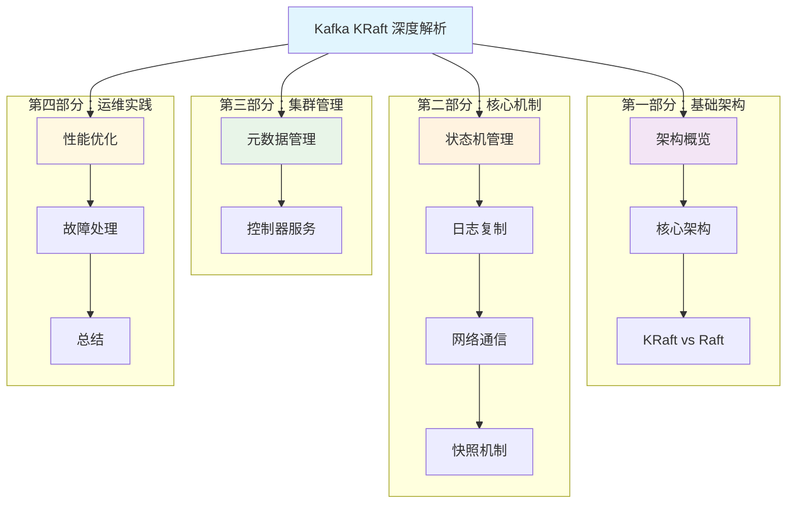
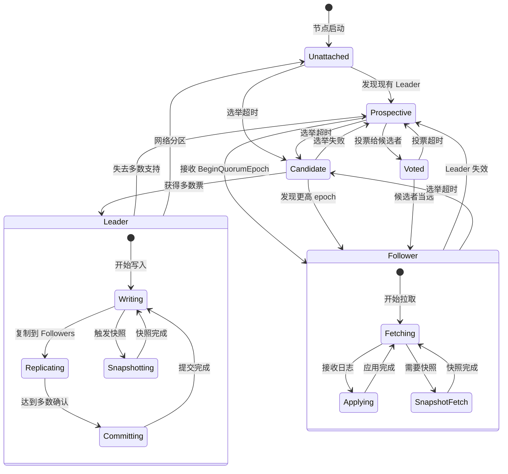
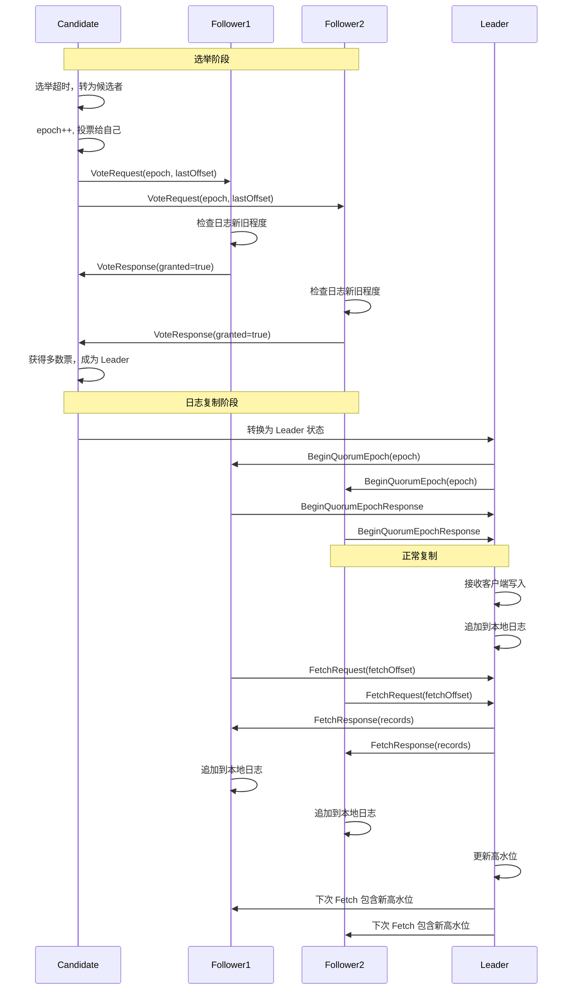
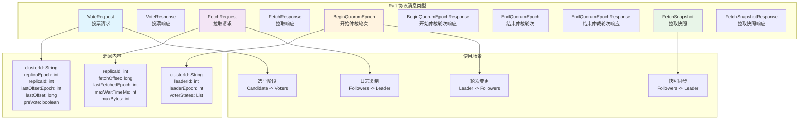
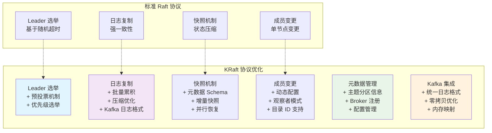
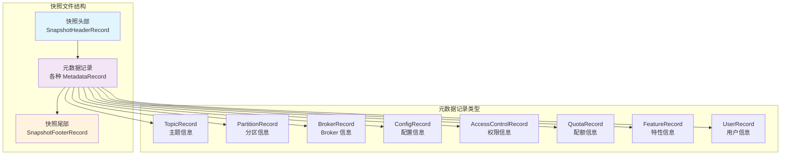
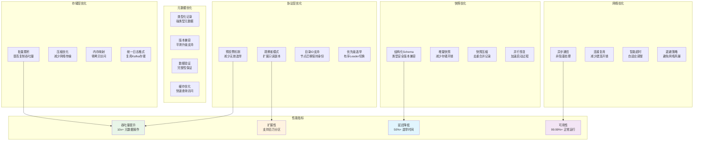
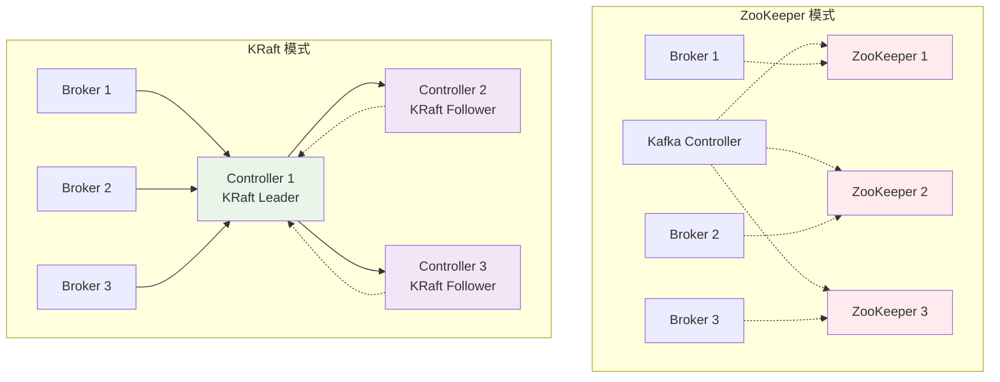
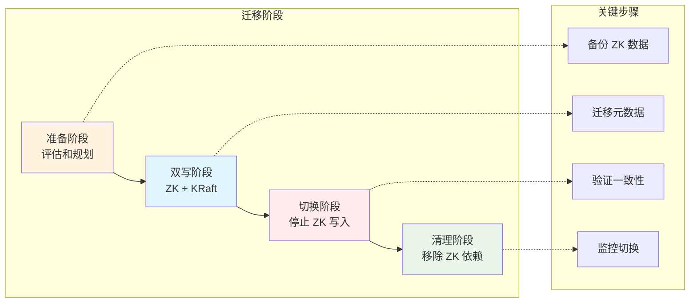

# Kafka KRaft 深度解析

## 概述

KRaft (Kafka Raft) 是 Apache Kafka 自主实现的共识协议，基于 Raft 算法但针对 Kafka 的特定需求进行了定制。KRaft 彻底替代了 ZooKeeper，实现了 Kafka 集群的自治管理，提供了更简单的部署架构、更好的可扩展性和更强的一致性保证。本文将深入分析 KRaft 的架构设计、核心功能和实现机制。

## 目录

### 第一部分：基础架构
1. [架构概览](#架构概览) - 整体架构图和状态转换流程图
2. [核心架构](#核心架构) - KafkaRaftClient 和 RaftManager 设计
3. [KRaft vs 标准 Raft](#kraft-vs-标准-raft-协议对比) - 协议对比和 Kafka 场景优化

### 第二部分：核心机制
4. [状态机管理](#状态机管理) - QuorumState 和选举机制
5. [日志复制](#日志复制) - ReplicatedLog 和 BatchAccumulator
6. [网络通信](#网络通信) - KafkaNetworkChannel 和协议实现
7. [快照机制](#快照机制) - 快照创建、Schema 和恢复

### 第三部分：集群管理
8. [元数据管理](#元数据管理) - QuorumController 和 MetadataRecordSerde
9. [控制器服务](#控制器服务) - ControllerServer 和集群管理

### 第四部分：运维实践
10. [性能优化](#性能优化) - 性能调优和监控指标
11. [故障处理](#故障处理) - 错误处理和恢复机制
12. [总结](#总结) - 核心特点、最佳实践和迁移策略

---

## 章节导读

### 📚 第一部分：基础架构
深入了解 KRaft 的整体设计理念和核心架构组件，重点对比 KRaft 与标准 Raft 协议的差异，理解针对 Kafka 场景的特殊优化。

### ⚙️ 第二部分：核心机制
详细解析 KRaft 的核心技术实现，包括状态机管理、日志复制、网络通信和快照机制，每个部分都配有源码级分析。

### 🏗️ 第三部分：集群管理
探讨 KRaft 如何管理 Kafka 集群的元数据和控制器服务，了解分布式集群的协调机制。

### 🔧 第四部分：运维实践
提供实用的性能优化建议、故障处理方案和最佳实践，帮助在生产环境中成功部署和运维 KRaft 集群。

### 📖 文档结构导航



## 架构概览

### Kafka KRaft 架构图

```mermaid
graph TB
    subgraph "KRaft 核心组件"
        KRC[KafkaRaftClient]
        RM[RaftManager]
        QS[QuorumState]
        RL[ReplicatedLog]
        BA[BatchAccumulator]
        NC[NetworkChannel]
    end

    subgraph "控制器组件"
        QC[QuorumController]
        CS[ControllerServer]
        MRS[MetadataRecordSerde]
        MC[MetadataCache]
        MP[MetadataPublisher]
    end

    subgraph "状态管理"
        PS[ProspectiveState]
        CAS[CandidateState]
        LS[LeaderState]
        FS[FollowerState]
        VS[VotedState]
        US[UnattachedState]
    end

    subgraph "网络协议"
        VR[VoteRequest]
        FR[FetchRequest]
        BQE[BeginQuorumEpoch]
        EQE[EndQuorumEpoch]
        FSR[FetchSnapshot]
        URV[UpdateRaftVoter]
    end

    subgraph "日志和快照"
        LOG[Log Segments]
        IDX[Index Files]
        SNAP[Snapshot Files]
        CP[Checkpoints]
        SM[State Machine]
    end

    subgraph "集群角色"
        CTRL[Controller Node]
        BRK[Broker Node]
        OBS[Observer Node]
        VOTER[Voter Node]
    end

    KRC --> QS
    KRC --> RL
    KRC --> BA
    KRC --> NC
    RM --> KRC

    QC --> RM
    CS --> QC
    QC --> MRS
    QC --> MC
    QC --> MP

    QS --> PS
    QS --> CAS
    QS --> LS
    QS --> FS
    QS --> VS
    QS --> US

    NC --> VR
    NC --> FR
    NC --> BQE
    NC --> EQE
    NC --> FSR
    NC --> URV

    RL --> LOG
    RL --> IDX
    RL --> SNAP
    RL --> CP
    RL --> SM

    CS --> CTRL
    RM --> BRK
    KRC --> OBS
    QS --> VOTER

    style KRC fill:#e1f5fe
    style QC fill:#f3e5f5
    style QS fill:#fff3e0
    style NC fill:#e8f5e8
    style RL fill:#fff8e1
```



上图展示了 KRaft 的核心架构，包括：
- **KRaft 核心组件**: Raft 客户端、管理器、状态机、日志复制等
- **控制器组件**: 仲裁控制器、控制器服务器、元数据管理等
- **状态管理**: 六种不同的节点状态和状态转换
- **网络协议**: Raft 协议的各种请求和响应类型
- **日志和快照**: 持久化存储和状态机快照
- **集群角色**: 不同类型的节点角色

### Kafka KRaft 状态转换流程图



上图展示了 KRaft 节点的完整状态转换流程，包括六种主要状态和它们之间的转换条件。

---

# 第一部分：基础架构

## 核心架构

### 1. KafkaRaftClient 类设计

KafkaRaftClient 是 KRaft 协议的核心实现，负责 Raft 算法的主要逻辑：

```java
public class KafkaRaftClient<T> implements RaftClient<T> {
    // 仲裁状态管理
    private final QuorumState quorum;
    
    // 复制日志
    private final ReplicatedLog log;
    
    // 批处理累加器
    private final MemoryPool memoryPool;
    
    // 网络通信
    private final NetworkChannel channel;
    
    // 消息队列
    private final RaftMessageQueue messageQueue;
    
    // 过期服务
    private final ExpirationService expirationService;
}
```

**源码位置**: `raft/src/main/java/org/apache/kafka/raft/KafkaRaftClient.java:274-296`

**核心功能**: 
- **状态管理**: 通过 QuorumState 管理节点的 Raft 状态
- **日志复制**: 实现 Raft 日志复制协议
- **选举处理**: 处理 Leader 选举和投票逻辑
- **网络通信**: 管理与其他节点的网络通信

### 2. RaftManager 管理器

RaftManager 是 KRaft 组件的管理器，负责组件的生命周期管理：

```scala
class KafkaRaftManager[T](
  clusterId: String,
  config: KafkaConfig,
  metadataLogDirUuid: Uuid,
  serde: RecordSerde[T],
  topicPartition: TopicPartition,
  topicId: Uuid,
  time: Time,
  metrics: Metrics,
  externalKRaftMetrics: ExternalKRaftMetrics,
  threadNamePrefixOpt: Option[String],
  val controllerQuorumVotersFuture: CompletableFuture[JMap[Integer, InetSocketAddress]],
  bootstrapServers: JCollection[InetSocketAddress],
  localListeners: Endpoints,
  fatalFaultHandler: FaultHandler
) extends RaftManager[T] with Logging {

  override val replicatedLog: ReplicatedLog = buildMetadataLog()
  private val netChannel = buildNetworkChannel()
  private val expirationTimer = new SystemTimer("raft-expiration-executor")
  private val expirationService = new TimingWheelExpirationService(expirationTimer)
  override val client: KafkaRaftClient[T] = buildRaftClient()
  private val clientDriver = new KafkaRaftClientDriver[T](client, threadNamePrefix, fatalFaultHandler, logContext)
}
```

**源码位置**: `core/src/main/scala/kafka/raft/RaftManager.scala:111-158`

**核心功能**:
- **组件构建**: 构建 RaftClient、NetworkChannel、ReplicatedLog 等组件
- **生命周期管理**: 管理组件的启动和关闭
- **配置管理**: 处理 KRaft 相关的配置参数
- **故障处理**: 处理致命和非致命故障

### 3. 启动和初始化

RaftManager 的启动过程包括多个组件的初始化：

```scala
def startup(): Unit = {
  client.initialize(
    controllerQuorumVotersFuture.get(),
    new FileQuorumStateStore(new File(dataDir, FileQuorumStateStore.DEFAULT_FILE_NAME)),
    metrics,
    externalKRaftMetrics
  )
  netChannel.start()
  clientDriver.start()
}
```

**源码位置**: `core/src/main/scala/kafka/raft/RaftManager.scala:160-169`

**核心功能**:
- **客户端初始化**: 初始化 RaftClient 和仲裁状态
- **网络启动**: 启动网络通信组件
- **驱动器启动**: 启动客户端驱动器线程

---

# 第二部分：核心机制

## 状态机管理

### 1. QuorumState 状态管理

QuorumState 是 KRaft 状态机的核心，管理节点在 Raft 协议中的状态：

```java
public class QuorumState {
    // 当前状态
    private EpochState state;
    
    // 持久化存储
    private final QuorumStateStore store;
    
    // 分区状态
    private final KRaftControlRecordStateMachine partitionState;
    
    // 时间服务
    private final Time time;
    
    // 随机数生成器
    private final Random random;
}
```

**源码位置**: `raft/src/main/java/org/apache/kafka/raft/QuorumState.java:622-638`

**核心功能**:
- **状态转换**: 管理六种不同状态之间的转换
- **持久化**: 将关键状态信息持久化到磁盘
- **选举管理**: 处理选举超时和投票逻辑
- **Epoch 管理**: 管理 Raft epoch 的递增和验证

### 2. 状态转换实现

#### 转换为候选者状态

```java
public void transitionToCandidate() {
    checkValidTransitionToCandidate();

    int newEpoch = epoch() + 1;
    int electionTimeoutMs = randomElectionTimeoutMs();

    durableTransitionTo(new CandidateState(
        time,
        localIdOrThrow(),
        localDirectoryId,
        newEpoch,
        partitionState.lastVoterSet(),
        state.highWatermark(),
        electionTimeoutMs,
        logContext
    ));
}
```

**源码位置**: `raft/src/main/java/org/apache/kafka/raft/QuorumState.java:640-656`

**核心功能**:
- **Epoch 递增**: 新的选举轮次递增 epoch
- **超时设置**: 设置随机的选举超时时间
- **持久化转换**: 将状态变更持久化到磁盘
- **状态验证**: 验证状态转换的合法性

#### 转换为 Leader 状态

```java
public LeaderState<T> transitionToLeader(long epochStartOffset, BatchAccumulator<T> accumulator) {
    checkValidTransitionToLeader();

    CandidateState candidateState = candidateStateOrThrow();
    
    LeaderState<T> state = new LeaderState<>(
        time,
        localVoterNodeOrThrow(),
        epoch(),
        epochStartOffset,
        partitionState.lastVoterSet(),
        partitionState.lastVoterSetOffset(),
        partitionState.lastKraftVersion(),
        candidateState.epochElection().grantingVoters(),
        accumulator,
        fetchTimeoutMs,
        logContext,
        kafkaRaftMetrics
    );

    durableTransitionTo(state);
    return state;
}
```

**源码位置**: `raft/src/main/java/org/apache/kafka/raft/QuorumState.java:711-729`

**核心功能**:
- **Leader 初始化**: 初始化 Leader 状态和批处理累加器
- **投票者记录**: 记录支持当选的投票者
- **高水位设置**: 设置初始的高水位偏移量
- **指标更新**: 更新 Leader 选举相关的指标

### 3. 选举机制实现

#### 投票请求处理

```java
private CompletableFuture<VoteResponseData> handleVoteRequest(
    RaftRequest.Inbound request,
    long currentTimeMs
) {
    VoteRequestData voteRequest = (VoteRequestData) request.data();
    
    // 验证集群 ID
    if (!clusterId.equals(voteRequest.clusterId())) {
        return completedFuture(new VoteResponseData()
            .setErrorCode(Errors.INCONSISTENT_CLUSTER_ID.code()));
    }
    
    // 处理投票逻辑
    return handleVoteRequest(voteRequest, currentTimeMs)
        .thenApply(response -> {
            logger.debug("Completed vote request {} with response {}", 
                        voteRequest, response);
            return response;
        });
}
```

**核心功能**:
- **集群验证**: 验证请求来自同一集群
- **投票决策**: 根据 Raft 规则决定是否投票
- **响应构建**: 构建投票响应消息
- **日志记录**: 记录投票决策过程

## 日志复制

### 1. ReplicatedLog 接口

ReplicatedLog 定义了 KRaft 日志复制的核心接口：

```java
public interface ReplicatedLog extends AutoCloseable {
    
    // 作为 Leader 追加记录
    LogAppendInfo appendAsLeader(Records records, int epoch);
    
    // 作为 Follower 追加记录
    LogAppendInfo appendAsFollower(Records records, int epoch);
    
    // 读取记录
    LogFetchInfo read(long startOffsetInclusive, Isolation isolation);
    
    // 获取最新 epoch
    int lastFetchedEpoch();
    
    // 获取日志结束偏移量
    LogOffsetMetadata endOffset();
    
    // 获取高水位
    LogOffsetMetadata highWatermark();
    
    // 更新高水位
    void updateHighWatermark(LogOffsetMetadata offsetMetadata);
}
```

**源码位置**: `raft/src/main/java/org/apache/kafka/raft/ReplicatedLog.java:28-71`

**核心功能**:
- **双重追加**: 支持 Leader 和 Follower 两种追加模式
- **隔离读取**: 支持不同隔离级别的读取操作
- **水位管理**: 管理高水位和日志结束偏移量
- **Epoch 跟踪**: 跟踪最新的 epoch 信息

### 2. BatchAccumulator 批处理

BatchAccumulator 负责批量累积记录，提高写入效率：

```java
public class BatchAccumulator<T> implements AutoCloseable {
    // 当前 epoch
    private final int epoch;
    
    // 下一个偏移量
    private volatile long nextOffset;
    
    // 内存池
    private final MemoryPool memoryPool;
    
    // 压缩类型
    private final Compression compression;
    
    // 序列化器
    private final RecordSerde<T> serde;
    
    // 已完成的批次
    private final Queue<CompletedBatch<T>> completed = new ArrayDeque<>();
    
    // 追加锁
    private final ReentrantLock appendLock = new ReentrantLock();
}
```

**源码位置**: `raft/src/main/java/org/apache/kafka/raft/internals/BatchAccumulator.java:102-166`

**核心功能**:
- **批量累积**: 将多个记录累积到一个批次中
- **内存管理**: 使用内存池管理批次内存分配
- **压缩支持**: 支持多种压缩算法
- **并发控制**: 通过锁机制保证线程安全

### 3. 日志追加实现

#### Leader 追加记录

```java
public long append(int epoch, List<T> records, boolean delayDrain) {
    int numberOfCompletedBatches = completed.size();
    
    // 检查 epoch 有效性
    if (epoch != this.epoch) {
        throw new NotLeaderException("Invalid epoch " + epoch + ", expected " + this.epoch);
    }
    
    // 检查批次数量限制
    if (numberOfCompletedBatches >= maxNumberOfBatches) {
        throw new IllegalStateException("Cannot append more than " + maxNumberOfBatches + " batches");
    }

    appendLock.lock();
    try {
        long lastOffset = nextOffset + records.size() - 1;
        maybeCompleteDrain();

        BatchBuilder<T> batch = maybeAllocateBatch(records, serializationCache);
        if (batch == null) {
            throw new BufferAllocationException("Failed to allocate memory for batch");
        }

        if (delayDrain) {
            drainOffset.compareAndSet(Long.MAX_VALUE, nextOffset);
        }

        for (T record : records) {
            batch.appendRecord(record, serializationCache);
        }

        maybeResetLinger();
        nextOffset = lastOffset + 1;
        return lastOffset;
    } finally {
        appendLock.unlock();
    }
}
```

**源码位置**: `raft/src/main/java/org/apache/kafka/raft/internals/BatchAccumulator.java:118-166`

**核心功能**:
- **Epoch 验证**: 确保追加操作使用正确的 epoch
- **批次限制**: 控制同时存在的批次数量
- **内存分配**: 为新批次分配内存缓冲区
- **延迟排空**: 支持延迟排空机制控制复制时机

## 网络通信

### 1. KafkaNetworkChannel 实现

KafkaNetworkChannel 实现了 KRaft 的网络通信层：

```java
public class KafkaNetworkChannel implements NetworkChannel {
    private final Time time;
    private final ListenerName listenerName;
    private final InterBrokerSendThread requestThread;
    private final AtomicInteger correlationIdCounter = new AtomicInteger(0);
    
    public KafkaNetworkChannel(
        Time time,
        ListenerName listenerName,
        KafkaClient netClient,
        int requestTimeoutMs,
        String threadNamePrefix
    ) {
        this.time = time;
        this.listenerName = listenerName;
        this.requestThread = new InterBrokerSendThread(
            threadNamePrefix + "-network-thread",
            netClient,
            requestTimeoutMs,
            time,
            false
        );
    }
}
```

**源码位置**: `raft/src/main/java/org/apache/kafka/raft/KafkaNetworkChannel.java:113-126`

**核心功能**:
- **请求发送**: 发送 Raft 协议请求到其他节点
- **响应处理**: 处理来自其他节点的响应
- **连接管理**: 管理与其他节点的网络连接
- **超时处理**: 处理网络请求的超时情况

### 2. 请求发送机制

```java
@Override
public void send(RaftRequest.Outbound request) {
    Node node = request.destination();
    if (node != null) {
        requestThread.sendRequest(new RequestAndCompletionHandler(
            request.createdTimeMs(),
            node,
            buildRequest(request.data()),
            response -> sendOnComplete(request, response)
        ));
    } else {
        sendCompleteFuture(request, errorResponse(request.data(), Errors.BROKER_NOT_AVAILABLE));
    }
}
```

**源码位置**: `raft/src/main/java/org/apache/kafka/raft/KafkaNetworkChannel.java:114-126`

**核心功能**:
- **目标验证**: 验证目标节点的有效性
- **请求构建**: 构建符合协议的网络请求
- **异步发送**: 异步发送请求并处理响应
- **错误处理**: 处理网络不可用等错误情况

### 3. Raft 协议消息

#### VoteRequest 投票请求

```java
public static VoteRequestData singletonRequest(TopicPartition topicPartition,
                                               String clusterId,
                                               int replicaEpoch,
                                               int replicaId,
                                               int lastEpoch,
                                               long lastEpochEndOffset,
                                               boolean preVote) {
    return new VoteRequestData()
               .setClusterId(clusterId)
               .setTopics(Collections.singletonList(
                   new VoteRequestData.TopicData()
                       .setTopicName(topicPartition.topic())
                       .setPartitions(Collections.singletonList(
                           new VoteRequestData.PartitionData()
                               .setPartitionIndex(topicPartition.partition())
                               .setReplicaEpoch(replicaEpoch)
                               .setReplicaId(replicaId)
                               .setLastOffsetEpoch(lastEpoch)
                               .setLastOffset(lastEpochEndOffset)
                               .setPreVote(preVote))
                       )));
}
```

**源码位置**: `clients/src/main/java/org/apache/kafka/common/requests/VoteRequest.java:71-92`

**核心功能**:
- **选举请求**: 候选者向其他节点请求投票
- **日志信息**: 包含候选者的日志状态信息
- **预投票支持**: 支持预投票机制减少不必要的选举
- **集群验证**: 包含集群 ID 进行验证

### KRaft 选举和日志复制流程图



上图展示了 KRaft 的完整选举和日志复制流程，包括候选者选举、Leader 确立和日志复制的详细步骤。

### KRaft 网络协议详解



上图详细展示了 KRaft 协议中的各种消息类型、内容结构和使用场景。

---

# 第三部分：集群管理

## 元数据管理

### 1. QuorumController 控制器

QuorumController 是 KRaft 模式下的核心控制器，负责集群元数据管理：

```java
public class QuorumController implements Controller {
    // 节点 ID
    private final int nodeId;

    // 集群 ID
    private final String clusterId;

    // 事件队列
    private final KafkaEventQueue queue;

    // Raft 客户端
    private final RaftClient<ApiMessageAndVersion> raftClient;

    // 集群控制
    private final ClusterControlManager clusterControl;

    // 配置控制
    private final ConfigurationControlManager configurationControl;

    // 主题控制
    private final ReplicationControlManager replicationControl;

    // 特性控制
    private final FeatureControlManager featureControl;
}
```

**源码位置**: `metadata/src/main/java/org/apache/kafka/controller/QuorumController.java:1460-1482`

**核心功能**:
- **元数据管理**: 管理集群的所有元数据信息
- **事件驱动**: 通过事件队列处理各种操作请求
- **状态同步**: 与 Raft 日志保持状态同步
- **模块化设计**: 通过多个控制管理器实现功能分离

### 2. MetadataRecordSerde 序列化

MetadataRecordSerde 负责元数据记录的序列化和反序列化：

```java
public class MetadataRecordSerde extends AbstractApiMessageSerde {
    public static final MetadataRecordSerde INSTANCE = new MetadataRecordSerde();

    @Override
    public ApiMessage apiMessageFor(short apiKey) {
        return MetadataRecordType.fromId(apiKey).newMetadataRecord();
    }
}
```

**源码位置**: `metadata/src/main/java/org/apache/kafka/metadata/MetadataRecordSerde.java:23-30`

**核心功能**:
- **类型映射**: 将 API Key 映射到具体的元数据记录类型
- **序列化**: 将元数据对象序列化为字节流
- **反序列化**: 将字节流反序列化为元数据对象
- **版本兼容**: 支持不同版本的元数据格式

### 3. 控制器状态管理

#### 控制器启动过程

```java
private QuorumController(
    FaultHandler nonFatalFaultHandler,
    FaultHandler fatalFaultHandler,
    LogContext logContext,
    int nodeId,
    String clusterId,
    KafkaEventQueue queue,
    Time time,
    KafkaConfigSchema configSchema,
    RaftClient<ApiMessageAndVersion> raftClient,
    QuorumFeatures quorumFeatures,
    // ... 其他参数
) {
    this.nodeId = nodeId;
    this.clusterId = clusterId;
    this.queue = queue;
    this.time = time;
    this.raftClient = raftClient;

    // 初始化各种控制管理器
    this.clusterControl = new ClusterControlManager.Builder()
        .setLogContext(logContext)
        .setTime(time)
        .setSessionTimeoutNs(sessionTimeoutNs)
        .build();

    this.replicationControl = new ReplicationControlManager.Builder()
        .setConfigSchema(configSchema)
        .setLogContext(logContext)
        .setDefaultReplicationFactor(defaultReplicationFactor)
        .setDefaultNumPartitions(defaultNumPartitions)
        .build();
}
```

**核心功能**:
- **组件初始化**: 初始化各种控制管理器组件
- **配置设置**: 设置控制器的各种配置参数
- **事件队列**: 建立事件驱动的处理机制
- **Raft 集成**: 与 Raft 客户端集成实现一致性

## KRaft vs 标准 Raft 协议对比

### KRaft 针对 Kafka 场景的优化



### 详细对比分析

| 特性 | 标准 Raft | KRaft 优化 | 优化原因 |
|------|-----------|------------|----------|
| **选举机制** | 随机超时选举 | 预投票 + 优先级选举 | 减少无效选举，支持有序切换 |
| **日志格式** | 通用日志条目 | Kafka RecordBatch 格式 | 统一存储格式，零拷贝优化 |
| **批处理** | 单条目复制 | 批量累积复制 | 提高吞吐量，减少网络开销 |
| **快照内容** | 通用状态 | 结构化元数据 Schema | 类型安全，版本兼容 |
| **成员管理** | 单节点变更 | 动态配置 + 观察者 | 支持大规模集群，灵活扩展 |
| **存储优化** | 内存状态机 | 磁盘日志 + 内存映射 | 持久化保证，性能优化 |
| **网络协议** | 通用 RPC | Kafka 协议栈 | 复用现有基础设施 |

### KRaft 特有的协议扩展

#### 1. 预投票机制 (Pre-Vote)

```java
// 预投票请求处理
private CompletableFuture<VoteResponseData> handlePreVoteRequest(
    VoteRequestData request,
    long currentTimeMs
) {
    // 预投票不会增加 epoch，只是探测是否可能获得选票
    boolean wouldVote = canGrantVote(
        request.replicaId(),
        request.lastOffsetEpoch(),
        request.lastOffset(),
        false // 不是正式投票
    );

    return CompletableFuture.completedFuture(
        VoteResponse.singletonResponse(
            Errors.NONE,
            topicPartition,
            wouldVote,
            Optional.empty(),
            quorum.epoch()
        )
    );
}
```

**优化效果**:
- **减少无效选举**: 避免网络分区恢复时的选举风暴
- **保持稳定性**: 不会因为单个节点的网络抖动触发选举
- **提高可用性**: 快速确定是否有机会成为 Leader

#### 2. 观察者模式 (Observer)

```java
// 观察者节点处理
public class ObserverState extends EpochState {
    // 观察者不参与投票，只接收日志复制
    @Override
    public boolean canGrantVote(int candidateId, boolean isLogUpToDate) {
        return false; // 观察者永远不投票
    }

    @Override
    public boolean isVoter() {
        return false;
    }

    // 但可以接收和应用日志
    public void handleFetchResponse(FetchResponseData response) {
        // 应用日志但不影响仲裁
        applyRecords(response.records());
    }
}
```

**优化效果**:
- **扩展性**: 支持大量只读副本而不影响仲裁性能
- **地理分布**: 在不同地区部署观察者节点
- **负载分担**: 观察者可以处理只读查询

#### 3. 目录 ID 支持

```java
// 节点目录 ID 管理
public class VoterNode {
    private final int nodeId;
    private final Uuid directoryId; // KRaft 特有
    private final Map<String, InetSocketAddress> endpoints;

    // 支持节点迁移时保持身份
    public boolean isSameNode(int nodeId, Uuid directoryId) {
        return this.nodeId == nodeId && this.directoryId.equals(directoryId);
    }
}
```

**优化效果**:
- **节点迁移**: 支持节点在不同机器间迁移
- **身份保持**: 通过目录 ID 保持节点身份一致性
- **故障恢复**: 更好的故障检测和恢复机制

## 快照机制

### 1. 快照数据 Schema 详解

KRaft 快照采用结构化的元数据 Schema，确保类型安全和版本兼容：

#### 快照文件结构



#### 快照头部记录

```java
// 快照头部记录结构
public class SnapshotHeaderRecord implements ApiMessage {
    private short version = 0;
    private long lastContainedLogTimestamp;
    private long lastContainedLogOffset;
    private int lastContainedLogEpoch;

    // 快照元信息
    public static final Schema SCHEMA_0 = new Schema(
        new Field("version", Type.INT16, "快照格式版本"),
        new Field("last_contained_log_timestamp", Type.INT64, "包含的最后日志时间戳"),
        new Field("last_contained_log_offset", Type.INT64, "包含的最后日志偏移量"),
        new Field("last_contained_log_epoch", Type.INT32, "包含的最后日志 epoch")
    );
}
```

**源码位置**: `metadata/src/main/resources/common/metadata/SnapshotHeaderRecord.json`

#### 主题记录 Schema

```java
// 主题记录的详细结构
public class TopicRecord implements ApiMessage {
    private String name;           // 主题名称
    private Uuid topicId;         // 主题 UUID

    public static final Schema SCHEMA_0 = new Schema(
        new Field("name", Type.COMPACT_STRING, "主题名称"),
        new Field("topic_id", Type.UUID, "主题唯一标识符")
    );

    // 版本演进支持
    public static final Schema SCHEMA_1 = new Schema(
        new Field("name", Type.COMPACT_STRING, "主题名称"),
        new Field("topic_id", Type.UUID, "主题唯一标识符"),
        new Field("properties", Type.COMPACT_ARRAY, "主题属性",
            new Schema(
                new Field("key", Type.COMPACT_STRING, "属性键"),
                new Field("value", Type.COMPACT_STRING, "属性值")
            ))
    );
}
```

**源码位置**: `metadata/src/main/resources/common/metadata/TopicRecord.json`

#### 分区记录 Schema

```java
// 分区记录的详细结构
public class PartitionRecord implements ApiMessage {
    private int partitionId;              // 分区 ID
    private Uuid topicId;                // 所属主题 ID
    private List<Integer> replicas;       // 副本列表
    private List<Integer> isr;           // 同步副本列表
    private List<Integer> removingReplicas; // 正在移除的副本
    private List<Integer> addingReplicas;   // 正在添加的副本
    private int leader;                   // Leader 副本
    private int leaderEpoch;             // Leader epoch
    private int partitionEpoch;          // 分区 epoch

    public static final Schema SCHEMA_0 = new Schema(
        new Field("partition_id", Type.INT32, "分区标识符"),
        new Field("topic_id", Type.UUID, "主题标识符"),
        new Field("replicas", Type.COMPACT_ARRAY, "副本列表", Type.INT32),
        new Field("isr", Type.COMPACT_ARRAY, "同步副本列表", Type.INT32),
        new Field("removing_replicas", Type.COMPACT_ARRAY, "移除中副本", Type.INT32),
        new Field("adding_replicas", Type.COMPACT_ARRAY, "添加中副本", Type.INT32),
        new Field("leader", Type.INT32, "Leader 副本 ID"),
        new Field("leader_epoch", Type.INT32, "Leader epoch"),
        new Field("partition_epoch", Type.INT32, "分区 epoch")
    );
}
```

**源码位置**: `metadata/src/main/resources/common/metadata/PartitionRecord.json`

#### Broker 记录 Schema

```java
// Broker 记录的详细结构
public class BrokerRecord implements ApiMessage {
    private int brokerId;                    // Broker ID
    private List<BrokerEndpoint> endpoints;  // 监听端点
    private String rack;                     // 机架信息
    private boolean fenced;                  // 是否被隔离
    private long brokerEpoch;               // Broker epoch
    private Uuid incarnationId;             // 实例 ID
    private List<Uuid> logDirs;             // 日志目录

    public static final Schema SCHEMA_0 = new Schema(
        new Field("broker_id", Type.INT32, "Broker 标识符"),
        new Field("endpoints", Type.COMPACT_ARRAY, "监听端点",
            new Schema(
                new Field("name", Type.COMPACT_STRING, "监听器名称"),
                new Field("host", Type.COMPACT_STRING, "主机地址"),
                new Field("port", Type.UINT16, "端口号"),
                new Field("security_protocol", Type.INT16, "安全协议")
            )),
        new Field("rack", Type.COMPACT_NULLABLE_STRING, "机架标识"),
        new Field("fenced", Type.BOOLEAN, "是否被隔离"),
        new Field("broker_epoch", Type.INT64, "Broker epoch"),
        new Field("incarnation_id", Type.UUID, "实例标识符"),
        new Field("log_dirs", Type.COMPACT_ARRAY, "日志目录", Type.UUID)
    );
}
```

**源码位置**: `metadata/src/main/resources/common/metadata/BrokerRecord.json`

### 2. 快照创建流程

```java
public final class RecordsSnapshotWriter<T> implements SnapshotWriter<T> {
    private final RawSnapshotWriter snapshot;
    private final BatchAccumulator<T> accumulator;
    private final Time time;

    @Override
    public void append(List<T> records) {
        if (snapshot.isFrozen()) {
            throw new IllegalStateException("Snapshot is already frozen");
        }

        accumulator.append(snapshot.snapshotId().epoch(), records, false);

        if (accumulator.needsDrain(time.milliseconds())) {
            appendBatches(accumulator.drain());
        }
    }

    @Override
    public long freeze() {
        finalizeSnapshotWithFooter();
        appendBatches(accumulator.drain());
        snapshot.freeze();
        accumulator.close();
        return snapshot.sizeInBytes();
    }

    // 添加快照尾部记录
    private void finalizeSnapshotWithFooter() {
        SnapshotFooterRecord footer = new SnapshotFooterRecord()
            .setVersion((short) 0)
            .setChecksum(calculateChecksum());

        accumulator.appendControlMessages((baseOffset, epoch, compression, buffer) -> {
            // 写入尾部控制记录
            return MemoryRecords.withRecords(
                baseOffset,
                compression,
                epoch,
                new SimpleRecord(
                    time.milliseconds(),
                    null, // key
                    MetadataRecordSerde.INSTANCE.serialize(
                        new ApiMessageAndVersion(footer, (short) 0)
                    )
                )
            );
        });
    }
}
```

**源码位置**: `raft/src/main/java/org/apache/kafka/snapshot/RecordsSnapshotWriter.java:100-126`

**核心功能**:
- **记录追加**: 将状态机记录追加到快照中
- **批量处理**: 使用批处理累加器提高效率
- **快照冻结**: 完成快照创建并冻结状态
- **大小统计**: 统计快照文件的大小
- **校验和**: 确保快照数据完整性

### 3. 快照版本兼容性

KRaft 快照支持向前和向后兼容：

```java
// 版本兼容性处理
public class MetadataRecordSerde extends AbstractApiMessageSerde {

    @Override
    public ApiMessage apiMessageFor(short apiKey) {
        MetadataRecordType recordType = MetadataRecordType.fromId(apiKey);
        return recordType.newMetadataRecord();
    }

    // 版本兼容性读取
    @Override
    public ApiMessageAndVersion read(Readable input, int size) throws IOException {
        ByteBuffer buffer = ByteBuffer.allocate(size);
        input.readFully(buffer.array(), 0, size);
        buffer.rewind();

        ByteBufferAccessor accessor = new ByteBufferAccessor(buffer);

        // 读取记录类型和版本
        short recordType = accessor.readShort();
        short version = accessor.readShort();

        // 获取对应的消息类型
        ApiMessage message = apiMessageFor(recordType);

        // 根据版本进行兼容性处理
        if (version > message.highestSupportedVersion()) {
            // 向前兼容：忽略不认识的字段
            log.warn("Reading record type {} with version {} > supported version {}",
                    recordType, version, message.highestSupportedVersion());
            version = message.highestSupportedVersion();
        }

        // 反序列化消息
        message.read(accessor, version);
        return new ApiMessageAndVersion(message, version);
    }
}
```

**兼容性策略**:
- **向前兼容**: 新版本可以读取旧版本的快照
- **向后兼容**: 旧版本可以忽略新字段读取新版本快照
- **版本协商**: 自动选择合适的版本进行序列化
- **优雅降级**: 不支持的字段会被安全忽略

### 4. 快照恢复机制

#### 完整恢复流程

```java
// 快照恢复的核心逻辑
public class SnapshotRestoreManager {

    public void handleSnapshotRestore(OffsetAndEpoch snapshotId) {
        log.info("Starting snapshot restore from {}", snapshotId);

        try (SnapshotReader<ApiMessageAndVersion> reader =
             log.readSnapshot(snapshotId).orElseThrow()) {

            // 1. 验证快照完整性
            validateSnapshotIntegrity(reader);

            // 2. 重置状态机
            resetStateMachine();

            // 3. 解析快照头部
            SnapshotHeaderRecord header = parseSnapshotHeader(reader);
            log.info("Restoring snapshot with header: {}", header);

            // 4. 逐批恢复记录
            long recordCount = 0;
            while (reader.hasNext()) {
                Batch<ApiMessageAndVersion> batch = reader.next();
                for (ApiMessageAndVersion record : batch) {
                    handleMetadataRecord(record);
                    recordCount++;
                }
            }

            // 5. 验证快照尾部
            SnapshotFooterRecord footer = parseSnapshotFooter(reader);
            validateSnapshotFooter(footer, recordCount);

            // 6. 更新快照偏移量
            updateSnapshotOffset(snapshotId.offset());

            log.info("Completed snapshot restore from {} with {} records",
                    snapshotId, recordCount);

        } catch (Exception e) {
            log.error("Failed to restore from snapshot {}", snapshotId, e);
            throw new RuntimeException("Snapshot restore failed", e);
        }
    }

    // 处理不同类型的元数据记录
    private void handleMetadataRecord(ApiMessageAndVersion record) {
        ApiMessage message = record.message();

        switch (message.apiKey()) {
            case MetadataRecordType.TOPIC_RECORD.id():
                handleTopicRecord((TopicRecord) message);
                break;
            case MetadataRecordType.PARTITION_RECORD.id():
                handlePartitionRecord((PartitionRecord) message);
                break;
            case MetadataRecordType.BROKER_RECORD.id():
                handleBrokerRecord((BrokerRecord) message);
                break;
            case MetadataRecordType.CONFIG_RECORD.id():
                handleConfigRecord((ConfigRecord) message);
                break;
            default:
                log.warn("Unknown metadata record type: {}", message.apiKey());
        }
    }

    // 主题记录处理
    private void handleTopicRecord(TopicRecord record) {
        topicRegistry.registerTopic(
            record.topicId(),
            record.name(),
            record.properties()
        );
        log.debug("Restored topic: {} with ID: {}", record.name(), record.topicId());
    }

    // 分区记录处理
    private void handlePartitionRecord(PartitionRecord record) {
        partitionRegistry.registerPartition(
            record.topicId(),
            record.partitionId(),
            record.replicas(),
            record.isr(),
            record.leader(),
            record.leaderEpoch(),
            record.partitionEpoch()
        );
        log.debug("Restored partition: {}-{}", record.topicId(), record.partitionId());
    }
}
```

#### 增量快照支持

```java
// 增量快照机制
public class IncrementalSnapshotManager {

    // 创建增量快照
    public void createIncrementalSnapshot(OffsetAndEpoch baseSnapshot,
                                        long targetOffset) {
        try (SnapshotWriter<ApiMessageAndVersion> writer =
             log.createSnapshot(new OffsetAndEpoch(targetOffset, epoch()))) {

            // 1. 写入增量快照头部
            IncrementalSnapshotHeaderRecord header = new IncrementalSnapshotHeaderRecord()
                .setBaseSnapshotOffset(baseSnapshot.offset())
                .setBaseSnapshotEpoch(baseSnapshot.epoch())
                .setTargetOffset(targetOffset);

            writer.append(List.of(new ApiMessageAndVersion(header, (short) 0)));

            // 2. 写入增量变更记录
            List<ApiMessageAndVersion> deltaRecords = collectDeltaRecords(
                baseSnapshot.offset(), targetOffset);

            for (ApiMessageAndVersion record : deltaRecords) {
                writer.append(List.of(record));
            }

            // 3. 完成增量快照
            writer.freeze();

            log.info("Created incremental snapshot from {} to {}",
                    baseSnapshot.offset(), targetOffset);

        } catch (Exception e) {
            log.error("Failed to create incremental snapshot", e);
            throw new RuntimeException("Incremental snapshot creation failed", e);
        }
    }

    // 收集增量变更
    private List<ApiMessageAndVersion> collectDeltaRecords(long fromOffset, long toOffset) {
        List<ApiMessageAndVersion> deltaRecords = new ArrayList<>();

        // 读取指定范围内的日志记录
        LogFetchInfo fetchInfo = log.read(fromOffset, Isolation.UNCOMMITTED);

        for (Record record : fetchInfo.records) {
            if (record.offset() > toOffset) break;

            // 只包含元数据变更记录
            if (isMetadataRecord(record)) {
                ApiMessageAndVersion metadataRecord = deserializeRecord(record);
                deltaRecords.add(metadataRecord);
            }
        }

        return deltaRecords;
    }
}
```

### 5. 快照压缩和优化

```java
// 快照压缩优化
public class SnapshotCompactionManager {

    // 压缩快照以减少大小
    public void compactSnapshot(OffsetAndEpoch snapshotId) {
        try (SnapshotReader<ApiMessageAndVersion> reader = log.readSnapshot(snapshotId).orElseThrow();
             SnapshotWriter<ApiMessageAndVersion> writer = log.createSnapshot(snapshotId)) {

            // 1. 去重和合并记录
            Map<String, ApiMessageAndVersion> latestRecords = new HashMap<>();

            while (reader.hasNext()) {
                Batch<ApiMessageAndVersion> batch = reader.next();
                for (ApiMessageAndVersion record : batch) {
                    String key = generateRecordKey(record);

                    // 只保留最新的记录
                    if (shouldKeepRecord(record)) {
                        latestRecords.put(key, record);
                    } else {
                        latestRecords.remove(key); // 删除记录
                    }
                }
            }

            // 2. 按类型排序写入
            List<ApiMessageAndVersion> sortedRecords = latestRecords.values()
                .stream()
                .sorted(this::compareRecordPriority)
                .collect(Collectors.toList());

            // 3. 批量写入压缩后的记录
            int batchSize = 1000;
            for (int i = 0; i < sortedRecords.size(); i += batchSize) {
                List<ApiMessageAndVersion> batch = sortedRecords.subList(
                    i, Math.min(i + batchSize, sortedRecords.size()));
                writer.append(batch);
            }

            writer.freeze();

            log.info("Compacted snapshot {} from {} to {} records",
                    snapshotId, reader.recordCount(), sortedRecords.size());

        } catch (Exception e) {
            log.error("Failed to compact snapshot {}", snapshotId, e);
            throw new RuntimeException("Snapshot compaction failed", e);
        }
    }

    // 生成记录键用于去重
    private String generateRecordKey(ApiMessageAndVersion record) {
        ApiMessage message = record.message();

        switch (message.apiKey()) {
            case MetadataRecordType.TOPIC_RECORD.id():
                TopicRecord topicRecord = (TopicRecord) message;
                return "topic:" + topicRecord.topicId();

            case MetadataRecordType.PARTITION_RECORD.id():
                PartitionRecord partitionRecord = (PartitionRecord) message;
                return "partition:" + partitionRecord.topicId() + ":" + partitionRecord.partitionId();

            case MetadataRecordType.BROKER_RECORD.id():
                BrokerRecord brokerRecord = (BrokerRecord) message;
                return "broker:" + brokerRecord.brokerId();

            default:
                return "unknown:" + message.apiKey() + ":" + message.hashCode();
        }
    }
}
```

**核心功能**:
- **状态重置**: 在恢复前重置状态机状态
- **批量恢复**: 批量读取和应用快照记录
- **偏移量更新**: 更新快照相关的偏移量信息
- **错误处理**: 处理快照恢复过程中的错误
- **增量支持**: 支持增量快照减少存储开销
- **压缩优化**: 通过去重和合并优化快照大小

### KRaft 优化特性总结



### KRaft 针对 Kafka 场景的关键优化

#### 1. 元数据特化优化

```java
// Kafka 特定的元数据记录类型
public enum MetadataRecordType {
    TOPIC_RECORD((short) 2, "TopicRecord"),
    PARTITION_RECORD((short) 3, "PartitionRecord"),
    CONFIG_RECORD((short) 4, "ConfigRecord"),
    PARTITION_CHANGE_RECORD((short) 5, "PartitionChangeRecord"),
    FENCE_BROKER_RECORD((short) 6, "FenceBrokerRecord"),
    UNFENCE_BROKER_RECORD((short) 7, "UnfenceBrokerRecord"),
    REMOVE_TOPIC_RECORD((short) 8, "RemoveTopicRecord"),
    DELEGATION_TOKEN_RECORD((short) 9, "DelegationTokenRecord"),
    USER_SCRAM_CREDENTIAL_RECORD((short) 10, "UserScramCredentialRecord"),
    FEATURE_LEVEL_RECORD((short) 11, "FeatureLevelRecord"),
    CLIENT_QUOTA_RECORD((short) 12, "ClientQuotaRecord"),
    PRODUCER_IDS_RECORD((short) 13, "ProducerIdsRecord"),
    BROKER_RECORD((short) 14, "BrokerRecord"),
    BROKER_REGISTRATION_CHANGE_RECORD((short) 15, "BrokerRegistrationChangeRecord"),
    ACCESS_CONTROL_RECORD((short) 16, "AccessControlRecord");

    // 每种记录类型都针对 Kafka 的特定需求设计
    public ApiMessage newMetadataRecord() {
        switch (this) {
            case TOPIC_RECORD:
                return new TopicRecord();
            case PARTITION_RECORD:
                return new PartitionRecord();
            // ... 其他类型
            default:
                throw new UnsupportedOperationException("Unknown record type: " + this);
        }
    }
}
```

**优化效果**:
- **类型安全**: 编译时检查元数据类型正确性
- **版本兼容**: 每种记录类型独立版本演进
- **性能优化**: 针对 Kafka 场景优化序列化性能
- **扩展性**: 易于添加新的元数据类型

#### 2. 批量操作优化

```java
// 批量元数据操作
public class BatchMetadataOperations {

    // 批量创建主题
    public CompletableFuture<List<CreateTopicsResult>> batchCreateTopics(
        List<CreateTopicRequest> requests
    ) {
        // 1. 验证所有请求
        List<String> errors = validateCreateTopicRequests(requests);
        if (!errors.isEmpty()) {
            return CompletableFuture.failedFuture(new ValidationException(errors));
        }

        // 2. 批量生成记录
        List<ApiMessageAndVersion> records = new ArrayList<>();
        for (CreateTopicRequest request : requests) {
            // 主题记录
            TopicRecord topicRecord = new TopicRecord()
                .setName(request.name())
                .setTopicId(Uuid.randomUuid());
            records.add(new ApiMessageAndVersion(topicRecord, (short) 0));

            // 分区记录
            for (int i = 0; i < request.numPartitions(); i++) {
                PartitionRecord partitionRecord = new PartitionRecord()
                    .setPartitionId(i)
                    .setTopicId(topicRecord.topicId())
                    .setReplicas(assignReplicas(request.replicationFactor()))
                    .setLeader(selectLeader())
                    .setLeaderEpoch(0)
                    .setPartitionEpoch(0);
                records.add(new ApiMessageAndVersion(partitionRecord, (short) 0));
            }
        }

        // 3. 批量提交到 Raft 日志
        return raftClient.append(records)
            .thenApply(this::convertToCreateTopicsResults);
    }
}
```

**优化效果**:
- **原子性**: 批量操作要么全部成功要么全部失败
- **性能**: 减少网络往返和日志写入次数
- **一致性**: 确保相关元数据的一致性更新
- **吞吐量**: 大幅提升大规模操作的吞吐量

#### 3. 智能选举优化

```java
// 智能选举策略
public class IntelligentElectionManager {

    // 基于负载的选举优先级
    public int calculateElectionPriority(int nodeId) {
        BrokerMetrics metrics = getBrokerMetrics(nodeId);

        int priority = BASE_PRIORITY;

        // CPU 负载影响
        if (metrics.cpuUsage() < 0.5) {
            priority += 10; // CPU 负载低，优先级高
        } else if (metrics.cpuUsage() > 0.8) {
            priority -= 10; // CPU 负载高，优先级低
        }

        // 网络延迟影响
        double avgLatency = metrics.averageNetworkLatency();
        if (avgLatency < 10) {
            priority += 5; // 网络延迟低
        } else if (avgLatency > 50) {
            priority -= 5; // 网络延迟高
        }

        // 磁盘 I/O 影响
        if (metrics.diskIOUtil() < 0.6) {
            priority += 5; // 磁盘 I/O 低
        }

        // 历史稳定性
        if (metrics.uptimeHours() > 24) {
            priority += 3; // 运行时间长，稳定性好
        }

        return priority;
    }

    // 预投票阶段考虑优先级
    public boolean shouldGrantPreVote(VoteRequestData request) {
        int candidatePriority = calculateElectionPriority(request.replicaId());
        int myPriority = calculateElectionPriority(localNodeId);

        // 只有优先级更高的候选者才能获得预投票
        return candidatePriority >= myPriority &&
               isLogUpToDate(request.lastOffsetEpoch(), request.lastOffset());
    }
}
```

**优化效果**:
- **智能选择**: 选择最适合的节点作为 Leader
- **负载均衡**: 避免高负载节点成为 Leader
- **稳定性**: 优先选择稳定运行的节点
- **性能**: 提升整体集群性能

## 控制器服务

### 1. ControllerServer 设计

ControllerServer 是 KRaft 模式下的控制器服务器：

```scala
class ControllerServer(
  val sharedServer: SharedServer,
  val configSchema: KafkaConfigSchema,
  val bootstrapMetadata: BootstrapMetadata
) extends Logging {

  private val config = sharedServer.brokerConfig
  private val time = sharedServer.time
  private val metrics = sharedServer.metrics

  // 控制器组件
  @volatile private var _controller: QuorumController = _
  @volatile private var _socketServer: SocketServer = _
  @volatile private var _dataPlaneRequestProcessor: KafkaApis = _
  @volatile private var _controlPlaneRequestProcessor: KafkaApis = _

  // 状态管理
  @volatile private var _status: ProcessStatus = SHUTDOWN
  private val statusLock = new ReentrantLock()
}
```

**源码位置**: `core/src/main/scala/kafka/server/ControllerServer.scala:65-122`

**核心功能**:
- **服务管理**: 管理控制器相关的各种服务组件
- **请求处理**: 处理控制平面和数据平面的请求
- **状态跟踪**: 跟踪控制器服务器的运行状态
- **生命周期**: 管理组件的启动和关闭生命周期

### 2. 控制器启动流程

```scala
def startup(): Unit = {
  if (!maybeChangeStatus(SHUTDOWN, STARTING)) return
  val startupDeadline = Deadline.fromDelay(time, config.serverMaxStartupTimeMs, TimeUnit.MILLISECONDS)
  try {
    this.logIdent = logContext.logPrefix()
    info("Starting controller")
    config.dynamicConfig.initialize(clientMetricsReceiverPluginOpt = None)

    maybeChangeStatus(STARTING, STARTED)

    // 启动各种组件
    startupSocketServer()
    startupQuorumController()
    startupDataPlaneRequestProcessor()
    startupControlPlaneRequestProcessor()

    // 等待控制器准备就绪
    waitForControllerReady(startupDeadline)

    info("Controller startup complete")
  } catch {
    case e: Throwable =>
      maybeChangeStatus(STARTING, SHUTDOWN)
      fatal("Fatal error during controller startup", e)
      throw e
  }
}
```

**源码位置**: `core/src/main/scala/kafka/server/ControllerServer.scala:139-257`

**核心功能**:
- **状态转换**: 管理启动过程中的状态转换
- **组件启动**: 按顺序启动各种服务组件
- **超时控制**: 控制启动过程的超时时间
- **错误处理**: 处理启动过程中的错误情况

### 3. 集群管理功能

#### Broker 注册管理

```java
// Broker 注册处理
public CompletableFuture<BrokerRegistrationReply> registerBroker(
    BrokerRegistrationRequestData request
) {
    final CompletableFuture<BrokerRegistrationReply> future = new CompletableFuture<>();

    appendControlEvent("registerBroker", () -> {
        try {
            // 验证 Broker 信息
            validateBrokerRegistration(request);

            // 注册 Broker
            BrokerRegistrationReply reply = clusterControl.registerBroker(
                request.brokerId(),
                request.brokerEpoch(),
                request.incarnationId(),
                request.listeners(),
                request.features(),
                request.rack(),
                request.isMigratingZkBroker(),
                request.logDirs()
            );

            future.complete(reply);
        } catch (Exception e) {
            future.completeExceptionally(e);
        }
    });

    return future;
}
```

**核心功能**:
- **Broker 验证**: 验证 Broker 注册信息的有效性
- **状态更新**: 更新集群中 Broker 的状态信息
- **事件处理**: 通过事件队列异步处理注册请求
- **响应构建**: 构建注册响应返回给 Broker

---

# 第四部分：运维实践

## 性能优化

### 1. 批处理优化

KRaft 通过批处理机制提高性能：

```java
// 批处理配置参数
public class QuorumConfig {
    // 批处理延迟时间
    public static final String APPEND_LINGER_MS_CONFIG = "append.linger.ms";
    public static final int APPEND_LINGER_MS_DEFAULT = 25;

    // 最大批处理大小
    public static final String MAX_BATCH_SIZE_BYTES_CONFIG = "max.batch.size.bytes";
    public static final int MAX_BATCH_SIZE_BYTES_DEFAULT = 8192;

    // 请求超时时间
    public static final String REQUEST_TIMEOUT_MS_CONFIG = "request.timeout.ms";
    public static final int REQUEST_TIMEOUT_MS_DEFAULT = 2000;

    // 重试退避时间
    public static final String RETRY_BACKOFF_MS_CONFIG = "retry.backoff.ms";
    public static final int RETRY_BACKOFF_MS_DEFAULT = 20;
}
```

**优化策略**:
- **延迟批处理**: 通过 linger 时间累积更多记录
- **大小控制**: 控制批次大小平衡延迟和吞吐量
- **超时管理**: 合理设置超时时间避免长时间等待
- **重试机制**: 优化重试退避时间减少网络开销

### 2. 内存管理优化

```java
// 内存池配置
public class BatchAccumulator<T> {
    // 内存池
    private final MemoryPool memoryPool;

    // 最大批次数量
    private final int maxNumberOfBatches;

    // 批次分配
    private BatchBuilder<T> maybeAllocateBatch(List<T> records,
                                              ObjectSerializationCache serializationCache) {
        int recordsSize = serde.recordSize(records, serializationCache);
        int batchSize = Math.max(recordsSize, maxBatchSize);

        ByteBuffer buffer = memoryPool.tryAllocate(batchSize);
        if (buffer == null) {
            return null; // 内存不足
        }

        return new BatchBuilder<>(
            buffer,
            serde,
            compression,
            nextOffset,
            epoch,
            time.milliseconds()
        );
    }
}
```

**优化策略**:
- **内存池**: 使用内存池减少内存分配开销
- **批次限制**: 限制同时存在的批次数量
- **动态分配**: 根据记录大小动态分配内存
- **内存回收**: 及时回收不再使用的内存

### 3. 网络优化

```java
// 网络通信优化
public class KafkaNetworkChannel {
    // 连接池管理
    private final KafkaClient netClient;

    // 请求超时
    private final int requestTimeoutMs;

    // 发送请求优化
    @Override
    public void send(RaftRequest.Outbound request) {
        Node node = request.destination();
        if (node != null) {
            // 异步发送减少阻塞
            requestThread.sendRequest(new RequestAndCompletionHandler(
                request.createdTimeMs(),
                node,
                buildRequest(request.data()),
                response -> sendOnComplete(request, response)
            ));
        } else {
            // 快速失败避免等待
            sendCompleteFuture(request, errorResponse(request.data(), Errors.BROKER_NOT_AVAILABLE));
        }
    }
}
```

**优化策略**:
- **异步发送**: 使用异步发送避免阻塞主线程
- **连接复用**: 复用网络连接减少建连开销
- **快速失败**: 对无效请求快速失败
- **超时控制**: 合理设置网络超时时间

## 故障处理

### 1. 网络分区处理

KRaft 通过多种机制处理网络分区：

```java
// 选举超时处理
private long pollCandidate(long currentTimeMs) {
    CandidateState state = quorum.candidateStateOrThrow();

    if (shutdown != null) {
        // 关闭期间继续选举直到满足条件
        long minRequestBackoffMs = maybeSendVoteRequests(state, currentTimeMs);
        return Math.min(shutdown.remainingTimeMs(), minRequestBackoffMs);
    } else if (state.hasElectionTimeoutExpired(currentTimeMs)) {
        logger.info("Election was not granted, transitioning to prospective");
        transitionToProspective(currentTimeMs);
        return 0L;
    } else {
        long minVoteRequestBackoffMs = maybeSendVoteRequests(state, currentTimeMs);
        return Math.min(state.remainingElectionTimeMs(currentTimeMs), minVoteRequestBackoffMs);
    }
}
```

**源码位置**: `raft/src/main/java/org/apache/kafka/raft/KafkaRaftClient.java:3130-3144`

**故障处理机制**:
- **选举超时**: 通过选举超时检测 Leader 失效
- **状态转换**: 自动转换到合适的状态
- **重新选举**: 启动新的选举轮次
- **分区恢复**: 网络恢复后自动重新加入集群

### 2. Leader 失效处理

```java
// Leader 状态检查
private long pollLeader(long currentTimeMs) {
    LeaderState<T> state = quorum.leaderStateOrThrow();
    maybeFireLeaderChange(state);

    long timeUntilCheckQuorumExpires = state.timeUntilCheckQuorumExpires(currentTimeMs);
    if (shutdown.get() != null || state.isResignRequested() || timeUntilCheckQuorumExpires == 0) {
        transitionToResigned(state.nonLeaderVotersByDescendingFetchOffset());
        return 0L;
    }

    // 继续 Leader 职责
    long timeUntilFlush = maybeAppendBatches(state, currentTimeMs);
    long timeUntilNextBeginQuorumSend = maybeSendBeginQuorumEpochRequests(state, currentTimeMs);

    return Math.min(timeUntilFlush, timeUntilNextBeginQuorumSend);
}
```

**源码位置**: `raft/src/main/java/org/apache/kafka/raft/KafkaRaftClient.java:3065-3085`

**故障处理机制**:
- **仲裁检查**: 定期检查是否仍有多数支持
- **主动辞职**: 失去多数支持时主动辞职
- **状态转换**: 转换到合适的 Follower 状态
- **优雅退出**: 确保数据一致性后退出 Leader 角色

### 3. 数据一致性保证

```java
// 高水位更新机制
public void updateHighWatermark(LogOffsetMetadata offsetMetadata) {
    if (offsetMetadata.offset() < 0) {
        throw new IllegalArgumentException("High watermark cannot be negative");
    }

    if (offsetMetadata.offset() > endOffset().offset()) {
        throw new IllegalArgumentException("High watermark cannot exceed log end offset");
    }

    // 原子更新高水位
    synchronized (this) {
        if (offsetMetadata.offset() > highWatermark().offset()) {
            this.highWatermarkMetadata = offsetMetadata;
            notifyHighWatermarkListeners();
        }
    }
}
```

**一致性保证**:
- **高水位机制**: 通过高水位确保已提交数据的一致性
- **原子更新**: 使用同步机制保证更新的原子性
- **边界检查**: 验证偏移量的有效性
- **监听通知**: 通知相关组件高水位变化

## 总结

### 核心特点

KRaft 作为 Kafka 的新一代元数据管理系统，具有以下核心特点：

1. **自治性**: 完全摆脱对 ZooKeeper 的依赖，实现集群自治管理
2. **一致性**: 基于 Raft 协议提供强一致性保证
3. **可扩展性**: 支持更大规模的集群和更多的分区
4. **简化部署**: 减少外部依赖，简化集群部署和运维
5. **性能优化**: 通过批处理、内存管理等机制提高性能

### 最佳实践

#### 1. 集群规划
- **节点数量**: 建议使用奇数个控制器节点（3、5、7）
- **硬件配置**: 控制器节点需要足够的内存和快速的存储
- **网络规划**: 确保控制器节点之间的网络延迟较低

#### 2. 配置优化
```properties
# 控制器配置
process.roles=controller
controller.quorum.voters=1@localhost:9093,2@localhost:9094,3@localhost:9095
metadata.log.dir=/var/kafka-metadata

# 性能调优
append.linger.ms=25
max.batch.size.bytes=8192
request.timeout.ms=2000
```

#### 3. 监控指标
- **选举频率**: 监控 Leader 选举的频率
- **日志复制延迟**: 监控日志复制的延迟
- **网络分区**: 监控网络分区和恢复情况
- **内存使用**: 监控批处理累加器的内存使用

#### 4. 故障恢复
- **快照策略**: 定期创建快照加速恢复
- **日志保留**: 合理设置日志保留策略
- **备份恢复**: 建立完善的备份和恢复机制

### KRaft vs ZooKeeper 对比

#### 架构对比图



#### 详细对比

| 特性 | ZooKeeper 模式 | KRaft 模式 |
|------|----------------|------------|
| **外部依赖** | 需要 ZooKeeper 集群 | 无外部依赖 |
| **部署复杂度** | 高（需要管理两套系统） | 低（单一系统） |
| **元数据存储** | ZooKeeper znode | Kafka 日志 |
| **一致性协议** | ZAB (ZooKeeper Atomic Broadcast) | Raft |
| **可扩展性** | 受 ZooKeeper 限制 | 更好的可扩展性 |
| **分区数量限制** | ~200,000 | 数百万 |
| **启动时间** | 较慢（需要从 ZK 加载） | 较快（本地日志） |
| **运维复杂度** | 高（两套监控告警） | 低（统一监控） |
| **故障恢复** | 依赖 ZK 集群健康 | 自主恢复 |
| **网络分区容忍** | 较差 | 更好 |

#### 迁移策略



## 总结

### 核心特点

KRaft 作为 Kafka 的新一代元数据管理系统，具有以下核心特点：

1. **自治性**: 完全摆脱对 ZooKeeper 的依赖，实现集群自治管理
2. **一致性**: 基于 Raft 协议提供强一致性保证
3. **可扩展性**: 支持更大规模的集群和更多的分区
4. **简化部署**: 减少外部依赖，简化集群部署和运维
5. **性能优化**: 通过批处理、内存管理等机制提高性能

### 最佳实践

#### 1. 集群规划
- **节点数量**: 建议使用奇数个控制器节点（3、5、7）
- **硬件配置**: 控制器节点需要足够的内存和快速的存储
- **网络规划**: 确保控制器节点之间的网络延迟较低

#### 2. 配置优化
```properties
# 控制器配置
process.roles=controller
controller.quorum.voters=1@localhost:9093,2@localhost:9094,3@localhost:9095
metadata.log.dir=/var/kafka-metadata

# 性能调优
append.linger.ms=25
max.batch.size.bytes=8192
request.timeout.ms=2000
```

#### 3. 监控指标
- **选举频率**: 监控 Leader 选举的频率
- **日志复制延迟**: 监控日志复制的延迟
- **网络分区**: 监控网络分区和恢复情况
- **内存使用**: 监控批处理累加器的内存使用

#### 4. 故障恢复
- **快照策略**: 定期创建快照加速恢复
- **日志保留**: 合理设置日志保留策略
- **备份恢复**: 建立完善的备份和恢复机制

### 技术演进意义

KRaft 代表了 Kafka 架构演进的重要里程碑，为构建更加简单、可靠、高性能的 Kafka 集群提供了强有力的支持。通过深入理解其实现原理和最佳实践，可以更好地利用 KRaft 的优势构建现代化的数据流处理平台。

---

*本文档基于 Apache Kafka 源码深度分析，涵盖了 KRaft 协议的核心实现、架构设计和最佳实践。希望能为理解和使用 KRaft 提供有价值的技术参考。*
