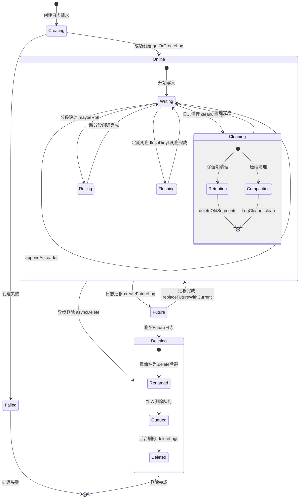
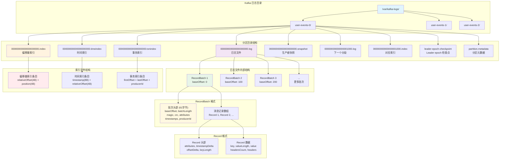
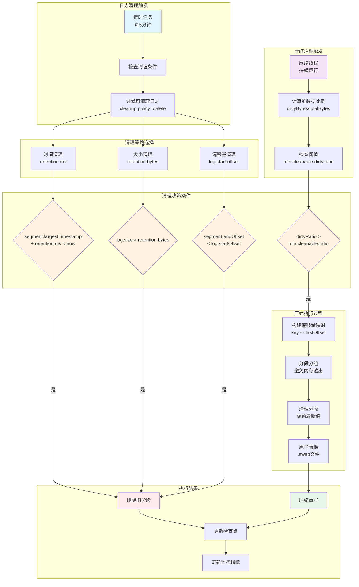

# Kafka LogManager 深度解析

## 概述

Kafka LogManager 是 Kafka 存储子系统的核心组件，负责管理所有分区的日志文件。它统一管理日志的创建、检索、清理、压缩等操作，是 Kafka 高性能存储的基础。本文将深入分析 LogManager 的架构设计、核心功能和实现机制。

## 目录

1. [架构概览](#架构概览) - 整体架构图和生命周期流程图
2. [核心架构](#核心架构) - LogManager 类设计和核心组件
3. [日志管理](#日志管理) - 日志创建、检索和删除
4. [UnifiedLog 设计](#unifiedlog-设计) - 统一日志的核心实现
5. [日志清理系统](#日志清理系统) - 保留期清理和压缩清理
6. [调度任务管理](#调度任务管理) - 后台任务调度和执行
7. [目录管理](#目录管理) - 多目录支持和故障处理
8. [配置管理](#配置管理) - 动态配置和参数调优
9. [性能优化](#性能优化) - 性能调优和监控指标
10. [故障处理](#故障处理) - 错误处理和恢复机制
11. [总结](#总结) - 核心特点和最佳实践

## 架构概览

### Kafka LogManager 架构图

```mermaid
graph TB
    subgraph "LogManager 核心组件"
        LM[LogManager]
        CL["currentLogs<br/>ConcurrentHashMap"]
        FL["futureLogs<br/>ConcurrentHashMap"]
        LTBD["logsToBeDeleted<br/>Queue"]
        LOCK[logCreationOrDeletionLock]
    end

    subgraph "日志目录管理"
        LD["logDirs<br/>Seq[File]"]
        DID["directoryIds<br/>Map"]
        ODL["offlineLogDirs<br/>Set"]
        LDFC[logDirFailureChannel]
    end

    subgraph "UnifiedLog 组件"
        UL[UnifiedLog]
        LL[LocalLog]
        LS[LogSegments]
        AS[ActiveSegment]
        PSM[ProducerStateManager]
        LEC[LeaderEpochCache]
    end

    subgraph "日志清理系统"
        LC[LogCleaner]
        LCM[LogCleanerManager]
        CT[CleanerThreads]
        OM[OffsetMap]
        CP[Checkpoints]
    end

    subgraph "调度任务"
        SCH[Scheduler]
        RT[RetentionTask]
        FT[FlushTask]
        DT[DeleteTask]
        CPT[CheckpointTask]
    end

    subgraph "配置管理"
        CR[ConfigRepository]
        DC[DefaultConfig]
        TC[TopicConfigs]
        CC[CleanerConfig]
    end

    LM --> CL
    LM --> FL
    LM --> LTBD
    LM --> LOCK

    LM --> LD
    LM --> DID
    LM --> ODL
    LM --> LDFC

    CL --> UL
    FL --> UL
    UL --> LL
    UL --> LS
    UL --> AS
    UL --> PSM
    UL --> LEC

    LM --> LC
    LC --> LCM
    LC --> CT
    LC --> OM
    LC --> CP

    LM --> SCH
    SCH --> RT
    SCH --> FT
    SCH --> DT
    SCH --> CPT

    LM --> CR
    CR --> DC
    CR --> TC
    LM --> CC

    style LM fill:#e1f5fe
    style UL fill:#f3e5f5
    style LC fill:#fff3e0
    style SCH fill:#e8f5e8
    style CR fill:#fff8e1
```



上图展示了 LogManager 的核心架构，包括：
- **LogManager 核心组件**: 日志映射、删除队列、同步锁等
- **日志目录管理**: 多目录支持、目录ID、故障检测等
- **UnifiedLog 组件**: 统一日志、本地日志、分段管理等
- **日志清理系统**: 清理器、管理器、压缩线程等
- **调度任务**: 保留、刷盘、删除、检查点等任务
- **配置管理**: 配置仓库、默认配置、主题配置等

### Kafka 日志生命周期流程图



上图展示了日志从创建到删除的完整生命周期，包括在线状态下的写入、滚动、刷盘、清理等操作。

## 核心架构

### 1. LogManager 类设计

LogManager 是 Kafka 日志管理的入口点，负责日志的创建、检索和清理：

```scala
class LogManager(logDirs: Seq[File],
                initialOfflineDirs: Seq[File],
                configRepository: ConfigRepository,
                initialDefaultConfig: LogConfig,
                cleanerConfig: CleanerConfig,
                scheduler: Scheduler, ...) extends Logging {
  
  // 核心数据结构
  private val currentLogs = new ConcurrentHashMap[TopicPartition, UnifiedLog]()
  private val futureLogs = new ConcurrentHashMap[TopicPartition, UnifiedLog]()
  private val logsToBeDeleted = new LinkedBlockingQueue[(UnifiedLog, Long)]()
  private val logCreationOrDeletionLock = new Object
}
```

**源码位置**: `core/src/main/scala/kafka/log/LogManager.scala:62-90`

**核心功能**: 
- **日志映射管理**: currentLogs 存储当前活跃日志，futureLogs 存储迁移中的日志
- **删除队列**: logsToBeDeleted 管理待删除的日志，支持延迟删除
- **并发控制**: logCreationOrDeletionLock 确保日志创建和删除的线程安全

### 2. 启动和初始化

LogManager 启动时会初始化各种后台任务：

```scala
def startup(topicNames: Set[String]): Unit = {
  // 启动调度任务
  if (scheduler != null) {
    // 日志清理任务
    scheduler.schedule("kafka-log-retention", () => cleanupLogs(), 
                      initialTaskDelayMs, retentionCheckMs)
    
    // 日志刷盘任务  
    scheduler.schedule("kafka-log-flusher", () => flushDirtyLogs(),
                      initialTaskDelayMs, flushCheckMs)
    
    // 检查点任务
    scheduler.schedule("kafka-recovery-point-checkpoint", 
                      () => checkpointLogRecoveryOffsets(),
                      initialTaskDelayMs, flushRecoveryOffsetCheckpointMs)
    
    // 日志删除任务
    scheduler.scheduleOnce("kafka-delete-logs", () => deleteLogs(),
                          initialTaskDelayMs)
  }
  
  // 启动日志清理器
  if (cleanerConfig.enableCleaner) {
    _cleaner = new LogCleaner(cleanerConfig, liveLogDirs, currentLogs, ...)
    _cleaner.startup()
  }
}
```

**源码位置**: `core/src/main/scala/kafka/log/LogManager.scala:604-636`

**核心功能**: 
- **任务调度**: 启动保留、刷盘、检查点、删除等后台任务
- **清理器启动**: 初始化日志压缩清理器
- **周期执行**: 所有任务都按配置的间隔周期执行

## 日志管理

### 1. 日志创建和获取

LogManager 通过 `getOrCreateLog` 方法统一管理日志的创建：

```scala
def getOrCreateLog(topicPartition: TopicPartition, 
                  isNew: Boolean = false, 
                  isFuture: Boolean = false,
                  topicId: Optional[Uuid]): UnifiedLog = {
  logCreationOrDeletionLock synchronized {
    val log = getLog(topicPartition, isFuture).getOrElse {
      // 检查离线目录
      if (!isNew && offlineLogDirs.nonEmpty)
        throw new KafkaStorageException("Can't create log - offline dirs exist")
      
      // 选择日志目录
      val logDir = logDirs.iterator
        .map(createLogDirectory(_, logDirName))
        .find(_.isSuccess)
        .getOrElse(throw new KafkaStorageException("No log directories available"))
        .get
      
      // 创建 UnifiedLog
      val config = fetchLogConfig(topicPartition.topic)
      val log = UnifiedLog.create(logDir, config, 0L, 0L, scheduler, ...)
      
      // 注册到映射中
      if (isFuture) futureLogs.put(topicPartition, log)
      else currentLogs.put(topicPartition, log)
      
      log
    }
    log
  }
}
```

**源码位置**: `core/src/main/scala/kafka/log/LogManager.scala:1010-1072`

**核心功能**: 
- **目录选择**: 自动选择可用的日志目录创建日志
- **配置获取**: 从配置仓库获取主题特定的日志配置
- **线程安全**: 通过同步锁确保并发创建的安全性
- **Future 日志**: 支持创建用于迁移的 Future 日志

### 2. 日志异步删除

日志删除采用异步方式，先重命名再延迟删除：

```scala
def asyncDelete(topicPartition: TopicPartition,
               isFuture: Boolean = false,
               checkpoint: Boolean = true): Option[UnifiedLog] = {
  val removedLog = logCreationOrDeletionLock synchronized {
    removeLogAndMetrics(if (isFuture) futureLogs else currentLogs, topicPartition)
  }
  
  removedLog.foreach { log =>
    // 重命名为 .delete 后缀
    log.renameDir(UnifiedLog.logDeleteDirName(topicPartition), false)
    
    // 加入删除队列
    addLogToBeDeleted(log)
    
    info(s"Log for partition ${log.topicPartition} is renamed to ${log.dir.getAbsolutePath} " +
         s"and is scheduled for deletion")
    
    // 更新检查点
    if (checkpoint) {
      val logDir = log.parentDirFile
      val logsToCheckpoint = logsInDir(logDir)
      checkpointRecoveryOffsetsInDir(logDir, logsToCheckpoint)
      checkpointLogStartOffsetsInDir(logDir, logsToCheckpoint)
    }
  }
  removedLog
}
```

**源码位置**: `core/src/main/scala/kafka/log/LogManager.scala:1277-1307`

**核心功能**: 
- **异步删除**: 先重命名后删除，避免阻塞主线程
- **队列管理**: 使用删除队列管理待删除的日志
- **检查点更新**: 删除后更新相关的检查点文件
- **日志记录**: 详细记录删除操作便于追踪

## UnifiedLog 设计

### 1. UnifiedLog 核心结构

UnifiedLog 是 Kafka 中单个分区日志的抽象，统一管理本地和远程日志：

```scala
class UnifiedLog(val logStartOffset: Long,
                val localLog: LocalLog,
                val brokerTopicStats: BrokerTopicStats,
                val producerStateManager: ProducerStateManager,
                val leaderEpochCache: LeaderEpochFileCache, ...) {
  
  // 高水位管理
  @volatile private var highWatermarkMetadata: LogOffsetMetadata = _
  
  // 日志分段
  def logSegments: Iterable[LogSegment] = localLog.segments.values
  
  // 活跃分段
  def activeSegment: LogSegment = localLog.segments.activeSegment
}
```

**源码位置**: `storage/src/main/java/org/apache/kafka/storage/internals/log/UnifiedLog.java:163-174`

**核心功能**:
- **统一视图**: 提供本地和远程日志的统一访问接口
- **状态管理**: 管理高水位、LEO、生产者状态等
- **分段管理**: 管理多个日志分段的读写操作

### 2. 日志写入操作

UnifiedLog 的写入操作是 Kafka 性能的关键：

```java
public LogAppendInfo appendAsLeader(MemoryRecords records,
                                   int leaderEpoch,
                                   AppendOrigin origin) {
  // 验证和分配偏移量
  boolean validateAndAssignOffsets = origin != AppendOrigin.RAFT_LEADER;

  synchronized (lock) {
    // 检查日志是否关闭
    localLog.checkIfMemoryMappedBufferClosed();

    if (validateAndAssignOffsets) {
      // 分配偏移量
      LongRef offset = LongRef.of(localLog.logEndOffset());
      appendInfo = analyzeAndValidateRecords(records, origin, offset);

      // 分配偏移量和时间戳
      validRecords = assignOffsetsNonCompacted(validRecords, offset);
    }

    // 检查是否需要滚动新分段
    LogSegment segment = maybeRoll(messagesSize, appendInfo);

    // 追加到活跃分段
    segment.append(appendInfo.lastOffset, appendInfo.maxTimestamp,
                  appendInfo.offsetOfMaxTimestamp, validRecords);

    // 更新高水位
    updateHighWatermarkWithLogEndOffset();

    return appendInfo;
  }
}
```

**源码位置**: `storage/src/main/java/org/apache/kafka/storage/internals/log/UnifiedLog.java:1015-1120`

**核心功能**:
- **偏移量分配**: 为每条消息分配唯一的偏移量
- **分段滚动**: 根据大小和时间策略自动滚动新分段
- **原子写入**: 通过同步锁确保写入操作的原子性
- **高水位更新**: 写入后立即更新高水位

### 3. 日志读取操作

日志读取支持多种隔离级别：

```java
public FetchDataInfo read(long startOffset,
                         int maxLength,
                         FetchIsolation isolation,
                         boolean minOneMessage) {
  checkLogStartOffset(startOffset);

  // 根据隔离级别确定最大偏移量
  LogOffsetMetadata maxOffsetMetadata = switch (isolation) {
    case LOG_END -> localLog.logEndOffsetMetadata();
    case HIGH_WATERMARK -> fetchHighWatermarkMetadata();
    case TXN_COMMITTED -> fetchLastStableOffsetMetadata();
  };

  return localLog.read(startOffset, maxLength, minOneMessage,
                      maxOffsetMetadata, isolation == FetchIsolation.TXN_COMMITTED);
}
```

**源码位置**: `storage/src/main/java/org/apache/kafka/storage/internals/log/UnifiedLog.java:1586-1597`

**核心功能**:
- **隔离级别**: 支持 LOG_END、HIGH_WATERMARK、TXN_COMMITTED 三种隔离级别
- **范围检查**: 验证读取偏移量的有效性
- **事务支持**: 支持事务隔离的读取操作

## 磁盘存储格式详解

### Kafka 磁盘存储结构图



上图展示了 Kafka 在磁盘上的完整存储结构，从顶层的日志目录到底层的消息记录格式。

### 1. 日志目录结构

Kafka 在磁盘上的存储采用分层结构，每个分区对应一个目录：

```bash
# 典型的 Kafka 日志目录结构
/var/kafka-logs/
├── user-events-0/                    # Topic "user-events" 分区 0
│   ├── 00000000000000000000.log      # 日志文件：存储实际消息
│   ├── 00000000000000000000.index    # 偏移量索引：快速定位消息
│   ├── 00000000000000000000.timeindex # 时间索引：基于时间查找
│   ├── 00000000000000000000.txnindex # 事务索引：事务状态信息
│   ├── 00000000000000000000.snapshot # 生产者快照：幂等性保证
│   ├── leader-epoch-checkpoint       # Leader epoch 检查点
│   ├── partition.metadata            # 分区元数据
│   ├── 00000000000000001000.log      # 下一个日志分段
│   ├── 00000000000000001000.index    # 对应的索引文件
│   └── ...
├── user-events-1/                    # 分区 1
└── user-events-2/                    # 分区 2
```

**核心特点**:
- **分区隔离**: 每个分区独立的目录，便于管理和迁移
- **分段存储**: 大文件分割为多个分段，提高 I/O 效率
- **索引加速**: 多种索引文件支持快速查找
- **检查点机制**: 保证数据一致性和快速恢复

### 2. 日志文件格式（.log）

日志文件存储实际的消息数据，采用批次（RecordBatch）格式：

```java
// RecordBatch 在磁盘上的二进制格式
public class RecordBatchFormat {
    // 批次头部（61 字节固定长度）
    long baseOffset;          // 8 字节：批次起始偏移量
    int batchLength;          // 4 字节：批次总长度（不包括 baseOffset 和 batchLength）
    int partitionLeaderEpoch; // 4 字节：分区 Leader epoch
    byte magic;               // 1 字节：格式版本（当前为 2）
    int crc;                  // 4 字节：CRC32 校验和
    short attributes;         // 2 字节：属性标志位
    int lastOffsetDelta;      // 4 字节：最后一条消息的偏移量增量
    long baseTimestamp;       // 8 字节：批次基准时间戳
    long maxTimestamp;        // 8 字节：批次最大时间戳
    long producerId;          // 8 字节：生产者 ID
    short producerEpoch;      // 2 字节：生产者 epoch
    int baseSequence;         // 4 字节：基准序列号
    int recordsCount;         // 4 字节：记录数量

    // 变长部分：实际的消息记录
    Record[] records;         // 变长：消息记录数组
}
```

**源码位置**: `clients/src/main/java/org/apache/kafka/common/record/DefaultRecordBatch.java:47-61`

**核心功能**:
- **批次压缩**: 支持 gzip、snappy、lz4、zstd 压缩算法
- **事务支持**: 通过 producerId 和 attributes 支持事务语义
- **校验保证**: CRC32 校验确保数据完整性
- **时间戳**: 支持 CreateTime 和 LogAppendTime 两种时间戳类型

### 3. 偏移量索引格式（.index）

偏移量索引提供从逻辑偏移量到物理位置的快速映射：

```java
// OffsetIndex 条目格式（8 字节固定长度）
public class OffsetIndexEntry {
    int relativeOffset;    // 4 字节：相对于基准偏移量的偏移量
    int position;          // 4 字节：在日志文件中的物理位置
}

// 索引查找实现
public OffsetPosition lookup(long targetOffset) {
    ByteBuffer idx = mmap().duplicate();
    int slot = binarySearch(idx, targetOffset);  // 二分查找
    if (slot == -1)
        return new OffsetPosition(baseOffset(), 0);
    else
        return parseEntry(idx, slot);
}
```

**源码位置**: `storage/src/main/java/org/apache/kafka/storage/internals/log/OffsetIndex.java:44-47`

**核心功能**:
- **稀疏索引**: 不为每条消息建索引，根据配置间隔建立
- **相对偏移**: 使用相对偏移量节省空间（4字节 vs 8字节）
- **内存映射**: 使用 mmap 提高查找性能
- **二分查找**: O(log n) 时间复杂度的快速查找

### 4. 时间索引格式（.timeindex）

时间索引支持基于时间戳的消息查找：

```java
// TimeIndex 条目格式（12 字节固定长度）
public class TimeIndexEntry {
    long timestamp;        // 8 字节：时间戳
    int relativeOffset;    // 4 字节：相对偏移量
}

// 时间索引查找
public TimestampOffset lookup(long targetTimestamp) {
    int slot = binarySearchByTimestamp(targetTimestamp);
    if (slot == -1)
        return new TimestampOffset(NO_TIMESTAMP, baseOffset());
    else
        return parseEntry(slot);
}
```

**源码位置**: `storage/src/main/java/org/apache/kafka/storage/internals/log/TimeIndex.java:35-37`

**核心功能**:
- **时间查找**: 支持基于时间戳的消息检索
- **稀疏映射**: 记录时间戳到偏移量的映射关系
- **范围查询**: 支持时间范围内的消息查找

### 5. 事务索引格式（.txnindex）

事务索引跟踪事务的提交和中止状态：

```java
// TransactionIndex 条目格式
public class TxnIndexEntry {
    long firstOffset;      // 8 字节：事务起始偏移量
    long lastOffset;       // 8 字节：事务结束偏移量
    long producerId;       // 8 字节：生产者 ID
    boolean isAborted;     // 1 字节：是否中止
}
```

**核心功能**:
- **事务跟踪**: 记录每个事务的起始和结束位置
- **状态标记**: 标记事务是提交还是中止
- **隔离读取**: 支持 read_committed 隔离级别

### 6. 消息记录格式

单条消息记录的格式（在 RecordBatch 内部）：

```java
// Record 格式（变长）
public class RecordFormat {
    // 记录头部
    byte attributes;          // 1 字节：属性（未使用）
    long timestampDelta;      // 变长：时间戳增量（VarLong）
    int offsetDelta;          // 变长：偏移量增量（VarInt）
    int keyLength;            // 变长：Key 长度（VarInt）
    byte[] key;               // 变长：消息 Key
    int valueLength;          // 变长：Value 长度（VarInt）
    byte[] value;             // 变长：消息 Value
    int headersCount;         // 变长：Header 数量（VarInt）
    Header[] headers;         // 变长：Header 数组
}

// Header 格式
public class HeaderFormat {
    int keyLength;            // 变长：Header Key 长度（VarInt）
    byte[] key;               // 变长：Header Key
    int valueLength;          // 变长：Header Value 长度（VarInt）
    byte[] value;             // 变长：Header Value
}
```

**核心功能**:
- **变长编码**: 使用 VarInt/VarLong 节省空间
- **增量存储**: 时间戳和偏移量使用增量存储
- **Header 支持**: 支持自定义 Header 信息
- **压缩友好**: 格式设计便于压缩算法处理

### 7. 生产者快照格式（.snapshot）

生产者快照文件记录生产者状态，用于幂等性和事务支持：

```java
// ProducerSnapshot 格式
public class ProducerSnapshotFormat {
    short version;            // 2 字节：快照版本
    int crc;                  // 4 字节：CRC32 校验和
    long snapshotId;          // 8 字节：快照 ID
    long lastOffset;          // 8 字节：最后偏移量

    // 生产者条目数组
    int producerEntriesCount; // 4 字节：生产者条目数量
    ProducerEntry[] entries;  // 变长：生产者条目数组
}

// ProducerEntry 格式
public class ProducerEntry {
    long producerId;          // 8 字节：生产者 ID
    short epoch;              // 2 字节：生产者 epoch
    int lastSequence;         // 4 字节：最后序列号
    long lastOffset;          // 8 字节：最后偏移量
    int offsetDelta;          // 4 字节：偏移量增量
    long timestamp;           // 8 字节：时间戳
    long coordinatorEpoch;    // 8 字节：协调器 epoch
    short currentTxnFirstOffset; // 2 字节：当前事务起始偏移量
}
```

**源码位置**: `storage/bin/main/message/ProducerSnapshot.json:28-63`

**核心功能**:
- **幂等性保证**: 防止消息重复
- **事务状态**: 跟踪事务的进行状态
- **快速恢复**: 重启时快速恢复生产者状态

### 8. 文件命名规则

Kafka 使用严格的文件命名规则来组织存储：

```bash
# 文件命名格式：{baseOffset}.{extension}
00000000000000000000.log        # 起始偏移量为 0 的日志文件
00000000000000000000.index      # 对应的偏移量索引
00000000000000000000.timeindex  # 对应的时间索引
00000000000000001000.log        # 起始偏移量为 1000 的日志文件

# 特殊后缀
00000000000000000000.log.deleted    # 标记为删除的文件
00000000000000000000.log.cleaned    # 清理过程中的临时文件
00000000000000000000.log.swap       # 压缩过程中的交换文件

# 检查点文件
recovery-point-offset-checkpoint     # 恢复点检查点
log-start-offset-checkpoint         # 起始偏移量检查点
replication-offset-checkpoint       # 复制偏移量检查点
```

**核心功能**:
- **有序命名**: 文件名反映偏移量顺序，便于管理
- **状态标识**: 通过后缀标识文件状态
- **原子操作**: 通过重命名实现原子操作

### 9. 内存映射和 I/O 优化

Kafka 大量使用内存映射文件来优化 I/O 性能：

```java
// FileRecords 中的内存映射实现
public class FileRecords {
    private final FileChannel channel;
    private final AtomicInteger size;

    // 内存映射读取
    public FetchDataInfo read(int startPosition, int size) {
        // 使用 FileChannel.map() 进行内存映射
        MappedByteBuffer buffer = channel.map(FileChannel.MapMode.READ_ONLY,
                                             startPosition, size);
        return new FetchDataInfo(new FileChannelRecordBatch(...));
    }

    // 零拷贝写入
    public int append(MemoryRecords records) {
        return records.writeFullyTo(channel);  // 直接写入 FileChannel
    }
}

// 索引文件的内存映射
public abstract class AbstractIndex {
    protected final MappedByteBuffer mmap;

    protected AbstractIndex(File file, long baseOffset, int maxIndexSize) {
        this.mmap = channel.map(FileChannel.MapMode.READ_WRITE, 0, maxIndexSize);
    }
}
```

**源码位置**: `clients/src/main/java/org/apache/kafka/common/record/FileRecords.java:185-201`

**核心功能**:
- **零拷贝**: 减少用户态和内核态之间的数据拷贝
- **内存映射**: 将文件映射到内存，提高访问速度
- **页缓存**: 利用操作系统的页缓存机制
- **顺序 I/O**: 优化为顺序读写，提高磁盘效率

### 10. 存储配置参数

关键的存储相关配置参数：

```properties
# 日志分段配置
log.segment.bytes=1073741824              # 日志分段大小（1GB）
log.segment.ms=604800000                  # 日志分段时间（7天）
log.index.interval.bytes=4096             # 索引间隔字节数
log.index.size.max.bytes=10485760         # 最大索引文件大小（10MB）

# 刷盘配置
log.flush.interval.messages=9223372036854775807  # 刷盘消息间隔
log.flush.interval.ms=null                # 刷盘时间间隔
log.flush.scheduler.interval.ms=9223372036854775807  # 刷盘调度间隔

# 清理配置
log.retention.bytes=-1                    # 日志保留大小
log.retention.ms=604800000                # 日志保留时间（7天）
log.cleanup.policy=delete                 # 清理策略（delete/compact）

# 压缩配置
compression.type=producer                 # 压缩类型
log.cleaner.enable=true                   # 启用日志清理器
log.cleaner.threads=1                     # 清理线程数
```

**核心功能**:
- **性能调优**: 通过参数调优优化存储性能
- **容量管理**: 控制磁盘空间使用
- **数据保留**: 配置数据保留策略
- **压缩优化**: 优化存储空间使用

### 11. 实际存储示例

以下是一个实际的 Kafka 分区目录示例，展示文件大小和内容：

```bash
# 查看分区目录
$ ls -la /var/kafka-logs/user-events-0/
-rw-r--r-- 1 kafka kafka 1073741824 Dec 15 10:30 00000000000000000000.log
-rw-r--r-- 1 kafka kafka   10485760 Dec 15 10:30 00000000000000000000.index
-rw-r--r-- 1 kafka kafka    1048576 Dec 15 10:30 00000000000000000000.timeindex
-rw-r--r-- 1 kafka kafka      10240 Dec 15 10:30 00000000000000000000.txnindex
-rw-r--r-- 1 kafka kafka       4096 Dec 15 10:30 00000000000000000000.snapshot
-rw-r--r-- 1 kafka kafka  536870912 Dec 15 11:15 00000000000000100000.log
-rw-r--r-- 1 kafka kafka    5242880 Dec 15 11:15 00000000000000100000.index
-rw-r--r-- 1 kafka kafka     524288 Dec 15 11:15 00000000000000100000.timeindex
-rw-r--r-- 1 kafka kafka        256 Dec 15 10:25 leader-epoch-checkpoint
-rw-r--r-- 1 kafka kafka        128 Dec 15 10:25 partition.metadata

# 查看日志文件内容（二进制转十六进制）
$ hexdump -C 00000000000000000000.log | head -5
00000000  00 00 00 00 00 00 00 00  00 00 00 52 00 00 00 01  |...........R....|
00000010  02 4e 84 7a 00 00 00 00  00 00 00 01 01 7f 8b 2c  |.N.z...........,|
00000020  3d 01 7f 8b 2c 3d 00 00  00 00 00 00 00 01 00 00  |=...,=..........|
00000030  00 00 00 00 00 01 00 00  00 00 14 00 00 00 01 08  |................|
00000040  75 73 65 72 31 00 00 00  0c 48 65 6c 6c 6f 20 57  |user1....Hello W|

# 查看索引文件内容
$ hexdump -C 00000000000000000000.index | head -3
00000000  00 00 00 00 00 00 00 00  00 00 00 64 00 00 00 52  |...........d...R|
00000010  00 00 00 c8 00 00 00 a4  00 00 01 2c 00 00 00 f6  |...........,....|
00000020  00 00 01 90 00 00 01 48  00 00 01 f4 00 00 01 9a  |.......H........|
```

**解析说明**:
- **日志文件**: 包含实际的消息数据，以 RecordBatch 格式存储
- **索引文件**: 每 8 字节一个条目，前 4 字节是相对偏移量，后 4 字节是物理位置
- **文件大小**: 日志文件达到 1GB 时会滚动到新分段

### 12. 存储性能特征

Kafka 的存储设计具有以下性能特征：

```java
// 顺序写入性能测试
public class SequentialWritePerformance {
    public void testSequentialWrite() {
        // Kafka 的顺序写入可以达到磁盘的理论最大吞吐量
        // 机械硬盘：~100-200 MB/s
        // SSD：~500-1000 MB/s
        // NVMe SSD：~2000-7000 MB/s

        long startTime = System.currentTimeMillis();
        for (int i = 0; i < 1000000; i++) {
            // 模拟 Kafka 的顺序写入
            fileChannel.write(buffer);
        }
        long duration = System.currentTimeMillis() - startTime;

        // Kafka 通过以下优化实现高性能：
        // 1. 顺序 I/O：避免随机寻道
        // 2. 批量写入：减少系统调用
        // 3. 零拷贝：减少内存拷贝
        // 4. 页缓存：利用操作系统缓存
    }
}
```

**性能优势**:
- **顺序 I/O**: 比随机 I/O 快 100-1000 倍
- **批量操作**: 减少系统调用开销
- **零拷贝**: 使用 sendfile() 系统调用
- **页缓存**: 充分利用操作系统的页缓存机制

### 13. 存储空间优化

Kafka 提供多种存储空间优化策略：

```properties
# 压缩配置
compression.type=lz4                     # 使用 LZ4 压缩（速度快）
compression.type=gzip                    # 使用 GZIP 压缩（压缩率高）
compression.type=snappy                  # 使用 Snappy 压缩（平衡）
compression.type=zstd                    # 使用 ZSTD 压缩（最新，效果好）

# 日志压缩
log.cleanup.policy=compact               # 启用日志压缩
log.cleaner.min.compaction.lag.ms=0     # 压缩延迟时间
log.cleaner.max.compaction.lag.ms=9223372036854775807  # 最大压缩延迟

# 分段优化
log.segment.bytes=134217728               # 较小的分段（128MB）
log.index.interval.bytes=4096             # 索引间隔
```

**优化效果**:
- **压缩比**: LZ4(2-3x), Snappy(2-4x), GZIP(3-5x), ZSTD(3-6x)
- **日志压缩**: 对于有重复 key 的数据，可节省 50-90% 空间
- **索引优化**: 稀疏索引平衡查找速度和空间使用

### 4. 分段滚动机制

日志分段的滚动是性能优化的重要机制：

```java
private LogSegment maybeRoll(int messagesSize, LogAppendInfo appendInfo) {
  synchronized (lock) {
    LogSegment segment = localLog.segments().activeSegment();
    long now = time().milliseconds();

    // 检查是否需要滚动
    if (segment.shouldRoll(new RollParams(
        config().maxSegmentMs(),     // 最大时间
        config().segmentSize(),      // 最大大小
        appendInfo.maxTimestamp(),   // 最大时间戳
        appendInfo.lastOffset(),     // 最后偏移量
        messagesSize,                // 消息大小
        now))) {                     // 当前时间

      // 创建新分段
      LogSegment newSegment = localLog.roll(Optional.of(appendInfo.lastOffset + 1));

      // 异步刷盘旧分段
      scheduler().scheduleOnce("flush-log", () -> {
        flushUptoOffsetExclusive(newSegment.baseOffset());
      });

      return newSegment;
    }
    return segment;
  }
}
```

**源码位置**: `storage/src/main/java/org/apache/kafka/storage/internals/log/UnifiedLog.java:2034-2112`

**核心功能**:
- **滚动条件**: 基于时间、大小、索引等多个条件判断是否滚动
- **异步刷盘**: 滚动时异步刷盘旧分段，不阻塞写入
- **新分段创建**: 自动创建新的活跃分段

## 日志清理系统

### 1. 保留期清理

LogManager 定期执行保留期清理，删除过期的日志分段：

```scala
private def cleanupLogs(): Unit = {
  debug("Beginning log cleanup...")
  var total = 0
  val startMs = time.milliseconds

  // 获取可删除的日志
  val deletableLogs = if (cleaner != null) {
    cleaner.pauseCleaningForNonCompactedPartitions()
  } else {
    currentLogs.entrySet().stream()
      .filter(e => !e.getValue.config.compact)
      .collect(Collectors.toMap(_.getKey, _.getValue))
  }

  try {
    deletableLogs.forEach { case (topicPartition, log) =>
      debug(s"Garbage collecting '${log.name}'")
      total += log.deleteOldSegments()

      // 清理 Future 日志
      val futureLog = futureLogs.get(topicPartition)
      if (futureLog != null) {
        total += futureLog.deleteOldSegments()
      }
    }
  } finally {
    if (cleaner != null) {
      cleaner.resumeCleaning(deletableLogs.keySet())
    }
  }

  debug(s"Log cleanup completed. $total files deleted in " +
        (time.milliseconds - startMs) / 1000 + " seconds")
}
```

**源码位置**: `core/src/main/scala/kafka/log/LogManager.scala:1380-1421`

**核心功能**:
- **清理协调**: 与压缩清理器协调，避免冲突
- **批量处理**: 批量处理多个分区的清理操作
- **性能统计**: 记录清理耗时和删除文件数量

### 2. 压缩清理

LogCleaner 负责执行日志压缩清理：

```java
public Map.Entry<Long, CleanerStats> clean(LogToClean cleanable) {
  UnifiedLog log = cleanable.log();

  info("Beginning cleaning of log {}", log.name());

  // 构建偏移量映射
  OffsetMap offsetMap = buildOffsetMap(log, cleanable.firstDirtyOffset(),
                                      cleanable.firstUncleanableOffset());

  // 分组清理分段
  List<List<LogSegment>> groupedSegments = groupSegmentsBySize(
    log.logSegments(0, endOffset), log.config().segmentSize(),
    log.config().maxIndexSize, cleanable.firstUncleanableOffset());

  for (List<LogSegment> group : groupedSegments) {
    cleanSegments(log, group, offsetMap, currentTime, stats, ...);
  }

  return Map.entry(endOffset, stats);
}
```

**源码位置**: `storage/src/main/java/org/apache/kafka/storage/internals/log/Cleaner.java:126-181`

**核心功能**:
- **偏移量映射**: 构建 key -> 最新偏移量的映射
- **分段分组**: 将分段按大小分组进行清理
- **增量清理**: 只清理脏数据部分，提高效率

### 3. 清理器管理

LogCleanerManager 管理清理任务的调度和执行：

```java
public Optional<LogToClean> grabFilthiestCompactedLog(Time time, PreCleanStats preCleanStats) {
  return inLock(lock, () -> {
    long now = time.milliseconds();
    Map<TopicPartition, Long> lastClean = allCleanerCheckpoints();

    // 找出最脏的日志
    List<LogToClean> dirtyLogs = logs.entrySet().stream()
      .filter(entry -> entry.getValue().config().compact &&
                      !inProgress.containsKey(entry.getKey()) &&
                      !isUncleanablePartition(entry.getValue(), entry.getKey()))
      .map(entry -> {
        TopicPartition tp = entry.getKey();
        UnifiedLog log = entry.getValue();
        Long lastCleanOffset = lastClean.get(tp);
        OffsetsToClean offsetsToClean = cleanableOffsets(log,
                                                        Optional.ofNullable(lastCleanOffset), now);
        return new LogToClean(tp, log, offsetsToClean.firstDirtyOffset,
                             offsetsToClean.firstUncleanableOffset);
      })
      .filter(ltc -> ltc.totalBytes() > 0)
      .sorted((ltc1, ltc2) -> Double.compare(ltc2.cleanableRatio(), ltc1.cleanableRatio()))
      .collect(Collectors.toList());

    // 选择最脏的日志进行清理
    if (!dirtyLogs.isEmpty()) {
      LogToClean filthiest = dirtyLogs.get(0);
      inProgress.put(filthiest.topicPartition(), LogCleaningState.LOG_CLEANING_IN_PROGRESS);
      return Optional.of(filthiest);
    }
    return Optional.empty();
  });
}
```

**源码位置**: `storage/src/main/java/org/apache/kafka/storage/internals/log/LogCleanerManager.java:240-299`

**核心功能**:
- **脏度计算**: 计算每个日志的脏数据比例
- **优先级排序**: 优先清理最脏的日志
- **状态管理**: 跟踪清理任务的执行状态

## 调度任务管理

### 1. 日志刷盘任务

定期将内存中的数据刷写到磁盘：

```scala
private def flushDirtyLogs(): Unit = {
  debug("Checking for dirty logs to flush...")

  for ((topicPartition, log) <- currentLogs.asScala.toList ++ futureLogs.asScala.toList) {
    try {
      val timeSinceLastFlush = time.milliseconds - log.lastFlushTime
      debug(s"Checking if flush is needed on ${topicPartition.topic} " +
            s"flush interval ${log.config.flushMs} last flushed ${log.lastFlushTime} " +
            s"time since last flush: $timeSinceLastFlush")

      if (timeSinceLastFlush >= log.config.flushMs)
        log.flush(false)
    } catch {
      case e: Throwable =>
        error(s"Error flushing topic ${topicPartition.topic}", e)
    }
  }
}
```

**源码位置**: `core/src/main/scala/kafka/log/LogManager.scala:1471-1486`

**核心功能**:
- **时间检查**: 检查距离上次刷盘的时间间隔
- **批量刷盘**: 遍历所有日志进行刷盘检查
- **异常处理**: 单个日志刷盘失败不影响其他日志

### 2. 检查点任务

定期保存恢复点和起始偏移量：

```scala
def checkpointLogRecoveryOffsets(): Unit = {
  liveLogDirs.foreach { logDir =>
    try {
      val logsToCheckpoint = logsInDir(logDir)
      checkpointRecoveryOffsetsInDir(logDir, logsToCheckpoint)
    } catch {
      case e: IOException =>
        logDirFailureChannel.maybeAddOfflineLogDir(logDir.getAbsolutePath,
                                                  s"Disk error while writing recovery offsets checkpoint in dir $logDir", e)
    }
  }
}

def checkpointLogStartOffsets(): Unit = {
  liveLogDirs.foreach { logDir =>
    try {
      val logsToCheckpoint = logsInDir(logDir)
      checkpointLogStartOffsetsInDir(logDir, logsToCheckpoint)
    } catch {
      case e: IOException =>
        logDirFailureChannel.maybeAddOfflineLogDir(logDir.getAbsolutePath,
                                                  s"Disk error while writing log start offsets checkpoint in dir $logDir", e)
    }
  }
}
```

**源码位置**: `core/src/main/scala/kafka/log/LogManager.scala:1488-1522`

**核心功能**:
- **恢复点检查点**: 保存每个分区的恢复点偏移量
- **起始偏移量检查点**: 保存每个分区的起始偏移量
- **故障检测**: 检查点失败时标记目录为离线

### 3. 延迟删除任务

处理删除队列中的日志：

```scala
private def deleteLogs(): Unit = {
  var nextDelayMs = 0L
  try {
    def deleteExpiredLogs(): Unit = {
      val (deletedLogs, remainingLogs) = logsToBeDeleted.asScala.partition { case (_, deleteMs) =>
        deleteMs <= time.milliseconds
      }

      deletedLogs.foreach { case (removedLog, _) =>
        try {
          removedLog.delete()
          info(s"Deleted log for partition ${removedLog.topicPartition} in ${removedLog.dir.getAbsolutePath}.")
        } catch {
          case e: KafkaStorageException =>
            error(s"Exception while deleting $removedLog in dir ${removedLog.dir.getParent}.", e)
        }
      }

      nextDelayMs = remainingLogs.headOption.map { case (_, deleteMs) =>
        math.max(0, deleteMs - time.milliseconds)
      }.getOrElse(currentDefaultConfig.fileDeleteDelayMs)
    }

    deleteExpiredLogs()
  } catch {
    case e: Throwable =>
      error("Exception in kafka-delete-logs thread.", e)
      nextDelayMs = currentDefaultConfig.fileDeleteDelayMs
  } finally {
    try {
      scheduler.scheduleOnce("kafka-delete-logs", () => deleteLogs(), nextDelayMs)
    } catch {
      case e: Throwable =>
        if (scheduler.isStarted) {
          error("Failed to schedule next delete in kafka-delete-logs thread", e)
          scheduler.scheduleOnce("kafka-delete-logs", () => deleteLogs(), currentDefaultConfig.fileDeleteDelayMs)
        }
    }
  }
}
```

**源码位置**: `core/src/main/scala/kafka/log/LogManager.scala:1354-1374`

**核心功能**:
- **延迟删除**: 根据配置的延迟时间删除日志
- **动态调度**: 根据下一个删除时间动态调度任务
- **异常恢复**: 删除失败时继续处理其他日志

## 日志管理策略详解

### Kafka 日志清理和压缩策略流程图



上图展示了 Kafka 日志清理和压缩的完整策略流程，包括触发条件、决策逻辑和执行过程。

### 1. 日志清理策略

#### 清理触发条件

Kafka 的日志清理基于多种触发条件，通过定时任务周期性执行：

```scala
// LogManager 启动时注册清理任务
scheduler.schedule("kafka-log-retention", () => cleanupLogs(),
                  initialTaskDelayMs, retentionCheckMs)

// 清理任务的核心逻辑
private def cleanupLogs(): Unit = {
  debug("Beginning log cleanup...")
  var total = 0
  val startMs = time.milliseconds

  // 获取可清理的日志（非压缩策略的日志）
  val deletableLogs = if (cleaner != null) {
    cleaner.pauseCleaningForNonCompactedPartitions()  // 暂停压缩清理
  } else {
    currentLogs.entrySet().stream()
      .filter(e => !e.getValue.config.compact)       // 只处理 delete 策略的日志
      .collect(Collectors.toMap(_.getKey, _.getValue))
  }

  try {
    deletableLogs.forEach { case (topicPartition, log) =>
      total += log.deleteOldSegments()  // 执行分段删除

      // 同时清理 Future 日志
      val futureLog = futureLogs.get(topicPartition)
      if (futureLog != null) {
        total += futureLog.deleteOldSegments()
      }
    }
  } finally {
    if (cleaner != null) {
      cleaner.resumeCleaning(deletableLogs.keySet())  // 恢复压缩清理
    }
  }
}
```

**源码位置**: `core/src/main/scala/kafka/log/LogManager.scala:1380-1421`

**触发条件**:
- **定时触发**: 默认每 5 分钟执行一次（`log.retention.check.interval.ms=300000`）
- **策略过滤**: 只清理配置为 `cleanup.policy=delete` 的日志
- **协调机制**: 与压缩清理器协调，避免冲突

#### 三种清理策略

UnifiedLog 实现了三种不同的清理策略：

```java
public int deleteOldSegments() throws IOException {
  if (config().delete) {
    return deleteLogStartOffsetBreachedSegments() +      // 1. 起始偏移量清理
           deleteRetentionSizeBreachedSegments() +       // 2. 大小限制清理
           deleteRetentionMsBreachedSegments();          // 3. 时间限制清理
  } else {
    return deleteLogStartOffsetBreachedSegments();       // 只执行起始偏移量清理
  }
}
```

**源码位置**: `storage/src/main/java/org/apache/kafka/storage/internals/log/UnifiedLog.java:1876-1884`

##### 1. 基于时间的清理

```java
private int deleteRetentionMsBreachedSegments() throws IOException {
  long retentionMs = UnifiedLog.localRetentionMs(config(), remoteLogEnabledAndRemoteCopyEnabled());
  if (retentionMs < 0) return 0;  // -1 表示不限制时间

  long startMs = time().milliseconds();

  DeletionCondition shouldDelete = (segment, nextSegmentOpt) -> {
    // 检查分段的最大时间戳是否超过保留期
    boolean delete = startMs - segment.largestTimestamp() > retentionMs;

    // 防止删除包含未来时间戳的分段
    if (startMs < segment.largestTimestamp()) {
      futureTimestampLogger.warn("{} contains future timestamp(s), making it ineligible to be deleted", segment);
    }

    return delete;
  };

  return deleteOldSegments(shouldDelete, deletionReason);
}
```

**源码位置**: `storage/src/main/java/org/apache/kafka/storage/internals/log/UnifiedLog.java:1890-1903`

**清理规则**:
- **时间基准**: 使用分段中最大的消息时间戳
- **保留期**: 通过 `retention.ms` 配置（默认 7 天）
- **安全检查**: 不删除包含未来时间戳的分段
- **远程存储**: 支持本地和远程存储的不同保留期

##### 2. 基于大小的清理

```java
private int deleteRetentionSizeBreachedSegments() throws IOException {
  long retentionSize = UnifiedLog.localRetentionSize(config(), remoteLogEnabledAndRemoteCopyEnabled());
  if (retentionSize < 0) return 0;  // -1 表示不限制大小

  long sizeSoFar = 0L;

  DeletionCondition shouldDelete = (segment, nextSegmentOpt) -> {
    if (nextSegmentOpt.isPresent()) {
      sizeSoFar += segment.size();
      // 从最老的分段开始，累计大小超过限制时删除
      return sizeSoFar > retentionSize;
    } else {
      // 保留最新的分段
      return false;
    }
  };

  return deleteOldSegments(shouldDelete, deletionReason);
}
```

**源码位置**: `storage/src/main/java/org/apache/kafka/storage/internals/log/UnifiedLog.java:1925-1957`

**清理规则**:
- **大小限制**: 通过 `retention.bytes` 配置
- **从老到新**: 从最老的分段开始删除
- **保留最新**: 始终保留最新的活跃分段
- **累计计算**: 累计删除直到满足大小限制

##### 3. 基于起始偏移量的清理

```java
private int deleteLogStartOffsetBreachedSegments() throws IOException {
  DeletionCondition shouldDelete = (segment, nextSegmentOpt) -> {
    // 删除完全在起始偏移量之前的分段
    return nextSegmentOpt.isPresent() && nextSegmentOpt.get().baseOffset() <= localLogStartOffset();
  };

  return deleteOldSegments(shouldDelete, deletionReason);
}
```

**源码位置**: `storage/src/main/java/org/apache/kafka/storage/internals/log/UnifiedLog.java:1959-1980`

**清理规则**:
- **强制清理**: 无论配置如何都会执行
- **偏移量基准**: 基于日志起始偏移量
- **完整分段**: 只删除完全在起始偏移量之前的分段

### 2. 日志压缩策略

#### 压缩触发条件

日志压缩通过专门的 LogCleaner 组件实现，具有复杂的触发和调度机制：

```java
// LogCleaner 的核心清理循环
private boolean cleanFilthiestLog() throws LogCleaningException {
  PreCleanStats preCleanStats = new PreCleanStats();

  // 选择最脏的日志进行清理
  Optional<LogToClean> ltc = cleanerManager.grabFilthiestCompactedLog(time, preCleanStats);

  if (ltc.isEmpty()) {
    return false;  // 没有需要清理的日志
  } else {
    LogToClean cleanable = ltc.get();
    cleanLog(cleanable);  // 执行压缩清理
    return true;
  }
}
```

**源码位置**: `storage/src/main/java/org/apache/kafka/storage/internals/log/LogCleaner.java:554-573`

#### 脏数据比例计算

LogCleanerManager 负责计算和选择最需要清理的日志：

```java
public Optional<LogToClean> grabFilthiestCompactedLog(Time time, PreCleanStats preCleanStats) {
  return inLock(lock, () -> {
    long now = time.milliseconds();
    Map<TopicPartition, Long> lastClean = allCleanerCheckpoints();

    // 计算所有可清理日志的脏数据比例
    List<LogToClean> dirtyLogs = logs.entrySet().stream()
      .filter(entry -> entry.getValue().config().compact &&           // 压缩策略
                      !inProgress.containsKey(entry.getKey()) &&      // 未在清理中
                      !isUncleanablePartition(entry.getValue(), entry.getKey()))  // 可清理
      .map(entry -> {
        TopicPartition tp = entry.getKey();
        UnifiedLog log = entry.getValue();
        Long lastCleanOffset = lastClean.get(tp);

        // 计算可清理的偏移量范围
        OffsetsToClean offsetsToClean = cleanableOffsets(log, Optional.ofNullable(lastCleanOffset), now);
        return new LogToClean(tp, log, offsetsToClean.firstDirtyOffset, offsetsToClean.firstUncleanableOffset);
      })
      .filter(ltc -> ltc.totalBytes() > 0)
      .sorted((ltc1, ltc2) -> Double.compare(ltc2.cleanableRatio(), ltc1.cleanableRatio()))  // 按脏数据比例排序
      .collect(Collectors.toList());

    // 应用清理阈值过滤
    List<LogToClean> cleanableLogs = dirtyLogs.stream()
      .filter(ltc -> (ltc.needCompactionNow() && ltc.cleanableBytes() > 0) ||  // 强制压缩
                    ltc.cleanableRatio() > ltc.log().config().minCleanableRatio)  // 超过阈值
      .toList();

    // 选择最脏的日志
    if (!cleanableLogs.isEmpty()) {
      LogToClean filthiest = cleanableLogs.get(0);
      inProgress.put(filthiest.topicPartition(), LogCleaningState.LOG_CLEANING_IN_PROGRESS);
      return Optional.of(filthiest);
    }
    return Optional.empty();
  });
}
```

**源码位置**: `storage/src/main/java/org/apache/kafka/storage/internals/log/LogCleanerManager.java:240-299`

**选择策略**:
- **脏数据比例**: `cleanableRatio = dirtyBytes / totalBytes`
- **最小阈值**: 必须超过 `min.cleanable.dirty.ratio`（默认 0.5）
- **强制压缩**: 某些条件下强制执行压缩
- **状态跟踪**: 防止同一日志被多个线程同时清理

#### 压缩执行过程

压缩清理的核心算法包括构建偏移量映射和重写日志分段：

```java
public Map.Entry<Long, CleanerStats> clean(LogToClean cleanable) throws IOException, DigestException {
  UnifiedLog log = cleanable.log();

  info("Beginning cleaning of log {}", log.name());

  // 1. 构建偏移量映射：key -> 最新偏移量
  OffsetMap offsetMap = buildOffsetMap(log, cleanable.firstDirtyOffset(), cleanable.firstUncleanableOffset());

  // 2. 按大小分组分段，避免内存溢出
  List<List<LogSegment>> groupedSegments = groupSegmentsBySize(
    log.logSegments(0, endOffset),
    log.config().segmentSize(),
    log.config().maxIndexSize,
    cleanable.firstUncleanableOffset()
  );

  // 3. 逐组清理分段
  for (List<LogSegment> group : groupedSegments) {
    cleanSegments(log, group, offsetMap, currentTime, stats, transactionMetadata, ...);
  }

  return Map.entry(endOffset, stats);
}
```

**源码位置**: `storage/src/main/java/org/apache/kafka/storage/internals/log/Cleaner.java:126-181`

**压缩步骤**:
1. **偏移量映射**: 构建 key -> 最新偏移量的映射表
2. **分段分组**: 按大小分组避免内存问题
3. **重写分段**: 只保留每个 key 的最新值
4. **原子替换**: 使用 .swap 文件确保原子性

### 3. 压缩配置参数

#### 核心压缩配置

```properties
# 压缩清理器配置
log.cleaner.enable=true                           # 启用日志清理器
log.cleaner.threads=1                             # 清理线程数
log.cleaner.io.max.bytes.per.second=1.7976931348623157E308  # I/O 限流
log.cleaner.dedupe.buffer.size=134217728          # 去重缓冲区大小（128MB）

# 压缩触发条件
log.cleaner.min.cleanable.ratio=0.5               # 最小可清理比例
log.cleaner.min.compaction.lag.ms=0               # 最小压缩延迟
log.cleaner.max.compaction.lag.ms=9223372036854775807  # 最大压缩延迟

# 删除保留配置
log.cleaner.delete.retention.ms=86400000          # 删除标记保留时间（1天）
```

#### 主题级别配置

```properties
# 主题特定的压缩配置
cleanup.policy=compact                            # 压缩策略
min.cleanable.dirty.ratio=0.5                    # 最小脏数据比例
segment.ms=604800000                              # 分段时间（7天）
delete.retention.ms=86400000                     # 删除保留时间
min.compaction.lag.ms=0                          # 最小压缩延迟
max.compaction.lag.ms=9223372036854775807        # 最大压缩延迟
```

**参数说明**:
- **min.cleanable.dirty.ratio**: 脏数据比例阈值，超过才触发压缩
- **min.compaction.lag.ms**: 消息写入后多久才能被压缩
- **max.compaction.lag.ms**: 消息最长多久必须被压缩
- **delete.retention.ms**: 删除标记（tombstone）的保留时间

### 4. 清理和压缩的协调机制

#### 清理器状态管理

LogCleanerManager 维护清理状态，确保清理和压缩操作的协调：

```java
// 清理状态枚举
public enum LogCleaningState {
  LOG_CLEANING_IN_PROGRESS,     // 正在清理中
  LOG_CLEANING_ABORTED,         // 清理已中止
  LOG_CLEANING_PAUSED           // 清理已暂停
}

// 状态管理方法
public void pauseCleaningForNonCompactedPartitions() {
  inLock(lock, () -> {
    pausedCleaningCount++;
    return logs.entrySet().stream()
      .filter(entry -> !entry.getValue().config().compact)
      .collect(Collectors.toMap(Map.Entry::getKey, Map.Entry::getValue));
  });
}

public void resumeCleaning(Collection<TopicPartition> topicPartitions) {
  inLock(lock, () -> {
    pausedCleaningCount = Math.max(0, pausedCleaningCount - 1);
    // 恢复指定分区的清理
    topicPartitions.forEach(tp -> inProgress.remove(tp));
    return null;
  });
}
```

**源码位置**: `storage/src/main/java/org/apache/kafka/storage/internals/log/LogCleanerManager.java:180-220`

**协调机制**:
- **互斥操作**: 保留清理和压缩清理不会同时进行
- **状态跟踪**: 跟踪每个分区的清理状态
- **暂停恢复**: 支持暂停和恢复清理操作

#### 清理检查点管理

清理器维护检查点文件记录清理进度：

```java
// 更新清理检查点
public void updateCheckpoints(File dataDir, Optional<Map.Entry<TopicPartition, Long>> partitionToUpdateOpt,
                             Optional<Set<TopicPartition>> partitionsToRemoveOpt) {
  inLock(lock, () -> {
    try {
      OffsetCheckpointFile checkpointFile = new OffsetCheckpointFile(new File(dataDir, "cleaner-offset-checkpoint"));
      Map<TopicPartition, Long> checkpoints = checkpointFile.read();

      // 更新指定分区的检查点
      partitionToUpdateOpt.ifPresent(entry -> checkpoints.put(entry.getKey(), entry.getValue()));

      // 移除指定分区的检查点
      partitionsToRemoveOpt.ifPresent(partitions -> partitions.forEach(checkpoints::remove));

      // 写回检查点文件
      checkpointFile.write(checkpoints);
    } catch (IOException e) {
      logger.error("Failed to update cleaner checkpoint in {}", dataDir, e);
    }
    return null;
  });
}
```

**核心功能**:
- **进度记录**: 记录每个分区的清理进度
- **断点续传**: 重启后从检查点继续清理
- **原子更新**: 确保检查点更新的原子性

### 5. 压缩性能优化

#### 内存管理优化

压缩过程中的内存使用优化：

```java
// OffsetMap 的内存管理
public class SkimpyOffsetMap implements OffsetMap {
  private final ByteBuffer bytes;
  private final int hashSize;

  public SkimpyOffsetMap(int memory, double hashTableUtilization) {
    this.hashSize = (int) (memory / (8.0 * hashTableUtilization));  // 哈希表大小
    this.bytes = ByteBuffer.allocate(memory);
  }

  public void put(ByteBuffer key, long offset) {
    // 使用线性探测哈希表存储 key -> offset 映射
    int slot = hashIntoSlot(key);
    while (true) {
      if (isEmpty(slot)) {
        putNewEntry(slot, key, offset);
        break;
      } else if (keyEquals(key, slot)) {
        putExistingEntry(slot, offset);  // 更新现有条目
        break;
      } else {
        slot = (slot + 1) % hashSize;  // 线性探测
      }
    }
  }
}
```

**源码位置**: `storage/src/main/java/org/apache/kafka/storage/internals/log/SkimpyOffsetMap.java:45-89`

**优化策略**:
- **内存预分配**: 预分配固定大小的内存缓冲区
- **哈希表**: 使用线性探测哈希表提高查找效率
- **内存复用**: 重复使用同一块内存区域

#### I/O 优化

压缩过程的 I/O 优化：

```java
// 分段分组策略
private List<List<LogSegment>> groupSegmentsBySize(Iterable<LogSegment> segments,
                                                  int maxSegmentSize,
                                                  int maxIndexSize,
                                                  long firstUncleanableOffset) {
  List<List<LogSegment>> grouped = new ArrayList<>();
  List<LogSegment> currentGroup = new ArrayList<>();
  long currentGroupSize = 0;

  for (LogSegment segment : segments) {
    if (segment.baseOffset() >= firstUncleanableOffset) break;

    long segmentSize = segment.size();

    // 如果加入当前分段会超过限制，开始新组
    if (currentGroupSize + segmentSize > maxSegmentSize && !currentGroup.isEmpty()) {
      grouped.add(new ArrayList<>(currentGroup));
      currentGroup.clear();
      currentGroupSize = 0;
    }

    currentGroup.add(segment);
    currentGroupSize += segmentSize;
  }

  if (!currentGroup.isEmpty()) {
    grouped.add(currentGroup);
  }

  return grouped;
}
```

**优化策略**:
- **分组处理**: 将大量分段分组处理，避免内存溢出
- **大小控制**: 控制每组的总大小，平衡内存和 I/O
- **批量操作**: 批量处理多个分段，提高效率

### 6. 清理和压缩监控

#### 关键监控指标

```java
// 清理统计信息
public class CleanerStats {
  public long bytesRead = 0;           // 读取字节数
  public long bytesWritten = 0;        // 写入字节数
  public long mapBytesUsed = 0;        // 映射表使用的内存
  public long mapUtilization = 0;      // 映射表利用率
  public long numKeysProcessed = 0;    // 处理的 key 数量
  public long numRecordsProcessed = 0; // 处理的记录数量
  public long numRecordsRetained = 0;  // 保留的记录数量
}

// JMX 指标暴露
public void recordStats(String cleanerId, String logName, long startOffset,
                       long endOffset, CleanerStats stats) {
  // 记录清理统计信息到 JMX
  cleanerManager.recordCleanerStats(cleanerId, logName, startOffset, endOffset, stats);
}
```

**监控维度**:
- **吞吐量**: 清理的字节数和记录数
- **效率**: 保留记录的比例
- **资源使用**: 内存和 I/O 使用情况
- **清理频率**: 清理任务的执行频率

#### 性能调优建议

```properties
# 根据业务特点调优的配置建议

# 高吞吐量场景
log.cleaner.threads=4                             # 增加清理线程
log.cleaner.dedupe.buffer.size=268435456          # 增大去重缓冲区（256MB）
log.cleaner.io.max.bytes.per.second=2147483647   # 提高 I/O 限制

# 低延迟场景
min.cleanable.dirty.ratio=0.3                    # 降低清理阈值
min.compaction.lag.ms=60000                      # 减少压缩延迟（1分钟）
segment.ms=3600000                               # 减少分段时间（1小时）

# 存储优化场景
min.cleanable.dirty.ratio=0.8                    # 提高清理阈值
delete.retention.ms=3600000                      # 减少删除保留时间（1小时）
compression.type=zstd                            # 使用高压缩比算法
```

**调优原则**:
- **业务特点**: 根据读写模式和数据特征调优
- **资源平衡**: 平衡 CPU、内存、磁盘资源使用
- **监控驱动**: 基于监控指标进行调优

## 目录管理

### 1. 多目录支持

LogManager 支持多个日志目录，提供负载均衡和容错：

```scala
private def createLogDirectory(logDir: File, logDirName: String): Try[File] = {
  val logDirPath = logDir.getAbsolutePath
  if (isLogDirOnline(logDirPath)) {
    val dir = new File(logDir, logDirName)
    try {
      Files.createDirectories(dir.toPath)
      Success(dir)
    } catch {
      case e: IOException =>
        val msg = s"Error while creating log for $logDirName in dir $logDirPath"
        logDirFailureChannel.maybeAddOfflineLogDir(logDirPath, msg, e)
        Failure(new KafkaStorageException(msg, e))
    }
  } else {
    Failure(new KafkaStorageException(s"Can't create log for $logDirName, log directory $logDirPath is offline"))
  }
}
```

**源码位置**: `core/src/main/scala/kafka/log/LogManager.scala:1048-1053`

**核心功能**:
- **目录选择**: 自动选择可用的日志目录
- **故障检测**: 目录创建失败时标记为离线
- **负载均衡**: 在多个目录间分布日志

### 2. 目录故障处理

当日志目录发生故障时，LogManager 会自动处理：

```scala
def handleLogDirFailure(dir: String): Unit = {
  warn(s"Stopping serving logs in dir $dir")
  logCreationOrDeletionLock synchronized {
    _liveLogDirs = _liveLogDirs.filterNot(_.getAbsolutePath == dir)
    if (_liveLogDirs.isEmpty) {
      fatal(s"Shutdown broker because none of the specified log dirs from ${logDirs.map(_.getAbsolutePath)} can be created or are readable.")
      Exit.halt(1)
    }

    // 移除故障目录中的日志
    currentLogs.entrySet().removeIf { entry =>
      val log = entry.getValue
      if (log.parentDir == dir) {
        log.closeHandlers()
        true
      } else false
    }

    futureLogs.entrySet().removeIf { entry =>
      val log = entry.getValue
      if (log.parentDir == dir) {
        log.closeHandlers()
        true
      } else false
    }
  }
}
```

**源码位置**: `core/src/main/scala/kafka/log/LogManager.scala:1450-1466`

**核心功能**:
- **故障隔离**: 隔离故障目录，继续使用其他目录
- **资源清理**: 关闭故障目录中日志的文件句柄
- **服务保护**: 所有目录都故障时停止服务

## 配置管理

### 1. 动态配置更新

LogManager 支持动态更新日志配置：

```scala
def reconfigureDefaultLogConfig(logConfig: LogConfig): Unit = {
  this._currentDefaultConfig = logConfig
}

def fetchLogConfig(topicName: String): LogConfig = {
  val topicOverrides = configRepository.topicConfig(topicName)
  LogConfig.fromProps(currentDefaultConfig.originals, topicOverrides.asJava)
}
```

**源码位置**: `core/src/main/scala/kafka/log/LogManager.scala:108-110`

**核心功能**:
- **默认配置**: 管理全局默认的日志配置
- **主题配置**: 支持主题级别的配置覆盖
- **动态更新**: 运行时更新配置不需要重启

### 2. 配置验证

在应用配置前进行验证：

```scala
def validateLogConfig(props: Properties): Unit = {
  LogConfig.validateBrokerLogConfigValues(props, remoteStorageSystemEnable)
}
```

**核心功能**:
- **参数验证**: 验证配置参数的有效性
- **兼容性检查**: 检查配置间的兼容性
- **错误提示**: 提供详细的错误信息

## 性能优化

### 1. 内存映射文件

LogManager 使用内存映射文件提高 I/O 性能：

```java
// 检查内存映射缓冲区状态
public void checkIfMemoryMappedBufferClosed() {
  if (localLog.checkIfMemoryMappedBufferClosed()) {
    throw new KafkaStorageException("The memory mapped buffer for log of " +
                                   topicPartition() + " is already closed");
  }
}
```

**核心功能**:
- **零拷贝**: 通过内存映射实现零拷贝读写
- **状态检查**: 确保内存映射缓冲区的有效性
- **性能优化**: 减少系统调用和内存拷贝

### 2. 批量操作

LogManager 通过批量操作提高效率：

```scala
def asyncDelete(topicPartitions: Set[TopicPartition],
               errorHandler: (TopicPartition, Throwable) => Unit,
               isStray: Boolean = false): Unit = {
  val logDirs = mutable.Set.empty[File]

  // 批量删除
  topicPartitions.foreach { topicPartition =>
    try {
      getLog(topicPartition).foreach { log =>
        logDirs += log.parentDirFile
        asyncDelete(topicPartition, checkpoint = false, isStray = isStray)
      }
    } catch {
      case e: Throwable => errorHandler(topicPartition, e)
    }
  }

  // 批量更新检查点
  logDirs.foreach { logDir =>
    val logsToCheckpoint = logsInDir(logDir)
    checkpointRecoveryOffsetsInDir(logDir, logsToCheckpoint)
    checkpointLogStartOffsetsInDir(logDir, logsToCheckpoint)
  }
}
```

**源码位置**: `core/src/main/scala/kafka/log/LogManager.scala:1329-1353`

**核心功能**:
- **批量删除**: 一次性删除多个分区的日志
- **批量检查点**: 批量更新检查点文件
- **错误处理**: 单个分区失败不影响其他分区

## 故障处理

### 1. 异常处理机制

LogManager 实现了完善的异常处理机制：

```scala
private def maybeHandleIOException[T](msg: => String, fun: => T): T = {
  try {
    fun
  } catch {
    case e: IOException =>
      logDirFailureChannel.maybeAddOfflineLogDir(dir.getParent, msg, e)
      throw new KafkaStorageException(msg, e)
  }
}
```

**核心功能**:
- **IO 异常处理**: 统一处理 IO 异常
- **目录离线**: IO 异常时标记目录为离线
- **异常转换**: 将底层异常转换为 Kafka 异常

### 2. 恢复机制

系统重启时的恢复机制：

```scala
private def loadLog(logDir: File,
                   hadCleanShutdown: Boolean,
                   recoveryPoints: Map[TopicPartition, Long]): UnifiedLog = {
  val topicPartition = UnifiedLog.parseTopicPartitionName(logDir)
  val config = fetchLogConfig(topicPartition.topic)
  val logRecoveryPoint = recoveryPoints.getOrElse(topicPartition, 0L)

  val log = UnifiedLog.create(
    logDir, config, 0L, logRecoveryPoint, scheduler, brokerTopicStats,
    time, maxTransactionTimeoutMs, producerStateManagerConfig,
    producerIdExpirationCheckIntervalMs, logDirFailureChannel,
    hadCleanShutdown, Optional.empty, numRemainingSegments,
    remoteStorageSystemEnable, LogOffsetsListener.NO_OP_OFFSETS_LISTENER)

  if (logDir.getName.endsWith(UnifiedLog.DeleteDirSuffix)) {
    addLogToBeDeleted(log)
  } else {
    currentLogs.put(topicPartition, log)
  }

  log
}
```

**源码位置**: `core/src/main/scala/kafka/log/LogManager.scala:329-346`

**核心功能**:
- **恢复点**: 从检查点恢复日志状态
- **清理标识**: 检查是否为正常关闭
- **删除处理**: 处理待删除的日志目录

## 总结

Kafka LogManager 是一个高度优化的日志管理系统，具有以下核心特点：

### 核心特点

1. **统一管理**:
   - 统一管理所有分区的日志文件
   - 提供日志创建、检索、删除的统一接口
   - 支持当前日志和 Future 日志的管理

2. **高性能设计**:
   - 内存映射文件实现零拷贝 I/O
   - 异步删除避免阻塞主线程
   - 批量操作提高处理效率

3. **可靠性保证**:
   - 多目录支持提供容错能力
   - 完善的异常处理和恢复机制
   - 定期检查点保证数据一致性

4. **智能清理**:
   - 基于时间和大小的保留期清理
   - 高效的日志压缩清理
   - 动态调度的清理任务

### 最佳实践

1. **容量规划**: 合理配置日志保留期和分段大小
2. **目录配置**: 使用多个日志目录提高性能和可靠性
3. **清理策略**: 根据业务需求选择合适的清理策略
4. **监控告警**: 监控日志大小、清理效率等关键指标
5. **故障处理**: 建立完善的故障检测和恢复流程

LogManager 作为 Kafka 存储子系统的核心，为 Kafka 的高性能、高可靠性提供了坚实的基础。理解其设计原理和实现机制，对于 Kafka 的运维和优化具有重要意义。
