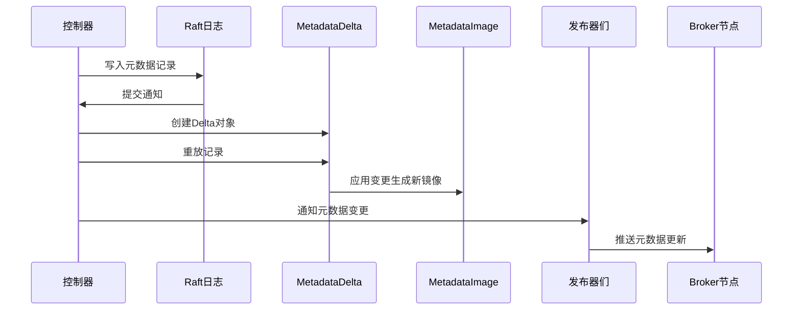

# Kafka MetadataImage 深度解析

## 概述

MetadataImage是Kafka KRaft模式下的核心数据结构，它代表了某个时间点的完整集群元数据快照。这个类是线程安全的，用于在控制器和broker之间共享集群状态信息。

## 类定义和结构

### 核心组成

<augment_code_snippet path="metadata/src/main/java/org/apache/kafka/image/MetadataImage.java" mode="EXCERPT">
```java
public final class MetadataImage {
    public static final MetadataImage EMPTY = new MetadataImage(
        MetadataProvenance.EMPTY,
        FeaturesImage.EMPTY,
        ClusterImage.EMPTY,
        TopicsImage.EMPTY,
        ConfigurationsImage.EMPTY,
        ClientQuotasImage.EMPTY,
        ProducerIdsImage.EMPTY,
        AclsImage.EMPTY,
        ScramImage.EMPTY,
        DelegationTokenImage.EMPTY);

    private final MetadataProvenance provenance;
    private final FeaturesImage features;
    private final ClusterImage cluster;
    private final TopicsImage topics;
    private final ConfigurationsImage configs;
    private final ClientQuotasImage clientQuotas;
    private final ProducerIdsImage producerIds;
    private final AclsImage acls;
    private final ScramImage scram;
    private final DelegationTokenImage delegationTokens;
}
```
</augment_code_snippet>

## 组件详解

### 1. MetadataProvenance - 元数据来源信息

<augment_code_snippet path="metadata/src/main/java/org/apache/kafka/image/MetadataProvenance.java" mode="EXCERPT">
```java
public final class MetadataProvenance {
    public static final MetadataProvenance EMPTY = new MetadataProvenance(-1L, -1, -1L, false);

    private final long lastContainedOffset;      // 最后包含的偏移量
    private final int lastContainedEpoch;        // 最后包含的纪元
    private final long lastContainedLogTimeMs;   // 最后包含的日志时间
    private final boolean isOffsetBatchAligned;  // 偏移量是否批次对齐
}
```
</augment_code_snippet>

**功能说明：**
- **版本追踪**：记录元数据的版本信息，用于确定数据的新旧程度
- **快照标识**：提供快照ID，用于快照文件命名和管理
- **一致性保证**：通过偏移量和纪元确保数据一致性
- **批次对齐**：标识偏移量是否在记录批次边界上，影响快照创建策略

### 2. FeaturesImage - 特性版本管理

<augment_code_snippet path="metadata/src/main/java/org/apache/kafka/image/FeaturesImage.java" mode="EXCERPT">
```java
public final class FeaturesImage {
    public static final FeaturesImage EMPTY = new FeaturesImage(
        Map.of(),
        Optional.empty()
    );

    private final Map<String, Short> finalizedVersions;  // 已确定的特性版本
    private final Optional<MetadataVersion> metadataVersion;  // 元数据版本
}
```
</augment_code_snippet>

**核心功能：**
- **特性版本控制**：管理集群支持的各种特性版本
- **兼容性管理**：确保集群中所有节点的特性兼容性
- **升级支持**：支持集群特性的渐进式升级
- **ELR支持检查**：检查是否启用了Eligible Leader Replicas特性

### 3. ClusterImage - 集群拓扑信息

<augment_code_snippet path="metadata/src/main/java/org/apache/kafka/image/ClusterImage.java" mode="EXCERPT">
```java
public final class ClusterImage {
    public static final ClusterImage EMPTY = new ClusterImage(
            Map.of(),
            Map.of());

    private final Map<Integer, BrokerRegistration> brokers;      // Broker注册信息
    private final Map<Integer, ControllerRegistration> controllers;  // 控制器注册信息
}
```
</augment_code_snippet>

**管理内容：**
- **Broker注册**：维护所有broker的注册信息，包括端点、机架信息等
- **控制器注册**：管理控制器节点的注册信息（KIP-919）
- **节点状态**：跟踪节点的在线/离线状态
- **纪元管理**：维护broker的纪元信息，用于故障检测

### 4. TopicsImage - 主题和分区信息

TopicsImage是最复杂的组件之一，管理所有主题和分区的元数据：

**主要功能：**
- **主题管理**：维护主题名称到ID的映射
- **分区信息**：存储每个分区的副本分配、领导者信息
- **副本状态**：跟踪副本的ISR（In-Sync Replicas）状态
- **分区变更**：处理分区的领导者选举和副本重分配

### 5. ConfigurationsImage - 配置管理

<augment_code_snippet path="metadata/src/main/java/org/apache/kafka/image/ConfigurationsImage.java" mode="EXCERPT">
```java
public final class ConfigurationsImage {
    public static final ConfigurationsImage EMPTY =
        new ConfigurationsImage(Map.of());

    private final Map<ConfigResource, ConfigurationImage> data;  // 配置资源映射
}
```
</augment_code_snippet>

**配置类型：**
- **Broker配置**：broker级别的配置参数
- **主题配置**：主题级别的配置参数
- **客户端配置**：客户端相关的配置
- **动态配置**：支持运行时修改的配置

### 6. 安全相关组件

#### ClientQuotasImage - 客户端配额
- 管理客户端的生产和消费配额
- 支持基于用户、客户端ID的配额控制

#### AclsImage - 访问控制列表
- 存储所有的ACL规则
- 支持基于用户、主题、操作的权限控制

#### ScramImage - SCRAM认证
- 管理SCRAM认证的用户凭证
- 支持SCRAM-SHA-256和SCRAM-SHA-512

#### DelegationTokenImage - 委托令牌
- 管理委托令牌的信息
- 支持令牌的创建、续期和撤销

### 7. ProducerIdsImage - 生产者ID管理
- 管理生产者ID的分配
- 支持幂等性生产者和事务性生产者

## 核心方法解析

### 1. 构造和初始化

<augment_code_snippet path="metadata/src/main/java/org/apache/kafka/image/MetadataImage.java" mode="EXCERPT">
```java
public MetadataImage(
    MetadataProvenance provenance,
    FeaturesImage features,
    ClusterImage cluster,
    TopicsImage topics,
    ConfigurationsImage configs,
    ClientQuotasImage clientQuotas,
    ProducerIdsImage producerIds,
    AclsImage acls,
    ScramImage scram,
    DelegationTokenImage delegationTokens
) {
    this.provenance = provenance;
    this.features = features;
    this.cluster = cluster;
    this.topics = topics;
    this.configs = configs;
    this.clientQuotas = clientQuotas;
    this.producerIds = producerIds;
    this.acls = acls;
    this.scram = scram;
    this.delegationTokens = delegationTokens;
}
```
</augment_code_snippet>

**设计特点：**
- **不可变性**：所有字段都是final的，确保线程安全
- **组合模式**：通过组合多个Image子类来构建完整的元数据视图
- **空对象模式**：提供EMPTY常量，避免null引用

### 2. 状态检查

<augment_code_snippet path="metadata/src/main/java/org/apache/kafka/image/MetadataImage.java" mode="EXCERPT">
```java
public boolean isEmpty() {
    return features.isEmpty() &&
        cluster.isEmpty() &&
        topics.isEmpty() &&
        configs.isEmpty() &&
        clientQuotas.isEmpty() &&
        producerIds.isEmpty() &&
        acls.isEmpty() &&
        scram.isEmpty() &&
        delegationTokens.isEmpty();
}
```
</augment_code_snippet>

**用途：**
- **初始状态检查**：判断是否为空的元数据镜像
- **测试支持**：在单元测试中验证状态
- **优化决策**：基于是否为空做出不同的处理逻辑

### 3. 版本信息获取

<augment_code_snippet path="metadata/src/main/java/org/apache/kafka/image/MetadataImage.java" mode="EXCERPT">
```java
public OffsetAndEpoch highestOffsetAndEpoch() {
    return new OffsetAndEpoch(provenance.lastContainedOffset(), provenance.lastContainedEpoch());
}

public long offset() {
    return provenance.lastContainedOffset();
}
```
</augment_code_snippet>

**应用场景：**
- **版本比较**：确定哪个元数据镜像更新
- **快照管理**：决定是否需要创建新快照
- **同步控制**：在集群同步中使用

### 4. 序列化支持

<augment_code_snippet path="metadata/src/main/java/org/apache/kafka/image/MetadataImage.java" mode="EXCERPT">
```java
public void write(ImageWriter writer, ImageWriterOptions options) {
    // Features should be written out first so we can include the metadata.version at the beginning of the
    // snapshot
    features.write(writer, options);
    cluster.write(writer, options);
    topics.write(writer, options);
    configs.write(writer, options);
    clientQuotas.write(writer, options);
    producerIds.write(writer, options);
    acls.write(writer);
    scram.write(writer, options);
    delegationTokens.write(writer, options);
    writer.close(true);
}
```
</augment_code_snippet>

**写入顺序的重要性：**
1. **Features优先**：确保元数据版本信息在快照开头
2. **依赖关系**：按照组件间的依赖关系排序
3. **兼容性**：保证不同版本间的兼容性

## MetadataDelta - 增量变更机制

### 变更应用模式

<augment_code_snippet path="metadata/src/main/java/org/apache/kafka/image/MetadataDelta.java" mode="EXCERPT">
```java
public final class MetadataDelta {
    private final MetadataImage image;
    
    private FeaturesDelta featuresDelta = null;
    private ClusterDelta clusterDelta = null;
    private TopicsDelta topicsDelta = null;
    // ... 其他Delta对象
    
    public MetadataImage apply(MetadataProvenance provenance) {
        // 应用所有变更，生成新的MetadataImage
    }
}
```
</augment_code_snippet>

**Delta模式的优势：**
- **性能优化**：只处理变更的部分，避免全量复制
- **内存效率**：共享未变更的数据结构
- **原子性**：确保变更的原子性应用

### 记录重放机制

MetadataDelta支持多种记录类型的重放：

```java
public void replay(RegisterBrokerRecord record) {
    getOrCreateClusterDelta().replay(record);
}

public void replay(TopicRecord record) {
    getOrCreateTopicsDelta().replay(record);
}

public void replay(ConfigRecord record) {
    getOrCreateConfigsDelta().replay(record);
}
```

**重放过程：**
1. **记录解析**：将Raft日志记录解析为具体的变更操作
2. **Delta创建**：为相应的组件创建Delta对象
3. **变更应用**：将变更应用到Delta中
4. **镜像生成**：最终生成新的MetadataImage

## 使用场景和模式

### 1. 控制器端使用

```java
// 控制器维护当前的元数据镜像
private volatile MetadataImage currentImage = MetadataImage.EMPTY;

// 处理Raft日志记录
public void handleCommit(List<ApiMessageAndVersion> records) {
    MetadataDelta delta = new MetadataDelta(currentImage);
    for (ApiMessageAndVersion record : records) {
        delta.replay(record.message());
    }
    MetadataImage newImage = delta.apply(newProvenance);
    this.currentImage = newImage;
    
    // 通知所有发布器
    notifyPublishers(delta, newImage);
}
```

### 2. Broker端使用

```java
// Broker通过MetadataCache访问元数据
public class KRaftMetadataCache {
    private volatile MetadataImage image = MetadataImage.EMPTY;
    
    public void setImage(MetadataImage newImage) {
        this.image = newImage;
    }
    
    public boolean contains(String topicName) {
        return image.topics().topicsByName().containsKey(topicName);
    }
    
    public Properties config(ConfigResource resource) {
        return image.configs().configProperties(resource);
    }
}
```

### 3. 快照管理

```java
// 创建快照
public void createSnapshot(OffsetAndEpoch snapshotId) {
    MetadataImage image = getCurrentImage();
    try (SnapshotWriter writer = createSnapshotWriter(snapshotId)) {
        image.write(writer, new ImageWriterOptions());
    }
}

// 加载快照
public MetadataImage loadSnapshot(OffsetAndEpoch snapshotId) {
    try (SnapshotReader reader = openSnapshot(snapshotId)) {
        return MetadataImageBuilder.fromSnapshot(reader);
    }
}
```

## 性能特性和优化

### 1. 内存效率
- **不可变数据结构**：支持结构共享，减少内存占用
- **延迟初始化**：只在需要时创建Delta对象
- **空对象优化**：使用静态EMPTY对象避免重复创建

### 2. 线程安全
- **不可变性**：所有Image对象都是不可变的
- **原子更新**：通过volatile引用实现原子的镜像更新
- **无锁设计**：读操作无需加锁，提高并发性能

### 3. 序列化优化
- **增量序列化**：只序列化变更的部分
- **版本兼容**：支持不同版本间的兼容性
- **压缩支持**：支持快照数据的压缩

## 总结

MetadataImage是Kafka KRaft架构的核心数据结构，它：

1. **统一管理**：将所有类型的集群元数据统一管理
2. **版本控制**：提供完整的版本追踪和管理机制
3. **高性能**：通过不可变设计和增量更新实现高性能
4. **线程安全**：天然支持多线程并发访问
5. **可扩展**：支持新的元数据类型的添加

这种设计使得Kafka能够高效地管理大规模集群的元数据，同时保证数据的一致性和可靠性。

## 深入技术细节

### 元数据同步流程



### 内存布局优化

MetadataImage采用了多种内存优化策略：

#### 1. 结构共享（Structural Sharing）
```java
// 示例：TopicsImage的优化
public class TopicsImage {
    private final Map<String, TopicImage> topicsByName;
    private final Map<Uuid, TopicImage> topicsById;

    // 两个Map共享相同的TopicImage对象
    // 避免重复存储
}
```

#### 2. 写时复制（Copy-on-Write）
```java
// Delta应用时的优化
public TopicsImage apply() {
    if (changedTopics.isEmpty() && deletedTopics.isEmpty()) {
        return image; // 无变更时直接返回原镜像
    }

    // 只复制变更的部分
    Map<String, TopicImage> newTopicsByName = new HashMap<>(image.topicsByName());
    // 应用变更...
    return new TopicsImage(newTopicsByName, newTopicsById);
}
```

### 版本兼容性处理

#### 元数据版本演进
```java
public class ImageWriterOptions {
    private final MetadataVersion metadataVersion;

    public void handleLoss(String feature) {
        // 当目标版本不支持某特性时的处理
        if (lossHandler != null) {
            lossHandler.handleLoss(feature);
        }
    }
}
```

#### 向后兼容策略
- **特性降级**：新版本特性在旧版本中被忽略
- **默认值填充**：为缺失的字段提供合理默认值
- **渐进式升级**：支持集群节点的分阶段升级

### 错误处理和恢复

#### 1. 快照损坏恢复
```java
public MetadataImage loadFromSnapshot(OffsetAndEpoch snapshotId) {
    try {
        return loadSnapshot(snapshotId);
    } catch (CorruptSnapshotException e) {
        // 尝试加载更早的快照
        return loadPreviousSnapshot(snapshotId);
    }
}
```

#### 2. 增量应用失败处理
```java
public void handleReplayFailure(ApiMessageAndVersion record, Exception e) {
    // 记录失败的记录
    log.error("Failed to replay record: {}", record, e);

    // 根据错误类型决定处理策略
    if (e instanceof UnknownRecordTypeException) {
        // 忽略未知记录类型（可能是新版本的记录）
        return;
    } else {
        // 其他错误需要停止处理
        throw new MetadataReplayException("Failed to replay metadata", e);
    }
}
```

## 实际应用案例

### 案例1：主题创建流程

```java
// 1. 控制器接收创建主题请求
public void handleCreateTopic(CreateTopicsRequest request) {
    // 验证请求
    validateCreateTopicRequest(request);

    // 生成主题记录
    TopicRecord topicRecord = new TopicRecord()
        .setName(request.topicName())
        .setTopicId(Uuid.randomUuid());

    // 写入Raft日志
    raftClient.scheduleAppend(topicRecord);
}

// 2. 记录提交后的处理
public void handleCommittedRecord(TopicRecord record) {
    MetadataDelta delta = new MetadataDelta(currentImage);
    delta.replay(record);

    // 应用变更
    MetadataImage newImage = delta.apply(newProvenance);
    updateCurrentImage(newImage);

    // 通知发布器
    notifyPublishers(delta, newImage);
}

// 3. Broker端接收更新
public void onMetadataUpdate(MetadataDelta delta, MetadataImage newImage) {
    if (delta.topicsDelta() != null) {
        // 更新本地缓存
        metadataCache.setImage(newImage);

        // 通知客户端
        notifyClientsOfTopicChanges(delta.topicsDelta());
    }
}
```

### 案例2：Broker故障处理

```java
// 1. 检测到Broker离线
public void handleBrokerOffline(int brokerId) {
    // 创建围栏记录
    FenceBrokerRecord fenceRecord = new FenceBrokerRecord()
        .setId(brokerId)
        .setEpoch(getCurrentBrokerEpoch(brokerId));

    raftClient.scheduleAppend(fenceRecord);
}

// 2. 处理围栏记录
public void handleFenceBroker(FenceBrokerRecord record) {
    MetadataDelta delta = new MetadataDelta(currentImage);
    delta.replay(record);

    // 触发分区重新分配
    triggerPartitionReassignment(record.id());

    MetadataImage newImage = delta.apply(newProvenance);
    updateCurrentImage(newImage);
}

// 3. 分区领导者重新选举
public void electNewLeaders(int failedBrokerId) {
    TopicsImage topics = currentImage.topics();

    for (TopicImage topic : topics.topicsById().values()) {
        for (Map.Entry<Integer, PartitionRegistration> entry : topic.partitions().entrySet()) {
            PartitionRegistration partition = entry.getValue();

            if (partition.leader == failedBrokerId) {
                // 从ISR中选择新领导者
                int newLeader = selectNewLeader(partition);

                // 创建分区变更记录
                PartitionChangeRecord changeRecord = new PartitionChangeRecord()
                    .setTopicId(topic.id())
                    .setPartitionId(entry.getKey())
                    .setLeader(newLeader);

                raftClient.scheduleAppend(changeRecord);
            }
        }
    }
}
```

### 案例3：配置动态更新

```java
// 1. 处理配置更新请求
public void handleConfigUpdate(AlterConfigsRequest request) {
    for (ConfigResource resource : request.resources()) {
        for (Map.Entry<String, String> config : request.configs(resource).entrySet()) {
            ConfigRecord configRecord = new ConfigRecord()
                .setResourceType(resource.type().id())
                .setResourceName(resource.name())
                .setName(config.getKey())
                .setValue(config.getValue());

            raftClient.scheduleAppend(configRecord);
        }
    }
}

// 2. 应用配置变更
public void handleConfigRecord(ConfigRecord record) {
    MetadataDelta delta = new MetadataDelta(currentImage);
    delta.replay(record);

    MetadataImage newImage = delta.apply(newProvenance);
    updateCurrentImage(newImage);

    // 通知配置发布器
    configPublisher.onMetadataUpdate(delta, newImage);
}

// 3. Broker端应用配置
public void applyConfigChanges(ConfigurationsDelta configDelta) {
    for (Map.Entry<ConfigResource, ConfigurationDelta> entry : configDelta.changes().entrySet()) {
        ConfigResource resource = entry.getKey();
        ConfigurationDelta configChange = entry.getValue();

        if (resource.type() == ConfigResource.Type.BROKER) {
            // 应用Broker配置变更
            applyBrokerConfigChanges(configChange);
        } else if (resource.type() == ConfigResource.Type.TOPIC) {
            // 应用主题配置变更
            applyTopicConfigChanges(resource.name(), configChange);
        }
    }
}
```

## 监控和调试

### 关键指标监控

```java
// 元数据镜像相关指标
public class MetadataImageMetrics {
    private final Metrics metrics;

    public void recordImageSize(MetadataImage image) {
        metrics.addMetric("metadata.image.topics.count",
                         image.topics().topicsById().size());
        metrics.addMetric("metadata.image.brokers.count",
                         image.cluster().brokers().size());
        metrics.addMetric("metadata.image.offset",
                         image.offset());
    }

    public void recordDeltaApplication(long durationMs, int recordCount) {
        metrics.addMetric("metadata.delta.application.duration.ms", durationMs);
        metrics.addMetric("metadata.delta.records.count", recordCount);
    }
}
```

### 调试工具

```java
// 元数据镜像比较工具
public class MetadataImageComparator {
    public static List<String> compare(MetadataImage image1, MetadataImage image2) {
        List<String> differences = new ArrayList<>();

        // 比较版本信息
        if (!image1.provenance().equals(image2.provenance())) {
            differences.add("Provenance differs: " +
                          image1.provenance() + " vs " + image2.provenance());
        }

        // 比较主题
        compareTopics(image1.topics(), image2.topics(), differences);

        // 比较集群信息
        compareCluster(image1.cluster(), image2.cluster(), differences);

        return differences;
    }
}

// 元数据镜像导出工具
public class MetadataImageExporter {
    public static void exportToJson(MetadataImage image, OutputStream output) {
        JsonGenerator generator = createJsonGenerator(output);

        generator.writeStartObject();
        generator.writeObjectField("provenance", image.provenance());
        generator.writeObjectField("features", image.features());
        generator.writeObjectField("cluster", image.cluster());
        generator.writeObjectField("topics", image.topics());
        generator.writeEndObject();

        generator.close();
    }
}
```

## 最佳实践和注意事项

### 1. 性能优化建议

- **批量处理**：尽可能批量应用多个记录，减少镜像创建次数
- **内存监控**：监控MetadataImage的内存使用，特别是在大规模集群中
- **快照策略**：合理设置快照创建频率，平衡恢复时间和存储开销

### 2. 错误处理策略

- **渐进式验证**：在应用变更前进行充分验证
- **回滚机制**：保留历史镜像以支持快速回滚
- **监控告警**：对元数据应用失败设置告警

### 3. 扩展性考虑

- **分片策略**：对于超大规模集群，考虑元数据分片
- **压缩优化**：对历史快照进行压缩存储
- **缓存策略**：在Broker端实现智能缓存策略

MetadataImage作为Kafka KRaft架构的核心，其设计和实现体现了现代分布式系统的最佳实践，为Kafka的高可用性和高性能提供了坚实的基础。
