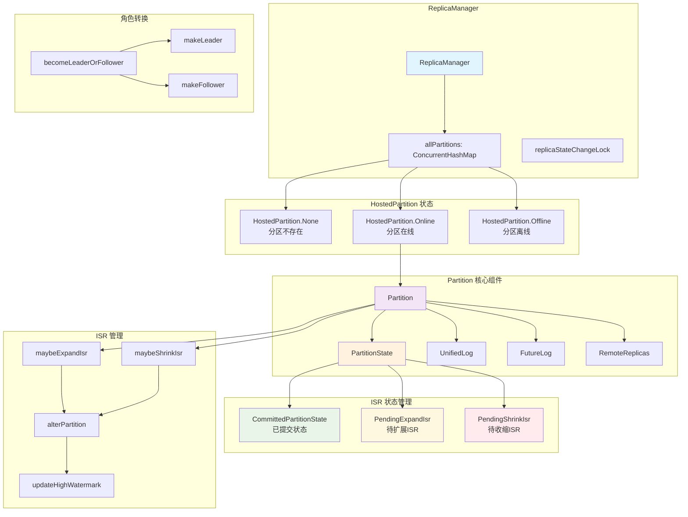
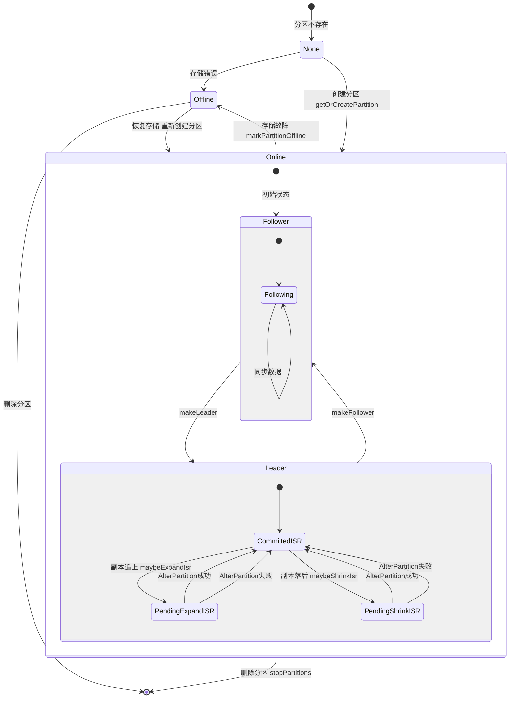

# Kafka Partition 管理深度解析

## 概述

Kafka 中的 Partition（分区）是数据存储和复制的基本单位。每个分区都有一个 leader 和多个 follower 副本，通过 ISR（In-Sync Replicas）机制保证数据一致性。本文将深入分析 Kafka 如何管理 Partition，包括其生命周期、状态转换、ISR 管理、分区分配策略等核心机制。

## 目录

1. [架构概览](#架构概览) - 整体架构图和生命周期状态图
2. [核心架构](#核心架构) - ReplicaManager 和 HostedPartition 状态管理
3. [分区生命周期管理](#分区生命周期管理) - 分区创建、查询和状态转换
4. [Partition 类核心设计](#partition-类核心设计) - 分区对象结构和状态机
5. [角色转换机制](#角色转换机制) - Leader/Follower 角色转换流程
6. [ISR 管理机制](#isr-管理机制) - ISR 扩展、收缩和高水位管理
7. [分区删除和清理](#分区删除和清理) - 分区停止、删除和离线处理
8. [分区分配策略详解](#分区分配策略详解) - 分区数量决策、消息路由和副本分配
9. [数据平衡与重新分配](#数据平衡与重新分配) - 自动平衡局限性和手动重新分配
10. [性能优化和监控](#性能优化和监控) - 延迟操作和监控指标
11. [总结](#总结) - 核心特点和最佳实践

## 架构概览

### Kafka Partition 管理架构图



上图展示了 Kafka Partition 管理的核心架构，包括：
- **ReplicaManager**: 分区管理的中央控制器
- **HostedPartition**: 分区的三种托管状态
- **Partition**: 分区对象的核心组件
- **ISR 状态管理**: 三种 ISR 状态的转换
- **角色转换**: Leader/Follower 角色转换机制
- **ISR 管理**: ISR 扩展、收缩和高水位更新流程

### Kafka Partition 生命周期状态转换图



上图展示了分区从创建到删除的完整生命周期，以及在不同状态间的转换条件和触发机制。

## 核心架构

### 1. ReplicaManager 中的分区管理

ReplicaManager 是 Kafka Broker 中负责管理所有分区的核心组件。

```scala
// 核心数据结构
protected val allPartitions = new ConcurrentHashMap[TopicPartition, HostedPartition]
private val replicaStateChangeLock = new Object
```

**源码位置**: `core/src/main/scala/kafka/server/ReplicaManager.scala:322-323`

**核心功能**:
- **分区状态存储**: 使用线程安全的 ConcurrentHashMap 维护所有分区状态
- **并发控制**: 通过 replicaStateChangeLock 确保状态变更操作的原子性

### 2. HostedPartition 状态枚举

Kafka 使用 HostedPartition 枚举来表示分区的托管状态：

```scala
sealed trait HostedPartition
object HostedPartition {
  final object None extends HostedPartition
  final case class Online(partition: Partition) extends HostedPartition
  final case class Offline(partition: Option[Partition]) extends HostedPartition
}
```

**源码位置**: `core/src/main/scala/kafka/server/ReplicaManager.scala:171-188`

**核心功能**:
- **None**: 分区不存在，Broker 无此分区信息
- **Online**: 分区正常运行，可以处理读写请求
- **Offline**: 分区离线（通常因存储故障），保留分区对象便于恢复

## 分区生命周期管理

### 1. 分区创建

分区创建通过 `getOrCreatePartition` 方法实现：

```scala
def getOrCreatePartition(tp: TopicPartition, topicId: Uuid): Option[(Partition, Boolean)] = {
  getPartition(tp) match {
    case HostedPartition.Offline(_) =>
      // 离线分区处理：检查主题ID匹配性
      if (topicIdMatches) createNewPartition() else None

    case HostedPartition.Online(partition) =>
      // 在线分区：验证主题ID一致性
      validateTopicId(partition, topicId)
      Some(partition, false)

    case HostedPartition.None =>
      // 新分区：直接创建
      createAndRegisterPartition(tp, topicId)
  }
}
```

**源码位置**: `core/src/main/scala/kafka/server/ReplicaManager.scala:2770-2811`

**核心功能**:
- **状态检查**: 根据分区当前状态决定创建策略
- **主题ID验证**: 确保主题ID一致性，防止数据混乱
- **分区注册**: 创建新分区并注册到 allPartitions 映射中

### 2. 分区状态查询

```scala
def getPartition(topicPartition: TopicPartition): HostedPartition = {
  Option(allPartitions.get(topicPartition)).getOrElse(HostedPartition.None)
}

def onlinePartition(topicPartition: TopicPartition): Option[Partition] = {
  getPartition(topicPartition) match {
    case HostedPartition.Online(partition) => Some(partition)
    case _ => None
  }
}
```

**源码位置**: `core/src/main/scala/kafka/server/ReplicaManager.scala:549-572`

**核心功能**:
- **状态查询**: 从 allPartitions 映射中获取分区状态
- **在线过滤**: onlinePartition 只返回可用的在线分区

## Partition 类核心设计

### 1. Partition 类结构

```scala
class Partition(val topicPartition: TopicPartition, ...) {
  // 核心状态变量
  @volatile var partitionState: PartitionState = CommittedPartitionState(...)
  @volatile var assignmentState: AssignmentState = SimpleAssignmentState(...)
  @volatile var log: Option[UnifiedLog] = None
  @volatile var futureLog: Option[UnifiedLog] = None
}
```

**源码位置**: `core/src/main/scala/kafka/cluster/Partition.scala:308-348`

**核心功能**:
- **状态管理**: partitionState 维护 ISR 和 leader epoch 信息
- **日志管理**: log 存储实际数据，futureLog 用于日志目录迁移
- **副本分配**: assignmentState 记录副本分配信息

### 2. PartitionState 状态管理

Kafka 使用状态模式管理分区的 ISR 状态：

```scala
// ISR 状态基类
sealed trait PartitionState {
  def isr: Set[Int]           // 已提交的 ISR
  def maximalIsr: Set[Int]    // 有效 ISR（包括待提交的）
  def isInflight: Boolean     // 是否有请求在处理中
}

// 稳定状态：ISR 已确认
case class CommittedPartitionState(isr: Set[Int], ...) extends PartitionState {
  val maximalIsr = isr
  val isInflight = false
}

// 扩展状态：乐观包含新副本
case class PendingExpandIsr(...) extends PartitionState {
  val maximalIsr = isr + newInSyncReplicaId  // 乐观策略
  val isInflight = true
}

// 收缩状态：保守保留副本
case class PendingShrinkIsr(...) extends PartitionState {
  val maximalIsr = isr                       // 保守策略
  val isInflight = true
}
```

**源码位置**: `core/src/main/scala/kafka/cluster/Partition.scala:197-273`

**核心功能**:
- **CommittedPartitionState**: 稳定状态，ISR 已被控制器确认
- **PendingExpandIsr**: 扩展状态，乐观包含新副本以提前推进高水位
- **PendingShrinkIsr**: 收缩状态，保守保留副本避免错误推进高水位

## 角色转换机制

### 1. becomeLeaderOrFollower 核心流程

ReplicaManager 中最重要的方法，处理控制器的 LeaderAndIsr 请求：

```scala
def becomeLeaderOrFollower(leaderAndIsrRequest: LeaderAndIsrRequest,
                          onLeadershipChange: Callback): LeaderAndIsrResponse = {
  replicaStateChangeLock synchronized {
    // 1. 验证控制器 epoch
    if (leaderAndIsrRequest.controllerEpoch < controllerEpoch) {
      return getErrorResponse(STALE_CONTROLLER_EPOCH)
    }

    // 2. 分类分区：哪些成为 leader，哪些成为 follower
    val (partitionsToBeLeader, partitionsToBeFollower) =
      classifyPartitions(leaderAndIsrRequest)

    // 3. 批量执行角色转换
    val newLeaders = makeLeaders(partitionsToBeLeader)
    val newFollowers = makeFollowers(partitionsToBeFollower)

    // 4. 通知角色变更
    onLeadershipChange(newLeaders, newFollowers)
  }
}
```

**源码位置**: `core/src/main/scala/kafka/server/ReplicaManager.scala:2057-2238`

**核心功能**:
- **Epoch 验证**: 防止处理过期的控制器请求
- **角色分类**: 根据请求内容决定分区的新角色
- **批量转换**: 提高角色转换效率，减少锁竞争
- **变更通知**: 触发后续的清理和同步操作

### 2. makeLeader 实现

```scala
def makeLeader(partitionState: PartitionState): Boolean = {
  inWriteLock(leaderIsrUpdateLock) {
    // 1. 确保本地日志存在
    createLogIfNotExists(partitionState)

    // 2. 更新分区状态和副本分配
    updateAssignmentAndIsr(partitionState, isLeader = true)

    // 3. 重置远程副本状态
    remoteReplicasMap.values.forEach(_.resetLastCaughtUpTime())

    // 4. 更新高水位
    maybeIncrementLeaderHW()
  }
}
```

**源码位置**: `core/src/main/scala/kafka/cluster/Partition.scala:733-831`

**核心功能**:
- **日志初始化**: 确保本地有可写的日志文件
- **状态更新**: 更新 ISR、leader epoch 和副本分配信息
- **副本重置**: 清除远程副本的历史状态，重新开始同步
- **高水位更新**: 作为 leader 开始管理高水位

### 3. makeFollower 实现

```scala
def makeFollower(partitionState: PartitionState): Boolean = {
  inWriteLock(leaderIsrUpdateLock) {
    // 1. 确保本地日志存在
    createLogIfNotExists(partitionState)

    // 2. 清空远程副本映射
    remoteReplicasMap.clear()

    // 3. 重置为 follower 状态
    this.partitionState = CommittedPartitionState(Set.empty, ...)
    updateEpochs(partitionState)

    // 4. 同步高水位到 LEO
    syncHighWatermarkToLEO()
  }
}
```

**源码位置**: `core/src/main/scala/kafka/cluster/Partition.scala:839-960`

**核心功能**:
- **日志初始化**: 确保本地有可读的日志文件
- **清理副本状态**: follower 不需要管理其他副本
- **状态重置**: 清空 ISR，更新 epoch 信息
- **高水位同步**: 将高水位设置为当前 LEO

## ISR 管理机制

### 1. ISR 扩展（maybeExpandIsr）

当 follower 副本追上 leader 时，触发 ISR 扩展：

```scala
def maybeExpandIsr(followerReplica: Replica): Unit = {
  // 检查是否需要扩展 ISR
  val needsUpdate = !partitionState.isInflight &&
                   canAddReplicaToIsr(followerReplica.brokerId) &&
                   isFollowerInSync(followerReplica)

  if (needsUpdate) {
    // 准备 ISR 扩展请求
    val expandRequest = prepareIsrExpand(followerReplica.brokerId)
    submitAlterPartition(expandRequest)
  }
}

def isFollowerInSync(followerReplica: Replica): Boolean = {
  // 检查副本是否同步：LEO >= HW 且在时间窗口内
  followerReplica.logEndOffset >= leaderLog.highWatermark &&
  followerReplica.isCaughtUp(leaderLogEndOffset, currentTime, maxLagTime)
}
```

**源码位置**: `core/src/main/scala/kafka/cluster/Partition.scala:1018-1040`

**核心功能**:
- **同步检查**: 副本 LEO >= 高水位且在时间窗口内保持同步
- **状态验证**: 确保没有其他 ISR 变更在进行中
- **乐观策略**: 立即将副本包含在有效 ISR 中，提前推进高水位
- **异步提交**: 向控制器提交 AlterPartition 请求

### 2. ISR 收缩（maybeShrinkIsr）

当副本落后太多时，触发 ISR 收缩：

```scala
def maybeShrinkIsr(): Unit = {
  if (!partitionState.isInflight) {
    // 找出不同步的副本
    val outOfSyncReplicas = getOutOfSyncReplicas(maxLagTime)

    if (outOfSyncReplicas.nonEmpty) {
      info(s"Shrinking ISR: removing ${outOfSyncReplicas.mkString(",")}")
      val shrinkRequest = prepareIsrShrink(outOfSyncReplicas)
      submitAlterPartition(shrinkRequest)
    }
  }
}

def getOutOfSyncReplicas(maxLagMs: Long): Set[Int] = {
  partitionState.isr.filter { replicaId =>
    replicaId != localBrokerId && {
      val replica = remoteReplicasMap.get(replicaId)
      replica == null || !replica.isCaughtUp(leaderEndOffset, currentTime, maxLagMs)
    }
  }
}
```

**源码位置**: `core/src/main/scala/kafka/cluster/Partition.scala:1231-1273`

**核心功能**:
- **滞后检测**: 识别超过最大滞后时间的副本
- **保守策略**: 在控制器确认前不从有效 ISR 中移除副本
- **状态检查**: 确保没有其他 ISR 变更在进行中
- **日志记录**: 详细记录 ISR 变更过程便于调试

### 3. AlterPartition 请求处理

ISR 变更通过 AlterPartition 请求向控制器报告：

```scala
def submitAlterPartition(proposedIsrState: PendingPartitionChange): Future[LeaderAndIsr] = {
  // 向控制器提交 ISR 变更请求
  val future = alterIsrManager.submit(topicIdPartition, proposedIsrState.sentLeaderAndIsr)

  // 异步处理响应
  future.whenComplete { (leaderAndIsr, exception) =>
    inWriteLock(leaderIsrUpdateLock) {
      if (partitionState == proposedIsrState) {
        if (leaderAndIsr != null) {
          handleAlterPartitionUpdate(proposedIsrState, leaderAndIsr)  // 成功
        } else {
          handleAlterPartitionError(proposedIsrState, exception)      // 失败
        }
      }
      // 如果状态已变更，忽略过期响应
    }
  }
}
```

**源码位置**: `core/src/main/scala/kafka/cluster/Partition.scala:1831-1847`

**核心功能**:
- **异步提交**: 向控制器提交 ISR 变更，避免阻塞主线程
- **响应处理**: 根据成功/失败结果更新本地状态
- **状态一致性**: 忽略过期响应，确保状态正确性
- **错误处理**: 失败时回滚到之前的稳定状态

### 4. 高水位管理

高水位（High Watermark）是 ISR 中所有副本都已同步的最大偏移量：

```scala
def maybeIncrementLeaderHW(leaderLog: UnifiedLog): Boolean = {
  // 检查最小 ISR 要求
  if (isUnderMinIsr) {
    return false  // ISR 副本数不足，不更新高水位
  }

  // 计算新高水位：ISR 中所有副本的最小 LEO
  var newHighWatermark = leaderLog.logEndOffset

  remoteReplicasMap.forEach { (_, replica) =>
    if (partitionState.maximalIsr.contains(replica.brokerId)) {
      val replicaLEO = replica.logEndOffset
      if (replicaLEO < newHighWatermark) {
        newHighWatermark = replicaLEO  // 取最小值
      }
    }
  }

  // 更新高水位（只能向前推进）
  val oldHW = leaderLog.highWatermark
  if (newHighWatermark > oldHW) {
    leaderLog.updateHighWatermark(newHighWatermark)
    return true  // 高水位有更新
  }
  false
}
```

**源码位置**: `core/src/main/scala/kafka/cluster/Partition.scala:1152-1223`

**核心功能**:
- **最小 ISR 检查**: 确保有足够的同步副本才更新高水位
- **最小 LEO 计算**: 高水位 = ISR 中所有副本的最小 LEO
- **单调递增**: 高水位只能向前推进，不能回退
- **延迟操作触发**: 高水位更新会完成等待的生产和消费请求

## 分区删除和清理

### 1. 分区停止和删除

```scala
def stopPartitions(partitionsToStop: Seq[StopPartitionRequest]): Map[TopicPartition, Errors] = {
  val errorMap = new mutable.HashMap[TopicPartition, Errors]

  // 1. 停止获取器线程
  replicaFetcherManager.removeFetcherForPartitions(partitionsToStop.map(_.topicPartition).toSet)
  replicaAlterLogDirsManager.removeFetcherForPartitions(partitionsToStop.map(_.topicPartition).toSet)

  // 2. 从分区映射中移除
  partitionsToStop.foreach { stopPartition =>
    val topicPartition = stopPartition.topicPartition
    if (stopPartition.deleteLocalLog) {
      getPartition(topicPartition) match {
        case hostedPartition: HostedPartition.Online =>
          if (allPartitions.remove(topicPartition, hostedPartition)) {
            maybeRemoveTopicMetrics(topicPartition.topic)
            hostedPartition.partition.delete()
          }
        case _ =>
      }
    }
  }

  errorMap.toMap
}
```

**源码位置**: `core/src/main/scala/kafka/server/ReplicaManager.scala:498-542`

**核心功能**:
- 停止相关的获取器线程
- 从分区映射中移除分区
- 删除本地日志文件
- 清理相关的监控指标

### 2. 分区离线标记

```scala
def markPartitionOffline(tp: TopicPartition): Unit = replicaStateChangeLock synchronized {
  allPartitions.get(tp) match {
    case HostedPartition.Online(partition) =>
      allPartitions.put(tp, HostedPartition.Offline(Some(partition)))
      partition.markOffline()
    case _ =>
      allPartitions.put(tp, HostedPartition.Offline(None))
  }
}
```

**源码位置**: `core/src/main/scala/kafka/server/ReplicaManager.scala:2593-2601`

**核心功能**:
- 将在线分区标记为离线状态
- 保留分区对象以便后续恢复
- 确保状态变更的原子性

## 分区分配策略详解

### 1. 分区数量决策

#### 用户指定 vs 系统默认

Kafka 中分区的分配是多层次的，用户可以在不同层面进行控制：

```bash
# 1. 用户明确指定分区数量
kafka-topics.sh --create \
  --topic user-events \
  --partitions 4 \           # 用户指定 4 个分区
  --replication-factor 3 \
  --bootstrap-server localhost:9092

# 2. 使用系统默认配置
kafka-topics.sh --create \
  --topic user-events \
  --bootstrap-server localhost:9092
  # 使用 server.properties 中的 num.partitions 配置
```

#### 服务器默认配置

```properties
# server.properties
num.partitions=3              # 默认分区数
default.replication.factor=2  # 默认副本因子
auto.create.topics.enable=true # 自动创建主题（生产环境建议关闭）
```

**源码位置**: `core/src/main/scala/kafka/server/KafkaConfig.scala`

```scala
object KafkaConfig {
  val NumPartitionsProp = "num.partitions"
  val DefaultReplicationFactorProp = "default.replication.factor"

  // 默认值定义
  val NumPartitionsDefault = 1
  val DefaultReplicationFactorDefault = 1
}
```

**核心功能**:
- 提供系统级别的默认分区配置
- 支持动态配置更新
- 为新创建的主题提供默认值

### 2. 消息分区路由策略

#### 默认分区器实现

Kafka 提供智能的消息分区路由机制：

```java
public class DefaultPartitioner implements Partitioner {
    private final StickyPartitionCache stickyPartitionCache = new StickyPartitionCache();

    public int partition(String topic, Object key, byte[] keyBytes,
                        Object value, byte[] valueBytes, Cluster cluster) {
        if (keyBytes == null) {
            // 无 Key：使用 Sticky Partitioning
            return stickyPartitionCache.partition(topic, cluster);
        }

        // 有 Key：使用一致性 Hash
        int numPartitions = cluster.partitionsForTopic(topic).size();
        return Utils.toPositive(Utils.murmur2(keyBytes)) % numPartitions;
    }
}
```

**源码位置**: `clients/src/main/java/org/apache/kafka/clients/producer/internals/DefaultPartitioner.java`

**核心功能**:
- **无 Key 策略**: Sticky Partitioning 提高批处理效率
- **有 Key 策略**: 一致性 Hash 保证相同 Key 在同一分区
- **负载均衡**: murmur2 算法确保消息均匀分布

#### Sticky Partitioning 优化

Kafka 2.4+ 的 Sticky Partitioning 策略显著提升性能：

```java
public class StickyPartitionCache {
    private final ConcurrentMap<String, Integer> indexCache;

    public int partition(String topic, Cluster cluster) {
        Integer cachedPartition = indexCache.get(topic);
        if (cachedPartition == null) {
            return nextPartition(topic, cluster);  // 选择新分区
        }
        return cachedPartition;  // 使用缓存的分区
    }

    public int nextPartition(String topic, Cluster cluster) {
        List<PartitionInfo> availablePartitions = cluster.availablePartitionsForTopic(topic);

        // 随机选择可用分区，避免与当前分区相同
        int newPartition = selectRandomAvailablePartition(availablePartitions);
        indexCache.put(topic, newPartition);
        return newPartition;
    }
}
```

**源码位置**: `clients/src/main/java/org/apache/kafka/clients/producer/internals/StickyPartitionCache.java`

**核心功能**:
- **批处理优化**: 多个消息发送到同一分区，提高批处理效率
- **动态切换**: 批次完成后切换到新分区
- **可用性保证**: 优先选择可用的分区

#### 用户控制分区选择

```java
// 用户可以在不同层面控制分区选择
public class PartitionControlExample {

    // 1. 完全自动 - 推荐方式
    public void sendAutoPartition(String topic, String value) {
        producer.send(new ProducerRecord<>(topic, value));
    }

    // 2. 基于业务 Key 自动分区
    public void sendWithKey(String topic, String key, String value) {
        producer.send(new ProducerRecord<>(topic, key, value));
    }

    // 3. 明确指定分区 - 特殊场景使用
    public void sendToSpecificPartition(String topic, int partition, String value) {
        producer.send(new ProducerRecord<>(topic, partition, null, value));
    }

    // 4. 自定义分区器
    public void configureCustomPartitioner() {
        Properties props = new Properties();
        props.put("partitioner.class", "com.example.CustomPartitioner");
        KafkaProducer<String, String> producer = new KafkaProducer<>(props);
    }
}
```

### 3. 副本分配算法

#### 自动副本分配实现

Kafka 使用智能算法自动分配副本：

```scala
def assignReplicasToBrokers(brokerMetadatas: Seq[BrokerMetadata],
                           nPartitions: Int,
                           replicationFactor: Int): Map[Int, Seq[Int]] = {
  // 参数验证
  validateParameters(nPartitions, replicationFactor, brokerMetadatas.size)

  val brokerArray = brokerMetadatas.map(_.id).toArray
  val result = mutable.Map[Int, Seq[Int]]()

  // 随机起始点，避免热点
  val startIndex = rand.nextInt(brokerArray.length)
  var replicaShift = rand.nextInt(brokerArray.length)

  for (partitionId <- 0 until nPartitions) {
    // 调整偏移量，确保均匀分布
    if (partitionId > 0 && (partitionId % brokerArray.length == 0))
      replicaShift += 1

    // 分配副本到不同 Broker
    val replicas = assignReplicasForPartition(partitionId, startIndex, replicaShift,
                                             replicationFactor, brokerArray)
    result.put(partitionId, replicas)
  }
  result.toMap
}
```

**源码位置**: `core/src/main/scala/kafka/admin/AdminUtils.scala`

**核心功能**:
- **均匀分布**: 每个 Broker 承载相似数量的分区
- **容错设计**: 副本分布在不同 Broker，避免单点故障
- **随机起始**: 避免总是从同一个 Broker 开始分配

#### 分配示例

假设有 3 个 Broker (0,1,2)，创建 6 个分区，副本因子为 3：

```
Partition 0: [0, 1, 2]  # Leader: 0, Followers: 1, 2
Partition 1: [1, 2, 0]  # Leader: 1, Followers: 2, 0
Partition 2: [2, 0, 1]  # Leader: 2, Followers: 0, 1
Partition 3: [0, 2, 1]  # Leader: 0, Followers: 2, 1
Partition 4: [1, 0, 2]  # Leader: 1, Followers: 0, 2
Partition 5: [2, 1, 0]  # Leader: 2, Followers: 1, 0
```

这种分配确保：
- 每个 Broker 都是 2 个分区的 Leader
- 副本均匀分布在所有 Broker 上
- 任何单个 Broker 故障都不会影响数据可用性

## 数据平衡与重新分配

### 1. 自动平衡的局限性

#### 当前 Kafka 自动平衡能力

Kafka 原生的自动平衡机制非常有限：

```scala
class KafkaController {
  def checkAndTriggerAutoLeaderRebalance(): Unit = {
    if (isActive) {
      // 查找 Leader 不在首选副本的分区
      val imbalancedPartitions = findImbalancedPartitions()

      // 只平衡 Leader 分布，不考虑数据大小
      if (imbalancedPartitions.nonEmpty) {
        onPreferredReplicaElection(imbalancedPartitions)
      }
    }
  }

  def findImbalancedPartitions(): Set[TopicPartition] = {
    controllerContext.allPartitions.filter { partition =>
      val leaderInfo = controllerContext.partitionLeadershipInfo(partition)
      leaderInfo.leader != leaderInfo.preferredReplica &&
      controllerContext.liveBrokerIds.contains(leaderInfo.preferredReplica)
    }
  }
}
```

**源码位置**: `core/src/main/scala/kafka/controller/KafkaController.scala`

**核心功能**:
- **仅 Leader 平衡**: 只平衡 Leader 副本分布，不考虑数据大小
- **首选副本检查**: 将 Leader 迁移回首选副本
- **配置控制**: 通过参数控制平衡行为

#### 自动平衡配置

```properties
# server.properties
auto.leader.rebalance.enable=true          # 启用自动 Leader 平衡
leader.imbalance.per.broker.percentage=10  # Leader 不平衡阈值（10%）
leader.imbalance.check.interval.seconds=300 # 检查间隔（5分钟）
```

#### 平衡能力对比表

| 平衡类型 | Kafka 原生支持 | 自动触发 | 说明 |
|----------|----------------|----------|------|
| **Leader 分布** | ✅ 支持 | ✅ 自动 | 平衡 Leader 副本在 Broker 间的分布 |
| **副本分布** | ❌ 不支持 | ❌ 手动 | 需要手动重新分配副本位置 |
| **数据大小** | ❌ 不支持 | ❌ 手动 | 需要手动重新分配或第三方工具 |
| **消息数量** | ❌ 不支持 | ❌ 手动 | 分区策略只影响新消息分布 |

### 2. 数据不平衡问题

#### 常见的数据倾斜场景

```bash
# 示例：数据分布严重不均
Topic: user-events (3 partitions)
Partition 0: 100MB  (10,000 条消息) - 普通用户
Partition 1: 2GB    (50 条消息)     - 大文件上传
Partition 2: 50MB   (5,000 条消息)  - 普通用户

# Kafka 不会自动重新平衡这些数据
```

#### 导致数据倾斜的原因

```java
// 容易导致数据倾斜的分区键设计
public class ProblematicPartitioning {

    // ❌ 问题1：热点用户导致倾斜
    public void sendUserEvent(String userId, String eventData) {
        // 如果某些用户特别活跃，会导致分区倾斜
        producer.send(new ProducerRecord<>("user-events", userId, eventData));
    }

    // ❌ 问题2：地理分布不均
    public void sendByRegion(String region, String eventData) {
        // 如果某些地区用户特别多，会导致分区倾斜
        producer.send(new ProducerRecord<>("user-events", region, eventData));
    }

    // ❌ 问题3：时间相关的倾斜
    public void sendByHour(String hour, String eventData) {
        // 高峰时段会导致某些分区过载
        producer.send(new ProducerRecord<>("user-events", hour, eventData));
    }
}
```

### 3. 手动数据平衡方案

#### 分区重新分配工具

```bash
# 1. 生成重新分配计划
kafka-reassign-partitions.sh --bootstrap-server localhost:9092 \
  --topics-to-move-json-file topics.json \
  --broker-list "0,1,2,3" \
  --generate

# 2. 执行重新分配（会移动数据）
kafka-reassign-partitions.sh --bootstrap-server localhost:9092 \
  --reassignment-json-file reassignment.json \
  --execute \
  --throttle 50000000  # 限制重新分配的带宽

# 3. 监控重新分配进度
kafka-reassign-partitions.sh --bootstrap-server localhost:9092 \
  --reassignment-json-file reassignment.json \
  --verify
```

#### 重新分配源码实现

```scala
// ReassignPartitionsCommand.scala
class ReassignPartitionsCommand {
  def reassignPartitions(zkUtils: ZkUtils,
                        reassignmentJsonString: String,
                        throttle: Long = -1): Unit = {

    val partitionsToBeReassigned = parsePartitionReassignmentData(reassignmentJsonString)

    // 设置限流
    if (throttle >= 0) {
      val throttledReplicas = getThrottledReplicas(partitionsToBeReassigned)
      assignThrottledReplicas(zkUtils, throttledReplicas, throttle)
    }

    // 执行重新分配
    val reassignPartitionsCommand = new ReassignPartitionsCommand(zkUtils, partitionsToBeReassigned.toMap)

    // 这会触发实际的数据移动
    if (reassignPartitionsCommand.reassignPartitions()) {
      println("Successfully started reassignment of partitions")
    } else {
      println("Failed to reassign partitions")
    }
  }
}
```

**源码位置**: `core/src/main/scala/kafka/admin/ReassignPartitionsCommand.scala`

### 4. 预防数据不平衡的策略

#### 智能分区键设计

```java
// ✅ 更好的分区键设计
public class GoodPartitioningExample {

    public void sendUserEvent(String userId, String eventData) {
        // 组合键，增加随机性
        String partitionKey = userId + "-" + System.currentTimeMillis() % 1000;
        producer.send(new ProducerRecord<>("user-events", partitionKey, eventData));
    }

    public void sendWithRandomSalt(String businessKey, String eventData) {
        // 添加随机盐值
        String partitionKey = businessKey + "-" + ThreadLocalRandom.current().nextInt(100);
        producer.send(new ProducerRecord<>("user-events", partitionKey, eventData));
    }

    public void sendWithConsistentHashing(String businessKey, String eventData) {
        // 使用一致性哈希，考虑数据分布
        int hash = Objects.hash(businessKey);
        String partitionKey = businessKey + "-" + (hash % 10);
        producer.send(new ProducerRecord<>("user-events", partitionKey, eventData));
    }
}
```

#### 自定义分区器考虑数据大小

```java
// 自定义分区器：考虑数据大小的负载均衡
public class SizeAwarePartitioner implements Partitioner {
    private final AtomicLongArray partitionSizes;

    @Override
    public int partition(String topic, Object key, byte[] keyBytes,
                        Object value, byte[] valueBytes, Cluster cluster) {
        int numPartitions = cluster.partitionsForTopic(topic).size();

        if (keyBytes == null) {
            // 无 Key：选择数据量最小的分区
            return findMinSizePartition(numPartitions);
        }

        // 有 Key：在候选分区中选择数据量最小的
        int basePartition = Utils.murmur2(keyBytes) % numPartitions;
        int[] candidates = {basePartition, (basePartition + 1) % numPartitions,
                           (basePartition + 2) % numPartitions};
        return findMinSizePartition(candidates);
    }

    private int findMinSizePartition(int[] candidates) {
        int minPartition = candidates[0];
        long minSize = partitionSizes.get(candidates[0]);

        for (int candidate : candidates) {
            long size = partitionSizes.get(candidate);
            if (size < minSize) {
                minSize = size;
                minPartition = candidate;
            }
        }
        return minPartition;
    }

    // 更新分区大小统计
    public void updatePartitionSize(int partition, int messageSize) {
        partitionSizes.addAndGet(partition, messageSize);
    }
}
```

### 5. 监控和运维

#### 分区大小监控

```bash
# 使用 kafka-log-dirs 工具查看分区大小
kafka-log-dirs.sh --bootstrap-server localhost:9092 \
  --topic-list user-events \
  --describe

# 输出示例：
# {"version":1,"brokers":[
#   {"broker":0,"logDirs":[
#     {"logDir":"/var/kafka-logs","error":null,"partitions":[
#       {"partition":"user-events-0","size":104857600,"offsetLag":0,"isFuture":false},
#       {"partition":"user-events-1","size":2147483648,"offsetLag":0,"isFuture":false}
#     ]}
#   ]}
# ]}
```

#### JMX 指标监控

```java
// JMX 指标监控：分区大小
public class PartitionSizeMonitor {
    public void monitorPartitionSizes() {
        MBeanServer server = ManagementFactory.getPlatformMBeanServer();

        // 查询所有分区的日志大小指标
        ObjectName pattern = new ObjectName("kafka.log:type=Log,name=Size,topic=*,partition=*");
        Set<ObjectName> mbeans = server.queryNames(pattern, null);

        for (ObjectName mbean : mbeans) {
            Long size = (Long) server.getAttribute(mbean, "Value");
            String topic = mbean.getKeyProperty("topic");
            String partition = mbean.getKeyProperty("partition");

            System.out.printf("Topic: %s, Partition: %s, Size: %d bytes%n",
                             topic, partition, size);
        }
    }
}
```

**核心功能**:
- **JMX 监控**: 通过 JMX 获取分区日志大小
- **实时统计**: 监控所有主题分区的存储使用情况
- **运维支持**: 为容量规划和负载均衡提供数据支持

## 性能优化和监控

### 1. 延迟操作管理

Kafka 使用延迟操作（DelayedOperations）来优化性能：

```scala
class DelayedOperations(
  topicId: Option[Uuid],
  topicPartition: TopicPartition,
  delayedProducePurgatory: DelayedOperationPurgatory[DelayedProduce],
  delayedFetchPurgatory: DelayedOperationPurgatory[DelayedFetch],
  delayedDeleteRecordsPurgatory: DelayedOperationPurgatory[DelayedDeleteRecords],
  delayedShareFetchPurgatory: DelayedOperationPurgatory[DelayedShareFetch]
) {
  def checkAndCompleteAll(): Unit = {
    delayedProducePurgatory.checkAndComplete(TopicPartitionOperationKey(topicPartition))
    delayedFetchPurgatory.checkAndComplete(TopicPartitionOperationKey(topicPartition))
    delayedDeleteRecordsPurgatory.checkAndComplete(TopicPartitionOperationKey(topicPartition))
    delayedShareFetchPurgatory.checkAndComplete(TopicPartitionOperationKey(topicPartition))
  }
}
```

**源码位置**: `core/src/main/scala/kafka/cluster/Partition.scala:147-154`

**核心功能**:
- 管理生产、消费、删除等延迟操作
- 当条件满足时自动完成延迟操作
- 提高系统响应性能

### 2. 监控指标

```scala
val isrChangeListener = new AlterPartitionListener {
  override def markIsrExpand(): Unit = {
    replicaManager.isrExpandRate.mark()
  }

  override def markIsrShrink(): Unit = {
    replicaManager.isrShrinkRate.mark()
  }

  override def markFailed(): Unit = replicaManager.failedIsrUpdatesRate.mark()
}
```

**源码位置**: `core/src/main/scala/kafka/cluster/Partition.scala:135-145`

**核心功能**:
- 监控 ISR 扩展和收缩频率
- 跟踪 ISR 更新失败率
- 提供运维监控数据

## 总结

Kafka 的 Partition 管理是一个复杂而精密的系统，涉及多个层面：

### 核心特点

1. **多层次分区控制**:
   - 用户可以指定分区数量，也可以使用系统默认值
   - 消息路由支持自动分配、Key-based 分配和自定义分区器
   - 副本分配完全由 Kafka 智能算法处理

2. **状态管理**:
   - 通过 HostedPartition 枚举管理分区生命周期
   - 使用 PartitionState 状态机管理 ISR 变更
   - 支持乐观扩展和保守收缩的 ISR 策略

3. **自动化程度**:
   - Leader 平衡可以自动进行
   - 数据大小平衡需要手动干预或第三方工具
   - 提供了丰富的监控和管理工具

### 最佳实践

1. **分区设计**: 合理设计分区键，避免数据倾斜
2. **监控告警**: 定期监控分区大小和分布情况
3. **容量规划**: 根据业务增长预估分区数量
4. **运维自动化**: 使用工具定期检查和重新平衡

这套机制保证了 Kafka 在高并发、大规模场景下的数据一致性和高可用性，是 Kafka 作为分布式流处理平台的核心基础。
