# Kafka ReplicaManager 深度解析：副本管理的核心引擎

## 目录

1. [ReplicaManager 架构概览](#1-replicamanager-架构概览)
2. [副本状态管理](#2-副本状态管理)
3. [ISR 同步副本集合管理](#3-isr-同步副本集合管理)
4. [Leader 纪元机制](#4-leader-纪元机制)
5. [高水位管理](#5-高水位管理)
6. [日志追加处理](#6-日志追加处理)
7. [副本同步机制](#7-副本同步机制)
8. [分区状态管理](#8-分区状态管理)
9. [性能优化与监控](#9-性能优化与监控)
10. [故障处理与恢复](#10-故障处理与恢复)

## 概述

ReplicaManager 是 Kafka Broker 中最核心的组件之一，负责管理分区副本的完整生命周期，包括副本同步、ISR 管理、高水位更新、日志追加等关键功能。它是 Kafka 数据一致性和高可用性的基石。本文将结合源码深入解析 ReplicaManager 的设计原理和实现机制。

## 1. ReplicaManager 架构概览

### 1.1 整体架构

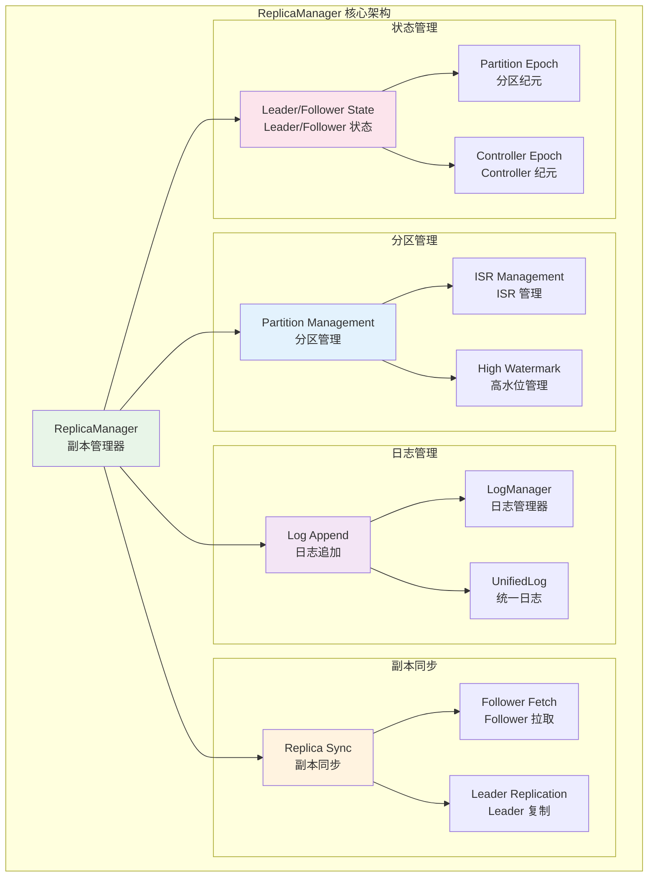
```mermaid
graph TB
    subgraph "ReplicaManager 核心架构"
        RM[ReplicaManager<br/>副本管理器]

        subgraph "分区管理"
            PM[Partition Management<br/>分区管理]
            ISR[ISR Management<br/>ISR 管理]
            HW[High Watermark<br/>高水位管理]
        end

        subgraph "日志管理"
            LA[Log Append<br/>日志追加]
            LM[LogManager<br/>日志管理器]
            UL[UnifiedLog<br/>统一日志]
        end

        subgraph "副本同步"
            RS[Replica Sync<br/>副本同步]
            FF[Follower Fetch<br/>Follower 拉取]
            LR[Leader Replication<br/>Leader 复制]
        end

        subgraph "状态管理"
            LS[Leader/Follower State<br/>Leader/Follower 状态]
            PE[Partition Epoch<br/>分区纪元]
            CE[Controller Epoch<br/>Controller 纪元]
        end

        RM --> PM
        RM --> LA
        RM --> RS
        RM --> LS

        PM --> ISR
        PM --> HW
        LA --> LM
        LA --> UL
        RS --> FF
        RS --> LR
        LS --> PE
        LS --> CE
    end

    style RM fill:#e8f5e8
    style PM fill:#e3f2fd
    style LA fill:#f3e5f5
    style RS fill:#fff3e0
    style LS fill:#fce4ec
```

### 1.2 启动初始化

ReplicaManager 在启动时会初始化各种核心组件和定时任务：

```scala
def startup(): Unit = {
  scheduler.schedule("isr-expiration", () => maybeShrinkIsr(), 0L, config.replicaLagTimeMaxMs / 2)    // ISR 过期检查
  scheduler.schedule("shutdown-idle-replica-alter-log-dirs-thread", () => shutdownIdleReplicaAlterLogDirsThread(), 0L, 10000L)    // 空闲线程清理

  logDirFailureHandler = new LogDirFailureHandler("LogDirFailureHandler")    // 日志目录故障处理器
  logDirFailureHandler.start()

  addPartitionsToTxnManager.foreach(_.start())    // 事务管理器启动
  remoteLogManager.foreach(rlm => rlm.setDelayedOperationPurgatory(delayedRemoteListOffsetsPurgatory))    // 远程日志管理器配置
}
```

**源码位置**: `ReplicaManager.scala:392-402`

**核心功能**:
- 定时任务调度管理（ISR 检查、故障处理）
- 组件协调启动（日志管理器、事务管理器）
- 故障检测和恢复机制初始化
- 延迟操作管理器配置

## 2. 副本状态管理

### 2.1 Leader/Follower 状态转换

ReplicaManager 处理来自 Controller 的 LeaderAndIsr 请求，实现副本角色转换：

```scala
def becomeLeaderOrFollower(correlationId: Int,
                          leaderAndIsrRequest: LeaderAndIsrRequest,
                          onLeadershipChange: (Iterable[Partition], Iterable[Partition]) => Unit): LeaderAndIsrResponse = {
  replicaStateChangeLock synchronized {
    val controllerId = leaderAndIsrRequest.controllerId
    val requestPartitionStates = leaderAndIsrRequest.partitionStates.asScala

    // 验证 Controller 纪元，防止过期请求
    if (leaderAndIsrRequest.controllerEpoch < controllerEpoch) {
      stateChangeLogger.warn(s"Ignoring LeaderAndIsr request from controller $controllerId")
      leaderAndIsrRequest.getErrorResponse(Errors.STALE_CONTROLLER_EPOCH.exception)
    } else {
      // 处理状态转换逻辑...
    }
  }
}
```

**源码位置**: `ReplicaManager.scala:2048-2060`

**核心功能**:
- Controller 纪元验证，防止过期请求
- 分区角色转换协调
- 状态变更日志记录
- 并发安全的状态转换

### 2.2 成为 Leader 的处理流程

当 Broker 需要成为某些分区的 Leader 时，执行以下处理流程：

```scala
private def makeLeaders(controllerId: Int,
                       controllerEpoch: Int,
                       partitionStates: Map[Partition, LeaderAndIsrRequest.PartitionState],
                       correlationId: Int,
                       responseMap: mutable.Map[TopicPartition, Errors],
                       highWatermarkCheckpoints: LazyOffsetCheckpoints,
                       topicIds: Map[String, Uuid]): Set[Partition] = {

  val partitionsToMakeLeader: mutable.Set[Partition] = mutable.Set()

  try {
    partitionStates.foreachEntry { (partition, partitionState) =>
      try {
        if (partition.makeLeader(partitionState, highWatermarkCheckpoints, topicIds(partitionState.topicName))) {
          partitionsToMakeLeader += partition    // 成功转换为 Leader
        }
      } catch {
        case e: KafkaStorageException =>
          stateChangeLogger.error(s"Skipped the become-leader state change due to storage error")
          markPartitionOffline(partition.topicPartition)    // 标记分区离线
      }
    }
    partitionsToMakeLeader
  } catch {
    case e: Throwable =>
      partitionStates.keys.foreach { partition =>
        stateChangeLogger.error(s"Error while processing LeaderAndIsr request for partition ${partition.topicPartition}", e)
      }
      throw e
  }
}
```

**源码位置**: `ReplicaManager.scala:2308-2320`

**核心功能**:
- 停止分区的 Fetcher 线程（如果之前是 Follower）
- 更新分区元数据缓存
- 将分区添加到 Leader 分区集合
- 异常处理和分区离线标记

### 2.3 成为 Follower 的处理流程

当 Broker 需要成为某些分区的 Follower 时，执行以下处理流程：

```scala
private def makeFollowers(controllerId: Int,
                         controllerEpoch: Int,
                         partitionStates: Map[Partition, LeaderAndIsrRequest.PartitionState],
                         correlationId: Int,
                         responseMap: mutable.Map[TopicPartition, Errors],
                         highWatermarkCheckpoints: LazyOffsetCheckpoints,
                         topicIds: Map[String, Uuid]): Set[Partition] = {

  val partitionsToMakeFollower: mutable.Set[Partition] = mutable.Set()

  try {
    partitionStates.foreachEntry { (partition, partitionState) =>
      val newLeaderBrokerId = partitionState.leader
      try {
        if (metadataCache.hasAliveBroker(newLeaderBrokerId)) {
          if (partition.makeFollower(partitionState, highWatermarkCheckpoints, topicIds(partitionState.topicName))) {
            partitionsToMakeFollower += partition    // 成功转换为 Follower
          }
        } else {
          stateChangeLogger.error(s"Cannot become follower since the new leader $newLeaderBrokerId is unavailable")
          // 即使 Leader 不可用也要创建本地副本，确保高水位被包含在检查点文件中
          partition.createLogIfNotExists(isNew = false, isFutureReplica = false,
            highWatermarkCheckpoints, topicIds(partitionState.topicName))
        }
      } catch {
        case e: KafkaStorageException =>
          stateChangeLogger.error(s"Skipped the become-follower state change due to storage error")
      }
    }
    partitionsToMakeFollower
  } catch {
    case e: Throwable =>
      stateChangeLogger.error(s"Error while processing LeaderAndIsr request", e)
      throw e
  }
}
```

**源码位置**: `ReplicaManager.scala:2406-2430`

**核心功能**:
- 验证新 Leader 的可用性
- 更新 Leader 信息并启动 Fetcher
- 创建本地日志副本
- 异常处理和状态恢复

**状态转换流程图：**

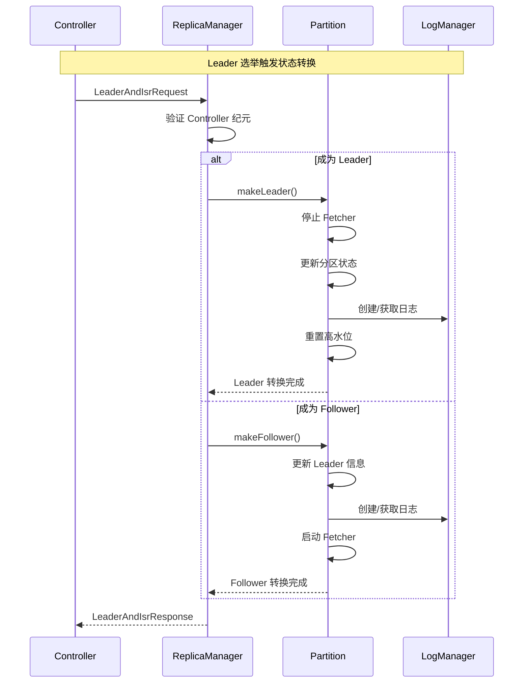
```mermaid
sequenceDiagram
    participant Controller as Controller
    participant RM as ReplicaManager
    participant P as Partition
    participant LM as LogManager

    Note over Controller,LM: Leader 选举触发状态转换

    Controller->>RM: LeaderAndIsrRequest
    RM->>RM: 验证 Controller 纪元

    alt 成为 Leader
        RM->>P: makeLeader()
        P->>P: 停止 Fetcher
        P->>P: 更新分区状态
        P->>LM: 创建/获取日志
        P->>P: 重置高水位
        P-->>RM: Leader 转换完成
    else 成为 Follower
        RM->>P: makeFollower()
        P->>P: 更新 Leader 信息
        P->>LM: 创建/获取日志
        P->>P: 启动 Fetcher
        P-->>RM: Follower 转换完成
    end

    RM-->>Controller: LeaderAndIsrResponse
```

## 3. ISR 同步副本集合管理

### 3.1 ISR 核心概念

#### 3.1.1 ISR 定义与作用

ISR（In-Sync Replicas，同步副本集合）是 Kafka 保证数据一致性和可用性的核心机制：

- **定义**: 与 Leader 副本保持同步的副本集合
- **组成**: Leader 副本 + 所有跟上进度的 Follower 副本
- **作用**: 只有 ISR 中的副本才有资格被选举为新的 Leader

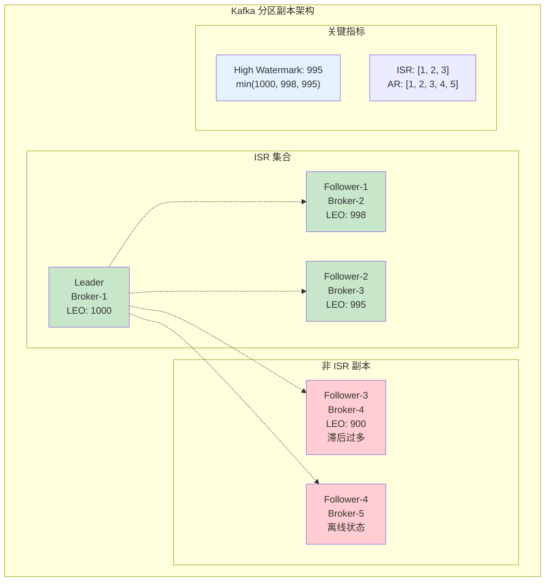
```mermaid
graph TB
    subgraph "Kafka 分区副本架构"
        subgraph "ISR 集合"
            L[Leader<br/>Broker-1<br/>LEO: 1000]
            F1[Follower-1<br/>Broker-2<br/>LEO: 998]
            F2[Follower-2<br/>Broker-3<br/>LEO: 995]
        end

        subgraph "非 ISR 副本"
            F3[Follower-3<br/>Broker-4<br/>LEO: 900<br/>滞后过多]
            F4[Follower-4<br/>Broker-5<br/>离线状态]
        end

        subgraph "关键指标"
            HW["High Watermark: 995<br/>min(1000, 998, 995)"]
            ISR_LIST["ISR: [1, 2, 3]<br/>AR: [1, 2, 3, 4, 5]"]
        end
    end

    L -.-> F1
    L -.-> F2
    L -.-> F3
    L -.-> F4

    style L fill:#c8e6c9
    style F1 fill:#c8e6c9
    style F2 fill:#c8e6c9
    style F3 fill:#ffcdd2
    style F4 fill:#ffcdd2
    style HW fill:#e3f2fd
```

#### 3.1.2 ISR 核心机制

**1. 数据一致性保证**

```java
if (allIsrReplicasAcknowledged(message)) {
    updateHighWatermark();                // 更新高水位
    makeMessageVisibleToConsumers();      // 消息对消费者可见
}
```

**核心功能**:
- 只有当消息被所有 ISR 副本确认后，才会更新高水位
- 消费者只能看到高水位之前的消息，确保读取的数据不会丢失

**2. Leader 选举基础**

```java
Set<Integer> eligibleLeaders = currentIsr;    // 只有 ISR 中的副本才能成为新 Leader
int newLeader = selectLeaderFromIsr(eligibleLeaders);    // 确保新 Leader 拥有最新的已提交数据
```

**3. 动态可用性平衡**

```java
if (replicaLagTime > maxLagTime) {
    removeFromIsr(replicaId);    // 移除滞后副本
} else if (replicaCaughtUp) {
    addToIsr(replicaId);         // 添加同步副本
}
```

**核心功能**:
- 通过动态调整 ISR 成员，在一致性和可用性之间取得平衡
- 适应网络和性能变化

#### 3.1.3 ISR 与其他概念的关系

**ISR vs AR（Assigned Replicas）**
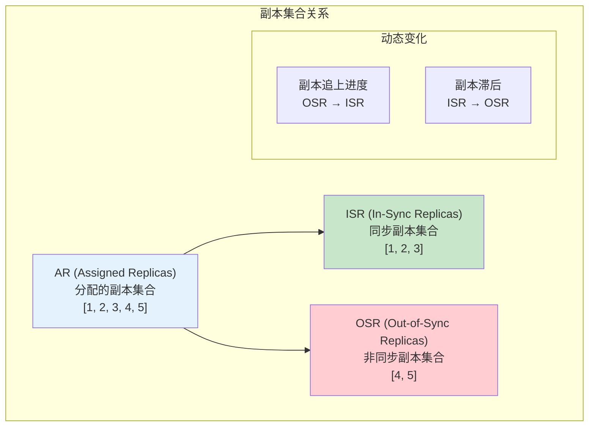
```mermaid
graph TB
    subgraph "副本集合关系"
        AR["AR (Assigned Replicas)<br/>分配的副本集合<br/>[1, 2, 3, 4, 5]"]
        ISR["ISR (In-Sync Replicas)<br/>同步副本集合<br/>[1, 2, 3]"]
        OSR["OSR (Out-of-Sync Replicas)<br/>非同步副本集合<br/>[4, 5]"]

        AR --> ISR
        AR --> OSR

        subgraph "动态变化"
            ADD["副本追上进度<br/>OSR → ISR"]
            REMOVE["副本滞后<br/>ISR → OSR"]
        end
    end

    style AR fill:#e3f2fd
    style ISR fill:#c8e6c9
    style OSR fill:#ffcdd2
```

**ISR vs 高水位的关系**

```java
long calculateHighWatermark() {
    long minLeo = leaderLeo;
    for (int replicaId : currentIsr) {
        if (replicaId != leaderId) {
            minLeo = Math.min(minLeo, getReplicaLeo(replicaId));    // 取所有 ISR 副本的最小 LEO
        }
    }
    return minLeo;    // HW = min(所有 ISR 副本的 LEO)
}
```

**核心功能**:
- 高水位计算依赖于 ISR 集合
- 确保只有被所有 ISR 副本确认的消息才对消费者可见

## 4. Leader 纪元机制

### 4.1 Leader 纪元概念

Leader 纪元是 Controller 为每个分区的每任 Leader 分配的单调递增标识符，用于解决分布式系统中的"脑裂"问题和数据一致性问题。

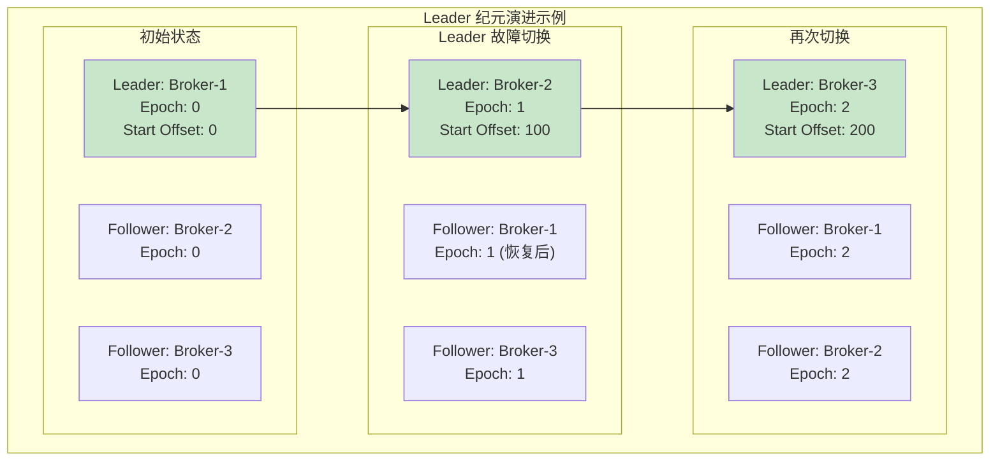
```mermaid
graph TB
    subgraph "Leader 纪元演进示例"
        subgraph "初始状态"
            L1["Leader: Broker-1<br/>Epoch: 0<br/>Start Offset: 0"]
            F1["Follower: Broker-2<br/>Epoch: 0"]
            F2["Follower: Broker-3<br/>Epoch: 0"]
        end

        subgraph "Leader 故障切换"
            L2["Leader: Broker-2<br/>Epoch: 1<br/>Start Offset: 100"]
            F1_2["Follower: Broker-1<br/>Epoch: 1 (恢复后)"]
            F2_2["Follower: Broker-3<br/>Epoch: 1"]
        end

        subgraph "再次切换"
            L3["Leader: Broker-3<br/>Epoch: 2<br/>Start Offset: 200"]
            F1_3["Follower: Broker-1<br/>Epoch: 2"]
            F2_3["Follower: Broker-2<br/>Epoch: 2"]
        end

        L1 --> L2
        L2 --> L3
    end

    style L1 fill:#c8e6c9
    style L2 fill:#c8e6c9
    style L3 fill:#c8e6c9
```

### 4.2 核心功能

**1. 防止数据不一致**

```scala
leaderLog.assignEpochStartOffset(partitionState.leaderEpoch, leaderEpochStartOffset)    // 在成为 Leader 时，分配新的纪元起始偏移量
```

**源码位置**: `Partition.scala:793`

**2. 解决"僵尸 Leader"问题**

```scala
private def checkCurrentLeaderEpoch(remoteLeaderEpochOpt: Optional[Integer]): Errors = {
  if (!remoteLeaderEpochOpt.isPresent) {
    Errors.NONE
  } else {
    val remoteLeaderEpoch = remoteLeaderEpochOpt.get
    val localLeaderEpoch = leaderEpoch
    if (localLeaderEpoch > remoteLeaderEpoch)
      Errors.FENCED_LEADER_EPOCH      // 拒绝过期纪元的请求
    else if (localLeaderEpoch < remoteLeaderEpoch)
      Errors.UNKNOWN_LEADER_EPOCH     // 本地纪元过期
    else
      Errors.NONE
  }
}
```

**核心功能**:
- 检查 Leader 纪元，防止过期的 Leader 继续服务
- 通过纪元比较实现分布式锁机制

**3. 指导副本截断**

```java
public class LeaderEpochTruncation {
    // Follower 根据新 Leader 的纪元信息决定截断位置
    // 确保只截断未提交的数据，保留已提交的数据
}
```

**核心功能**:
- Leader 纪元帮助 Follower 确定正确的截断点
- 避免在 Leader 切换时丢失已提交的数据

### 4.3 存储和管理

Leader 纪元通过 LeaderEpochFileCache 进行存储和管理：

```scala
public final class LeaderEpochFileCache {
  private final NavigableMap<Integer, EpochEntry> epochs = new TreeMap<>();    // 维护 (epoch -> startOffset) 的映射

  public void assign(int epoch, long startOffset) {
    EpochEntry entry = new EpochEntry(epoch, startOffset);
    if (assign(entry)) {
      log.debug("Appended new epoch entry {}. Cache now contains {} entries.", entry, epochs.size());
      writeToFile();    // 持久化到磁盘
    }
  }

  public OptionalInt epochForOffset(long offset) {
    // 返回包含该偏移量的纪元
    // 用于副本同步时的一致性检查
  }
}
```

**源码位置**: `LeaderEpochFileCache.java`

**核心功能**:
- Leader 纪元缓存管理
- 纪元到偏移量的映射维护
- 持久化存储到磁盘
- 副本同步时的一致性检查

**Leader 纪元在故障恢复中的作用：**

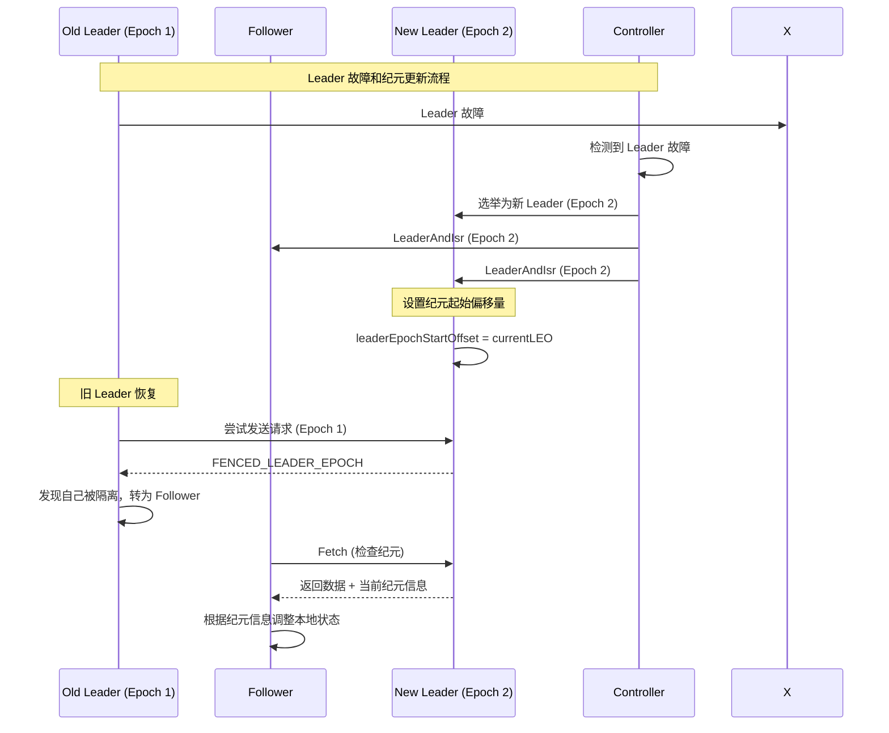
```mermaid
sequenceDiagram
    participant OL as Old Leader (Epoch 1)
    participant F as Follower
    participant NL as New Leader (Epoch 2)
    participant C as Controller

    Note over OL,C: Leader 故障和纪元更新流程

    OL->>X: Leader 故障
    C->>C: 检测到 Leader 故障
    C->>NL: 选举为新 Leader (Epoch 2)
    C->>F: LeaderAndIsr (Epoch 2)
    C->>NL: LeaderAndIsr (Epoch 2)

    Note over NL: 设置纪元起始偏移量
    NL->>NL: leaderEpochStartOffset = currentLEO

    Note over OL: 旧 Leader 恢复
    OL->>NL: 尝试发送请求 (Epoch 1)
    NL-->>OL: FENCED_LEADER_EPOCH
    OL->>OL: 发现自己被隔离，转为 Follower

    F->>NL: Fetch (检查纪元)
    NL-->>F: 返回数据 + 当前纪元信息
    F->>F: 根据纪元信息调整本地状态
```

### 3.2 ISR 动态管理

#### 3.2.1 成员资格判断

ISR 成员资格的判断需要同时考虑高水位和 Leader 纪元：

```scala
private def isFollowerInSync(followerReplica: Replica): Boolean = {
  leaderLogIfLocal.exists { leaderLog =>
    val followerEndOffset = followerReplica.stateSnapshot.logEndOffset
    followerEndOffset >= leaderLog.highWatermark &&                              // 条件1：Follower LEO >= Leader HW
    leaderEpochStartOffsetOpt.exists(followerEndOffset >= _)                     // 条件2：Follower LEO >= 当前 Leader 纪元的起始偏移量
  }
}

private def isFollowerOutOfSync(replicaId: Int, leaderEndOffset: Long,
                               currentTimeMs: Long, maxLagMs: Long): Boolean = {
  getReplica(replicaId) match {
    case Some(followerReplica) =>
      val followerState = followerReplica.stateSnapshot
      val timeSinceLastCaughtUpMs = currentTimeMs - followerState.lastCaughtUpTimeMs
      timeSinceLastCaughtUpMs > maxLagMs    // 关键条件：超过最大滞后时间
    case None =>
      true    // 副本不存在，视为不同步
  }
}
```

**源码位置**: `Partition.scala`

**核心功能**:
- 基本同步要求：Follower LEO >= Leader HW
- 纪元一致性要求：Follower LEO >= Leader Epoch 起始偏移量
- 时间滞后检查：副本滞后时间不超过配置阈值

**Leader 纪元在 ISR 判断中的重要性：**

条件2（`leaderEpochStartOffsetOpt.exists(followerEndOffset >= _)`）确保：
- Follower 的数据至少包含当前 Leader 纪元的起始点
- 防止包含过期纪元数据的副本被错误地认为是同步的
- 在 Leader 切换后，只有真正跟上新 Leader 的副本才能加入 ISR

**实际场景示例：**

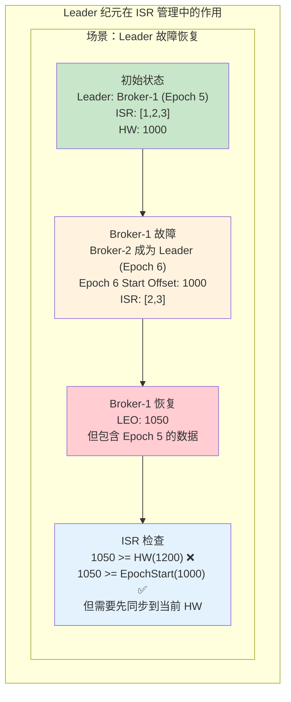
```mermaid
graph TB
    subgraph "Leader 纪元在 ISR 管理中的作用"
        subgraph "场景：Leader 故障恢复"
            S1["初始状态<br/>Leader: Broker-1 (Epoch 5)<br/>ISR: [1,2,3]<br/>HW: 1000"]
            S2["Broker-1 故障<br/>Broker-2 成为 Leader (Epoch 6)<br/>Epoch 6 Start Offset: 1000<br/>ISR: [2,3]"]
            S3["Broker-1 恢复<br/>LEO: 1050<br/>但包含 Epoch 5 的数据"]
            S4["ISR 检查<br/>1050 >= HW(1200) ❌<br/>1050 >= EpochStart(1000) ✅<br/>但需要先同步到当前 HW"]
        end

        S1 --> S2
        S2 --> S3
        S3 --> S4
    end

    style S1 fill:#c8e6c9
    style S2 fill:#fff3e0
    style S3 fill:#ffcdd2
    style S4 fill:#e3f2fd
```

这个机制防止了以下问题：
1. **数据不一致**：确保副本包含当前纪元的完整数据
2. **脑裂恢复**：旧 Leader 恢复时必须先同步新纪元的数据
3. **一致性保证**：只有真正同步的副本才能参与 ISR

**ISR 变化的触发条件：**

1. **加入 ISR 的条件**
   - Follower LEO >= Leader HW
   - Follower LEO >= Leader Epoch 起始偏移量
   - 副本处于活跃状态

2. **移出 ISR 的条件**
   - 副本滞后时间 > `replica.lag.time.max.ms`
   - 副本离线或不可达
   - 副本发生存储异常

#### 3.1.6 ISR 配置参数详解

**关键配置参数：**

```properties
# ISR 管理的核心配置
replica.lag.time.max.ms=30000
# 说明：副本最大滞后时间，超过此时间的副本会被移出 ISR
# 影响：较小的值提高一致性但可能影响可用性；较大的值相反

min.insync.replicas=2
# 说明：最小同步副本数，ISR 副本数必须 >= 此值才能接受写入
# 影响：提高数据安全性，但可能在副本故障时影响可用性

unclean.leader.election.enable=false
# 说明：是否允许非 ISR 副本成为 Leader
# 影响：false 保证数据一致性，true 提高可用性但可能丢失数据

replica.fetch.wait.max.ms=500
# 说明：Follower 拉取数据的最大等待时间
# 影响：影响副本同步的实时性和 ISR 成员资格
```

**配置示例和影响分析：**

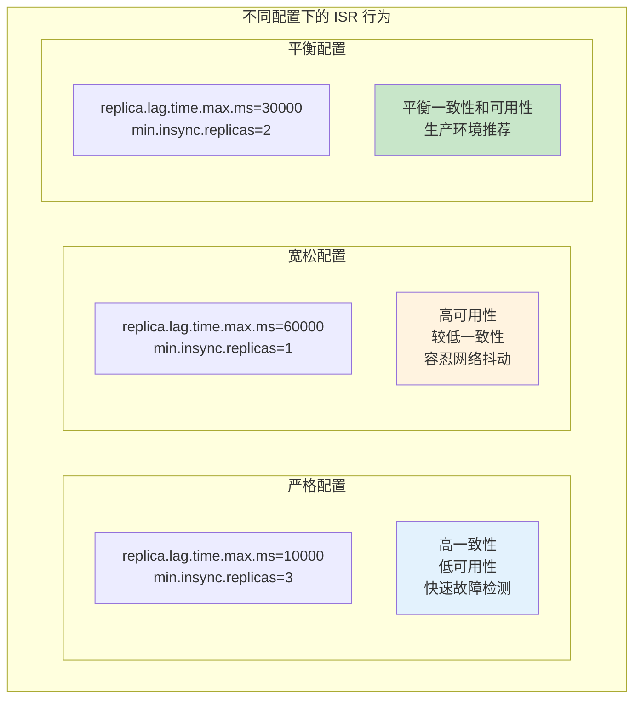
```mermaid
graph TB
    subgraph "不同配置下的 ISR 行为"
        subgraph "严格配置"
            SC1["replica.lag.time.max.ms=10000<br/>min.insync.replicas=3"]
            SC2["高一致性<br/>低可用性<br/>快速故障检测"]
        end

        subgraph "宽松配置"
            LC1["replica.lag.time.max.ms=60000<br/>min.insync.replicas=1"]
            LC2["高可用性<br/>较低一致性<br/>容忍网络抖动"]
        end

        subgraph "平衡配置"
            BC1["replica.lag.time.max.ms=30000<br/>min.insync.replicas=2"]
            BC2["平衡一致性和可用性<br/>生产环境推荐"]
        end
    end

    style SC2 fill:#e3f2fd
    style LC2 fill:#fff3e0
    style BC2 fill:#c8e6c9
```

### 3.3 ISR 扩展机制

#### 3.3.1 扩展条件和流程

ISR 扩展是将符合条件的 Follower 副本添加到 ISR 集合中的过程：

```scala
def maybeExpandIsr(followerReplica: Replica, followerFetchTimeMs: Long): Boolean = {
  val needsIsrUpdate = !partitionState.isInflight && inReadLock(leaderIsrUpdateLock) {
    needsExpandIsr(followerReplica)    // 检查是否需要扩展
  }

  if (needsIsrUpdate) {
    val alterIsrUpdateOpt = inWriteLock(leaderIsrUpdateLock) {
      partitionState match {
        case currentState: CommittedPartitionState if needsExpandIsr(followerReplica) =>
          Some(prepareIsrExpand(currentState, followerReplica.brokerId))    // 准备扩展 ISR
        case _ =>
          None
      }
    }
    alterIsrUpdateOpt.foreach(submitAlterPartition)    // 提交 AlterPartition 请求
  }
}

private def needsExpandIsr(followerReplica: Replica): Boolean = {
  canAddReplicaToIsr(followerReplica.brokerId) && isFollowerInSync(followerReplica)    // 检查副本是否可以加入 ISR 且已同步
}

private def isFollowerInSync(followerReplica: Replica): Boolean = {
  leaderLogIfLocal.exists { leaderLog =>
    val followerEndOffset = followerReplica.stateSnapshot.logEndOffset
    followerEndOffset >= leaderLog.highWatermark && leaderEpochStartOffsetOpt.exists(followerEndOffset >= _)    // 同步条件检查
  }
}
```

**源码位置**: `Partition.scala:1022-1036`

**核心功能**:
- 检查副本是否满足加入 ISR 的条件
- 准备 ISR 扩展操作
- 提交 AlterPartition 请求到 Controller
- 线程安全的状态更新

#### 3.2.2 ISR 扩展的实际场景

**场景1：新副本启动并追上进度**
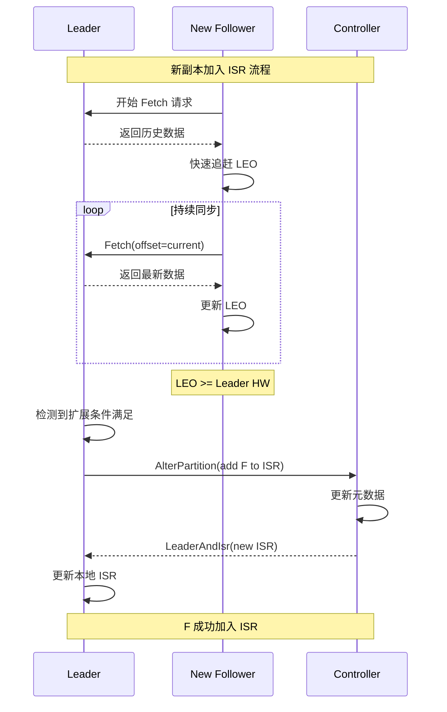
```mermaid
sequenceDiagram
    participant L as Leader
    participant F as New Follower
    participant C as Controller

    Note over L,C: 新副本加入 ISR 流程

    F->>L: 开始 Fetch 请求
    L-->>F: 返回历史数据
    F->>F: 快速追赶 LEO

    loop 持续同步
        F->>L: Fetch(offset=current)
        L-->>F: 返回最新数据
        F->>F: 更新 LEO
    end

    Note over F: LEO >= Leader HW
    L->>L: 检测到扩展条件满足
    L->>C: AlterPartition(add F to ISR)
    C->>C: 更新元数据
    C-->>L: LeaderAndIsr(new ISR)
    L->>L: 更新本地 ISR

    Note over L,C: F 成功加入 ISR
```

**场景2：网络恢复后副本重新同步**

```java
if (followerReplica.logEndOffset >= leaderLog.highWatermark &&
    followerReplica.logEndOffset >= leaderEpochStartOffset) {
    prepareIsrExpand(currentState, followerReplica.brokerId);    // 满足扩展条件，准备加入 ISR
}
```

**核心功能**:
- Follower 重新连接到 Leader
- 快速追赶落后的数据
- 满足同步条件后自动加入 ISR

### 3.4 ISR 收缩机制

#### 3.4.1 收缩触发条件

ReplicaManager 定期检查并收缩 ISR：

```scala
private def maybeShrinkIsr(): Unit = {
  trace("Evaluating ISR list of partitions to see which replicas can be removed from the ISR")

  allPartitions.forEach { (topicPartition, _) =>
    onlinePartition(topicPartition).foreach(_.maybeShrinkIsr())    // 为非离线分区收缩 ISR
  }
}
```

**源码位置**: `ReplicaManager.scala:2544-2551`

分区级别的 ISR 收缩检查：

```scala
def maybeShrinkIsr(): Unit = {
  def needsIsrUpdate: Boolean = {
    !partitionState.isInflight && inReadLock(leaderIsrUpdateLock) {
      needsShrinkIsr()    // 检查是否需要收缩
    }
  }

  if (needsIsrUpdate) {
    val alterIsrUpdateOpt = inWriteLock(leaderIsrUpdateLock) {
      leaderLogIfLocal.flatMap { leaderLog =>
        val outOfSyncReplicaIds = getOutOfSyncReplicas(replicaLagTimeMaxMs)    // 获取不同步的副本
        partitionState match {
          case currentState: CommittedPartitionState if outOfSyncReplicaIds.nonEmpty =>
            val outOfSyncReplicaLog = outOfSyncReplicaIds.map { replicaId =>
              val replicaStateSnapshot = getReplica(replicaId).map(_.stateSnapshot)
              val logEndOffsetMessage = replicaStateSnapshot.map(_.logEndOffset.toString).getOrElse("unknown")
              val lastCaughtUpTimeMessage = replicaStateSnapshot.map(_.lastCaughtUpTimeMs.toString).getOrElse("unknown")
              s"(brokerId: $replicaId, endOffset: $logEndOffsetMessage, lastCaughtUpTimeMs: $lastCaughtUpTimeMessage)"
            }.mkString(" ")

            info(s"Shrinking ISR from ${currentState.isr.mkString(",")} to " +
              s"${(currentState.isr -- outOfSyncReplicaIds).mkString(",")}")    // 记录 ISR 收缩日志

            Some(prepareIsrShrink(currentState, outOfSyncReplicaIds))    // 准备收缩 ISR
          case _ => None
        }
      }
    }
    alterIsrUpdateOpt.foreach(submitAlterPartition)    // 提交 AlterPartition 请求
  }
}
```

**源码位置**: `Partition.scala:1231-1260`

**核心功能**:
- 检查是否有不同步的副本需要移出 ISR
- 记录详细的收缩日志信息
- 准备并提交 ISR 收缩请求
- 线程安全的状态更新

### 3.5 ISR 管理流程图

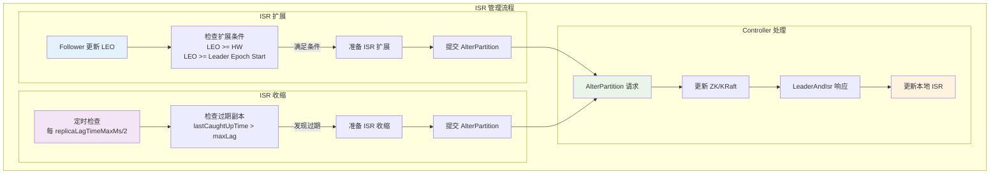
```mermaid
graph TB
    subgraph "ISR 管理流程"
        subgraph "ISR 扩展"
            FU[Follower 更新 LEO]
            CE[检查扩展条件<br/>LEO >= HW<br/>LEO >= Leader Epoch Start]
            AE[准备 ISR 扩展]
            SE[提交 AlterPartition]
        end

        subgraph "ISR 收缩"
            TC[定时检查<br/>每 replicaLagTimeMaxMs/2]
            CO[检查过期副本<br/>lastCaughtUpTime > maxLag]
            AS[准备 ISR 收缩]
            SS[提交 AlterPartition]
        end

        subgraph "Controller 处理"
            AP[AlterPartition 请求]
            UV[更新 ZK/KRaft]
            LI[LeaderAndIsr 响应]
            UL[更新本地 ISR]
        end

        FU --> CE
        CE -->|满足条件| AE
        AE --> SE

        TC --> CO
        CO -->|发现过期| AS
        AS --> SS

        SE --> AP
        SS --> AP
        AP --> UV
        UV --> LI
        LI --> UL
    end

    style FU fill:#e3f2fd
    style TC fill:#f3e5f5
    style AP fill:#e8f5e8
    style UL fill:#fff3e0
```

### 3.6 ISR 故障场景分析

#### 3.6.1 常见故障场景

**场景1：网络分区导致的 ISR 收缩**
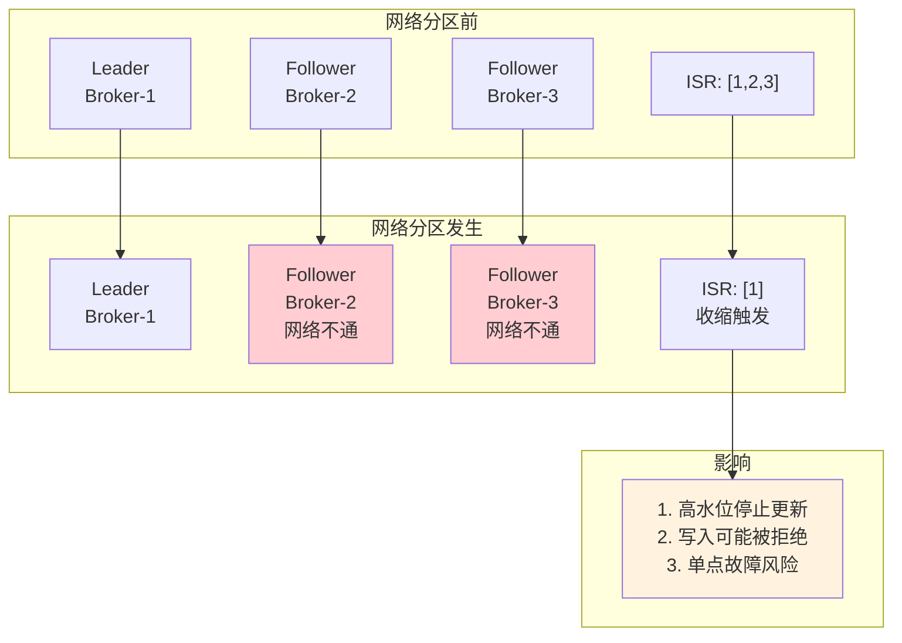
```mermaid
graph TB
    subgraph "网络分区前"
        L1[Leader<br/>Broker-1]
        F1[Follower<br/>Broker-2]
        F2[Follower<br/>Broker-3]
        ISR1["ISR: [1,2,3]"]
    end

    subgraph "网络分区发生"
        L2[Leader<br/>Broker-1]
        F1_2[Follower<br/>Broker-2<br/>网络不通]
        F2_2[Follower<br/>Broker-3<br/>网络不通]
        ISR2["ISR: [1]<br/>收缩触发"]
    end

    subgraph "影响"
        IMPACT["1. 高水位停止更新<br/>2. 写入可能被拒绝<br/>3. 单点故障风险"]
    end

    L1 --> L2
    F1 --> F1_2
    F2 --> F2_2
    ISR1 --> ISR2
    ISR2 --> IMPACT

    style F1_2 fill:#ffcdd2
    style F2_2 fill:#ffcdd2
    style IMPACT fill:#fff3e0
```

**场景2：副本性能问题导致的滞后**
```java
// 副本滞后的常见原因
public class ReplicaLagCauses {
    // 1. 磁盘 I/O 性能问题
    if (diskIOLatency > threshold) {
        // 磁盘写入慢，导致副本跟不上
    }

    // 2. 网络带宽不足
    if (networkThroughput < requiredBandwidth) {
        // 网络传输慢，Fetch 请求延迟
    }

    // 3. GC 停顿时间过长
    if (gcPauseTime > maxAcceptablePause) {
        // JVM GC 导致副本处理暂停
    }

    // 4. CPU 资源不足
    if (cpuUsage > 90) {
        // CPU 负载高，影响副本同步处理
    }
}
```

**场景3：Broker 故障恢复**
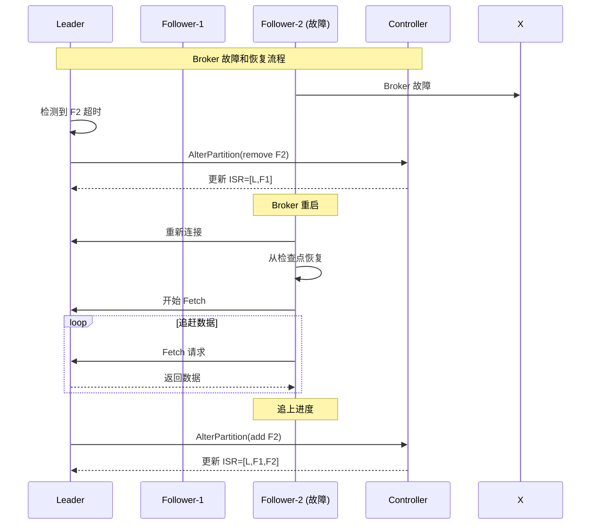
```mermaid
sequenceDiagram
    participant L as Leader
    participant F1 as Follower-1
    participant F2 as Follower-2 (故障)
    participant C as Controller

    Note over L,C: Broker 故障和恢复流程

    F2->>X: Broker 故障
    L->>L: 检测到 F2 超时
    L->>C: AlterPartition(remove F2)
    C-->>L: 更新 ISR=[L,F1]

    Note over F2: Broker 重启
    F2->>L: 重新连接
    F2->>F2: 从检查点恢复
    F2->>L: 开始 Fetch

    loop 追赶数据
        F2->>L: Fetch 请求
        L-->>F2: 返回数据
    end

    Note over F2: 追上进度
    L->>C: AlterPartition(add F2)
    C-->>L: 更新 ISR=[L,F1,F2]
```

#### 3.6.2 ISR 监控和告警

**关键监控指标：**

```bash
# 1. ISR 大小监控
kafka.cluster:type=Partition,name=InSyncReplicasCount,topic=*,partition=*

# 2. ISR 变化频率
kafka.server:type=ReplicaManager,name=IsrExpandsPerSec
kafka.server:type=ReplicaManager,name=IsrShrinksPerSec

# 3. 副本不足的分区数
kafka.server:type=ReplicaManager,name=UnderReplicatedPartitions

# 4. 离线分区数
kafka.controller:type=KafkaController,name=OfflinePartitionsCount
```

**告警规则示例：**

```yaml
# ISR 相关告警配置
alerts:
  - alert: ISRShrinkageHigh
    expr: rate(kafka_server_replicamanager_isrshrinkspersec[5m]) > 0.1
    for: 2m
    labels:
      severity: warning
    annotations:
      summary: "ISR 收缩频率过高"
      description: "ISR 收缩频率 {{ $value }} 超过阈值，可能存在副本同步问题"

  - alert: UnderReplicatedPartitions
    expr: kafka_server_replicamanager_underreplicatedpartitions > 0
    for: 1m
    labels:
      severity: critical
    annotations:
      summary: "存在副本不足的分区"
      description: "{{ $value }} 个分区的副本数不足，存在数据丢失风险"

  - alert: MinISRViolation
    expr: kafka_cluster_partition_insyncreplicascount < 2
    for: 30s
    labels:
      severity: critical
    annotations:
      summary: "分区 ISR 副本数低于最小要求"
      description: "分区 {{ $labels.topic }}-{{ $labels.partition }} ISR 副本数为 {{ $value }}"
```

### 3.7 ISR 最佳实践

#### 3.7.1 配置优化建议

**生产环境推荐配置：**
```properties
# 平衡一致性和可用性
min.insync.replicas=2
replica.lag.time.max.ms=30000
unclean.leader.election.enable=false

# 网络和性能优化
replica.fetch.wait.max.ms=500
replica.fetch.max.bytes=1048576
replica.socket.timeout.ms=30000

# 监控和调试
replica.high.watermark.checkpoint.interval.ms=5000
log.flush.interval.messages=10000
```

**不同场景的配置策略：**

1. **高一致性场景（金融、支付）**
   ```properties
   min.insync.replicas=3
   replica.lag.time.max.ms=10000
   unclean.leader.election.enable=false
   acks=all
   ```

2. **高可用性场景（日志收集）**
   ```properties
   min.insync.replicas=1
   replica.lag.time.max.ms=60000
   unclean.leader.election.enable=true
   acks=1
   ```

3. **平衡场景（一般业务）**
   ```properties
   min.insync.replicas=2
   replica.lag.time.max.ms=30000
   unclean.leader.election.enable=false
   acks=all
   ```

## 5. 高水位管理

### 5.1 高水位概念

#### 5.1.1 高水位定义

高水位（High Watermark，简称 HW）是分区中已被所有 ISR 副本同步的最大偏移量，是保证数据一致性和可见性的核心机制。

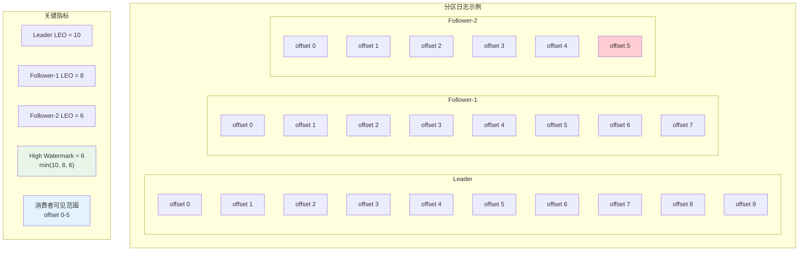
```mermaid
graph TB
    subgraph "分区日志示例"
        subgraph "Leader"
            L1[offset 0]
            L2[offset 1]
            L3[offset 2]
            L4[offset 3]
            L5[offset 4]
            L6[offset 5]
            L7[offset 6]
            L8[offset 7]
            L9[offset 8]
            L10[offset 9]
        end

        subgraph "Follower-1"
            F1_1[offset 0]
            F1_2[offset 1]
            F1_3[offset 2]
            F1_4[offset 3]
            F1_5[offset 4]
            F1_6[offset 5]
            F1_7[offset 6]
            F1_8[offset 7]
        end

        subgraph "Follower-2"
            F2_1[offset 0]
            F2_2[offset 1]
            F2_3[offset 2]
            F2_4[offset 3]
            F2_5[offset 4]
            F2_6[offset 5]
        end
    end

    subgraph "关键指标"
        LEO_L[Leader LEO = 10]
        LEO_F1[Follower-1 LEO = 8]
        LEO_F2[Follower-2 LEO = 6]
        HW["High Watermark = 6<br/>min(10, 8, 6)"]
        CV["消费者可见范围<br/>offset 0-5"]
    end

    style HW fill:#e8f5e8
    style CV fill:#e3f2fd
    style F2_6 fill:#ffcdd2
```

#### 5.1.2 核心作用

**1. 数据可见性控制**
- 只有高水位之前的消息对消费者可见
- 确保消费者不会读到可能丢失的数据

**2. 一致性保证**
- 所有 ISR 副本都已确认的数据才能被消费
- 防止在 Leader 切换时数据不一致

**3. 故障恢复基准**
- Leader 故障时，新 Leader 从高水位开始提供服务
- 确保已提交的数据不会丢失

#### 5.1.3 高水位 vs LEO

```java
// LEO（Log End Offset）：日志结束偏移量
// - 表示日志中下一条消息将要写入的偏移量
// - 每个副本都有自己的 LEO
// - LEO 总是 >= HW

// HW（High Watermark）：高水位
// - 表示已被所有 ISR 副本确认的最大偏移量
// - 整个分区只有一个 HW（由 Leader 维护）
// - HW = min(所有 ISR 副本的 LEO)
```

**核心功能**:
- LEO 表示副本的最新写入位置
- HW 表示已确认的安全读取位置
- 两者配合实现数据一致性保证

**关系示例：**
```
Leader:     [0][1][2][3][4][5][6][7][8][9]  LEO=10
Follower-1: [0][1][2][3][4][5][6][7]        LEO=8
Follower-2: [0][1][2][3][4][5]              LEO=6

High Watermark = min(10, 8, 6) = 6
消费者只能看到 offset 0-5 的消息
```

### 4.2 高水位更新机制

高水位的更新是一个精心设计的过程，确保数据一致性：

**源码位置：** `core/src/main/scala/kafka/cluster/Partition.scala:1152-1195`

```scala
// 检查并可能增加 Leader 的高水位
private def maybeIncrementLeaderHW(leaderLog: UnifiedLog, currentTimeMs: Long = time.milliseconds): Boolean = {
  if (isUnderMinIsr) {
    trace(s"Not increasing HWM because partition is under min ISR(ISR=${partitionState.isr}")
    return false
  }

  // maybeIncrementLeaderHW 在热路径中，以下代码避免不必要的集合生成
  val leaderLogEndOffset = leaderLog.logEndOffsetMetadata
  var newHighWatermark = leaderLogEndOffset

  // 遍历所有远程副本，找到最小的 LEO 作为新的高水位
  remoteReplicasMap.forEach { (_, replica) =>
    val replicaState = replica.stateSnapshot

    def shouldWaitForReplicaToJoinIsr: Boolean = {
      replicaState.isCaughtUp(leaderLogEndOffset.messageOffset, currentTimeMs, replicaLagTimeMaxMs) &&
      isReplicaIsrEligible(replica.brokerId)
    }

    // 只考虑 ISR 中的副本或者即将加入 ISR 的副本
    if (partitionState.isr.contains(replica.brokerId) || shouldWaitForReplicaToJoinIsr) {
      val replicaLogEndOffset = replicaState.logEndOffsetMetadata
      newHighWatermark = newHighWatermark.min(replicaLogEndOffset)
    }
  }

  // 尝试更新高水位
  leaderLog.maybeIncrementHighWatermark(newHighWatermark).toScala match {
    case Some(oldHighWatermark) =>
      debug(s"High watermark updated from $oldHighWatermark to $newHighWatermark")
      true
    case None =>
      if (isTraceEnabled) {
        val replicaInfo = remoteReplicas.map(replica => (replica.brokerId, replica.stateSnapshot.logEndOffsetMetadata)).toSet
        val localLogInfo = (localBrokerId, localLogOrException.logEndOffsetMetadata)
        trace(s"Skipping update high watermark since new hw $newHighWatermark is not larger than old value. " +
          s"All current LEOs are ${(replicaInfo + localLogInfo).map(logEndOffsetString)}")
      }
      false
  }
}
```

### 4.3 高水位更新的触发时机

高水位的更新有多个触发时机，确保及时反映副本同步状态：

#### 4.3.1 主要触发场景

1. **Follower 拉取数据后**
   ```scala
   // 当 Follower 更新 LEO 时，可能触发 HW 更新
   val leaderHWIncremented = if (prevFollowerEndOffset != replica.stateSnapshot.logEndOffset) {
     inReadLock(leaderIsrUpdateLock) {
       leaderLogIfLocal.exists(leaderLog => maybeIncrementLeaderHW(leaderLog, followerFetchTimeMs))
     }
   } else {
     false
   }
   ```

2. **ISR 变化时**
   ```scala
   // ISR 扩展或收缩后，需要重新计算 HW
   leaderLogIfLocal.exists(log => maybeIncrementLeaderHW(log))
   ```

3. **Leader 写入新数据后**
   ```scala
   // Leader 追加新消息后，检查是否可以提升 HW
   partition.appendRecordsToLeader(records, origin, requiredAcks, requestLocal)
   // 内部会调用 maybeIncrementLeaderHW
   ```

#### 4.3.2 高水位计算算法

```scala
// 高水位计算的核心逻辑
private def maybeIncrementLeaderHW(leaderLog: UnifiedLog, currentTimeMs: Long): Boolean = {
  // 1. 检查是否满足最小 ISR 要求
  if (isUnderMinIsr) {
    trace(s"Not increasing HWM because partition is under min ISR(ISR=${partitionState.isr}")
    return false
  }

  // 2. 从 Leader LEO 开始
  val leaderLogEndOffset = leaderLog.logEndOffsetMetadata
  var newHighWatermark = leaderLogEndOffset

  // 3. 遍历所有远程副本，找到最小的 LEO
  remoteReplicasMap.forEach { (_, replica) =>
    val replicaState = replica.stateSnapshot

    // 只考虑 ISR 中的副本或即将加入 ISR 的副本
    if (partitionState.isr.contains(replica.brokerId) || shouldWaitForReplicaToJoinIsr) {
      val replicaLogEndOffset = replicaState.logEndOffsetMetadata
      newHighWatermark = newHighWatermark.min(replicaLogEndOffset)  // 取最小值
    }
  }

  // 4. 尝试更新高水位
  leaderLog.maybeIncrementHighWatermark(newHighWatermark)
}
```

#### 4.3.3 高水位更新的约束条件

**更新条件：**
1. **新 HW > 当前 HW**：只能向前推进，不能回退
2. **满足最小 ISR**：ISR 副本数 >= min.insync.replicas
3. **副本同步状态**：只考虑 ISR 中的副本或即将加入的副本

**特殊情况处理：**
```scala
// 等待副本加入 ISR 的条件
def shouldWaitForReplicaToJoinIsr: Boolean = {
  replicaState.isCaughtUp(leaderLogEndOffset.messageOffset, currentTimeMs, replicaLagTimeMaxMs) &&
  isReplicaIsrEligible(replica.brokerId)
}
```

### 4.4 高水位检查点管理

**源码位置：** `core/src/main/scala/kafka/server/ReplicaManager.scala:2560-2582`

```scala
// 将所有分区的高水位值刷新到高水位文件
def checkpointHighWatermarks(): Unit = {
  def putHw(logDirToCheckpoints: mutable.AnyRefMap[String, mutable.AnyRefMap[TopicPartition, JLong]],
            log: UnifiedLog): Unit = {
    val checkpoints = logDirToCheckpoints.getOrElseUpdate(log.parentDir,
      new mutable.AnyRefMap[TopicPartition, JLong]())
    checkpoints.put(log.topicPartition, log.highWatermark)
  }

  val logDirToHws = new mutable.AnyRefMap[String, mutable.AnyRefMap[TopicPartition, JLong]](
    allPartitions.size)

  // 收集所有在线分区的高水位
  onlinePartitionsIterator.foreach { partition =>
    partition.log.foreach(putHw(logDirToHws, _))
    partition.futureLog.foreach(putHw(logDirToHws, _))
  }

  // 写入检查点文件
  for ((logDir, hws) <- logDirToHws) {
    try highWatermarkCheckpoints.get(logDir).foreach(_.write(hws.asJava))
    catch {
      case e: KafkaStorageException =>
        error(s"Error while writing to highwatermark file in directory $logDir", e)
    }
  }
}
```

**高水位更新流程：**

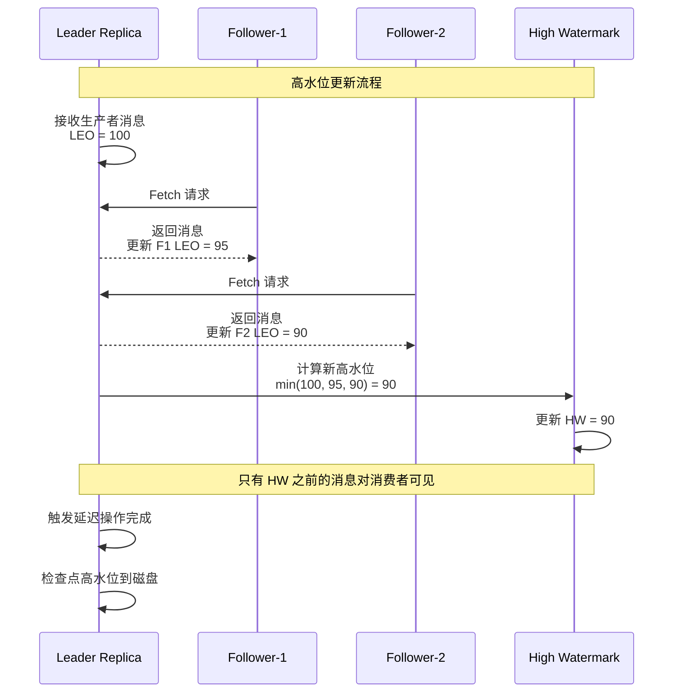
```mermaid
sequenceDiagram
    participant Leader as Leader Replica
    participant F1 as Follower-1
    participant F2 as Follower-2
    participant HW as High Watermark

    Note over Leader,HW: 高水位更新流程

    Leader->>Leader: 接收生产者消息<br/>LEO = 100
    F1->>Leader: Fetch 请求
    Leader-->>F1: 返回消息<br/>更新 F1 LEO = 95
    F2->>Leader: Fetch 请求
    Leader-->>F2: 返回消息<br/>更新 F2 LEO = 90

    Leader->>HW: 计算新高水位<br/>min(100, 95, 90) = 90
    HW->>HW: 更新 HW = 90

    Note over Leader,HW: 只有 HW 之前的消息对消费者可见

    Leader->>Leader: 触发延迟操作完成
    Leader->>Leader: 检查点高水位到磁盘
```

### 4.5 高水位在不同场景下的行为

#### 4.5.1 正常生产消费场景

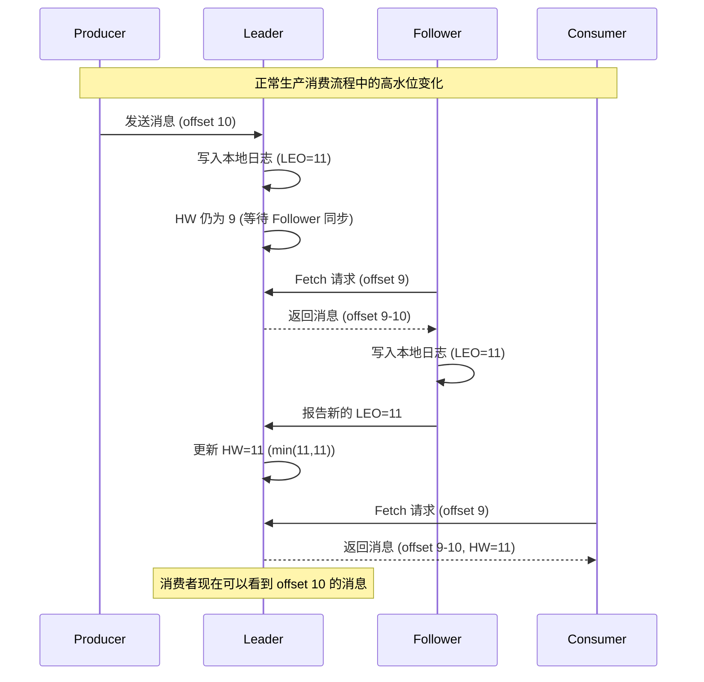
```mermaid
sequenceDiagram
    participant P as Producer
    participant L as Leader
    participant F as Follower
    participant C as Consumer

    Note over P,C: 正常生产消费流程中的高水位变化

    P->>L: 发送消息 (offset 10)
    L->>L: 写入本地日志 (LEO=11)
    L->>L: HW 仍为 9 (等待 Follower 同步)

    F->>L: Fetch 请求 (offset 9)
    L-->>F: 返回消息 (offset 9-10)
    F->>F: 写入本地日志 (LEO=11)
    F->>L: 报告新的 LEO=11

    L->>L: 更新 HW=11 (min(11,11))

    C->>L: Fetch 请求 (offset 9)
    L-->>C: 返回消息 (offset 9-10, HW=11)

    Note over L: 消费者现在可以看到 offset 10 的消息
```

#### 4.5.2 Leader 故障切换场景

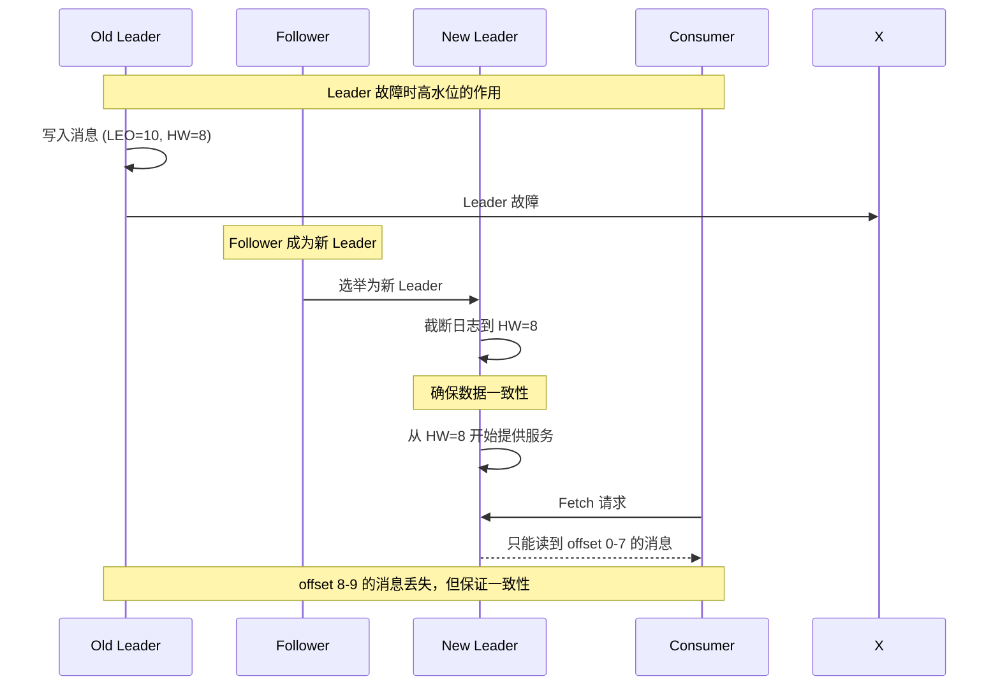
```mermaid
sequenceDiagram
    participant OL as Old Leader
    participant F as Follower
    participant NL as New Leader
    participant C as Consumer

    Note over OL,C: Leader 故障时高水位的作用

    OL->>OL: 写入消息 (LEO=10, HW=8)
    OL->>X: Leader 故障

    Note over F: Follower 成为新 Leader
    F->>NL: 选举为新 Leader
    NL->>NL: 截断日志到 HW=8

    Note over NL: 确保数据一致性
    NL->>NL: 从 HW=8 开始提供服务

    C->>NL: Fetch 请求
    NL-->>C: 只能读到 offset 0-7 的消息

    Note over OL,C: offset 8-9 的消息丢失，但保证一致性
```

#### 4.5.3 ISR 收缩场景

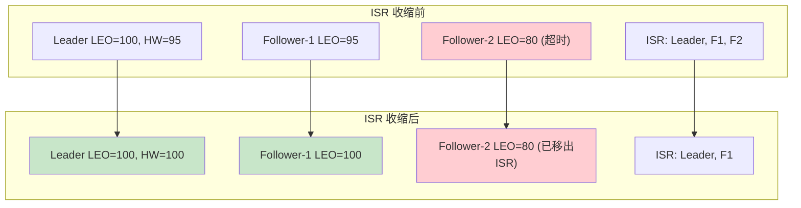
```mermaid
graph TB
    subgraph "ISR 收缩前"
        L1["Leader LEO=100, HW=95"]
        F1["Follower-1 LEO=95"]
        F2["Follower-2 LEO=80 (超时)"]
        ISR1["ISR: Leader, F1, F2"]
    end

    subgraph "ISR 收缩后"
        L2["Leader LEO=100, HW=100"]
        F1_2["Follower-1 LEO=100"]
        F2_2["Follower-2 LEO=80 (已移出ISR)"]
        ISR2["ISR: Leader, F1"]
    end

    L1 --> L2
    F1 --> F1_2
    F2 --> F2_2
    ISR1 --> ISR2

    style F2 fill:#ffcdd2
    style F2_2 fill:#ffcdd2
    style L2 fill:#c8e6c9
    style F1_2 fill:#c8e6c9
```

### 4.6 高水位相关的重要配置

#### 4.6.1 关键配置参数

```properties
# 最小同步副本数 - 影响高水位计算
min.insync.replicas=2

# 副本滞后时间 - 影响 ISR 成员资格
replica.lag.time.max.ms=30000

# 高水位检查点间隔 - 影响持久化频率
replica.high.watermark.checkpoint.interval.ms=5000

# 不干净的 Leader 选举 - 影响数据一致性
unclean.leader.election.enable=false
```

#### 4.6.2 配置对高水位的影响

**min.insync.replicas 的影响：**
```java
// 当 ISR 副本数 < min.insync.replicas 时
if (isUnderMinIsr) {
  // 不更新高水位，保护数据安全
  trace(s"Not increasing HWM because partition is under min ISR")
  return false
}
```

**replica.lag.time.max.ms 的影响：**
```java
// 副本超时会被移出 ISR，影响高水位计算
val timeSinceLastCaughtUpMs = currentTimeMs - followerState.lastCaughtUpTimeMs
if (timeSinceLastCaughtUpMs > maxLagMs) {
  // 副本被标记为不同步，将从 ISR 中移除
  // 高水位计算将不再考虑此副本
}
```

### 4.7 高水位监控和故障排查

#### 4.7.1 关键监控指标

```bash
# 查看分区的高水位信息
kafka-log-dirs.sh --bootstrap-server localhost:9092 --describe --json

# 查看消费者组的消费进度（相对于高水位）
kafka-consumer-groups.sh --bootstrap-server localhost:9092 --describe --group my-group

# 监控 ISR 变化（影响高水位计算）
kafka.cluster:type=Partition,name=InSyncReplicasCount,topic=*,partition=*
```

#### 4.7.2 常见问题和解决方案

**问题1：高水位长时间不更新**
```bash
# 可能原因：
# 1. Follower 同步滞后
# 2. ISR 副本数不足
# 3. 网络分区

# 排查步骤：
# 1. 检查 ISR 状态
kafka-topics.sh --describe --topic my-topic

# 2. 检查副本滞后情况
kafka-replica-verification.sh --broker-list localhost:9092 --topic-white-list my-topic
```

**问题2：消费者看不到最新消息**
```bash
# 原因：消息还未达到高水位
# 解决：检查副本同步状态，确保 ISR 副本正常同步
```

## 5. 日志追加：生产者消息的处理流程

### 5.1 日志追加的核心流程

ReplicaManager 处理生产者消息的追加是其最重要的功能之一：

**源码位置：** `core/src/main/scala/kafka/server/ReplicaManager.scala:1426-1503`

```scala
// 将消息追加到本地副本日志
private def appendToLocalLog(internalTopicsAllowed: Boolean,
                            origin: AppendOrigin,
                            entriesPerPartition: Map[TopicIdPartition, MemoryRecords],
                            requiredAcks: Short,
                            requestLocal: RequestLocal,
                            verificationGuards: Map[TopicPartition, VerificationGuard]):
Map[TopicIdPartition, LogAppendResult] = {

  val traceEnabled = isTraceEnabled

  def processFailedRecord(topicIdPartition: TopicIdPartition, t: Throwable) = {
    val logStartOffset = onlinePartition(topicIdPartition.topicPartition()).map(_.logStartOffset).getOrElse(-1L)
    brokerTopicStats.topicStats(topicIdPartition.topic).failedProduceRequestRate.mark()
    brokerTopicStats.allTopicsStats.failedProduceRequestRate.mark()
    // 处理各种异常情况...
  }

  entriesPerPartition.map { case (topicIdPartition, records) =>
    // 拒绝追加到内部主题（如果不允许）
    if (Topic.isInternal(topicIdPartition.topic) && !internalTopicsAllowed) {
      (topicIdPartition, LogAppendResult(
        LogAppendInfo.UNKNOWN_LOG_APPEND_INFO,
        Some(new InvalidTopicException(s"Cannot append to internal topic ${topicIdPartition.topic}")),
        hasCustomErrorMessage = false))
    } else {
      try {
        val partition = getPartitionOrException(topicIdPartition)
        val info = partition.appendRecordsToLeader(records, origin, requiredAcks, requestLocal,
          verificationGuards.getOrElse(topicIdPartition.topicPartition(), VerificationGuard.SENTINEL))
        val numAppendedMessages = info.numMessages

        // 更新成功追加的字节数和消息数统计
        brokerTopicStats.topicStats(topicIdPartition.topic).bytesInRate.mark(records.sizeInBytes)
        brokerTopicStats.allTopicsStats.bytesInRate.mark(records.sizeInBytes)
        brokerTopicStats.topicStats(topicIdPartition.topic).messagesInRate.mark(numAppendedMessages)
        brokerTopicStats.allTopicsStats.messagesInRate.mark(numAppendedMessages)

        if (traceEnabled)
          trace(s"${records.sizeInBytes} written to log $topicIdPartition beginning at offset " +
            s"${info.firstOffset} and ending at offset ${info.lastOffset}")

        (topicIdPartition, LogAppendResult(info, exception = None, hasCustomErrorMessage = false))
      } catch {
        case e: KafkaStorageException =>
          processFailedRecord(topicIdPartition, e)
          (topicIdPartition, LogAppendResult(LogAppendInfo.unknownLogAppendInfoWithLogStartOffset(logStartOffset),
            Some(e), hasCustomErrorMessage = false))
        // 处理其他异常...
      }
    }
  }
}
```

### 5.2 生产者请求的完整处理

**源码位置：** `core/src/main/scala/kafka/server/ReplicaManager.scala:684-706`

```scala
// 生产者消息追加的主入口
def appendRecordsToLocalLog(timeout: Long,
                           requiredAcks: Short,
                           internalTopicsAllowed: Boolean,
                           origin: AppendOrigin,
                           entriesPerPartition: Map[TopicIdPartition, MemoryRecords],
                           requestLocal: RequestLocal = RequestLocal.noCaching,
                           actionQueue: ActionQueue = this.defaultActionQueue,
                           verificationGuards: Map[TopicPartition, VerificationGuard] = Map.empty
                          ): Map[TopicIdPartition, LogAppendResult] = {
  val startTimeMs = time.milliseconds

  // 追加到本地日志
  val localProduceResultsWithTopicId = appendToLocalLog(
    internalTopicsAllowed = internalTopicsAllowed,
    origin,
    entriesPerPartition,
    requiredAcks,
    requestLocal,
    verificationGuards.toMap
  )

  debug("Produce to local log in %d ms".format(time.milliseconds - startTimeMs))

  // 添加完成清理操作到队列
  addCompletePurgatoryAction(actionQueue, localProduceResultsWithTopicId)

  localProduceResultsWithTopicId
}
```

### 5.3 日志追加流程图

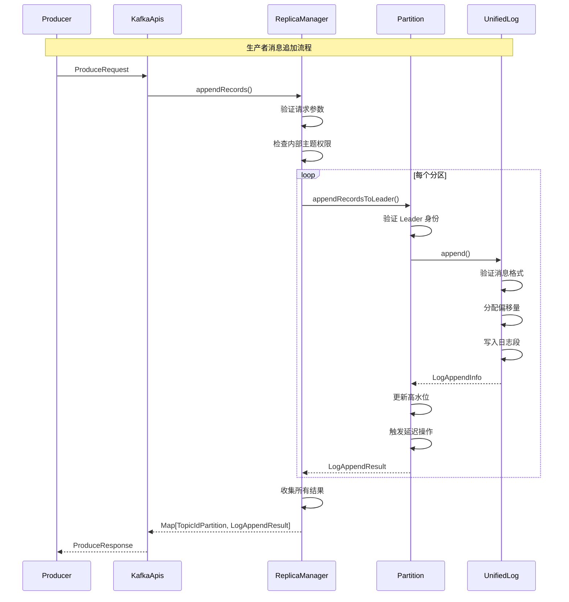
```mermaid
sequenceDiagram
    participant Producer as Producer
    participant KA as KafkaApis
    participant RM as ReplicaManager
    participant P as Partition
    participant UL as UnifiedLog

    Note over Producer,UL: 生产者消息追加流程

    Producer->>KA: ProduceRequest
    KA->>RM: appendRecords()

    RM->>RM: 验证请求参数
    RM->>RM: 检查内部主题权限

    loop 每个分区
        RM->>P: appendRecordsToLeader()
        P->>P: 验证 Leader 身份
        P->>UL: append()
        UL->>UL: 验证消息格式
        UL->>UL: 分配偏移量
        UL->>UL: 写入日志段
        UL-->>P: LogAppendInfo
        P->>P: 更新高水位
        P->>P: 触发延迟操作
        P-->>RM: LogAppendResult
    end

    RM->>RM: 收集所有结果
    RM-->>KA: Map[TopicIdPartition, LogAppendResult]
    KA-->>Producer: ProduceResponse
```

## 6. 副本同步：Follower 的数据拉取机制

### 6.1 Follower 拉取处理

ReplicaManager 还负责处理 Follower 的拉取请求：

**源码位置：** `core/src/main/scala/kafka/cluster/Partition.scala:940-955`

```scala
// 更新 Follower 副本状态并检查高水位
def updateFollowerFetchState(followerId: Int,
                           followerFetchOffsetMetadata: LogOffsetMetadata,
                           followerStartOffset: Long,
                           followerFetchTimeMs: Long,
                           leaderEndOffset: Long): Boolean = {
  getReplica(followerId) match {
    case Some(followerReplica) =>
      val prevFollowerEndOffset = followerReplica.stateSnapshot.logEndOffset
      followerReplica.updateFetchState(followerFetchOffsetMetadata, followerStartOffset, followerFetchTimeMs, leaderEndOffset)

      // 检查分区的 HW 是否可以增加，因为副本可能已经在 ISR 中且其 LEO 刚刚增加
      val leaderHWIncremented = if (prevFollowerEndOffset != replica.stateSnapshot.logEndOffset) {
        // Leader 日志可能被 ReplicaAlterLogDirsThread 更新，所以以下方法必须在 leaderIsrUpdateLock 锁中
        // 以防止向无效日志添加新的 hw
        inReadLock(leaderIsrUpdateLock) {
          leaderLogIfLocal.exists(leaderLog => maybeIncrementLeaderHW(leaderLog, followerFetchTimeMs))
        }
      } else {
        false
      }

      // 一些延迟操作可能在 HW 或 LW 改变后被解除阻塞
      if (leaderLWIncremented || leaderHWIncremented)
        tryCompleteDelayedRequests()

      leaderHWIncremented
    case None =>
      false
  }
}
```

### 6.2 副本同步状态检查

**源码位置：** `core/src/main/scala/kafka/cluster/Partition.scala:1297-1307`

```scala
// 获取不同步的副本集合
def getOutOfSyncReplicas(maxLagMs: Long): Set[Int] = {
  val current = partitionState
  if (!current.isInflight) {
    val candidateReplicaIds = current.isr - localBrokerId
    val currentTimeMs = time.milliseconds()
    val leaderEndOffset = localLogOrException.logEndOffset
    candidateReplicaIds.filter(replicaId => isFollowerOutOfSync(replicaId, leaderEndOffset, currentTimeMs, maxLagMs))
  } else {
    Set.empty
  }
}

// 判断 Follower 是否不同步
private def isFollowerOutOfSync(replicaId: Int, leaderEndOffset: Long, currentTimeMs: Long, maxLagMs: Long): Boolean = {
  getReplica(replicaId) match {
    case Some(followerReplica) =>
      val followerState = followerReplica.stateSnapshot
      val timeSinceLastCaughtUpMs = math.max(0L, currentTimeMs - followerState.lastCaughtUpTimeMs)
      timeSinceLastCaughtUpMs > maxLagMs
    case None =>
      true
  }
}
```

## 7. 分区管理：在线/离线状态处理

### 7.1 分区状态管理

**源码位置：** `core/src/main/scala/kafka/server/ReplicaManager.scala:2584-2592`

```scala
// 标记分区为离线状态
def markPartitionOffline(tp: TopicPartition): Unit = replicaStateChangeLock synchronized {
  allPartitions.get(tp) match {
    case HostedPartition.Online(partition) =>
      allPartitions.put(tp, HostedPartition.Offline(Some(partition)))
      partition.markOffline()
    case _ =>
      allPartitions.put(tp, HostedPartition.Offline(None))
  }
}
```

### 7.2 分区创建和获取

**源码位置：** `core/src/main/scala/kafka/server/ReplicaManager.scala:2752-2770`

```scala
// 获取或创建分区
private[kafka] def getOrCreatePartition(tp: TopicPartition,
                                       delta: TopicsDelta,
                                       topicId: Uuid): Option[(Partition, Boolean)] = {
  getPartition(tp) match {
    case HostedPartition.Offline(offlinePartition) =>
      if (offlinePartition.flatMap(p => p.topicId).contains(topicId)) {
        stateChangeLogger.warn(s"Unable to bring up new local leader $tp " +
          s"with topic id $topicId because it resides in an offline log " +
          "directory.")
        None
      } else {
        stateChangeLogger.info(s"Creating new partition $tp with topic id " + s"$topicId." +
          s"A topic with the same name but different id exists but it resides in an offline log " +
          s"directory.")
        val partition = Partition(new TopicIdPartition(topicId, tp), time, this)
        allPartitions.put(tp, HostedPartition.Online(partition))
        Some((partition, true))
      }
    case HostedPartition.Online(partition) =>
      if (partition.topicId.contains(topicId)) {
        Some((partition, false))
      } else {
        // 主题 ID 不匹配，可能是主题被删除并重新创建
        stateChangeLogger.info(s"Deleting partition $tp with topic id ${partition.topicId} " +
          s"since a partition with the same name but different topic id $topicId needs to be created.")
        partition.delete()
        val newPartition = Partition(new TopicIdPartition(topicId, tp), time, this)
        allPartitions.put(tp, HostedPartition.Online(newPartition))
        Some((newPartition, true))
      }
    case HostedPartition.None =>
      val partition = Partition(new TopicIdPartition(topicId, tp), time, this)
      allPartitions.put(tp, HostedPartition.Online(partition))
      Some((partition, true))
  }
}
```

## 8. 性能优化和监控

### 8.1 关键性能指标

ReplicaManager 提供了丰富的监控指标：

**源码位置：** `core/src/main/scala/kafka/server/ReplicaManager.scala:367-371`

```scala
// ISR 相关指标
val isrExpandRate: Meter = metricsGroup.newMeter(IsrExpandsPerSecMetricName, "expands", TimeUnit.SECONDS)
val isrShrinkRate: Meter = metricsGroup.newMeter(IsrShrinksPerSecMetricName, "shrinks", TimeUnit.SECONDS)
val failedIsrUpdatesRate: Meter = metricsGroup.newMeter(FailedIsrUpdatesPerSecMetricName, "failedUpdates", TimeUnit.SECONDS)

// 副本不足的分区数量
def underReplicatedPartitionCount: Int = leaderPartitionsIterator.count(_.isUnderReplicated)
```

### 8.2 配置优化建议

```properties
# 副本管理相关配置
replica.lag.time.max.ms=30000              # 副本最大滞后时间
replica.fetch.max.bytes=1048576             # 副本拉取最大字节数
replica.fetch.wait.max.ms=500               # 副本拉取最大等待时间
replica.high.watermark.checkpoint.interval.ms=5000  # 高水位检查点间隔

# ISR 管理配置
min.insync.replicas=2                       # 最小同步副本数
unclean.leader.election.enable=false       # 禁用不干净的 Leader 选举

# 性能调优配置
num.replica.fetchers=1                      # 副本拉取线程数
replica.fetch.backoff.ms=1000              # 副本拉取退避时间
```

## 9. 故障处理和恢复机制

### 9.1 日志目录故障处理

ReplicaManager 内置了完善的故障处理机制：

```scala
// 日志目录故障处理器
logDirFailureHandler = new LogDirFailureHandler("LogDirFailureHandler")
logDirFailureHandler.start()
```

### 9.2 副本恢复流程

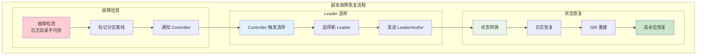
```mermaid
graph TB
    subgraph "副本故障恢复流程"
        subgraph "故障检测"
            FD[故障检测<br/>日志目录不可用]
            MO[标记分区离线]
            NL[通知 Controller]
        end

        subgraph "Leader 选举"
            LE[Controller 触发选举]
            NR[选择新 Leader]
            LI[发送 LeaderAndIsr]
        end

        subgraph "状态恢复"
            SR[状态转换]
            LR[日志恢复]
            IR[ISR 重建]
            HW[高水位恢复]
        end

        FD --> MO
        MO --> NL
        NL --> LE
        LE --> NR
        NR --> LI
        LI --> SR
        SR --> LR
        LR --> IR
        IR --> HW
    end

    style FD fill:#ffcdd2
    style LE fill:#e3f2fd
    style SR fill:#e8f5e8
    style HW fill:#c8e6c9
```

## 总结

ReplicaManager 是 Kafka 副本管理的核心引擎，其设计体现了分布式系统的核心原则：

### 核心优势：
1. **数据一致性**：通过 ISR 和高水位机制确保强一致性
2. **高可用性**：支持动态的 Leader/Follower 切换和故障恢复
3. **性能优化**：高效的日志追加和副本同步机制
4. **监控完善**：丰富的指标体系支持运维监控

### 设计精髓：
- **状态机管理**：清晰的分区状态转换和副本状态管理
- **异步处理**：大量使用异步操作提升性能
- **故障容错**：完善的故障检测和恢复机制
- **可扩展性**：支持大规模分区和副本的管理

ReplicaManager 的实现展现了 Kafka 在数据一致性、高可用性和高性能方面的精心设计，是理解 Kafka 核心机制的重要组件。
